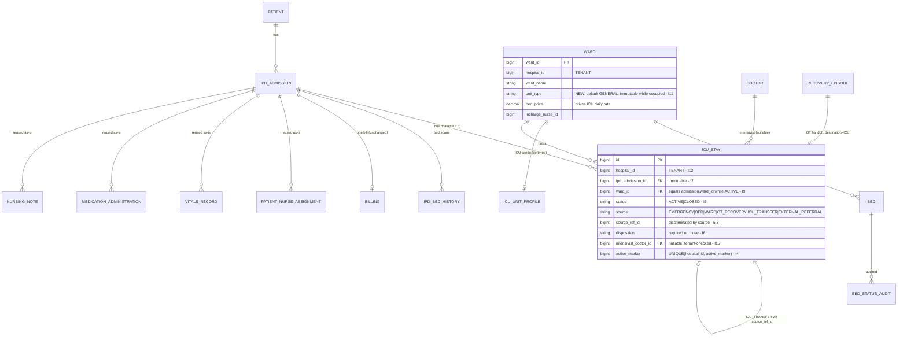

# ICU Phase 1 — ICU Domain Architecture

**Phase:** ICU-1 (DESIGN)
**Revision:** r2 — 2026-08-25
**Branch:** `icu`
**Status:** Design proposal — **awaiting review and approval. No code written.**
**Input:** [ICU_EXISTING_SYSTEM_AUDIT.md](ICU_EXISTING_SYSTEM_AUDIT.md) (ICU-0)

Scope of this phase is the **domain spine only**: how ICU is represented, how an ICU stay
relates to an IPD admission, how patients move in and out, and who owns what. The ICU
Patient Chart's clinical tables are declared in §12 and designed in ICU-2 — putting them
here would build the chart before the domain that anchors it.

> **r2 changes (review response).** New §4 _ICU Domain Invariants_ and §8 _Transaction
> Boundaries_. Stay lifecycle is **no longer best-effort** (§8.2). Added ACTIVE-stay ↔
> admission ↔ ward consistency (I7–I11) and cross-tenant relationship invariants
> (I12–I18). `source` splits `OPD` from `EMERGENCY` (§5.2). `source_ref_id` integrity
> defined (§5.3). Generic stay `PATCH` replaced by narrow field endpoints (§10.2).
> Closed-stay access defined (§10.3). `icu_unit_profile` **deferred out of ICU-2
> entirely** (§5.4). `VitalsRecord` append-only strategy (§12.1) and `IO_CHART`
> reconciliation (§12.2) added as named ICU-2 prerequisites.

---

## 1. Decision D1 — how ICU is represented

**Decision: a combination — classification on the existing `Ward`, plus a thin ICU
configuration sidecar. No new bed or occupancy model.**

### Options considered

|                                       | Option A — `Ward.unit_type` only              | Option B — dedicated `IcuUnit` resource (the `OtRoom` route) | **Option C — classification + config sidecar (chosen)** |
| ------------------------------------- | --------------------------------------------- | ------------------------------------------------------------ | ------------------------------------------------------- |
| Beds                                  | reuses `beds`                                 | needs a parallel bed model                                   | reuses `beds`                                           |
| Bed status lifecycle                  | `BedStatusService` unchanged                  | must be re-implemented or bypassed                           | `BedStatusService` unchanged                            |
| Bed history                           | `IpdBedHistory` unchanged                     | breaks — history is `bed_id`-keyed                           | unchanged                                               |
| Daily billing                         | **works with zero new code** (see below)      | breaks — scheduler resolves rate from `Ward.bedPrice`        | **works with zero new code**                            |
| Nurse ward scope                      | `NurseInchargeGuard.myWardIds()` unchanged    | breaks — guard is `ward_id`-keyed                            | unchanged                                               |
| Admission path                        | `admitFromOpd(…, wardId, bedId, …)` unchanged | needs a second admission path                                | unchanged                                               |
| Per-unit ICU config (ratio, capacity) | **no home for it**                            | has a home                                                   | has a home                                              |
| New tables                            | 0                                             | ~3                                                           | 1 (small, **deferred** — §5.4)                          |

### Why Option B is rejected

The audit's **R2** already recorded that OT went the other way and built `OtRoom`. That was
correct _for a theatre_ and is wrong _for an ICU_, and the difference is concrete:

> A theatre is a **room that holds cases back-to-back** — it has turnover time and no
> resident patient. `OtRoom`'s own javadoc says modelling it as a bed "conflates the room
> with the thing inside it". An ICU is the opposite: it is **a set of beds that hold
> patients continuously**, charged per day, cleaned between patients, and staffed by ward
> incharges. That is precisely what `Ward` + `Bed` already is.

Building `IcuUnit`/`IcuBed` would fork occupancy into two sources of truth and force
re-implementation of `BedStatusService`, `IpdBedHistory`, ward-scoped RBAC and daily bed
billing. That is the duplicate-model failure **R2** exists to prevent.

### Proof that billing needs no new code

[`BillingSchedulerService.processAdmissionCharge`](../backend/src/main/java/com/hms/service/hospital/BillingSchedulerService.java)
resolves the daily rate as:

```java
Ward ward = wardRepository.findById(admission.getWardId()).orElse(null);
if (ward != null && ward.getBedPrice() != null) bedPrice = ward.getBedPrice();
```

An ICU ward is a `Ward` with its own `bed_price`. Moving a patient into an ICU bed through
the **existing** `changeBed` therefore switches the daily rate to the ICU rate
automatically, on the existing bill, with no ICU billing code at all. This single fact is
the strongest argument for Option C and directly satisfies the acceptance gate _"no second
billing system"_.

### Why Option A alone is insufficient

Nurse-to-patient ratio and unit capability flags have no existing home:
`hospital_settings` is hospital-wide, `OtWorkflowPolicy` is per-hospital + priority scope,
and `wards` is shared by every non-ICU ward. A three-field sidecar keyed to `ward_id` is
the smallest correct answer — **designed in §5.4, and deliberately not scheduled for
ICU-2.**

---

## 2. Decision D2 — multiple critical-care unit types, none hard-coded

`wards.unit_type` holds a key from a **Java registry**, following the established
convention (`FormRegistry`, `VitalRegistry`, `OtPermissions`, `EntitlementRegistry` are all
Java, not tables — ICU-0 §7).

`service/hospital/icu/CareUnitRegistry`:

| Key       | Label                | Critical care?       |
| --------- | -------------------- | -------------------- |
| `GENERAL` | General Ward         | no — **the default** |
| `ICU`     | Intensive Care Unit  | yes                  |
| `MICU`    | Medical ICU          | yes                  |
| `SICU`    | Surgical ICU         | yes                  |
| `NICU`    | Neonatal ICU         | yes                  |
| `PICU`    | Paediatric ICU       | yes                  |
| `CCU`     | Coronary Care Unit   | yes                  |
| `HDU`     | High Dependency Unit | yes                  |

Two separate things, deliberately:

- **Type** is the classification, from the registry. `isCriticalCare(key)` is the single
  predicate every gate uses — nothing anywhere tests for the literal string `"ICU"`.
- **Name** stays free text on `Ward.wardName`. A hospital may run "ICU-1", "ICU-2" and
  "Cardiac ICU" as three wards all typed `ICU`, or one `MICU` and one `SICU`.

So _n_ units of _m_ types are supported natively, because a unit **is** a ward and
hospitals already create as many wards as they like.

**Not doing:** hospital-defined custom unit types. `hospital_vitals` sets a precedent for
custom entries, but eight types cover the requirement and a custom type would need its own
critical-care flag, print labels and reporting bucket. Revisit only on real demand.

**Migration safety:** `unit_type` defaults to `'GENERAL'`, so every existing ward is
untouched and behaves exactly as today.

---

## 3. Decision D3 — ICU Stay semantics relative to IPD Admission

**Decision: `IcuStay` is a phase record inside an existing `IpdAdmission`. It is never a
patient, never an admission, and never a status on the admission.**

```
Patient ──1:N──> IpdAdmission ──1:N──> IcuStay
                     (unchanged)      (new, sequential; ≤1 ACTIVE at a time)
```

- **One admission, many stays.** A patient who goes ICU → ward → ICU has **two** stay rows.
  That is not a workaround: ICU readmission within the same admission is a standard quality
  indicator, and it falls out of the model for free.
- **`IpdAdmission` is not modified.** No new column, no new status value. `ADMITTED` /
  `DISCHARGE_PLANNED` / `DISCHARGED` keep their exact meanings.
- **Append-oriented.** A closed stay is immutable. Re-entry writes a new row; it never
  reopens a closed one.

### Proof that existing structures cannot represent this

| Candidate                   | Why it fails                                                                                                                                                                                                                                                                     |
| --------------------------- | -------------------------------------------------------------------------------------------------------------------------------------------------------------------------------------------------------------------------------------------------------------------------------- |
| A status on `IpdAdmission`  | `status` is the admission lifecycle. "In ICU" is orthogonal — an ICU patient is still `ADMITTED`. Overloading it would break `listIpdAdmissions`, `BillingSchedulerService`'s discharge filter, and the discharge flow.                                                          |
| `IpdAdmission.wardId` alone | Answers "where now?", not "when, why, under whom, with what outcome". Overwritten on every transfer, so the ICU period is unrecoverable.                                                                                                                                         |
| `IpdBedHistory`             | Gives correct **time spans**, and nothing else: no reason for admission, no intensivist, no disposition, no outcome. It is also written **best-effort inside try/catch** (ICU-0 §5) — acceptable for a convenience log, not as the system of record for a critical-care episode. |
| `RecoveryEpisode`           | PACU-specific and `surgery_id`-keyed. An ICU patient who never had surgery cannot have one. It is the **precedent**, not the vehicle.                                                                                                                                            |

`RecoveryEpisode`'s own javadoc states the principle this design copies verbatim:

> _"A recovery episode is NOT a case state… Recovery is therefore its own record."_

`IcuStay` is that same shape, one level up: a phase of an admission, not a state of it.

### Backward compatibility

A non-ICU IPD patient has **zero** `icu_stay` rows. Every existing query, screen, PDF and
scheduler is unchanged. ICU is additive by construction — this is the acceptance gate
_"backward-compatible with existing non-ICU IPD patients"_, satisfied structurally rather
than by testing for it afterwards.

---

## 4. ICU Domain Invariants

The rules that must hold at every commit boundary. Each names **where it is enforced** —
an invariant with no enforcement point is a comment, not an invariant.

Enforcement legend: **DB** = schema constraint · **TX** = validated inside the writing
transaction (§8) · **TEST** = build-time or regression gate · **UI** = surface convenience
only, never the sole guarantee.

### 4.1 Identity

| #      | Invariant                                                                                                                                      | Enforced                                     |
| ------ | ---------------------------------------------------------------------------------------------------------------------------------------------- | -------------------------------------------- |
| **I1** | An ICU patient is a `Patient` with an `IpdAdmission`. No ICU-owned table carries patient demographics.                                         | TEST (schema review), design rule **R1**     |
| **I2** | `icu_stay.ipd_admission_id` is required and never changes after insert. A stay cannot be moved between admissions.                             | DB (`NOT NULL`) + TX (immutable-field guard) |
| **I3** | `icu_stay.patient_id` always equals the parent admission's `patient_id`. It is a denormalised read convenience, never an independent identity. | TX                                           |

### 4.2 Lifecycle

| #      | Invariant                                                                                                                                 | Enforced                                                  |
| ------ | ----------------------------------------------------------------------------------------------------------------------------------------- | --------------------------------------------------------- |
| **I4** | At most one `ACTIVE` stay exists per admission.                                                                                           | **DB** — `UNIQUE(hospital_id, active_marker)` (§5.1) + TX |
| **I5** | A stay is `ACTIVE` or `CLOSED`. `CLOSED` is terminal: no field of a closed stay may ever be written again, including by an administrator. | TX                                                        |
| **I6** | Closing a stay requires a `disposition` and a `discharged_at`. A stay cannot be closed with a null outcome.                               | DB (application-level `NOT NULL` on close) + TX           |

### 4.3 ACTIVE stay ↔ IpdAdmission ↔ Ward consistency

This is the core correctness property: **an ACTIVE stay and an occupied critical-care bed
are two views of one fact and may never disagree.**

| #       | Invariant                                                                                                                                                                     | Enforced                                                                                                                   |
| ------- | ----------------------------------------------------------------------------------------------------------------------------------------------------------------------------- | -------------------------------------------------------------------------------------------------------------------------- |
| **I7**  | If an admission has an `ACTIVE` stay, then `ipd_admission.ward_id` references a ward with `isCriticalCare(unit_type) = true`.                                                 | TX                                                                                                                         |
| **I8**  | Conversely, if `ipd_admission.status ∈ {ADMITTED, DISCHARGE_PLANNED}` and `ipd_admission.ward_id` is critical care, then exactly one `ACTIVE` stay exists for that admission. | TX                                                                                                                         |
| **I9**  | An `ACTIVE` stay's `ward_id` equals its admission's current `ward_id`. A ward change closes the stay and opens a new one (T6), so the two can never drift.                    | TX                                                                                                                         |
| **I10** | An admission with `status = DISCHARGED` has zero `ACTIVE` stays. Discharge closes the stay in the same transaction (T5).                                                      | TX                                                                                                                         |
| **I11** | A `ward.unit_type` may not be changed while any bed in that ward is `occupied`. Re-typing an occupied ward would break I7/I8 retroactively for patients already in it.        | TX — the write is rejected with `IllegalArgumentException` (400) and the message "empty the ward before changing its type" |

I7 and I8 together give the biconditional: **ACTIVE stay ⟺ the patient occupies a
critical-care bed.** That is the property every ICU screen, count and report depends on.

**Consequences accepted, and stated so they are not discovered later:**

- **Re-typing a ward is an administrative act with a precondition** (I11), not a free-form
  edit. A hospital converting a general ward to an ICU must move or discharge its patients
  first. This is deliberate: the alternative — retroactively synthesising stays for
  patients already in the beds — would invent clinical records with no admission time,
  reason or intensivist.
- **Turning the `ICU` module off does not delete or close anything.** Rows are preserved
  and I4–I11 continue to hold; only the endpoints become unreachable. Bed status and
  billing keep working because both are IPD-owned, not ICU-owned.
- **`IpdBedHistory` is not part of any invariant.** It is a best-effort convenience log
  (ICU-0 §5) and ICU deliberately does not depend on it for correctness. ICU does not
  change how it is written — that would be an unrelated architecture change.

### 4.4 Cross-tenant relationship invariants

Tenant isolation is a property of **every edge in the graph**, not only of the ICU rows
themselves. A correctly-scoped `icu_stay` that points at another tenant's ward is still a
tenant breach.

| #       | Invariant                                                                                                                                                                                                                       | Enforced                                                                          |
| ------- | ------------------------------------------------------------------------------------------------------------------------------------------------------------------------------------------------------------------------------- | --------------------------------------------------------------------------------- |
| **I12** | Every ICU-owned row carries `hospital_id BIGINT NOT NULL`.                                                                                                                                                                      | DB                                                                                |
| **I13** | `hospital_id` is taken from `SecurityContextHelper.getCurrentHospitalId()` and **never** from a request payload.                                                                                                                | TX                                                                                |
| **I14** | `hospital_id` is immutable after insert. There is no tenant-transfer path for an ICU row.                                                                                                                                       | TX                                                                                |
| **I15** | **Every referenced entity is intra-tenant.** For a stay: `hospital_id` must equal that of its `ipd_admission`, `patient`, `ward`, occupied `bed`, `intensivist_doctor` (when set), and the `source_ref_id` referent (when set). | TX                                                                                |
| **I16** | Each referent is loaded with a tenant-scoped finder (`findBy…AndHospitalId`) or `findById` + explicit compare. A raw `findById` with no comparison is a defect.                                                                 | TX + **TEST** (`TenantScopingArchTest` — the build fails on an unreviewed lookup) |
| **I17** | A referent belonging to another tenant produces **`ResourceNotFoundException` (404), never 403** — _"another hospital's bed must be indistinguishable from a missing one"_.                                                     | TX + **TEST** (`CrossTenantIsolationTest`)                                        |
| **I18** | Every uniqueness constraint is tenant-scoped, and every list query filters `hospital_id` **in the repository**, never in Java after fetching.                                                                                   | DB + TEST                                                                         |

**I15 in practice.** The one ICU field that accepts a caller-supplied foreign id is
`intensivist_doctor_id` (§10.2). It is therefore the highest-risk IDOR surface in the
module and must be resolved through a tenant-scoped doctor lookup with a
`CrossTenantIsolationTest` case of its own. `source_ref_id` is second (§5.3).

### 4.5 Downstream ownership

| #       | Invariant                                                                                                               | Enforced                    |
| ------- | ----------------------------------------------------------------------------------------------------------------------- | --------------------------- |
| **I19** | ICU creates no `Billing`, `BillingItem` or payment row. Exactly one bill per admission, spanning ward and ICU time.     | TEST (schema + code review) |
| **I20** | ICU writes no bed status directly. Every bed transition goes through `BedStatusService.change`.                         | TEST (arch review)          |
| **I21** | ICU never writes `IpdAdmission.doctorId`, `status`, `ipdNumber`, or any existing admission column.                      | TEST                        |
| **I22** | Realtime updates go through `RealtimeNotifier` only; `HospitalWebSocketHandler` is never called directly from ICU code. | TEST (arch review)          |

---

## 5. New entities — each justified against what exists

Only three schema objects, one of which is **deferred out of ICU-2** (§5.4). Everything
else reuses ICU-0 §2.

### 5.0 `wards.unit_type` — a column, not a table

```sql
ALTER TABLE wards ADD COLUMN unit_type VARCHAR(20) NOT NULL DEFAULT 'GENERAL';
```

Classification applies to every ward, not only ICU ones, so it belongs on `wards`.
No sidecar could hold it without making every ward query join. Writes are guarded by
**I11**.

### 5.1 `icu_stay` — JUSTIFIED (§3)

| Column                  | Type                 | Notes                                     |
| ----------------------- | -------------------- | ----------------------------------------- |
| `id`                    | BIGINT PK            |                                           |
| `public_id`             | VARCHAR UNIQUE       | convention for externally referenced rows |
| `hospital_id`           | BIGINT NOT NULL      | **tenant ownership** — I12                |
| `ipd_admission_id`      | BIGINT NOT NULL      | the parent episode — I2                   |
| `patient_id`            | BIGINT NOT NULL      | denormalised — I3                         |
| `ward_id`               | BIGINT NOT NULL      | the ICU ward — I9                         |
| `status`                | VARCHAR(10) NOT NULL | `ACTIVE` \| `CLOSED` — I5                 |
| `source`                | VARCHAR(20) NOT NULL | how the patient arrived — §5.2            |
| `source_ref_id`         | BIGINT NULL          | discriminated by `source` — §5.3          |
| `admitted_at`           | DATETIME NOT NULL    |                                           |
| `admission_reason`      | VARCHAR(255) NULL    | free text                                 |
| `intensivist_doctor_id` | BIGINT NULL          | D4; tenant-checked per I15                |
| `admitted_by_user_id`   | BIGINT NULL          |                                           |
| `disposition`           | VARCHAR(20) NULL     | required on close — I6                    |
| `discharged_at`         | DATETIME NULL        | required on close — I6                    |
| `discharged_by_user_id` | BIGINT NULL          |                                           |
| `active_marker`         | BIGINT NULL          | see below                                 |
| `created_at`            | DATETIME NOT NULL    | non-updatable                             |

**No `is_active` column.** This is a deliberate departure from the house soft-delete
convention, justified in §10.3: a critical-care episode is a clinical record, and hiding
one would falsify ICU length-of-stay and readmission figures.

**I4 enforced by the database.** MySQL has no partial indexes, and
`UNIQUE(ipd_admission_id, status)` cannot work because `CLOSED` repeats. The portable
pattern is a marker column that holds `ipd_admission_id` while active and `NULL` once
closed — MySQL treats NULLs as distinct in a unique index:

```sql
UNIQUE KEY uk_icu_stay_active (hospital_id, active_marker)
```

The invariant is then structural, not a service-level check that a race can slip past. The
service still validates first so the user gets a clean 409 rather than a driver error.

### 5.2 `source` — OPD and EMERGENCY are separate values

| Value               | Meaning                                                        | Typical path |
| ------------------- | -------------------------------------------------------------- | ------------ |
| `EMERGENCY`         | Unplanned direct admit into ICU from an emergency presentation | T1a          |
| `OPD`               | Planned direct admit into ICU following an OPD consultation    | T1b          |
| `WARD`              | Escalation from a general ward                                 | T2           |
| `OT_RECOVERY`       | Post-operative, via PACU or direct from theatre                | T3           |
| `ICU_TRANSFER`      | Moved from another critical-care unit in the same admission    | T6           |
| `EXTERNAL_REFERRAL` | Arrived already critically ill from another facility           | T1a variant  |

**Why they are split.** They were one value in r1, which conflated two clinically and
operationally different events. An unplanned emergency ICU admission and a planned
post-consultation ICU booking differ in acuity, in who authorises the bed, and in every
casemix report that separates emergency from elective activity. Collapsing them would make
"emergency ICU admissions" unrecoverable, and no later migration could split them, because
the distinguishing fact would never have been recorded.

**Derivation rule, so this is not a free-text choice.** `IpdAdmission.admissionType` is
already `EMERGENCY` / `ELECTIVE`. For a direct admit the stay's source is derived:
`admissionType = 'EMERGENCY'` → `source = EMERGENCY`; `ELECTIVE` → `source = OPD`. The
value is therefore consistent with the admission by construction rather than by a second
operator judgement. `EXTERNAL_REFERRAL` is the one direct-admit source an operator selects
explicitly.

### 5.3 `source_ref_id` integrity

`source_ref_id` is a **discriminated reference**: `source` is the discriminator that
determines what the id points at. There is no foreign key, because the referent type
varies — matching existing practice (`IpdAdmission.sourceOpdId`, `NursingNote.surgeryId`
are plain `Long`s with no FK).

| `source`            | `source_ref_id` references                          | Required?                                                                                                   |
| ------------------- | --------------------------------------------------- | ----------------------------------------------------------------------------------------------------------- |
| `EMERGENCY`         | `opd.id` (the presentation the admission came from) | required                                                                                                    |
| `OPD`               | `opd.id`                                            | required                                                                                                    |
| `WARD`              | `wards.ward_id` — the ward stepped up **from**      | required                                                                                                    |
| `OT_RECOVERY`       | `ot_recovery_episodes.id`                           | **optional** — `RECOVERY_TRACKING` is a per-hospital OT policy, so a direct theatre-to-ICU handoff has none |
| `ICU_TRANSFER`      | `icu_stay.id` — the stay just closed                | required                                                                                                    |
| `EXTERNAL_REFERRAL` | —                                                   | **must be NULL**                                                                                            |

**Integrity rules** (all enforced in the writing transaction, §8):

1. **Presence** matches the table above. A required-but-null or must-be-null-but-set
   combination is rejected; a `source` value outside the enumeration is rejected.
2. **Resolution.** The referent is loaded and must exist. An unresolvable id is rejected —
   the column is never written unvalidated.
3. **Tenancy (I15).** The referent's `hospital_id` must equal the stay's. Loaded with a
   tenant-scoped finder; a foreign referent yields **404**, not 403 (I17).
4. **Episode coherence.** Where the referent belongs to an episode it must be the _same_
   episode: an `ICU_TRANSFER` referent stay and an `OT_RECOVERY` referent episode must both
   resolve to this `ipd_admission_id`. This blocks pointing a stay at another patient's
   history.
5. **Immutability.** `source` and `source_ref_id` are set once at open and never updated —
   they are provenance, and provenance that can be edited is not provenance. No endpoint
   exposes them (§10.2).
6. **Tolerant reads.** Because there is no FK, a referent may later be deleted (wards are
   deletable through `WardService.deleteWard`). Read paths **must render an unresolvable
   referent as "unknown", never fail the request.** A stay must remain readable forever
   (§10.3) even if its origin ward is gone.

**Why not four typed nullable columns** (`source_opd_id`, `source_ward_id`, …) with real
FKs? That buys database-level referential integrity at the cost of four columns, four
indexes and a check constraint to keep exactly one populated — for a value that is read
only to display provenance. Rules 1–6 give equivalent integrity at the write boundary,
which is where every other reference in this codebase is already validated. Recorded as a
deliberate trade, open to reversal at review.

### 5.4 `icu_unit_profile` — designed, **deferred out of ICU-2 entirely**

**Decision (r2):** not built in ICU-2. It is created only in the later phase that
implements nurse-ratio enforcement. Until then it does not exist, and **no ICU-2 or ICU-3
code may read it.** ICU-2 ships `wards.unit_type` alone.

Rationale: nothing in the stay lifecycle, the ICU chart or patient movement depends on it,
and a table that exists before its enforcement logic is a table that gets populated with
values nothing honours — which is worse than its absence.

Design retained so it is not re-derived later:

| Column                | Notes                             |
| --------------------- | --------------------------------- |
| `ward_id`             | UNIQUE — one profile per ICU ward |
| `hospital_id`         | **tenant ownership** — I12        |
| `nurse_patient_ratio` | e.g. `1` for 1:1, `2` for 1:2     |
| `ventilator_capacity` | integer, nullable                 |
| `notes`               |                                   |

Justification when it lands: `hospital_settings` is hospital-wide; `OtWorkflowPolicy` is
per-hospital + priority scope, not per-ward; `wards` is shared with non-ICU wards.

**Consequence for §10:** `PUT /hospital/icu/units/{wardId}` sets `unit_type` **only** in
ICU-2. Profile fields are added to that endpoint when the profile ships.

### Entities explicitly NOT created

`IcuPatient` (**R1**), `IcuBed`/`IcuWard` (**R2**), `IcuVitals` (**R3**),
`IcuMedicationAdministration` (**R4**), `IcuNurseAssignment` (**R5**), an ICU audit trail
(**R6**), an ICU notification channel (**R7**), an ICU role (**R8**), an ICU bill (**I19**).

---

## 6. Relationship model



Everything in "reused as-is" keeps its `ipd_admission_id` key. **An ICU vitals reading and a
ward vitals reading are the same row type on the same admission** — which is why the doctor's
IPD chart and the ICU chart cannot drift apart (**R3**).

---

## 7. State-transition table

### 7.1 `IcuStay.status`

| From     | To       | Trigger                             | Guard                                                                                                                  |
| -------- | -------- | ----------------------------------- | ---------------------------------------------------------------------------------------------------------------------- |
| _(none)_ | `ACTIVE` | patient enters a critical-care bed  | I4 (no ACTIVE stay), I7 (target ward is critical care), admission is `ADMITTED` or `DISCHARGE_PLANNED`, §5.3 rules 1–4 |
| `ACTIVE` | `CLOSED` | leaves ICU, or admission discharged | I6 — `disposition` and `discharged_at` required                                                                        |
| `CLOSED` | —        | terminal (I5)                       | re-entry creates a **new** row                                                                                         |

Two states need a declarative guard, not a state machine. `SurgeryStateMachine` exists
because a surgery has nine states and a policy engine; copying it here would be the
over-modelling its own javadoc warns about (_"a workflow engine was considered and
rejected"_).

### 7.2 Movement transitions

Every row reuses an **existing** movement mechanism. ICU adds the stay record on top; it
never adds a second way to move a patient.

| #       | Transition                                  | Existing mechanism reused                                                                                        | ICU state change                               | `source` / `disposition`                                                                           |
| ------- | ------------------------------------------- | ---------------------------------------------------------------------------------------------------------------- | ---------------------------------------------- | -------------------------------------------------------------------------------------------------- |
| **T1a** | **Emergency → ICU** (direct admit)          | `IpdAdmissionService.admitFromOpd(opdId, icuWardId, icuBedId, …)` with `admissionType = EMERGENCY`               | open stay                                      | `source = EMERGENCY`, `ref = opd.id`                                                               |
| **T1b** | **OPD → ICU** (planned direct admit)        | same call with `admissionType = ELECTIVE`                                                                        | open stay                                      | `source = OPD`, `ref = opd.id`                                                                     |
| **T1c** | **External referral → ICU**                 | same call, operator-selected source                                                                              | open stay                                      | `source = EXTERNAL_REFERRAL`, `ref = NULL`                                                         |
| **T2**  | **Ward → ICU** (escalation)                 | `IpdAdmissionService.changeBed(ipdId, icuBedId)`                                                                 | open stay                                      | `source = WARD`, `ref =` previous `ward_id`                                                        |
| **T3**  | **OT → ICU**                                | PACU discharge with `RecoveryEpisode.transferDestination = 'ICU'` (**already declared**, ICU-0 §1) + `changeBed` | open stay                                      | `source = OT_RECOVERY`, `ref = recoveryEpisode.id` **or NULL** if the hospital does not track PACU |
| **T4**  | **ICU → Ward** (step-down)                  | `changeBed(ipdId, wardBedId)`; old bed → `cleaning` via `BedStatusService`                                       | close stay                                     | `disposition = WARD`                                                                               |
| **T5**  | **ICU → discharge**                         | `IpdAdmissionService.confirmDischarge(ipdId)`                                                                    | close stay                                     | `disposition = HOME` \| `LAMA` \| `REFERRED_OUT` \| `EXPIRED`                                      |
| **T6**  | **ICU → ICU, different unit** (MICU → SICU) | `changeBed`                                                                                                      | close **and** open a new stay, one transaction | `disposition = ANOTHER_ICU`, then `source = ICU_TRANSFER`, `ref =` closed stay id                  |
| **T7**  | **ICU → ICU, same ward, different bed**     | `changeBed`                                                                                                      | **none** — `IpdBedHistory` already records it  | —                                                                                                  |

**T6 vs T7 rule:** the stay is bounded by the **ward**, not the bed (I9). A bed move within
the same ward is a bed event; a move to a different ward closes and reopens.

### 7.3 Where the ICU hook lives

`IcuStayService.onWardChanged(admission, fromWardId, toWardId)` and
`IcuStayService.onDischarge(admission)` are called from the existing IPD movement paths.
Two call sites, **no rewrite of admission or transfer logic** — which matters given §13.

Both are **participants in the caller's transaction, not best-effort side effects.** See
§8, which is the r2 correction to this section.

---

## 8. Transaction Boundaries

### 8.1 The boundary

**One movement is one transaction.** The transaction is owned by the existing IPD service
method that the user invoked (`admitFromOpd`, `changeBed`, `confirmDischarge`); ICU opens
no transaction of its own and commits nothing independently.

### 8.2 Critical domain state vs. side effects

r1 described the ICU hook as _"the same best-effort, try/catch shape"_ used by
`patientAssignmentService.onAdmission`. **That was wrong and is withdrawn.**

The distinction is not stylistic. A best-effort ICU stay write produces a patient lying in
an ICU bed with **no stay record** — which breaks I8 silently, makes the ICU board
under-report occupancy, loses the admission time and reason permanently, and cannot be
detected later because nothing recorded that it should have existed. A nurse-assignment
failure, by contrast, is visible and correctable: someone notices the patient has no nurse.

| Class                                                        | Members                                                                                                                                               | Failure semantics                                                                                                                                                |
| ------------------------------------------------------------ | ----------------------------------------------------------------------------------------------------------------------------------------------------- | ---------------------------------------------------------------------------------------------------------------------------------------------------------------- |
| **Critical domain state** — same transaction, all-or-nothing | `icu_stay` open/close; `beds.status` + `current_ipd_admission_id` (via `BedStatusService`); `ipd_admission.ward_id`/`bed_id`; the I4 uniqueness write | **A failure fails the whole movement.** No partial commit. The user is told the transfer did not happen and retries.                                             |
| **Side effects** — best-effort, never roll back the movement | `AuditLog` (`AuditLogService.logAction`), `Notification`, `RealtimeNotifier` pushes                                                                   | Wrapped in try/catch and logged. The clinical write stands.                                                                                                      |
| **Pre-existing best-effort, unchanged by ICU**               | `IpdBedHistory`, `PatientAssignmentService.onAdmission`                                                                                               | Left exactly as they are today. ICU depends on neither for correctness (I7–I11 reference none of them). Changing them would be an unrelated architecture change. |

**Consequence, stated plainly:** a defect in ICU stay code can block an ICU admission or
transfer. That is the correct trade. A blocked transfer is loud, immediate and recoverable;
a silently missing critical-care record is none of those.

### 8.3 Rules

| #       | Rule                                                                                                                                                                                                                                                                                     | Rationale                                                                                            |
| ------- | ---------------------------------------------------------------------------------------------------------------------------------------------------------------------------------------------------------------------------------------------------------------------------------------- | ---------------------------------------------------------------------------------------------------- |
| **TB1** | `IcuStayService` lifecycle methods are annotated `@Transactional(propagation = Propagation.MANDATORY)`.                                                                                                                                                                                  | They must **join** the caller's transaction. `MANDATORY` throws if there is none — see TB2.          |
| **TB2** | `MANDATORY` is chosen deliberately over `REQUIRED` so that calling a stay write outside a transaction **fails loudly at the seam** instead of silently committing on its own. This is what converts audit finding **C1** from an invisible integrity hole into a hard, testable failure. | See §13/E1 — with `MANDATORY`, T1a–T1c cannot work until C1 is fixed.                                |
| **TB3** | No `REQUIRES_NEW` anywhere in ICU code. A nested independent transaction would let a stay commit while its movement rolls back — exactly the split-brain I7–I11 forbid.                                                                                                                  |                                                                                                      |
| **TB4** | Side effects fire **after commit**, via `RealtimeNotifier` (which already registers an `afterCommit` synchronization). ICU never broadcasts from inside a transaction.                                                                                                                   | ICU-0 §5: pushing pre-commit lets a client cache the pre-change row.                                 |
| **TB5** | Read paths are `@Transactional(readOnly = true)`.                                                                                                                                                                                                                                        | House convention.                                                                                    |
| **TB6** | ICU introduces **no new locking scheme on `beds` or `ipd_admission`.** Bed contention (**C3**) is pre-existing and is an escalation (§13/E1); ICU must not fix it unilaterally inside an ICU phase. The only new concurrency guarantee ICU adds is its own: the I4 unique index.         | Scope discipline.                                                                                    |
| **TB7** | Validation order inside the transaction: tenancy (I12–I18) → lifecycle (I4–I6) → consistency (I7–I11) → `source_ref_id` (§5.3) → write → side effects after commit.                                                                                                                      | Tenancy first so a foreign id is rejected as 404 before any other error can disclose that it exists. |

### 8.4 Concurrency the design does and does not cover

| Scenario                                                              | Covered?                                                                                                                                                                             |
| --------------------------------------------------------------------- | ------------------------------------------------------------------------------------------------------------------------------------------------------------------------------------ |
| Two clinicians step the same patient up to ICU simultaneously         | **Yes** — I4's unique index rejects the second stay; the transaction rolls back and neither a duplicate stay nor a half-move survives.                                               |
| Two clinicians claim the **same last ICU bed** for different patients | **No — pre-existing C3.** Bed availability is check-then-act with no lock. ICU makes the consequence worse but does not introduce the defect. **Escalation E1; blocking for ICU-3.** |
| Concurrent direct ICU admits                                          | **No — pre-existing C1 + C2.** `admitFromOpd` is not transactional and IPD numbers race. Under TB1/TB2 this now fails loudly rather than corrupting. **Escalation E1.**              |
| Re-typing a ward while a patient is being admitted to it              | **Yes** — I11 rejects the re-type while beds are occupied; the movement's own transaction sees a consistent `unit_type`.                                                             |

---

## 9. Ownership decisions (D4–D8)

### D4 — Consultant assignment: `icu_stay.intensivist_doctor_id`, nullable

`IpdAdmission.doctorId` is `NOT NULL` and is the treating doctor for the whole admission.
It cannot be repointed at the intensivist: it feeds `Billing.doctorId`,
`listMyIpdAdmissionsForDoctor` and the doctor's IPD list, so overwriting it would silently
move the case off the admitting doctor's dashboard (**I21**).

→ The intensivist is recorded **on the stay**. When null, the admitting doctor remains
responsible — also the correct behaviour for a hospital with no separate intensivist.
Being the only caller-supplied foreign id in the module, it carries the I15 tenant check
and its own `CrossTenantIsolationTest` case.

**Deferred to ICU-2:** multiple concurrent consultants (cardiology + nephrology). The
precedent is `SurgeryTeamMember`; adding it now would be speculative.

### D5 — Nursing assignment: `PatientNurseAssignment` reused verbatim (**R5**)

Already `ipd_admission_id`-keyed with `assigned_at`/`unassigned_at` history. Ward-scoped
RBAC through `NurseInchargeGuard.myWardIds()` works **unchanged**, because an ICU unit is a
ward with an incharge — a direct dividend of D1.

ICU nurse ratio is a **rule**, not a table — and per §5.4 it has no storage in ICU-2, so
ratio enforcement is not part of ICU-2 or ICU-3.

Note: `admitFromOpd` already refuses a ward with no incharge when `NURSING` is on. ICU
inherits that rule for free.

### D6 — Billing linkage: nothing new (§1, **I19**)

One `Billing` per admission, spanning ward and ICU time. The daily rate follows
`admission.wardId → Ward.bedPrice`. Procedures, consumables and drugs already post through
`administerHospitalItems` / `addIpdPrescription`.

**Accepted consequence, documented not changed:** `processDailyBedCharges` runs at midnight
IST and charges the rate of the ward the patient occupies _at that moment_. A ward → ICU →
ward round trip inside one day is charged once, at the midnight ward. That is existing IPD
behaviour for every transfer today; ICU does not alter it. Per-hour proration would be a
**billing redesign — an escalation trigger**, not an ICU change.

### D7 — Audit ownership: existing trails only (**R6**)

| Event                            | Recorded by                             | Where                                 | Class (§8.2)                                |
| -------------------------------- | --------------------------------------- | ------------------------------------- | ------------------------------------------- |
| Bed occupied / vacated / cleaned | `BedStatusService.change` (existing)    | `bed_status_audits` + `AuditLog`      | bed row = critical; audit row = side effect |
| Bed span                         | `IpdBedHistory` (existing, best-effort) | `ipd_bed_history`                     | side effect, unchanged by ICU               |
| ICU stay opened / closed         | `IcuStayService` (new)                  | the `icu_stay` row itself             | **critical domain state**                   |
| ICU stay audit entry             | `AuditLogService`                       | `AuditLog`, `entityType = "ICU_STAY"` | side effect                                 |
| Field edits (§10.2)              | `AuditLogService`                       | distinct action per field             | side effect                                 |

The **stay row is the history**: closed stays are immutable and never deleted, so the
episode timeline is reconstructable from `icu_stay` alone even if every audit write failed.
That is why the audit entry can safely stay best-effort while the stay itself cannot.

### D8 — Tenant ownership: explicit on every ICU resource

Fully specified as invariants **I12–I18** (§4.4), with enforcement points and the two build
gates named. Summary: `hospital_id NOT NULL`, context-derived and immutable, every edge
intra-tenant, scoped finders only, foreign ⇒ 404, tenant-scoped uniqueness and filtering.

---

## 10. API boundary proposal

Namespace **`/hospital/icu/**`**. Hospital-only: `@TenantType(HospitalType.HOSPITAL)`,
`@RequireModule("ICU")`, and **no `/clinic` or `/pharmacy` alias** — ICU controllers must
stay out of `ClinicPharmacyIsolationTest`'s golden set.

### 10.1 `IcuUnitController` — unit configuration

| Method | Path                                     | Purpose                                                 | Roles                         |
| ------ | ---------------------------------------- | ------------------------------------------------------- | ----------------------------- |
| GET    | `/hospital/icu/unit-types`               | `CareUnitRegistry` list                                 | any hospital staff            |
| GET    | `/hospital/icu/units`                    | critical-care wards + live occupancy                    | ADMIN, DOCTOR, NURSE_INCHARGE |
| PUT    | `/hospital/icu/units/{wardId}/unit-type` | set `unit_type`; rejected if any bed occupied (**I11**) | ADMIN                         |

Per §5.4 there is **no profile endpoint in ICU-2**. It is added to this controller in the
phase that ships `icu_unit_profile`.

### 10.2 `IcuStayController` — reads and narrowly scoped mutations

**The generic `PATCH /stays/{publicId}` from r1 is removed.** A generic patch leaves the
writable surface implicit: the set of fields a client may change becomes whatever the DTO
happens to expose, it cannot be audited per field, and it invites a caller to send
`status`, `ward_id` or `disposition` — fields the lifecycle owns and that must only ever
change through a movement (§7.2). Narrow endpoints make the mutable surface **enumerable,
individually authorised, and individually audited.**

**Reads**

| Method | Path                                     | Purpose                                                                      | Roles                                |
| ------ | ---------------------------------------- | ---------------------------------------------------------------------------- | ------------------------------------ |
| GET    | `/hospital/icu/stays`                    | ICU board; `ACTIVE` by default, `?status=CLOSED\|ALL` supported; ward-scoped | ADMIN, DOCTOR, NURSE_INCHARGE, NURSE |
| GET    | `/hospital/icu/stays/{publicId}`         | one stay, **`ACTIVE` or `CLOSED`**                                           | as above + scope (§10.3)             |
| GET    | `/hospital/icu/admissions/{ipdId}/stays` | full stay history for an admission, newest first                             | as above                             |

**Mutations — one endpoint per field, `ACTIVE` stays only**

| Method | Path                                              | Writes                                | Roles         | Audit action               |
| ------ | ------------------------------------------------- | ------------------------------------- | ------------- | -------------------------- |
| PUT    | `/hospital/icu/stays/{publicId}/intensivist`      | `intensivist_doctor_id` (null clears) | ADMIN, DOCTOR | `ICU_INTENSIVIST_ASSIGNED` |
| PUT    | `/hospital/icu/stays/{publicId}/admission-reason` | `admission_reason`                    | ADMIN, DOCTOR | `ICU_REASON_UPDATED`       |

Rules binding both:

1. **`ACTIVE` only.** A request against a `CLOSED` stay returns **409**, per I5. There is no
   administrative override.
2. **No lifecycle field is writable by any endpoint.** `status`, `ward_id`, `source`,
   `source_ref_id`, `disposition`, `admitted_at`, `discharged_at`, `ipd_admission_id`,
   `patient_id`, `hospital_id` are set only by the movement paths (§7.2) and by §5.3
   rule 5. They appear in no request DTO at all — absent, not ignored.
3. **`intensivist_doctor_id` is tenant-checked** (I15) through a scoped doctor lookup;
   a foreign or unknown doctor is **404**.
4. **No create and no close endpoint.** A stay opens and closes only as a consequence of an
   admit / transfer / discharge. Exposing "create ICU stay" would let the stay record
   disagree with the bed the patient is actually in — two sources of truth for one fact,
   and a direct violation of I7–I9. This is the API expression of the
   one-coherent-workspace principle.

### 10.3 Closed-stay historical access

**A closed stay is permanently readable and permanently immutable.**

| Aspect                  | Rule                                                                                                                                                                                                                                                                                                       |
| ----------------------- | ---------------------------------------------------------------------------------------------------------------------------------------------------------------------------------------------------------------------------------------------------------------------------------------------------------- |
| Deletion                | **None.** No `is_active`, no soft delete, no purge job. Deliberately departs from the house soft-delete convention: a critical-care episode is a clinical record, and a hideable episode falsifies ICU length-of-stay, readmission and occupancy figures — the exact numbers the module exists to produce. |
| Mutation                | Impossible (I5). Every mutation endpoint returns 409 on a closed stay.                                                                                                                                                                                                                                     |
| Read — by admission     | `GET /hospital/icu/admissions/{ipdId}/stays` returns all stays, `ACTIVE` and `CLOSED`, newest first. This is the ICU history for that admission.                                                                                                                                                           |
| Read — by stay          | `GET /hospital/icu/stays/{publicId}` resolves closed stays.                                                                                                                                                                                                                                                |
| Read — board            | `GET /hospital/icu/stays` defaults to `ACTIVE`; `?status=CLOSED` or `ALL` retrieves history.                                                                                                                                                                                                               |
| After discharge         | The stays remain readable through the admission. The doctor's `IpdDetails` history view and the admin can always reach them.                                                                                                                                                                               |
| Unresolvable provenance | A closed stay whose `source_ref_id` referent was later deleted still renders — origin shown as unknown (§5.3 rule 6). A read must never fail because a ward was deleted.                                                                                                                                   |
| Module turned off       | Rows are preserved untouched; only the endpoints become unreachable. Re-enabling restores access to the full history.                                                                                                                                                                                      |

**Access scope is evaluated live, not frozen at the time of care.** This has one
consequence worth stating: a **staff nurse loses access to a closed stay once the patient
is no longer assigned to them**, because `NurseAccessGuard` scopes to _current_ patients.
The `HOSPITAL_ADMIN`, the admission's doctor, and the incharge of the stay's ward retain
access. This is consistent with how every other nursing record already behaves — ICU does
not introduce a second, retrospective scoping model.

### 10.4 Existing endpoints — additive changes only

| Endpoint                                    | Change                                                                      |
| ------------------------------------------- | --------------------------------------------------------------------------- |
| `POST /hospital/ipd/admit`                  | none — an ICU bed is just a bed (T1a–T1c)                                   |
| `PUT /hospital/ipd/{id}/bed`                | none — stay opens/closes as part of the same transaction (T2, T4, T6)       |
| `POST /hospital/ipd/{id}/confirm-discharge` | none — stay closes in the same transaction (T5)                             |
| `GET /hospital/ipd/{id}`                    | response gains an optional `icuStay` block; **absent for non-ICU patients** |
| `GET /hospital/wards`                       | ward response gains `unitType`                                              |

### 10.5 Module wiring — all four places (ICU-0 §7)

1. `EntitlementRegistry.ICU` constant + `SELLABLE[HOSPITAL]`.
2. **`ControllerModules.put(ICU, "IcuUnitController", "IcuStayController")` — mandatory.**
   Finding **T1**: an undeclared controller makes `FacilityAccessAspect` return _allowed_,
   silently exposing ICU to clinic and pharmacy tenants.
3. `@RequireModule("ICU")` on both controllers.
4. `PlansTab.jsx` `AVAILABLE_MODULES` (HOSPITAL only).

**Plan rule:** ICU **depends on** IPD — an ICU stay is a phase of an admission, so ICU
without IPD is meaningless. This is a dependency, not `IMPLIED_BY` (which means "granted
by"). `validatePlanModules` should reject a plan carrying `ICU` without `IPD`.

### 10.6 Frontend boundary

The ICU chart is **tabs inside the existing workspace**, not new pages:
`IpdDetails.jsx` (doctor) and `nurse/NursePatientDetail.jsx` (nurse) gain ICU tabs shown
only when the admission has an active stay — the same conditional-tab pattern already used
for `Consent Forms` (`hasOT && otSurgery`). One new page only: the **ICU board**
(`pages/hospital/icu/IcuBoard.jsx`), a unit-level occupancy view with no per-patient
equivalent. New service module `services/icuService.js`.

---

## 11. Role / access matrix

Existing roles only. **No new role** — that would require `SecurityConfig` `hasAnyRole(...)`
edits, a security-architecture change and an escalation trigger (**R8**).

| Capability                       | HOSPITAL_ADMIN     | DOCTOR                  | NURSE_INCHARGE          | NURSE                                | RECEPTIONIST | PHARMACIST | OT_INCHARGE |
| -------------------------------- | ------------------ | ----------------------- | ----------------------- | ------------------------------------ | ------------ | ---------- | ----------- |
| Set ward `unit_type`             | ✅                 | ❌                      | ❌                      | ❌                                   | ❌           | ❌         | ❌          |
| View ICU board                   | ✅ all             | ✅ own patients         | ✅ own wards            | ✅ own patients                      | ❌           | ❌         | ❌          |
| Admit / transfer into an ICU bed | ✅                 | ⚠️ solo mode only       | ❌                      | ❌                                   | ✅           | ❌         | ❌          |
| Step down / discharge from ICU   | ✅                 | ⚠️ solo mode only       | ❌                      | ❌                                   | ✅           | ❌         | ❌          |
| Set intensivist (§10.2)          | ✅                 | ✅                      | ❌                      | ❌                                   | ❌           | ❌         | ❌          |
| Set admission reason (§10.2)     | ✅                 | ✅                      | ❌                      | ❌                                   | ❌           | ❌         | ❌          |
| View an ACTIVE stay              | ✅                 | ✅ own patients         | ✅ own wards            | ✅ own patients                      | ❌           | ❌         | ❌          |
| View a CLOSED stay               | ✅                 | ✅ own patients         | ✅ own wards            | ⚠️ only while still assigned (§10.3) | ❌           | ❌         | ❌          |
| Assign nurse to an ICU patient   | ✅                 | ❌                      | ✅ own wards            | ❌                                   | ❌           | ❌         | ❌          |
| Record ICU clinical data         | ✅                 | per `FormAccessService` | per `FormAccessService` | per `FormAccessService`              | ❌           | ❌         | ❌          |
| Mark ICU bed cleaned             | ✅                 | ❌                      | ✅ own wards            | ❌                                   | ❌           | ❌         | ❌          |
| Modify a CLOSED stay             | ❌ **nobody** (I5) | ❌                      | ❌                      | ❌                                   | ❌           | ❌         | ❌          |

⚠️ solo mode = the existing rule in `changeBed`: `RECEPTIONIST` or `HOSPITAL_ADMIN`, or
`DOCTOR` when `hospital_settings.reception_mode = 'SOLO'`. ICU inherits it unchanged.

**Scope enforcement is entirely reused** — no new guard:
`NurseInchargeGuard.myWardIds()` (incharge → own wards), `NurseAccessGuard` (staff nurse →
own patients), `NurseWriteAccess` (per-role write routing), `FormAccessService.assertCanEdit`
(per-form edit right). ICU form keys register in `FormRegistry`, so per-hospital
Files & Access control works on ICU forms on day one.

---

## 12. ICU-2 prerequisites and declared scope

Designed in ICU-2, **not** here. §12.1 and §12.2 are named prerequisites: ICU-2 cannot
begin its clinical tables until both are decided, because both determine whether ICU
extends an existing structure or duplicates one.

### 12.1 PREREQUISITE — `VitalsRecord` reuse and append-only strategy

**The problem.** Two ICU-0 findings collide. **R3** forbids forking `VitalsRecord` — an ICU
vitals table and a ward vitals table on the same admission would let the doctor's IPD chart
and the ICU chart disagree. **R9** records that `VitalsService.update(publicId, …)`
**overwrites the row in place** with no prior version retained, which contradicts the ICU
principle that clinical history preserves prior values.

Reuse alone is therefore not sufficient: if ICU simply writes into `vitals_records`, the
existing `PUT` path can silently overwrite an ICU observation from the IPD chart, and the
prior value is gone.

**Options.**

|                                | (a) Reuse + policy only            | (b) Reuse + ICU-scoped immutability (**recommended**) | (c) Separate ICU observation table |
| ------------------------------ | ---------------------------------- | ----------------------------------------------------- | ---------------------------------- |
| R3 (no fork)                   | ✅                                 | ✅                                                    | ❌ violates                        |
| R9 (append-only)               | ❌ existing `PUT` still overwrites | ✅                                                    | ✅                                 |
| Non-ICU IPD behaviour          | unchanged                          | **unchanged**                                         | unchanged                          |
| Unrelated architecture touched | none                               | none — the guard is conditional on an ICU stay        | none                               |

**Recommended strategy (b), to be confirmed in ICU-2:**

1. **Extend `vitals_records`** with nullable ICU columns — MAP, GCS, CVP, urine output.
   Nullable, so every existing row and every ward reading is unaffected.
2. **Add `supersedes_vitals_id`** (nullable, self-referencing). A correction does not
   update: it writes a **new** row pointing at the one it replaces. Both remain; the
   superseded row renders struck-through rather than vanishing.
3. **Guard `VitalsService.update`**: if the target row's `recorded_at` falls inside any ICU
   stay window for that admission, reject with **409** and direct the caller to the
   correction path. **Rows outside an ICU stay behave exactly as they do today** — this is
   an ICU-conditional guard, not a change to IPD vitals semantics.
4. **`FormAccessService.assertCanEdit("VITALS")` stays in the write path unchanged.** ICU
   columns inherit the existing per-hospital Files & Access gate; no new gate.

**Decisions ICU-2 must record before writing code:**

- **Is MAP stored or derived?** It is computable from systolic/diastolic, but an
  arterial-line MAP is a _measured_ value that differs from a cuff-derived one. Storing it
  is probably correct; the decision must be explicit, not incidental.
- **Does GCS store components or only the total?** `RecoveryObservation` sets the precedent
  by storing the Aldrete total with components — mirror it (E/V/M plus total) or justify
  not doing so.
- **Confirm (b) over (a)/(c)**, and confirm that the ICU-conditional guard is acceptable
  scope for ICU-2.

**Boundary note to avoid a known confusion:** `hospital_vitals` / `VitalRegistry` configure
**OPD** vitals and map to typed columns on the `opd` table. `vitals_records` is the
inpatient nursing table. They are different capabilities that share a word — CLAUDE.md says
so explicitly. **ICU extends `vitals_records` and must not touch `hospital_vitals`, and ICU
columns must not leak into the OPD case-paper VITAL SIGNS table** built by
`ClinicalPdfService`.

### 12.2 PREREQUISITE — `IO_CHART` reconciliation

> ## ⚠ CORRECTION — recorded 2026-08-26 during the ICU-5 audit
>
> **The current-state description written below in ICU-1 was wrong.** It was written from the
> `FormRegistry` entry and the `surgery_forms` store without opening `IoChartForm`. Inspecting
> the implementation during the ICU-5 audit established the following:
>
> | ICU-1 assumption (below)                                      | Verified reality                                          | Evidence                                                                                                             |
> | ------------------------------------------------------------- | --------------------------------------------------------- | -------------------------------------------------------------------------------------------------------------------- |
> | Surgery-keyed; an ICU patient with no surgery cannot have one | **False** — it is admission-keyed                         | `IoChartForm({ admissionId })`; `SurgeryForm.surgeryId` is **nullable** and the entity also carries `ipdAdmissionId` |
> | Stores opaque JSON in `surgery_forms`                         | **False — it stores nothing at all**                      | `IoChartForm` javadoc: _"derived from the patient's recorded vitals (no fill/save step), so it simply prints"_       |
> | A document, not a time series                                 | **False** — it _renders_ the `vitals_records` time series | `buildIoChartHtml(rows, …)` exported from `VitalsPanel`, fed by `nurseService.getVitals(admissionId)`                |
>
> **Consequence for the decision.** The duplicate-model risk this section was written to guard
> against — a nurse entering the same fluid in two places — **did not exist**, because there was
> no second store. What actually exists is a printed NABH sheet whose five INPUT/OUTPUT columns
> are emitted **blank** for manual completion:
>
> ```
> TIME | TEMP | PULSE | RESP. | B.P. || INPUT: I.V. FLUIDS | ORAL
>                                    || OUTPUT: RYLES TUBE ASPIRATION | URINE O/P | VOMITING MONITION
> ```
>
> Option **(c)** below — "new ICU table as system of record; `IO_CHART` renders from it" — remains
> the chosen strategy, but for a **different reason** than the one argued below: not to reconcile
> two competing stores, but because a running balance is `SUM(volume_ml)` grouped by direction,
> which no JSON blob can aggregate. The five column names above are the field list, taken from the
> hospital's own NABH sheet.
>
> **The original text is preserved unedited below**, because the reasoning that followed from it
> still shaped ICU-1 through ICU-4 and the record of how the decision was reached matters.
> See [ICU_PHASE5_PLAN.md](ICU_PHASE5_PLAN.md) §3.1 for the full audit, and its D-2 for how this
> interacts with `vitals_records.urine_output_ml`, which ICU-4 added after this section was
> written.

**The problem** _(as assessed in ICU-1 — see the correction above)_**.** `FormRegistry` already contains **`IO_CHART` — "Input & Output Chart"**,
category `OT`, backed by the generic `surgery_forms` JSON store and rendered through
`SurgeryFormFrame` (fill → save → print). ICU needs a running intake/output balance. If ICU
adds a structured I/O table without reconciling, a nurse can enter the same fluid in two
places and the two will disagree — the duplicate-model failure, one level down.

**Why the existing form cannot simply be reused:** it is **surgery-keyed**, so an ICU
patient who never had surgery cannot have one; it stores **opaque JSON**, so no running
balance, trend or alert can be computed from it; and it is a _document_, not a time series.

**Options.**

|                             | (a) Reuse `IO_CHART` as-is | (b) New ICU table, leave `IO_CHART` alone | (c) New ICU table as system of record; `IO_CHART` renders from it (**recommended**) |
| --------------------------- | -------------------------- | ----------------------------------------- | ----------------------------------------------------------------------------------- |
| Works without a surgery     | ❌                         | ✅                                        | ✅                                                                                  |
| Queryable running balance   | ❌                         | ✅                                        | ✅                                                                                  |
| Single entry point          | ✅                         | ❌ two places, guaranteed to diverge      | ✅                                                                                  |
| NABH printed form preserved | ✅                         | ✅                                        | ✅ generated from structured data                                                   |
| OT behaviour changed        | —                          | none                                      | **none for non-ICU patients**                                                       |

**Recommended strategy (c), to be confirmed in ICU-2:** a structured ICU intake/output
table keyed to `ipd_admission_id` becomes the system of record. For a patient **with** an
ICU stay, the ICU chart is the single entry point and the printed NABH I/O sheet is
generated from the structured rows. For a patient **without** an ICU stay, the existing
surgery-form path is **completely untouched** — no OT behaviour changes.

**Decisions ICU-2 must record before writing code:**

- **Confirm (c) over (b).** (b) is cheaper and is the fallback if generating the printed
  form proves disproportionate.
- **Is the printed sheet generated in the first release, or does it stay manual?** Deferring
  generation is acceptable; entering the data twice is not.
- **`FormRegistry` key strategy:** reuse the existing `IO_CHART` key so a hospital toggles
  one concept in Files & Access — noting its category is currently `OT` and would need to
  read sensibly for a non-surgical ICU patient — or add a distinct `ICU_IO` key.
  Recommendation: reuse `IO_CHART`, revisit the category label.

### 12.3 Remaining ICU-2 scope (from ICU-0 §6)

1. Continuous infusions — rate over time. No existing entity carries rate/units/titration.
2. Ventilator settings history — timed snapshots; `RecoveryObservation` is the shape.
3. Timed severity scores (SOFA / APACHE / GCS) — modelled on `RecoveryObservation`;
   **record and display only, never interpret or recommend.**
4. Alert threshold configuration — delivery reuses `Notification` + `RealtimeNotifier`;
   only the threshold storage is new.
5. **Append-only semantics for all of the above**, per R9 and §12.1's supersede pattern.
6. Multiple concurrent ICU consultants (D4) — decide or defer again.

---

## 13. Escalations — blocking, carried from ICU-0

Per scope discipline these are **reported, not actioned**.

**E1 — C1–C4 now sit directly under ICU, and §8 makes the dependency mechanical.**
ICU beds are the scarcest beds in a hospital, so ICU makes existing contention materially
worse on paths this design deliberately reuses:

- `admitFromOpd` is **not transactional** (C1 — the annotation binds to a private method)
  and is the T1a/T1b/T1c direct-admit path. **Under TB1/TB2 the ICU stay write uses
  `MANDATORY` propagation, so direct ICU admission will fail loudly until C1 is fixed.**
  That is intended: the alternative is a stay row committing independently of the admission
  it belongs to. It also means **T1 cannot ship in ICU-3 until C1 is resolved.**
- Bed availability is **check-then-act with no lock** (C3) — two clinicians can be given the
  same last ICU bed. `OtSchedulingService.lockRoom` is the in-repo fix pattern. TB6
  forbids ICU from fixing this itself.
- IPD number allocation races on a `UNIQUE` column (C2).
- `changeBed` loads the target bed unscoped (C4).

ICU-1 needs no fix: the design adds no new movement path. **ICU-3 (implementation of
movement) cannot proceed until this is decided.** It is IPD sequencing, transaction and
concurrency architecture — three named triggers. **Requesting a decision.**

**E2 — `lab_orders` has no `ipd_admission_id`.** ICU labs cannot attach to an admission.
Shared with OPD → escalation. Not required for ICU-1 or ICU-2's core chart.

**E3 — `EntitlementRegistryArchTest` does not exist** despite being documented (T1). ICU
works around it by declaring controllers manually (§10.5). Recreating the fence is a
security-fence change → **requesting a decision.**

**E4 — no new role**, per R8. Recorded as an accepted constraint, not a request.

---

## 14. Acceptance gate self-check

| Gate                                                      | How this design satisfies it                                                                                                                                                                                                                                                                                                  |
| --------------------------------------------------------- | ----------------------------------------------------------------------------------------------------------------------------------------------------------------------------------------------------------------------------------------------------------------------------------------------------------------------------- |
| **Backward-compatible with non-ICU IPD patients**         | `IcuStay` is additive; a non-ICU patient has zero rows. `IpdAdmission` gains no column and no status (I21). `wards.unit_type` defaults to `GENERAL`. No existing endpoint changes shape except by adding optional fields (§10.4). §12.1's vitals guard is conditional on an ICU stay, so ward vitals behave exactly as today. |
| **No duplicate patient identity**                         | I1–I3. No `IcuPatient`; ICU is a phase of an existing `IpdAdmission`; identity stays on `Patient`.                                                                                                                                                                                                                            |
| **No second billing system**                              | I19 + D6 — zero new billing objects. ICU rate is `Ward.bedPrice` resolved by the existing scheduler. One `Billing` per admission.                                                                                                                                                                                             |
| **Tenant ownership explicit on every ICU-owned resource** | I12–I18 — `hospital_id NOT NULL`, context-derived, immutable, every referenced edge intra-tenant, scoped finders only, 404-not-403, tenant-scoped uniqueness and filtering, with `TenantScopingArchTest` and `CrossTenantIsolationTest` named as the build gates.                                                             |

---

## 15. Decisions requested before ICU-2

| #   | Decision                                                                    | Recommendation                                            |
| --- | --------------------------------------------------------------------------- | --------------------------------------------------------- |
| 1   | D1 — classification + sidecar vs. a dedicated ICU resource                  | **Adopt Option C** (§1)                                   |
| 2   | `icu_unit_profile` — deferred entirely out of ICU-2?                        | **Yes, deferred** (§5.4) — resolved in r2                 |
| 3   | **E1 — C1–C4.** Blocking for ICU-3; T1 direct admit blocked by C1 under TB2 | Fix under a separate IPD-hardening branch, not inside ICU |
| 4   | E3 — recreate the missing entitlement arch test?                            | Yes, separately from ICU                                  |
| 5   | §5.3 — polymorphic `source_ref_id` vs. four typed FK columns                | Polymorphic + write-boundary validation                   |
| 6   | §12.1 — vitals strategy (b), and MAP stored vs. derived, GCS components     | **(b)**; decide MAP/GCS explicitly in ICU-2               |
| 7   | §12.2 — I/O strategy (c) vs (b); printed sheet generated or manual first    | **(c)**; printed sheet may be deferred                    |
| 8   | Multiple concurrent ICU consultants                                         | Defer to ICU-2; `SurgeryTeamMember` is the precedent      |
| 9   | Hospital-defined custom unit types beyond the eight                         | Defer — no demand shown                                   |

---

## Phase ICU-1 result

**DESIGN complete (r2) and awaiting approval.** No code written, no tests run, nothing
committed beyond this document. Three schema objects proposed (one deferred out of ICU-2),
22 invariants with named enforcement points, explicit transaction boundaries, nine
duplicate-model risks avoided, four escalations outstanding.

**CHECKPOINT: ICU-2 does not begin until this is reviewed and approved.**
