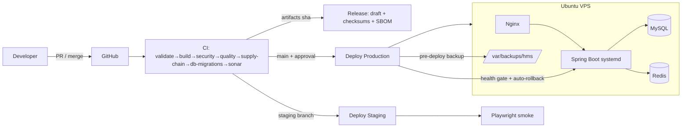
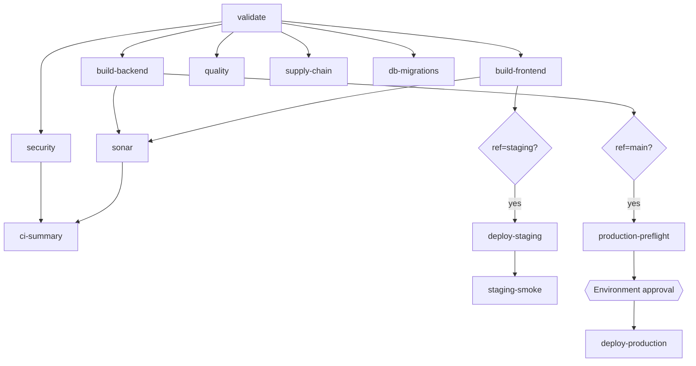
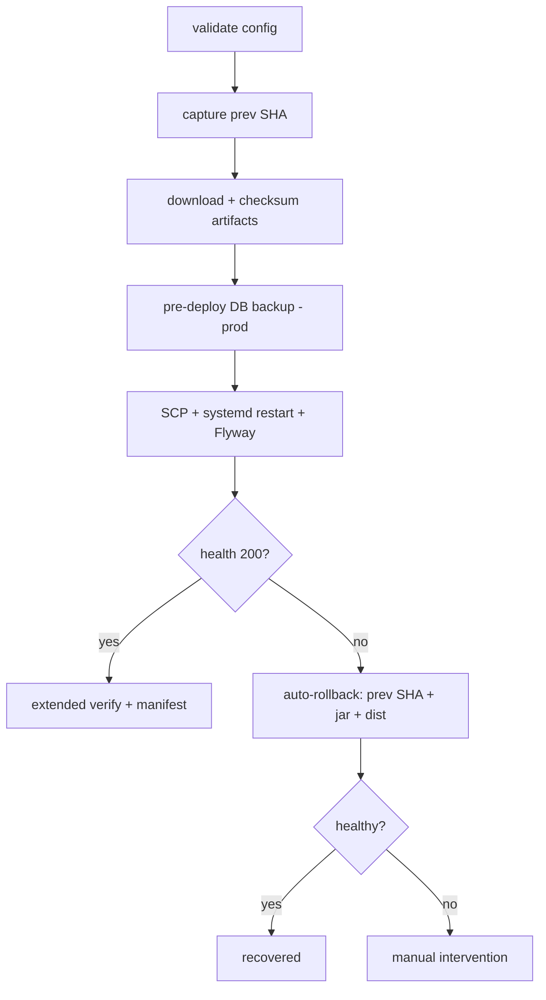
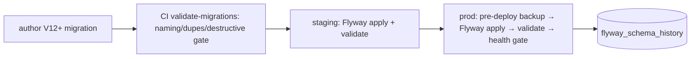

# HMS — Production Readiness Review

**Final engineering review before production release.** Reviews the platform built across the
Enterprise DevOps roadmap (governance → CI → quality → testing → security → release engineering →
deployment → database safety) as a single system, and gives an explicit release recommendation.

- **Reviewer role:** Principal Platform/SRE/DevOps/Security/Architecture review
- **Scope:** repository, pipelines, security, testing, deployment, database, docs — **not** a
  redesign. No Kubernetes / IaC / HA introduced.
- **Verdict (short):** **Conditional GO** for a small number of pilot hospitals once the
  Priority-1 items below are closed. The delivery *pipeline* is enterprise-grade; the biggest gaps
  are **observability/alerting** and **live validation** of the newest deployment/DB changes.

---

## 1. What was reviewed & consolidated

The roadmap delivered, and this review verified, the following as one system:

| Area | State |
|---|---|
| Governance | CODEOWNERS, PR/issue templates, branch & release strategy, CONTRIBUTING/SECURITY/SUPPORT/CoC |
| CI | `ci.yml` orchestrator → validate · build-frontend · build-backend · security · quality · supply-chain · db-migrations · sonar · ci-summary (reusable `_*.yml` + composite actions) |
| Code quality | SonarCloud gate, JaCoCo floor (line 20% / branch 10%), Checkstyle · PMD · SpotBugs+FindSecBugs (report), Spotless |
| Testing | 382 backend tests (unit · API · `@WebMvcTest` · ArchUnit) + Testcontainers IT (skips w/o Docker); Playwright smoke + critical e2e; k6 perf; Vitest frontend |
| Security | CodeQL (security-extended), Dependency Review, Gitleaks, npm audit, OWASP; SBOM (CycloneDX), Trivy fs, license scan (observe); Dependabot; Cosign prepared |
| Release eng. | SemVer, build/git metadata on `/actuator/info`, `release.yml` draft releases w/ checksums + SBOM + auto notes |
| Deployment | branch-based (staging/main), SSH+systemd+Nginx, health-gate + auto-rollback, extended verification, deployment manifest, prod approval gate + preflight, staging smoke, manual rollback |
| Database | Flyway (baseline V11), `ddl-auto=validate` in staging/prod, migration validation gate, backup/restore scripts + scheduled + pre-deploy backup |
| Observability | `/actuator/health` + `/actuator/info`, Slack deploy notify, CI/deploy step summaries, deployment manifests — **no metrics/dashboards/tracing/alerting** |

---

## 2. Cleanup register (STEP 1–3)

No files were deleted in this review. The candidates below are **surfaced for owner approval** —
several are pre-existing, data-adjacent, or possibly used in manual runbooks, so unilateral deletion
in a healthcare repo is not warranted. None affect the build.

| Candidate | Why it's a candidate | Safe to remove? | Recommendation |
|---|---|---|---|
| `setup/test-login.json` (59 B) | Unreferenced; looks like a stray curl payload | Likely | Remove after confirming no personal runbook uses it |
| `setup/migrations/V2_…, V3_…, V4_…, v2-module-system-migration.sql` | Informal single-underscore scripts, superseded by Flyway; **not** in Flyway's classpath | Likely (historical) | Move to `docs/history/` or delete once Flyway baseline is confirmed live |
| `setup/schema-full-utf8.sql` | Appears to duplicate `schema-full.sql` (encoding variant) | Verify first | Keep one canonical; document which |
| `backend/src/main/resources/db/migration/V6–V11` | Pre-Flyway, never executed (some Postgres syntax) | **Keep** | Intentionally retained below baseline as history (documented) |

No duplicate workflows/jobs/steps were found worth consolidating: workflows are already factored into
reusable `_*.yml` + composite `setup-node`/`setup-java`. The repeated SSH env-var fallback chains in
`_deploy.yml` are a readability wart but are **proven** — left as-is (see risks).

---

## 3. Security review (STEP 5) — no weakening detected

All pre-existing gates remained intact through every phase; later phases only **added** controls:
CodeQL was *strengthened* (dedicated config, `security-extended`), Gitleaks gained `.gitleaks.toml`,
and SBOM/Trivy/license/Dependabot were added. Secrets are never printed by any new script (config
validation checks names only; DB dumps never leave the VPS). **Posture: strong.** Manual GitHub
toggles (Dependabot alerts, secret-scanning push protection) remain the operator's to enable.

## 4. Testing review (STEP 6)
`mvn verify` → **BUILD SUCCESS**, 382 tests pass, coverage floor met, IT skips without Docker.
Pyramid is real (unit → API → integration → e2e → perf) and prioritises business workflows. **Gap:**
backend line coverage ≈ 25% — acceptable given the floor + workflow focus, but thin for a clinical
system; grow coverage of billing/patient/tenant paths.

## 5. Deployment review (STEP 7)
Branch-based promotion, health-gated auto-rollback, extended verification, manifests, prod approval
gate, manual rollback. Solid design. **Gap:** the newest additions (extended verify, manifest,
pre-deploy backup, manual rollback) are **validated locally/statically only** — they must be
exercised on the real VPS/staging before they can be fully trusted.

## 6. Monitoring review (STEP 8) — largest gap
Only `/actuator/health` + `/actuator/info`, Slack deploy notifications, and CI/deploy summaries
exist. There are **no metrics, dashboards, tracing, alerting, or log aggregation**. For a 24×7×365
hospital system this is the **top production risk** — you cannot currently detect a partial outage,
latency regression, error spike, or resource exhaustion proactively. (Out of this roadmap's
implemented scope; flagged as Priority-1.)

## 7. Documentation review (STEP 9)
Docs are consistent, namespaced per concern, and now indexed (`docs/README.md`). `docs/superpowers/`
holds product plans/specs (historical, product-team) — orthogonal to the DevOps docs and fine to
keep.

## 8. Dependency review (STEP 10)
Frameworks are current (Spring Boot 3.3.5, React 19, Vite, JDK 17). Dependabot now proposes weekly
grouped updates. No knowingly high-risk libraries. **Action:** triage the first Dependabot batch; do
**not** bulk-upgrade majors pre-launch (stability > currency).

## 9. Performance review (STEP 11)
CI parallelises well (fan-out after `validate`, cached npm/Maven). Backend build + tests ≈ 3 min.
Safe optimizations already present (concurrency cancellation, artifact SHA keys). **Recommendations
(non-blocking):** cache the OWASP NVD data (already cached), consider skipping supply-chain on
docs-only PRs, and add JVM startup tuning only if measured need arises. No risky changes made.

## 10. Maintainability review (STEP 12)
Reusable workflows + composite actions + scripts extracted from YAML = good. Main wart: the SSH
env-var fallback chains in `_deploy.yml`. Kept for stability; a future safe refactor is to resolve
them once into step outputs.

---

## 11. Production readiness checklist (STEP 13)

| Area | Status | Notes |
|---|---|---|
| Repository & governance | ✅ | CODEOWNERS, templates, branch/release strategy, policies |
| CI | ✅ | Orchestrated, gated, parallel, summarised |
| Code quality | ✅ | Sonar gate + coverage floor + static analysis |
| Security (SAST/deps/secrets) | ✅ | Multiple gates; not weakened |
| Supply chain (SBOM/Trivy/license) | ⚠ | Implemented in **observe** mode — promote to blocking after burn-in |
| Testing | ⚠ | Strong pyramid; **coverage ~25%** — grow critical-path coverage |
| CD / Deployment | ⚠ | Enterprise design; **needs live staging validation** of new steps |
| Rollback | ⚠ | App rollback automated; **DB not rolled back** (forward-fix/restore) |
| Database migrations | ✅ | Flyway baseline V11, validated, `validate` in prod |
| Backups & restore | ⚠ | Automated + pre-deploy; **restore drill must be run & scheduled**; offsite copy manual |
| Approvals | ⚠ | Wired; requires GitHub **Environment reviewers** to be configured |
| Monitoring / metrics | ❌ | Health/info only — **no metrics/dashboards** |
| Alerting | ❌ | Slack on deploy only — **no runtime alerts** |
| Logging / tracing | ⚠ | App + `journalctl`; **no aggregation/tracing** |
| Documentation | ✅ | Comprehensive + indexed |
| Developer experience | ✅ | Composite actions, local scripts, docs |
| Release engineering | ✅ | SemVer, metadata, draft releases, checksums, SBOM |
| Business continuity / HA / DR | ❌ | Single VPS (SPOF); DR = backups only (by design/scope) |

Legend: ✅ Complete · ⚠ Needs attention · ❌ Missing

---

## 12. Risk register (STEP 14)

| # | Risk | Sev | Impact | Recommendation | Effort |
|---|---|---|---|---|---|
| R1 | **No runtime monitoring/alerting** | 🔴 Critical | Outages/regressions go undetected on a 24×7 clinical system | Add Micrometer + Prometheus + Grafana + Alertmanager (or a hosted APM); alert on health, error rate, latency, DB/disk | M–L |
| R2 | **Single VPS = SPOF; DR is backup-only** | 🔴 Critical | Host loss = full outage; recovery = restore + rebuild | Document RTO/RPO now; plan a warm standby / managed DB when scaling (future phase) | L |
| R3 | New CD/DB steps unproven on real infra | 🟠 High | A latent bug in verify/manifest/backup could disrupt a real deploy | Run a full staging deploy + rollback + restore drill before onboarding | S–M |
| R4 | `ddl-auto=validate` may fail on legacy drift | 🟠 High | Prod app won't start if schema ≠ entities | Validate on staging first; `HIBERNATE_DDL_AUTO=none` escape hatch documented | S |
| R5 | Backend test coverage ~25% | 🟠 High | Regressions in billing/patient/tenant paths slip through | Grow critical-workflow coverage to a higher floor over releases | M |
| R6 | Restore not yet drilled; backups offsite-manual | 🟠 High | "Backups" unproven; site loss loses local backups | Run the restore drill; schedule it + offsite copy | S |
| R7 | Supply-chain/Trivy in observe mode | 🟡 Medium | Criticals visible but non-blocking | Promote to blocking after burn-in | S |
| R8 | No log aggregation / tracing | 🟡 Medium | Slow incident diagnosis across services | Ship logs to a store; add request tracing when scaling | M |
| R9 | Manual GitHub/VPS config required | 🟡 Medium | Approvals/alerts inactive until set | Complete the manual-config checklists in the docs | S |
| R10 | SSH fallback chains / raw dump schema | 🟢 Low | Maintainability | Refactor opportunistically | S |

---

## 13. Production readiness scores (STEP 15)

Scored 1–10, weighted by how each was verified (green pipeline runs, code/config review, and honest
gap analysis). Deductions reflect **unvalidated-on-live** and **missing observability**.

| Dimension | Score | Rationale |
|---|---|---|
| Repository | 9 | Clean, governed, documented, indexed |
| CI | 9 | Orchestrated, gated, fast, summarised |
| CD | 7 | Excellent design; not yet exercised on real infra |
| Security | 8.5 | Layered gates, SBOM, not weakened; supply-chain still observe |
| Testing | 7 | Real pyramid; coverage thin |
| Deployment | 7 | Safe + recoverable design; needs live proof |
| Database | 8 | Flyway baseline + validation + backups; restore undrilled |
| Observability | 3 | Health/info only; no metrics/alerts |
| Documentation | 9 | Thorough, consistent, indexed |
| Developer experience | 9 | Scripts, composite actions, clear docs |
| Scalability | 5 | Fine for tens of hospitals; single-VPS ceiling |
| Reliability | 6 | Rollback + backups help; no HA, no alerting |
| **Overall** | **7.4 / 10** | Enterprise pipeline; gated on observability + live validation |

*Overall = weighted mean emphasising Security, CD, Database, Observability, Reliability for a clinical
SaaS. Observability (3) and Reliability (6) are the main drags.*

---

## 14. Final architecture (STEP 16)

### Overall platform

### CI/CD flow

### Deployment + rollback

### Database lifecycle

---

## 15. Executive summary (STEP 17)

**What was improved.** In this roadmap the project went from a working application with an ad-hoc
deploy to an **enterprise software-delivery platform**: governed repo, orchestrated multi-gate CI,
enforced quality gates, a real test pyramid, layered DevSecOps + SBOM/supply-chain, semantic release
engineering with build provenance, a safe recoverable deployment pipeline with approvals and
auto-rollback, and a controlled, backed-up, migration-driven database lifecycle — all documented.

**Major achievements.** Multi-gate CI with a single clear status; security not weakened but layered;
`/actuator/info` build+git provenance for "which build runs here?"; deployment manifests as an audit
trail; Flyway introduced onto a **live** database with zero data risk (baseline-on-migrate); mandatory
pre-deploy backups.

**Current strengths.** Delivery pipeline, security posture, release traceability, documentation,
developer experience.

**Remaining weaknesses.** (1) **Observability/alerting** essentially absent. (2) New CD/DB machinery
**unproven on live infra**. (3) **Single-VPS** SPOF, DR = backups only. (4) Test coverage thin.

**Future roadmap (in scope order).** Monitoring/observability (metrics, dashboards, alerting, log
aggregation) → live validation & restore drills → coverage growth → promote supply-chain to blocking.

**Scaling beyond the current VPS (when the company grows).** Managed MySQL (HA + PITR); move the
frontend to a CDN; a second app node behind Nginx/load balancer for zero-downtime + failover;
externalized secrets (Vault/SSM); centralized logging/metrics; and eventually containers/IaC — all
explicitly **out of scope now** but unblocked by the current design.

---

## 16. Release recommendation (STEP 18)

**Would I approve this for production?** **Conditionally, yes** — the pipeline is production-grade.
Close Priority-1 (R1 observability, R3 live validation, R6 restore drill) first.

**Would I onboard paying hospitals?** **Pilot (1–3), yes**, after Priority-1, with hands-on support
and a documented manual runbook. Not at volume yet.

**Would I trust it in a real hospital?** For a **pilot** with monitoring + a tested restore and an
on-call human: **yes, cautiously**. As unattended critical infrastructure: **not yet** (no alerting,
no HA).

**Remaining blockers (must-fix before go-live):**
1. Runtime **monitoring + alerting** (R1).
2. Full **staging deploy + rollback + restore drill** proving the new machinery (R3, R6).
3. Configure GitHub **Environment approvals** + enable Dependabot/secret-scanning toggles (R9).
4. Confirm `ddl-auto=validate` passes on real staging schema (R4).

**Before 10 hospitals:** monitoring/alerting live; restore drills scheduled + offsite backups; raise
test coverage on billing/patient/tenant; promote supply-chain gates to blocking; document RTO/RPO.

**Before 100 hospitals:** managed HA database with PITR; a second app node + load balancer for
zero-downtime/failover; centralized logs/metrics/tracing; externalized secrets; capacity/load
testing beyond the k6 smoke.

**Before 1000 hospitals:** horizontal scaling & tenant sharding strategy; containerize + IaC +
(likely) orchestration; multi-region DR; SLOs/error budgets + on-call rotation; formal compliance
(HIPAA/GDPR/DPDP) audit and BAA processes.

---

## 17. Sign-off

The platform is left in a **clean, stable, maintainable, enterprise-ready** state. It is a **strong
conditional GO**: an excellent delivery foundation whose remaining gap to true clinical-grade
operation is **observability and live validation**, not architecture. Close the Priority-1 items and
begin a supported pilot.

_See [docs/README.md](README.md) for the full documentation index._
