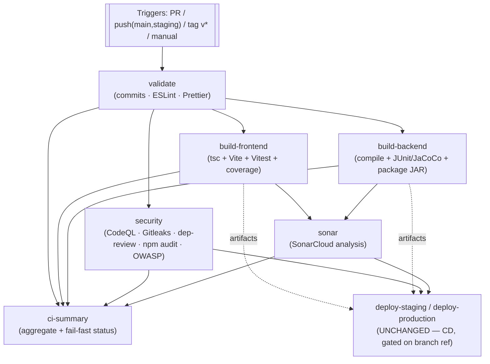

# CI Architecture

Continuous Integration for the Hospital Management System. This document covers **CI only**
(build, test, quality, security). Deployment/CD lives in `_deploy.yml` and is out of scope here.

---

## 1. Pipeline overview

**Single responsibility per job:** `validate` (fast gate) → `build-frontend` / `build-backend` /
`security` (parallel) → `sonar` (quality) → `ci-summary` (consolidated status). Deploy is
transitively gated: it `needs` the build jobs, which `need` `validate`.

---

## 2. Workflows & responsibilities

| File | Type | Responsibility |
| ---- | ---- | -------------- |
| `ci.yml` | Orchestrator | Triggers, job graph, Sonar, CI summary, and the (unchanged) deploy jobs |
| `_validate.yml` | Reusable | Conventional-commit check (PR, blocking) + ESLint + Prettier (report-only) |
| `_build-frontend.yml` | Reusable | `tsc` type-check, Vite build, Vitest + coverage, dist artifact |
| `_build-backend.yml` | Reusable | Maven compile, tests + JaCoCo, JUnit report, JAR artifact |
| `_security.yml` | Reusable | CodeQL, dependency-review, Gitleaks, npm audit, OWASP Dependency-Check |
| `_deploy.yml` | Reusable | **CD — not modified in this phase** |
| `actions/setup-java` | Composite | Temurin JDK + Maven cache |
| `actions/setup-node` | Composite | Node + npm cache + `npm ci` |

---

## 3. Trigger strategy

| Event | Runs | Deploys? |
| ----- | ---- | -------- |
| **Pull request** → `main`/`staging` | full CI (commitlint blocking) | no |
| **Push** → `main`/`staging` | full CI | yes (existing behavior, branch-ref gated) |
| **Tag** `v*` | full CI (build + package) | **no** — tag ref is not a branch ref |
| **Manual** (`workflow_dispatch`) | full CI | only if run on `staging`/`main` (branch-ref gated) |

**Duplicate-run control:** `concurrency: ci-${{ github.ref }}` with `cancel-in-progress: true`
cancels a superseded run when a new commit lands on the same ref.

---

## 4. Job design & fail-fast

`validate` is cheap (~1–2 min) and runs first. The heavy jobs (`build-frontend`,
`build-backend`, `security`) `needs: [validate]`, so a bad commit message or config problem
short-circuits the run before burning build/test/scan compute. `ci-summary` (`if: always()`)
posts a consolidated table and fails the run if any **required** stage failed.

---

## 5. Cache strategy

| Cache | Where | Key |
| ----- | ----- | --- |
| Maven (`~/.m2`) | `setup-java` composite | built-in `cache: maven` |
| npm | `setup-node` composite | `cache: npm`, keyed on `package-lock.json` |
| OWASP NVD data | `_security.yml` | `owasp-nvd-<os>-<hash(pom.xml)>` |

Caches are restored on every run; misses only cost the first run after a lock/pom change.

---

## 6. Artifact strategy

Artifacts are named by commit SHA so a given run's outputs are unambiguous and
**consumed unchanged by the deploy workflow** (do not rename without updating `_deploy.yml`):

| Artifact | Produced by | Consumed by | Retention |
| -------- | ----------- | ----------- | --------- |
| `frontend-dist-${sha}` | build-frontend | deploy | 7d |
| `backend-jar-${sha}` | build-backend | deploy | 7d |
| `jacoco-xml-${sha}` | build-backend | sonar | 7d |
| `frontend-coverage-${sha}` | build-frontend | sonar | 7d |
| `test-results-${sha}`, `jacoco-html-${sha}` | build-backend | humans | 14d |
| SARIF / OWASP / npm-audit reports | security | Security tab / humans | 30–90d |

---

## 7. Reporting & developer feedback

- **JUnit** results published as a check (dorny/test-reporter).
- **Coverage** (JaCoCo + Vitest LCOV) summarized into the GitHub **Step Summary**.
- **CI Summary** job posts one table of all stage results + a link to the run.
- **SonarCloud** analysis on every run (quality gate currently non-blocking — see §9).

---

## 8. Troubleshooting

| Symptom | Likely cause / fix |
| ------- | ------------------ |
| `validate` fails on a PR | Non-conventional commit message — see `CONTRIBUTING.md` §3 |
| Everything skipped after `validate` failed | Intended fail-fast — fix validate first |
| Frontend build fails on `tsc` | Type error; run `npm --prefix frontend run build` locally |
| Backend job slow / times out | Spring `@SpringBootTest` context tests; see `docs/DEVELOPMENT.md` §7 |
| Sonar step: "not authorized" | `SONAR_TOKEN` secret / `SONAR_*` vars missing |
| OWASP slow | Set the optional `NVD_API_KEY` secret |
| Artifact download fails in deploy | An artifact was renamed — restore the `*-${sha}` names |

---

## 9. Known CI technical debt (this phase)

- **ESLint / Prettier are report-only** in `validate` (the codebase predates linting;
  enforcing repo-wide would fail every run). Plan: enforce on changed files, then repo-wide.
- **SonarCloud quality gate is non-blocking** (`sonar.qualitygate.wait=false`) — unchanged
  this phase; flipping it to blocking is a follow-up.
- **Actions pinned to tags** (`@v4`) not commit SHAs — a supply-chain hardening follow-up.
- **No integration tests on real MySQL** (tests run on H2) — planned for a later phase.
