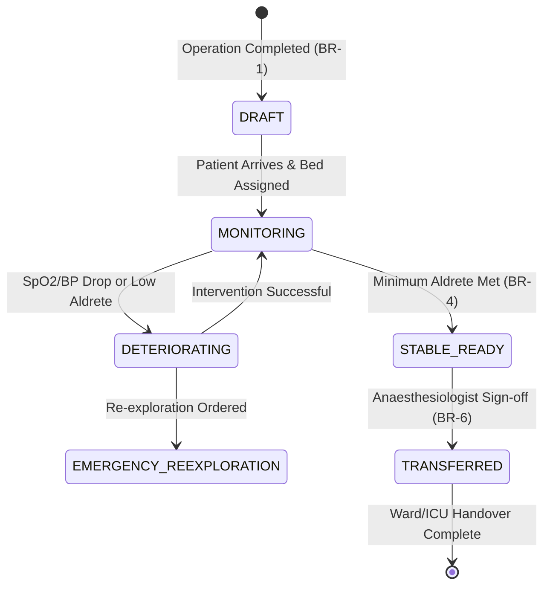

# Form Spec — Recovery Room / PACU Monitoring Record

| | |
|---|---|
| **Status** | Draft |
| **Source** | pasted form analysis — *VH/NABH/OT/08/2026* (2026-07-01) |
| **Existing code?** | **`pacu_record` is new.** Reuses existing patient/surgery from [`OtBooking`](../../backend/src/main/java/com/hms/entity/OtBooking.java)/[`operation_record`](./18-operation-record.md); drugs → [`Medicine`](../../backend/src/main/java/com/hms/entity/Medicine.java) + MAR ([`NurseTask`](../../backend/src/main/java/com/hms/entity/NurseTask.java), [Form 08](./08-nursing-daily-progress.md)); complication detection extends [`CdssEvaluationService.calculateEws`](../../backend/src/main/java/com/hms/service/hospital/CdssEvaluationService.java); transfer wires into bed/`IpdAdmission`. |

> **Read first — PACU is the recovery phase's owner; consolidate with Form 19, don't fork it.**
> **(1) Aldrete/recovery scoring lives HERE, not in AIMS.** Form 19 §Read-first noted `recovery_scores`
> "feeds PACU" — resolve that now: the **Modified Aldrete Score is a property of the PACU record**
> (`pacu_record.aldrete_score` + component breakdown). The anaesthesia record's *completion* gates PACU
> **entry** (Form 19 BR-5); it does not own the score. **Do not build `recovery_scores` in both places.**
> **(2) `pacu_vitals` is the same high-frequency, device-fed channel as `anaesthesia_vitals`** (Form 19) —
> both are the intra-/post-op sibling of ward `VitalSigns`. **Recommend one `monitoring_vitals` table keyed
> by `context` (INTRAOP / PACU)** rather than a third parallel vitals table; same trend/EWS infra.
> **(3) `pacu_events` = the same timestamped event pattern** as `anaesthesia_events` (Form 19) /
> `operation_complications` (Form 18); severe complications route to **Incident Reporting** (Form 18 gap).
> **(4) Section F meds reuse MAR** (`NurseTask`) + `Medicine` stock — not a new drug store.
> **New this form:** `pacu_record` + `pacu_vitals`/`pacu_events`, the **transfer/disposition** step, and a
> **structured digital-handover** document (note: a **nurse shift-handover** summary already exists in
> code — reuse its pattern for the OT→ward handover).

---

## 1. Form Overview
- **Department:** Recovery Room / PACU (primary); Anaesthesia, OT, ICU, Nursing, Surgeon, MRD (secondary)
- **Module:** **Operation Theatre → PACU (Recovery Room) → Recovery Monitoring** (live monitoring dashboard, not a chart)
- **Filled By:** Recovery Nurse (continuous monitoring); Anaesthesiologist (recovery orders)
- **Reviewed By:** Surgeon (progress), ICU Doctor (accepts critical), Ward Nurse (receives handover)
- **Archived By:** MRD
- **Lifecycle:** starts on shift-to-PACU (OT completed); ends on fit-for-transfer; permanent after archival
- **NABH clause:** COP/PSQ — immediate post-operative / post-anaesthesia monitoring record.

## 2. Purpose
- **Hospital use:** continuous monitoring of the highest-risk post-op window (extubation, first 1–2 h) until the patient is safe to transfer.
- **NABH requirement:** documented post-anaesthesia recovery monitoring + scored fit-for-transfer decision.
- **Legal:** proves the patient was safely recovered before leaving OT care; complication timeline is medico-legal evidence.
- **Clinical:** Aldrete-scored recovery + complication detection prevents premature transfer.
- **Business rationale:** a **Post-Anaesthesia Recovery Management System** — every OT patient auto-enters; no one leaves recovery prematurely.

## 3. Trigger
`Operation completed → shift to PACU → PACU record auto-starts (BR-1) → recovery monitoring → pain assessment → Aldrete score → fit-for-transfer → Ward/ICU/HDU`. Recovery is a **mandatory phase before transfer**.

## 4. User Roles
| Actor | Capacity | Existing HMS role | Note |
|---|---|---|---|
| Recovery Nurse | continuous monitoring, recommend transfer | `NURSE` (PACU) | |
| Anaesthesiologist | recovery orders, **approve transfer** | `DOCTOR` | with anaesthetist capacity flag |
| Surgeon | review progress | `DOCTOR` | |
| ICU Doctor | accept critical patients | `DOCTOR` | with ICU capacity flag |
| Ward Nurse | receives handover | `NURSE` | |
| MRD | archives record | — | role gap: `MRD_OFFICER` |

## 5. Fields
Legend — Source: `auto`=fetched from context, `manual`=entered, `sig`=signature capture.

| Field | Type | Max | Mandatory | Editable rule | DB column | Validation | Search | Print | Source |
|---|---|---|---|---|---|---|---|---|---|
| UHID | string | 20 | Y | read-only | (join `patient.custom_id`) | must resolve to a patient in hospital | Y | Y | auto |
| Patient Name | string | 100 | Y | read-only | `patient.name` | — | Y | Y | auto |
| IPD Number | string | 20 | Y | read-only | (join `ipd_admission.ipd_number`) | admission ACTIVE | Y | Y | auto |
| Surgery | string | 200 | Y | read-only | `operation_record.surgery_name` | — | N | Y | auto |
| Surgeon | string | 100 | Y | read-only | (join `doctor.name`) | — | Y | Y | auto |
| Anaesthesiologist | string | 100 | Y | read-only | (join `doctor.name`) | — | Y | Y | auto |
| OT Number | string | 10 | Y | read-only | `ot_booking.ot_number` | — | N | Y | auto |
| Recovery Bed | string | 20 | Y | draft only | `pacu_record.recovery_bed` | valid PACU bed | N | Y | manual |
| PACU Admission Time | datetime | — | Y | read-only | `pacu_record.recovery_start` | not in future | N | Y | auto |
| Consciousness | enum | — | Y | draft only | `pacu_record.consciousness` | fully awake/arousable/unresponsive | N | Y | manual |
| Orientation | enum | — | Y | draft only | `pacu_record.orientation` | oriented/confused/disoriented | N | Y | manual |
| Airway | enum | — | Y | draft only | `pacu_record.airway_status` | patent/assisted/intubated | N | Y | manual |
| Breathing | enum | — | Y | draft only | `pacu_record.breathing_status` | normal/shallow/laboured/apneic | N | Y | manual |
| Circulation | enum | — | Y | draft only | `pacu_record.circulation_status` | normal/hypotensive/hypertensive | N | Y | manual |
| Nausea | enum | — | Y | draft only | `pacu_record.nausea_severity` | none/mild/moderate/severe | N | Y | manual |
| Vomiting | bool | — | Y | draft only | `pacu_record.vomiting_present` | — | N | Y | manual |
| BP (Systolic/Diastolic) | int/int | — | Y | draft only | `pacu_vitals.bp_systolic`, `bp_diastolic` | > 0 | N | Y | manual/device |
| Pulse | int | — | Y | draft only | `pacu_vitals.pulse` | 0–300 | N | Y | manual/device |
| Temperature | decimal | 4,1 | Y | draft only | `pacu_vitals.temperature` | 30.0–45.0 °C | N | Y | manual/device |
| Respiratory Rate | int | — | Y | draft only | `pacu_vitals.respiration` | 0–100 | N | Y | manual/device |
| SpO₂ | int | — | Y | draft only | `pacu_vitals.spo2` | 0–100 % | N | Y | manual/device |
| Oxygen Support | string | 50 | N | draft only | `pacu_vitals.oxygen_support` | room air, L/min, mask, etc. | N | Y | manual |
| Pain Score | int | — | Y | draft only | `pacu_record.pain_score` | 0–10 (NRS) | N | Y | manual |
| Aldrete: Activity | int | — | Y | draft only | `pacu_record.aldrete_activity` | 0, 1, 2 | N | Y | manual |
| Aldrete: Respiration | int | — | Y | draft only | `pacu_record.aldrete_respiration` | 0, 1, 2 | N | Y | manual |
| Aldrete: Circulation | int | — | Y | draft only | `pacu_record.aldrete_circulation` | 0, 1, 2 | N | Y | manual |
| Aldrete: Consciousness | int | — | Y | draft only | `pacu_record.aldrete_consciousness` | 0, 1, 2 | N | Y | manual |
| Aldrete: Oxygen Saturation| int | — | Y | draft only | `pacu_record.aldrete_oxygen` | 0, 1, 2 | N | Y | manual |
| Total Aldrete Score | int | — | Y | read-only | `pacu_record.aldrete_score` | 0–10 (calculated) | N | Y | auto |
| Transfer Destination | enum | — | Y | draft only | `pacu_record.transfer_destination` | WARD/ICU/HDU/RE_EXPLORATION | N | Y | manual |
| Handover Notes | text | 2000 | Y | draft only | `pacu_record.handover_notes` | — | N | Y | manual |

## 6. Business Rules
- **BR-1** PACU record starts automatically when OT status becomes: **"Operation Completed"** (`OtBooking` status updated to `COMPLETED` or equivalent completion trigger).
- **BR-2** Vitals must be recorded at hospital-configured intervals (e.g., every 15 minutes for the first hour, every 30 minutes thereafter).
- **BR-3** Modified Aldrete Score must be calculated automatically as the sum of its five component scores (Activity, Respiration, Circulation, Consciousness, SpO₂).
- **BR-4** Patient cannot be transferred to a general ward until the minimum recovery score (typically Aldrete ≥ 9, or according to hospital policy) is achieved.
- **BR-5** If physiological deterioration occurs (e.g., SpO₂ < 90%, systolic BP < 90 mmHg, or Aldrete score decreases), the system must automatically notify the Anaesthesiologist, Surgeon, and ICU coordinator via WebSocket alerts.
- **BR-6** Every transfer requires a structured digital handover note detailing intraoperative medications, complications, pain status, and ward care instructions.
- **BR-7** Every database operation and API query must filter by the tenant's `hospital_id` to ensure absolute multi-tenant data isolation.

## 7. Database Design
### Table `pacu_record` (tenant-owned):
Holds the structured recovery session metadata, assessments, and transfer decisions.

| Column | Type | Notes |
|---|---|---|
| id | BIGINT PK | Primary key |
| public_id | VARCHAR(50) unique | Tenant-safe external identifier |
| hospital_id | BIGINT NOT NULL, FK | Tenant separation key, indexed |
| patient_id | BIGINT NOT NULL, FK | Reference to patient table |
| admission_id | BIGINT NOT NULL, FK | Reference to IPD admission |
| operation_id | BIGINT NOT NULL, FK | Reference to operation record |
| recovery_nurse_id | BIGINT, FK | Reference to nurse who executed PACU |
| anaesthesiologist_id | BIGINT, FK | Reference to approving doctor |
| recovery_start | TIMESTAMP NOT NULL | Time entered PACU |
| recovery_end | TIMESTAMP | Time departed PACU |
| recovery_bed | VARCHAR(20) | Bed number in recovery area |
| consciousness | VARCHAR(20) | Consciousness status |
| orientation | VARCHAR(20) | Orientation status |
| airway_status | VARCHAR(20) | Airway assessment |
| breathing_status | VARCHAR(20) | Breathing assessment |
| circulation_status | VARCHAR(20) | Circulation assessment |
| nausea_severity | VARCHAR(20) | Nausea assessment |
| vomiting_present | BOOLEAN | Presence of vomiting |
| pain_score | INTEGER | Pain scale (0-10) |
| aldrete_activity | INTEGER | Activity score (0, 1, 2) |
| aldrete_respiration | INTEGER | Respiration score (0, 1, 2) |
| aldrete_circulation | INTEGER | Circulation score (0, 1, 2) |
| aldrete_consciousness | INTEGER | Consciousness score (0, 1, 2) |
| aldrete_oxygen | INTEGER | Oxygen saturation score (0, 1, 2) |
| aldrete_score | INTEGER | Calculated sum (0-10) |
| transfer_destination | VARCHAR(30) | Destination (WARD, ICU, HDU, RE_EXPLORATION) |
| handover_notes | TEXT | Handover instructions |
| status | VARCHAR(20) | ACTIVE / READY / TRANSFERRED / CANCELLED |
| signed_by | BIGINT, FK | Reference to approving anaesthetist user |
| signed_at | TIMESTAMP | Time transfer was signed off |
| created_at | TIMESTAMP | Audit creation timestamp |
| updated_at | TIMESTAMP | Audit modification timestamp |

### Table `pacu_vitals` (tenant-owned):
High-frequency vital readings logged during PACU stay.

| Column | Type | Notes |
|---|---|---|
| id | BIGINT PK | |
| pacu_record_id | BIGINT NOT NULL, FK | Link to parent `pacu_record` |
| bp_systolic | INTEGER | |
| bp_diastolic | INTEGER | |
| pulse | INTEGER | |
| temperature | DECIMAL(4,1) | |
| respiration | INTEGER | |
| spo2 | INTEGER | |
| oxygen_support | VARCHAR(50) | |
| recorded_at | TIMESTAMP NOT NULL | Time of reading |

### Table `pacu_events` (tenant-owned):
Complications or clinical interventions logged chronologically.

| Column | Type | Notes |
|---|---|---|
| id | BIGINT PK | |
| pacu_record_id | BIGINT NOT NULL, FK | Link to parent `pacu_record` |
| event_type | VARCHAR(50) | e.g. COMPLICATION, MEDICATION, AIRWAY_INTERVENTION |
| severity | VARCHAR(20) | ROUTINE / URGENT / CRITICAL |
| remarks | TEXT | Text description of event |
| recorded_by | BIGINT, FK | Staff user id |
| recorded_at | TIMESTAMP NOT NULL | Time of event |

- **Indexes:** `(hospital_id, status)` for the PACU Dashboard. `(hospital_id, pacu_record_id, recorded_at)` for plotting trends.

## 8. APIs
Every `{id}` endpoint validates `hospital_id` ownership of the resource before access.

- **`POST /hospital/pacu/start`**
  - **Roles:** `NURSE`, `DOCTOR`, `HOSPITAL_ADMIN`
  - **Request:** `{ "admissionId": 123, "operationId": 456, "recoveryBed": "PACU-B3" }`
  - **Response:** Created `pacu_record` JSON
  - **Purpose:** Initializes recovery stay when patient moves out of OT.

- **`POST /hospital/pacu/{id}/vitals`**
  - **Roles:** `NURSE`, `HOSPITAL_ADMIN`
  - **Request:** `{ "bpSystolic": 120, "bpDiastolic": 80, "pulse": 78, "temperature": 36.8, "respiration": 16, "spo2": 98, "oxygenSupport": "Room Air" }`
  - **Response:** Created `pacu_vitals` JSON
  - **Purpose:** Adds a high-frequency monitoring entry (manual or device input).

- **`POST /hospital/pacu/{id}/events`**
  - **Roles:** `NURSE`, `DOCTOR`, `HOSPITAL_ADMIN`
  - **Request:** `{ "eventType": "COMPLICATION", "severity": "URGENT", "remarks": "Patient reported severe nausea; antiemetic administered." }`
  - **Response:** Created `pacu_events` JSON
  - **Purpose:** Logs complications, airway adjustments, or rescue medication.

- **`POST /hospital/pacu/{id}/transfer`**
  - **Roles:** `DOCTOR` (Anaesthesiologist flag)
  - **Request:** `{ "transferDestination": "WARD", "handoverNotes": "Stable. Post-op pain managed with Paracetamol IV. Keep head end elevated." }`
  - **Response:** Updated `pacu_record` JSON with status `TRANSFERRED`
  - **Purpose:** final sign-off and initiation of bed-transfer workflow (gates on BR-4).

- **`GET /hospital/pacu/{admissionId}`**
  - **Roles:** `DOCTOR`, `NURSE`, `HOSPITAL_ADMIN`
  - **Response:** Complete `pacu_record` with child vitals and events list
  - **Purpose:** Fetches the full recovery timeline for the patient's record.

- **`GET /hospital/pacu/dashboard`**
  - **Roles:** `DOCTOR`, `NURSE`, `HOSPITAL_ADMIN`
  - **Response:** Array of active recovery records with critical indicators (Aldrete, pain, elapsed time)
  - **Purpose:** Feeds the live Recovery Room status display.

## 9. UI Design
- **Desktop/Tablet Layout:** Three-panel dashboard design.
  - **Left Panel:** Patient Banner & Recovery Metadata (UHID, surgery, bed, time elapsed, oxygen status).
  - **Center Panel:** Live vitals plotting chart (multi-line trend for BP, Pulse, SpO₂) alongside the quick-entry vital panel.
  - **Right Panel:** Interactive Modified Aldrete Score card (color-coded sliders) and Pain Assessment tools.
- **Action Bar:** Sticky bottom action bar containing "Log Event", "Record Vitals", and "Sign-off & Transfer" buttons.
- **Responsive design:** Collapses into a tabbed layout on mobile devices (Info, Vitals, Assessment, Actions).

## 10. Workflow

## 11. Validation
- Aldrete component scores (`aldrete_activity`, etc.) must be strictly in the set `{0, 1, 2}`.
- Total `aldrete_score` must equal the mathematical sum of the components.
- Physiological parameters: BP systolic (20–300), BP diastolic (10–200), Pulse (30–250), Temperature (30.0–45.0), SpO₂ (0–100).
- Handover notes must contain at least 15 characters to prevent blank checkouts.
- Recovery end time must be greater than or equal to recovery start time.

## 12. Permissions
| Role | Create | Edit | Approve Transfer | View |
|---|---|---|---|---|
| Recovery Nurse | ✅ | ✅ | Recommend | ✅ |
| Anaesthesiologist | ✅ | ✅ | ✅ | ✅ |
| Surgeon | Notes | No | Review | ✅ |
| ICU Doctor | Accept ICU | No | ICU Transfer | Relevant |
| MRD | ❌ | ❌ | ❌ | Archived |

## 13. Print Rules
- Printed via HTML-to-PDF template `templates/pacu-record.html`.
- **Layout:** Standard margins, header with hospital logo, patient barcode (UHID/IPD number), and a structured timeline grid.
- **Visuals:** Printed timeline showing chronologically sorted vital trends, logged events, medications administered, Aldrete history, and final destination.
- **Sign-off:** Dual signature boxes for Recovery Nurse (Attending) and Anaesthesiologist (Approver).

## 14. Audit Logs
Recorded under `AuditLogService` with `entity_type="PACU_RECORD"`:
- PACU record started (who, bed, timestamp).
- Vitals recorded (values, device/manual source).
- Aldrete score calculation changes (old values, new values).
- Emergency event/deterioration alert sent.
- Handover notes written and transfer approved.

## 15. Digital Improvements
- **Auto-Calculations:** Elimination of manual Aldrete score addition, reducing grading errors.
- **Smart Timeline:** Automatically stitches OT exit time, PACU arrival, vitals timeline, and ward handover into a unified, scrollable surgical event line.
- **Pre-populated Handover:** Pre-fills the transfer report with surgical details and intraoperative drugs directly from AIMS.

## 16. Missing / Intelligent Features
- **Recovery Readiness Prediction:** Machine learning utility analyzing recovery progression to estimate ward transfer readiness within 15 minutes.
- **Auto Complication Alarm:** Alerts if SpO₂ drops or hypotension persists over consecutive checks.
- **Intelligent Handover Generator:** Auto-composes clinical highlights (Procedure, Anaesthesia type, fluids, allergies) for the ward nurse.

---

## Module & workflow placement
- **Owning module:** Operation Theatre → PACU Suite (Post-Anaesthesia Recovery Management System).
- **Creates / Updates / Views / Prints / Archives:**
  - **Creates:** `pacu_record`, `pacu_vitals`, `pacu_events`.
  - **Updates:** `IpdAdmission` (status, ward bed updates on transfer).
  - **Views:** Patient clinical timeline.
  - **Prints:** PACU Record PDF.
  - **Archives:** Medical Record Department (MRD).
- **Feeds into:** Ward/ICU Nursing (handover sheet) · Bed Management (recovery bed release, ward bed occupancy) · Billing (PACU recovery hourly charge) · MRD.
- **Fed by:** Operation Record (Form 18) · Anaesthesia Record (Form 19) · Pharmacy (dispensed recovery medications).
- **New modules this form implies:** Post-Anaesthesia Recovery Management System (PACU) · Modified Aldrete Scorer · Structured Handover Engine.
