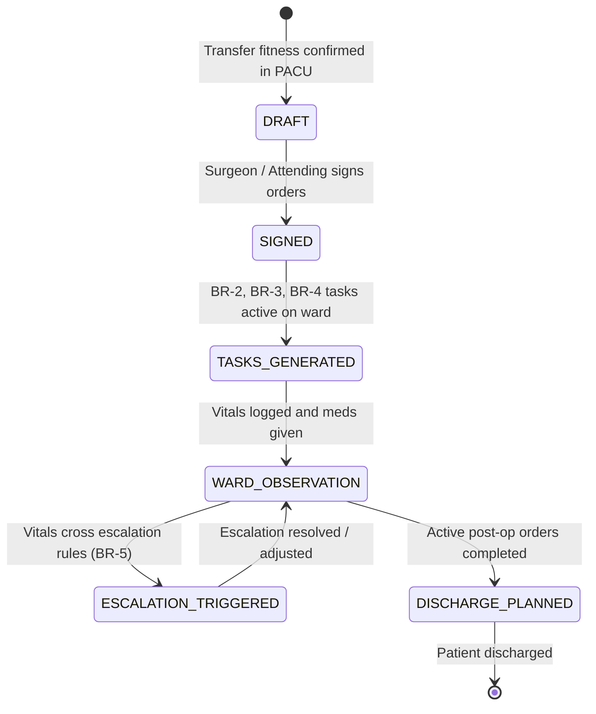

# Form Spec — Post-Operative Orders & Post-Operative Assessment

| | |
|---|---|
| **Status** | Draft |
| **Source** | pasted form analysis — *VH/NABH/OT/09/2026* (2026-07-01) |
| **Existing code?** | **Partially exists.** Reuses `DoctorOrder` (existing columns for meds/labs/radiology/diet in [`DoctorOrder`](../../backend/src/main/java/com/hms/entity/DoctorOrder.java)), `NurseTask` (existing ward MAR tasks in [`NurseTask`](../../backend/src/main/java/com/hms/entity/NurseTask.java)), and ward/bed management via `IpdAdmission`. **New:** `postoperative_orders` bundle header and related specific mapping sub-tables for monitoring, nursing, and escalation rules. |

> **Read first — Handover bridge between Surgery/PACU and Ward care.**
> **(1) Integrate with the clinical order system instead of building a separate silo.** Post-operative medication orders must write directly into the existing `doctor_orders` table (type `MEDICATION`) and map to `NurseTask` to feed the Medication Administration Record (MAR). Similarly, diet and investigation instructions must spawn standard `DoctorOrder` / `LabOrder` / `RadiologyOrder` items.
> **(2) Automated nursing task generation is key.** The monitoring parameters (vital schedule) and wound/drain care must auto-create standard `NurseTask` entries on the Nursing Dashboard, eliminating double-entry and translation lag.
> **(3) Digital Handover links up to PACU sign-off.** This form acts as the clinical receipt and handover checklist. PACU exit gates on the successful signature of this bundle.

---

## 1. Form Overview
- **Department:** Surgeon (primary); Anaesthesia, Nursing Station, ICU, Pharmacy, Physiotherapy, Dietician, MRD (secondary)
- **Module:** **Operation Theatre → Post-operative Management → Ward Orders** (integrated directly into the ward's Nursing Dashboard)
- **Filled By:** Surgeon (post-op orders & assessment); Anaesthesiologist (PACU exit orders)
- **Approved / Signed By:** Attending Surgeon / Resident
- **Executed By:** Ward Nurse (meds & vitals); Physiotherapist (rehab); Dietician (nutrition planning)
- **Archived By:** MRD
- **Lifecycle:** created in recovery/PACU; gates ward handover; active throughout immediate post-op period; archived in MRD on discharge
- **NABH clause:** COP/AAC — documented post-operative plan of care, including monitoring, medications, diet, and mobilization instructions, signed and dated by the operating clinician.

## 2. Purpose
- **Hospital use:** serves as the authoritative post-op care plan communicating instructions from the OT team to the ward nursing team.
- **NABH requirement:** structured post-operative plan of care completed immediately after surgery to ensure patient safety.
- **Legal:** establishes clear accountability for post-op orders, wound care guidelines, and escalation boundaries.
- **Clinical:** standardizes post-operative instructions (meds, vitals monitoring, mobilization, diet), reducing communication gaps.
- **Business rationale:** automates pharmacy requests, lab requests, and nursing duties directly from the clinical decision point.

## 3. Trigger
`Surgery completed → PACU recovery completed → Fit-for-transfer status → **Surgeon writes postoperative orders (this form)** → sign-off → patient shifted to Ward/ICU → automated task generation (vitals, meds, diet) active on Nursing Station`.

## 4. User Roles
| Actor on form | Capacity | Existing HMS role | Note |
|---|---|---|---|
| Surgeon | writes orders, provisional post-op diagnosis, signs | `DOCTOR` | operating surgeon |
| Anaesthesiologist | recovery orders, pain protocol, signs | `DOCTOR` | anaesthetist flag |
| Ward Nurse | receives patient, executes vitals and drug orders | `NURSE` | ward staff |
| ICU Doctor | receives patient in ICU, modifies orders as needed | `DOCTOR` | ICU consultant |
| Physiotherapist | reviews rehabilitation plan, executes activity order | — | role gap: `PHYSIOTHERAPIST` |
| Dietician | reviews nutrition plan, coordinates meals | — | role gap: `DIETICIAN` |
| MRD Officer | archives completed record | — | role gap: `MRD_OFFICER` |

## 5. Fields
Legend — Source: `auto`=fetched from context, `manual`=entered, `sig`=signature capture.

| Field | Type | Max | Mandatory | Editable rule | DB column | Validation | Search | Print | Source |
|---|---|---|---|---|---|---|---|---|---|
| UHID | string | 20 | Y | read-only | (join `patient.custom_id`) | valid patient identity | Y | Y | auto |
| IPD Number | string | 20 | Y | read-only | (join `ipd_admission.ipd_number`) | active admission | Y | Y | auto |
| Patient Name | string | 100 | Y | read-only | `patient.name` | — | Y | Y | auto |
| Procedure Performed | string | 200 | Y | read-only | `operation_record.surgery_name` | — | N | Y | auto |
| Surgeon | string | 100 | Y | read-only | (join `doctor.name`) | — | Y | Y | auto |
| Anaesthesiologist | string | 100 | Y | read-only | (join `doctor.name`) | — | Y | Y | auto |
| Ward / Bed | string | 30 | Y | read-only | (join `bed.name`) | — | N | Y | auto |
| Transfer Time | datetime | — | Y | read-only | `pacu_record.recovery_end` | not in future | N | Y | auto |
| Post-operative Diagnosis | string | 250 | Y | draft only | `postoperative_orders.postop_diagnosis` | min 3 characters | Y | Y | auto/manual |
| Patient Condition | enum | — | Y | draft only | `postoperative_orders.condition` | CONSCIOUS / DROWSY / SEDATED / STABLE / CRITICAL | N | Y | manual |
| Monitoring Parameters | enum list| — | Y | draft only | `postop_monitoring.parameter` | BP / PULSE / SPO2 / TEMP / DRAIN / URINE_OUTPUT | N | Y | manual |
| Vital Check Interval | int | — | Y | draft only | `postop_monitoring.interval_minutes` | 15 / 30 / 60 / 120 / 240 / 360 | N | Y | manual |
| Vital Check Duration | int | — | Y | draft only | `postop_monitoring.duration_hours` | 1 to 48 hours | N | Y | manual |
| Medication Name | string | 100 | Y | draft only | `postop_medications.medicine_id` | must match `MedicineMaster` | N | Y | manual |
| Dosage & Route | string | 50 | Y | draft only | `postop_medications.dose` / `route` | e.g. 500mg IV | N | Y | manual |
| Frequency | string | 20 | Y | draft only | `postop_medications.frequency` | OD / BD / TDS / QID / PRN / SOS | N | Y | manual |
| Diet Order | enum | — | Y | draft only | `postoperative_orders.diet_order` | NPO / CLEAR_LIQUIDS / SOFT_DIET / NORMAL_DIET | N | Y | manual |
| Activity Order | enum | — | Y | draft only | `postoperative_orders.activity_order` | BED_REST / SIT_UP / AMBULATE / PHYSIO_REFERRAL | N | Y | manual |
| Wound dressing instructions| text | 1000 | N | draft only | `postop_nursing_orders.instructions` | — | N | Y | manual |
| Drain Monitoring | text | 500 | N | draft only | `postop_nursing_orders.instructions` | — | N | Y | manual |
| Scheduled Investigations | string | 100 | N | draft only | `postop_investigations.test_name` | — | N | Y | manual |
| Escalation Criteria | text | 1000 | Y | draft only | `postoperative_orders.escalation_instructions`| — | N | Y | manual |

## 6. Business Rules
- **BR-1** **Transfer Precondition:** A patient cannot be marked as transferred from PACU to the Ward/ICU unless the postoperative orders are signed by the attending surgeon (status `SIGNED`).
- **BR-2** **Pharmacy & MAR Synchronization:** On signing the orders, `postop_medications` records must instantly create stock-deduction/preparation requests in the Pharmacy queue and insert corresponding administration schedules into `NurseTask` (MAR) for the target ward.
- **BR-3** **Ward Task Generation:** Monitoring schedules (`postop_monitoring`) must automatically create recurring `NurseTask` events of type `VITALS` at the specified intervals (e.g., BP check every 30m) on the ward nursing portal.
- **BR-4** **Lab & Radiology Orders Routing:** Any investigation listed in `postop_investigations` must automatically generate a `DoctorOrder` with status `ACTIVE` and forward it to the Lab/Radiology service module (`LabOrder` or `RadiologyOrder`).
- **BR-5** **Deterioration Alerts:** The dietician and physiotherapist must be automatically notified via SMS/WebSocket when a diet change or physiotherapy referral is signed.
- **BR-6** **Immutable Signed State:** Once signed, the postoperative orders are read-only. Any adjustments require a new versioned record (amendment) linked via `parent_id`.
- **BR-7** **Tenant Isolation:** Every table in the post-op system must carry `hospital_id`, and all API calls must validate ownership to prevent cross-tenant access.

## 7. Database Design
### Table `postoperative_orders` (tenant-owned):
The master clinical instructions header.

| Column | Type | Notes |
|---|---|---|
| id | BIGINT PK | |
| public_id | VARCHAR(50) unique | Tenant-safe UUID |
| hospital_id | BIGINT NOT NULL, FK | Tenant reference key, indexed |
| patient_id | BIGINT NOT NULL, FK | Reference to patient table |
| admission_id | BIGINT NOT NULL, FK | Reference to IPD admission |
| operation_id | BIGINT NOT NULL, FK | Reference to operation record |
| surgeon_id | BIGINT NOT NULL, FK | Operating doctor |
| anaesthesiologist_id | BIGINT, FK | Anaesthetist user id |
| postop_diagnosis | VARCHAR(250) | Post-operative diagnosis |
| condition | VARCHAR(30) | Clinical condition |
| diet_order | VARCHAR(30) | Diet regimen |
| activity_order | VARCHAR(30) | Activity status / instructions |
| escalation_instructions | TEXT | Parameters for notification triggers |
| status | VARCHAR(20) | DRAFT / SIGNED / CANCELLED |
| signed_by | BIGINT, FK | Doctor user who signed the bundle |
| signed_at | TIMESTAMP | Verification timestamp |
| created_at | TIMESTAMP | |
| updated_at | TIMESTAMP | |

### Table `postop_medications` (tenant-owned):
Prescribed medications for post-operative administration.

| Column | Type | Notes |
|---|---|---|
| id | BIGINT PK | |
| postop_order_id | BIGINT NOT NULL, FK | Parent postoperative order |
| medicine_id | BIGINT NOT NULL, FK | Reference to Medicine Master |
| dose | VARCHAR(50) | e.g. 500mg |
| route | VARCHAR(30) | e.g. IV, ORAL |
| frequency | VARCHAR(20) | e.g. TDS |
| duration_days | INTEGER | |
| start_date | DATE | |
| notes | VARCHAR(500) | Administration instructions |

### Table `postop_monitoring` (tenant-owned):
Vital check frequencies generated as tasks.

| Column | Type | Notes |
|---|---|---|
| id | BIGINT PK | |
| postop_order_id | BIGINT NOT NULL, FK | Link to parent order bundle |
| parameter | VARCHAR(30) | e.g. BP, PULSE, SPO2, DRAIN_OUTPUT |
| interval_minutes | INTEGER | check frequency in minutes |
| duration_hours | INTEGER | total observation duration |

### Table `postop_investigations` (tenant-owned):
Scheduled lab tests and diagnostic checks.

| Column | Type | Notes |
|---|---|---|
| id | BIGINT PK | |
| postop_order_id | BIGINT NOT NULL, FK | Link to parent order bundle |
| test_type | VARCHAR(20) | LAB / RADIOLOGY |
| test_name | VARCHAR(100) | e.g. CBC, Serum Potassium, X-Ray Chest |
| scheduled_date | DATE | Target execution date |

### Table `postop_nursing_orders` (tenant-owned):
Specialized ward procedures for nurses (dressing, drain, catheter).

| Column | Type | Notes |
|---|---|---|
| id | BIGINT PK | |
| postop_order_id | BIGINT NOT NULL, FK | Link to parent order bundle |
| order_type | VARCHAR(30) | DRESSING / DRAIN_CARE / CATHETER_CARE / OXYGEN |
| instructions | TEXT | Detailed procedural guidelines |
| frequency | VARCHAR(30) | e.g. Daily, Q8H |

- **Indexes:** `(hospital_id, admission_id)` to quickly find active orders. `(hospital_id, status)` for dashboard filters.

## 8. APIs
Every `{id}` endpoint checks `hospital_id` to confirm patient ownership.

- **`POST /hospital/postoperative-orders`**
  - **Roles:** `DOCTOR`, `HOSPITAL_ADMIN`
  - **Request:** `{ "admissionId": 123, "operationId": 456, "postopDiagnosis": "Post-op Appendicitis", "condition": "STABLE", "dietOrder": "NPO", "activityOrder": "BED_REST", "escalationInstructions": "Call if Temp > 38C" }`
  - **Response:** Created master order header JSON
  - **Purpose:** Initializes draft post-op order group.

- **`POST /hospital/postoperative-orders/{id}/medications`**
  - **Roles:** `DOCTOR`, `HOSPITAL_ADMIN`
  - **Request:** `{ "medicineId": 78, "dose": "1g", "route": "IV", "frequency": "BD", "durationDays": 3 }`
  - **Response:** Created medication entry JSON
  - **Purpose:** Adds a medication line to the post-op list.

- **`POST /hospital/postoperative-orders/{id}/monitoring`**
  - **Roles:** `DOCTOR`, `HOSPITAL_ADMIN`
  - **Request:** `{ "parameter": "BP", "intervalMinutes": 30, "durationHours": 4 }`
  - **Response:** Created monitoring entry JSON
  - **Purpose:** Adds vital checks mapping rules.

- **`POST /hospital/postoperative-orders/{id}/sign`**
  - **Roles:** `DOCTOR` (Surgeon or Anaesthesiologist flag)
  - **Response:** Updated order JSON with status `SIGNED`
  - **Purpose:** Signs off and triggers pharmacy requests, MAR schedules, and lab orders (BR-2, BR-3, BR-4).

- **`GET /hospital/postoperative-orders/{admissionId}`**
  - **Roles:** `DOCTOR`, `NURSE`, `HOSPITAL_ADMIN`
  - **Response:** Comprehensive order bundle with list of medications, monitoring, and nursing tasks.
  - **Purpose:** Fetches the active postoperative plan of care for display.

- **`GET /hospital/postoperative/dashboard`**
  - **Roles:** `DOCTOR`, `NURSE`, `HOSPITAL_ADMIN`
  - **Response:** Summary of ward patients with pending post-op monitoring checks and active drains.

## 9. UI Design
- **Interactive Multi-Step Form (Desktop/Tablet):**
  - **Assessment Header:** Pre-populated surgical context, input field for Post-op Diagnosis, and patient condition selectors.
  - **Tabbed Order Panels:**
    - *Tab 1: Medications* (Search-and-add list mapping to local pharmacy stock, dosage/route fields).
    - *Tab 2: Vital Monitoring* (Dropdown interval selectors, toggle switches for parameters).
    - *Tab 3: Diet & Mobilization* (Radio buttons for diet type and activity levels).
    - *Tab 4: Nursing & Drains* (Instructions text editor, drain output targets).
  - **Alert Thresholds (Sidebar):** Configure custom trigger values for temperature, SpO₂, pulse, and drain output.
  - **Sticky Action Bar:** Features draft autosaving indicator, cancel button, and a prominent "Authenticate & Sign Orders" button.

## 10. Workflow

## 11. Validation
- Temperature escalation threshold must be between 37.5 °C and 42.0 °C.
- SpO₂ alert threshold must be between 80% and 98%.
- All vital check intervals must be positive integers, typically selected from a preset array (15, 30, 60, 120, 240, 360).
- Medication durations cannot exceed 14 days (requires re-evaluating long-term medications via daily round).
- Diet type must match one of the predefined list values.

## 12. Permissions
| Role | Create | Edit | Sign | View |
|---|---|---|---|---|
| Surgeon | Attending | Draft | ✅ | ✅ |
| Anaesthesiologist | PACU Orders | Limited | ✅ | ✅ |
| Nurse | Execute Orders | Progress Updates | ❌ | ✅ |
| Physiotherapist | View orders | Therapy notes | ❌ | Relevant |
| Dietician | Diet items | Diet notes | ❌ | Relevant |
| MRD | ❌ | ❌ | ❌ | Full View |

## 13. Print Rules
- Printed via HTML-to-PDF template `templates/postop-orders.html`.
- **Layout:** Standard margins, header with hospital logo, patient barcode (UHID/IPD number), and standard sections.
- **Sections:** Patient Details, Surgical Diagnosis, Vital Monitoring Grid, Medication Orders, Diet/Activity Instructions, and escalation criteria.
- **Sign-off:** Authenticated clinician signature block and a QR code linking to the live digital signature verification.

## 14. Audit Logs
Recorded under `AuditLogService` with `entity_type="POSTOP_ORDERS"`:
- Post-operative order draft created (by whom, timestamp).
- Medication added or removed (name, dose, route).
- Critical escalation threshold modified (old value, new value).
- Complete post-op bundle signed (user, role, timestamp, IP).
- Nursing monitoring check skipped/held (task ID, nurse reason).

## 15. Digital Improvements
- **Instantiated Task Generation:** Eliminates handwriting misinterpretation by translating doctors' orders into specific task checklists.
- **Closed-Loop Pharmacy Queue:** Prescribing drugs in the OT bundle automatically alerts pharmacy staff to prepare the items, shortening delivery times.
- **Automatic CDSS Alerts:** Integrates ward vitals checks with surgeon notification, ensuring prompt intervention during early deterioration.

## 16. Missing / Intelligent Features
- **Smart Nursing Task Scheduler:** Plots nursing tasks on a daily timeline grid, optimizing rounding workloads.
- **Automated Clinical Escalation:** Monitors vital trends and triggers clinical supervisor alerts if vital trends deteriorate.
- **Progress Notes Pre-population:** Feeds executed medication tasks and vital values directly into the doctor's daily round notes.

---

## Module & workflow placement
- **Owning module:** Operation Theatre → Post-operative Management (Handover & Ward Orders Engine).
- **Creates / Updates / Views / Prints / Archives:**
  - **Creates:** `postoperative_orders` master header, sub-rows (`postop_medications`, `postop_monitoring`, `postop_nursing_orders`).
  - **Updates:** Spawns standard `DoctorOrder` entries, generates `NurseTask` rows on ward dashboard.
  - **Views:** Clinical assessment history.
  - **Prints:** Post-operative Orders PDF.
  - **Archives:** MRD.
- **Feeds into:** Ward/ICU Nursing Station (checklists) · Pharmacy (dispensing queue) · Lab/Radiology (investigations routing) · Physiotherapy / Dietician dashboards.
- **Fed by:** Operation Record (Form 18) · PACU Recovery Record (Form 20).
- **New modules this form implies:** Post-operative Handover Engine · Automated Escalation Engine.
