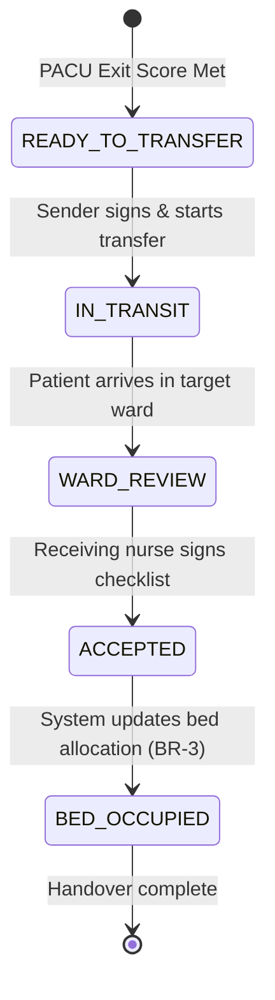

# Form Spec — OT to Ward / ICU Transfer & Clinical Handover Record

| | |
|---|---|
| **Status** | Draft |
| **Source** | pasted form analysis — *VH/NABH/OT/09/2026* (2026-07-01) |
| **Existing code?** | **`patient_transfer` and `clinical_handover` are new.** Reuses existing patient/surgery from [`OtBooking`](../../backend/src/main/java/com/hms/entity/OtBooking.java); updates bed locations via [`IpdAdmissionService.changeBed`](../../backend/src/main/java/com/hms/service/hospital/IpdAdmissionService.java#L1085); triggers on PACU completion status; feeds ward task updates via `NurseTask`. |

> **Read first — The Hospital Clinical Handover Engine.**
> **(1) Resolve the Bed-Change Permission Constraint.** [`IpdAdmissionService.changeBed`](../../backend/src/main/java/com/hms/service/hospital/IpdAdmissionService.java#L1085) restricts bed changes to `RECEPTIONIST`, `HOSPITAL_ADMIN`, or Solo `DOCTOR`. This blocks the **Ward Nurse** or **PACU Nurse** from completing a clinical transfer. We must recommend allowing `NURSE` roles to execute bed changes *if* the change is initiated via a signed and verified `patient_transfer` workflow.
> **(2) Reusability across the hospital.** Do not build this solely as an "OT form". Design the schema and APIs as a unified **Clinical Handover Engine** capable of handling Ward-to-ICU, ER-to-IPD, Ward-to-OT, and department transfers using the same tables and state machines.
> **(3) Medication & Task Handover.** Any pending medications and outstanding vitals monitoring orders from the source department must automatically transition to the destination department's nursing workflow on transfer acceptance.

---

## 1. Form Overview
- **Department:** Operation Theatre, PACU / Recovery (primary); Ward Nursing, ICU, Surgeon, Anaesthesiologist, MRD (secondary)
- **Module:** **Operation Theatre → Patient Transfer → Clinical Handover** (integrated with Bed Management and the Nursing Station)
- **Filled By:** PACU/Recovery Nurse (initiator); Ward/ICU Nurse (acceptor)
- **Approved / Signed By:** Attending Anaesthesiologist (PACU clearance)
- **Stored In:** MRD (permanent archive)
- **Lifecycle:** transient during transfer process; finalized and frozen upon destination nurse acceptance; archived upon patient discharge
- **NABH clause:** COP/AAC — standardized clinical handover protocol during care transfers; documentation of clinical status, devices, and therapy plan at the time of transfer.

## 2. Purpose
- **Hospital use:** coordinates patient safety during the critical physical transfer from recovery to ward/ICU.
- **NABH requirement:** mandatory structured handover documentation ensuring zero loss of vital data during shifts.
- **Legal:** provides a digital audit trail of when clinical responsibility shifted from recovery team to ward team.
- **Clinical:** summarizes patient condition, active lines/devices, upcoming medications, and scheduled tests for the receiving team.
- **Business rationale:** prevents silent transfers, resolves bed assignment disputes, and eliminates communication delays.

## 3. Trigger
`PACU recovery criteria met (Aldrete ≥ 9) → Surgeon signs post-op orders (Form 21) → **PACU Nurse initiates transfer (this form)** → patient moved physically → receiving Ward Nurse reviews handover → Ward Nurse clicks "Accept" → bed status updates (BR-3)`.

## 4. User Roles
| Actor on form | Capacity | Existing HMS role | Note |
|---|---|---|---|
| PACU Nurse | completes clinical summary, lists devices, signs | `NURSE` | sending nurse |
| Ward / ICU Nurse | reviews summary, signs to accept responsibility | `NURSE` | receiving nurse |
| Anaesthesiologist | clears patient for transfer, reviews PACU exit | `DOCTOR` | anaesthetist flag |
| Surgeon | reviews post-operative status | `DOCTOR` | operating surgeon |
| MRD Officer | archives finalized handover record | — | role gap: `MRD_OFFICER` |

## 5. Fields
Legend — Source: `auto`=fetched from context, `manual`=entered, `sig`=signature capture.

| Field | Type | Max | Mandatory | Editable rule | DB column | Validation | Search | Print | Source |
|---|---|---|---|---|---|---|---|---|---|
| UHID | string | 20 | Y | read-only | (join `patient.custom_id`) | valid patient identity | Y | Y | auto |
| Patient Name | string | 100 | Y | read-only | `patient.name` | — | Y | Y | auto |
| IPD Number | string | 20 | Y | read-only | (join `ipd_admission.ipd_number`) | active admission | Y | Y | auto |
| Surgery Performed | string | 200 | Y | read-only | `operation_record.surgery_name` | — | N | Y | auto |
| Surgeon | string | 100 | Y | read-only | (join `doctor.name`) | — | Y | Y | auto |
| Anaesthesiologist | string | 100 | Y | read-only | (join `doctor.name`) | — | Y | Y | auto |
| Recovery Bed | string | 20 | Y | read-only | `pacu_record.recovery_bed` | — | N | Y | auto |
| Destination Ward | string | 50 | Y | read-only | (join `ward.ward_name`) | must match target bed | Y | Y | auto |
| Destination Bed | string | 20 | Y | read-only | (join `bed.bed_code`) | must be assigned | N | Y | auto |
| Transfer Time | datetime | — | Y | read-only | `patient_transfer.transfer_time` | not in future | N | Y | auto |
| Mode of Transport | enum | — | Y | draft only | `patient_transfer.transport_mode` | STRETCHER / WHEELCHAIR / ICU_BED / AMBULATORY | N | Y | manual |
| Transport Staff | string | 100 | Y | draft only | `patient_transfer.transport_staff`| non-empty | N | Y | manual |
| Consciousness | enum | — | Y | read-only | `pacu_record.consciousness` | auto-pulled from PACU | N | Y | auto |
| SpO₂ / Aldrete | int/int | — | Y | read-only | `pacu_record.aldrete_score` | auto-pulled from PACU | N | Y | auto |
| Foley Catheter | bool/str | — | Y | draft only | `clinical_handover.devices` (JSON) | present + functional flag | N | Y | manual |
| Central Line | bool/str | — | Y | draft only | `clinical_handover.devices` (JSON) | present + functional flag | N | Y | manual |
| Abdominal Drain | bool/str | — | Y | draft only | `clinical_handover.devices` (JSON) | present + functional flag | N | Y | manual |
| Oxygen Support | bool/str | — | Y | draft only | `clinical_handover.devices` (JSON) | present + functional flag | N | Y | manual |
| Next Due Meds | text | — | Y | read-only | `clinical_handover.pending_tasks` | list from post-op orders | N | Y | auto |
| Scheduled Monitoring | text | — | Y | read-only | `clinical_handover.monitoring_plan` | list from post-op orders | N | Y | auto |
| Escalation Alerts | text | — | Y | read-only | `postoperative_orders.escalation_instructions`| list from post-op orders | N | Y | auto |
| Handover Nurse Sign | sig | — | Y | draft only | `clinical_handover.handover_by_sig` | sender signature | N | Y | sig |
| Accepting Nurse Sign | sig | — | Y | accept only | `clinical_handover.accepted_by_sig` | receiver signature | N | Y | sig |

## 6. Business Rules
- **BR-1** **Pre-Transfer Checks:** A transfer record cannot be initiated (`status=PENDING`) until PACU record is marked `READY`, Aldrete score is ≥ 9, and postoperative orders (Form 21) are signed.
- **BR-2** **No Silent Transfers:** The receiving ward nurse must review the clinical handover summary and explicitly click "Accept Handover" (authenticating with PIN/Signature) to finalize the transfer.
- **BR-3** **Auto Bed Assignment:** Upon transfer acceptance (`status=ACCEPTED`), the system must automatically execute a bed transfer using `IpdAdmissionService.changeBed` to release the recovery bed and mark the destination ward bed as `occupied` under the patient's ID (bypassing role restrictions via system authorization context).
- **BR-4** **Dashboard Migration:** All pending medication tasks and monitoring schedules automatically migrate from the PACU dashboard to the assigned nurse's portal in the destination ward.
- **BR-5** **Device Tracking:** All active tubes, drains, and lines (e.g. Catheter, Chest Drain) must be explicitly documented (presence, functionality, site) before transfer can be completed.
- **BR-6** **Immutable Record:** Once the receiving nurse accepts the patient, the clinical handover record is locked and cannot be edited.
- **BR-7** **Tenant Isolation:** Every transfer and handover query must filter by the authenticated `hospital_id`.

## 7. Database Design
### Table `patient_transfer` (tenant-owned):
Manages the transfer transaction states and physical logistics.

| Column | Type | Notes |
|---|---|---|
| id | BIGINT PK | |
| public_id | VARCHAR(50) unique | UUID key |
| hospital_id | BIGINT NOT NULL, FK | Tenant reference key, indexed |
| patient_id | BIGINT NOT NULL, FK | |
| admission_id | BIGINT NOT NULL, FK | |
| operation_id | BIGINT NOT NULL, FK | |
| from_department | VARCHAR(50) | Source ward / dept |
| to_department | VARCHAR(50) | Target ward / dept |
| transport_mode | VARCHAR(30) | Transport method |
| transport_staff | VARCHAR(100) | Accompanying staff member |
| transfer_time | TIMESTAMP NOT NULL | Time transfer was initiated |
| accepted_time | TIMESTAMP | Time handover was accepted |
| status | VARCHAR(20) | PENDING / IN_TRANSIT / ACCEPTED / CANCELLED |
| created_at | TIMESTAMP | |

### Table `clinical_handover` (tenant-owned):
Stores the clinical payload representing patient safety status during the shift.

| Column | Type | Notes |
|---|---|---|
| id | BIGINT PK | |
| transfer_id | BIGINT NOT NULL, FK | Parent `patient_transfer` record |
| clinical_status | TEXT (JSON) | Consciousness, orientation, vitals summary |
| monitoring_plan | TEXT (JSON) | Vital check frequency orders |
| devices | TEXT (JSON) | List of catheters, drains, and functional status |
| pending_tasks | TEXT (JSON) | Pending medication and lab tests due next |
| remarks | TEXT | General clinical notes |
| handover_by | BIGINT, FK | Sending nurse user ID |
| handover_by_sig | TEXT | Sender signature blob |
| accepted_by | BIGINT, FK | Receiving nurse user ID |
| accepted_by_sig | TEXT | Receiver signature blob |

- **Indexes:** `(hospital_id, status)` for active dashboard lists. `(hospital_id, transfer_id)` for quick lookup.

## 8. APIs
Every `{id}` endpoint checks `hospital_id` to confirm patient ownership.

- **`POST /hospital/patient-transfer`**
  - **Roles:** `NURSE`, `DOCTOR`, `HOSPITAL_ADMIN`
  - **Request:** `{ "admissionId": 123, "operationId": 456, "fromDepartment": "PACU", "toDepartment": "WARD_B", "targetBedId": 89, "transportMode": "STRETCHER", "transportStaff": "Staff Nurse Anita" }`
  - **Response:** Created `patient_transfer` JSON with status `PENDING`.
  - **Purpose:** Initiates the transfer request from PACU.

- **`POST /hospital/clinical-handover`**
  - **Roles:** `NURSE`, `HOSPITAL_ADMIN`
  - **Request:** `{ "transferId": 12, "devices": [{ "name": "Foley Catheter", "functional": true }], "remarks": "Patient awake but quiet. Pain managed." }`
  - **Response:** Created `clinical_handover` JSON.
  - **Purpose:** Saves the clinical safety handover status checklist.

- **`POST /hospital/patient-transfer/{id}/accept`**
  - **Roles:** `NURSE`, `HOSPITAL_ADMIN`
  - **Request:** `{ "acceptedBedId": 89, "acceptedBySig": "data:image/png;base64,..." }`
  - **Response:** Updated transfer JSON with status `ACCEPTED`.
  - **Purpose:** final sign-off by ward nurse, triggers bed release/occupation (BR-3).

- **`GET /hospital/patient-transfer/{id}`**
  - **Roles:** `DOCTOR`, `NURSE`, `HOSPITAL_ADMIN`
  - **Response:** Detailed transfer record with clinical handover payload.
  - **Purpose:** Fetches handover info for review.

- **`GET /hospital/patient-transfer/dashboard`**
  - **Roles:** `DOCTOR`, `NURSE`, `HOSPITAL_ADMIN`
  - **Response:** Active transfers categorized by pending, in-transit, and delays.
  - **Purpose:** Feeds the live Transfer Dashboard.

## 9. UI Design
- **Handover Screen (PACU Nurse / Sender):**
  - Left panel: Patient identity and destination bed info.
  - Center panel: Device checklist (Tubes & Devices: catheter, central line, oxygen) with toggle switches for status.
  - Right panel: Next-due medications list and escalation alert preview (read-only from Form 21).
  - Footer: "Sign & Send Patient" canvas signature box.
- **Acceptance Screen (Ward Nurse / Receiver):**
  - Split view showing PACU Exit status side-by-side with Ward Setup parameters.
  - Highlights: Red-flag indicators if SpO₂ or consciousness levels are altered.
  - Action button: Big green "Accept Responsibility & Check-in Bed" button triggering the base signature pad.

## 10. Workflow

## 11. Validation
- Transferred patient's Aldrete score must be ≥ 9.
- Device list cannot be left empty; if no lines are present, nurse must explicitly check "No devices present".
- Receiving bed ID must match the assigned target bed or be updated with a valid available ward bed.
- Transport mode must select one of the allowed enum values.

## 12. Permissions
| Role | Create / Initiate | Accept Handover | View Handover |
|---|---|---|---|
| Recovery Nurse | ✅ | ❌ | ✅ |
| Ward Nurse | ❌ | ✅ | ✅ |
| ICU Nurse | ❌ | ✅ | ✅ |
| Anaesthesiologist | Review | ❌ | ✅ |
| Surgeon | Review | ❌ | ✅ |
| MRD | ❌ | ❌ | Full View |

## 13. Print Rules
- Printed via HTML-to-PDF template `templates/clinical-handover.html`.
- **Layout:** Standard formatting with bold patient headers, patient barcode, and two distinct signature blocks.
- **Timeline:** Display of PACU exit vitals, list of active catheters/drains, and the next three pending medication tasks.
- **Signatures:** Mandatory dual signatures ("Dispatched By" and "Received By") printed at the bottom of the page.

## 14. Audit Logs
Recorded under `AuditLogService` with `entity_type="PATIENT_TRANSFER"`:
- Patient transfer request created (public ID, source, target).
- Tubes & devices documented (catheter status, remarks).
- Handover initiated (by nurse, timestamp).
- Handover accepted (by receiving nurse, target bed, timestamp).
- Bed assignment updated dynamically.

## 15. Digital Improvements
- **Standardized Handover Structure:** Replaces verbal-only handovers with a mandatory digital validation check, preventing missed instructions.
- **Automated Bed Occupation:** Triggers immediate system updates for bed availability on accepting the patient.
- **Task Continuity:** Moves scheduled vital checks directly to the new ward nurse's portal, preventing monitoring gaps.

## 16. Missing / Intelligent Features
- **Smart Handover Generator:** Auto-synthesizes key surgical data (e.g. Laparoscopic Cholecystectomy, stable, pain 3/10, next drug at 6 PM) into a clean, readable card.
- **Transfer Safety Validator:** Enforces checking that a bed is actually allocated and receiving nurse is active on shift before allowing transfer dispatch.
- **Clinical Journey Tracker:** Displays a linear visual timeline showing patient progress (OT -> PACU -> Transfer -> Ward).

---

## Module & workflow placement
- **Owning module:** Operation Theatre → Clinical Handover Engine.
- **Creates / Updates / Views / Prints / Archives:**
  - **Creates:** `patient_transfer`, `clinical_handover` records.
  - **Updates:** updates target `Bed` status (releasing PACU bed, occupying ward bed) via system contexts.
  - **Views:** Patient clinical timeline.
  - **Prints:** Clinical Handover PDF.
  - **Archives:** MRD.
- **Feeds into:** Ward/ICU Nursing Station dashboards · Bed Management System · Notification Service.
- **Fed by:** PACU Recovery Record (Form 20) · Post-operative Orders (Form 21).
- **New modules this form implies:** Reusable Hospital-Wide Clinical Handover Engine.
