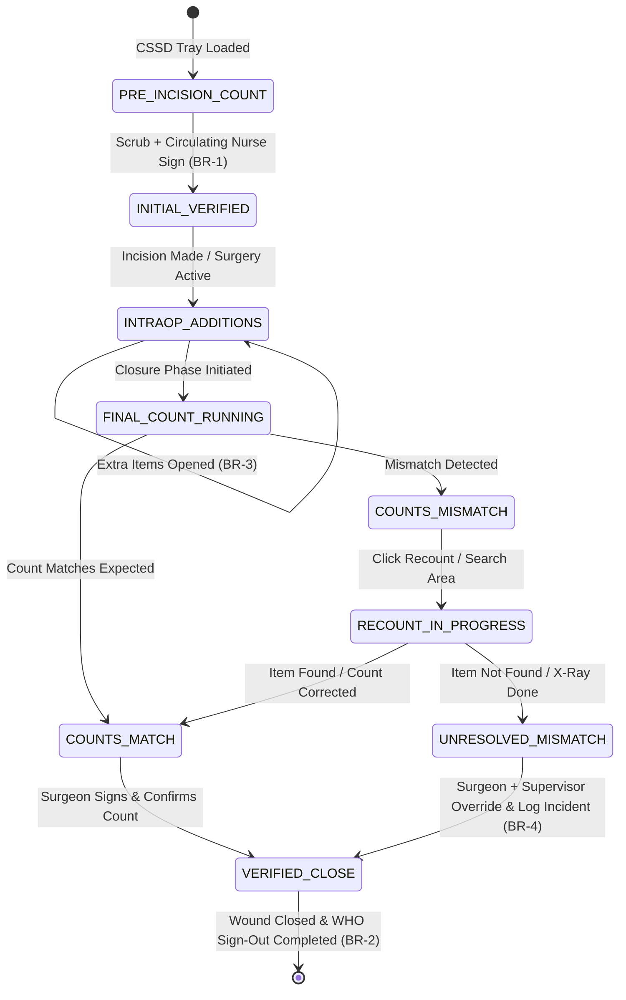

# Form Spec — OT Instrument, Sponge & Needle Count Record

| | |
|---|---|
| **Status** | Draft |
| **Source** | pasted form analysis — *VH/NABH/OT/10/2026* (2026-07-01) |
| **Existing code?** | **`ot_instrument_count` and `instrument_count_item` are new.** Integrates directly with [`OtChecklist`](../../backend/src/main/java/com/hms/entity/OtChecklist.java#L52) (gates the `signOutCompleted` step); reuses surgical context from [`OtBooking`](../../backend/src/main/java/com/hms/entity/OtBooking.java); links to quality/incident reporting structures for count failures. |

> **Read first — The Surgical Safety count gate.**
> **(1) Gate on WHO Sign Out.** [`OtChecklist`](../../backend/src/main/java/com/hms/entity/OtChecklist.java) manages the WHO Surgical Safety steps. The final sign-out step (`signOutCompleted=true`) **must block on the instrument count**. The system must enforce that the final instrument/sponge count is marked as verified (`final_count_status='VERIFIED'`) before the surgery case can be marked completed.
> **(2) CSSD Integration for expected totals.** The instrument lists (surgical trays) should not be typed manually. They should load automatically based on the CSSD tray type assigned to the `OtBooking` request (e.g., General Surgery Tray, Orthopaedic Tray), pre-populating expected counts.
> **(3) Count discrepancies are "Never Events".** Any mismatch between the initial count (plus additional items opened during surgery) and the final count must trigger an immediate safety override screen and automatically log a Quality Incident record.

---

## 1. Form Overview
- **Department:** Operation Theatre (primary); OT Nursing, Surgeon, CSSD, Quality Department, MRD (secondary)
- **Module:** **Operation Theatre → Instrument Management → Instrument Count** (integrated with CSSD, WHO Checklist, and Quality/Incident modules)
- **Filled By:** Scrub Nurse (instrument counts); Circulating Nurse (confirms counts)
- **Approved / Verified By:** Operating Surgeon (before wound closure)
- **Stored In:** MRD (permanent archive)
- **Lifecycle:** created before incision (initial count); active during surgery (additional items); finalized before wound closure (final count); locked upon surgeon verification; archived in MRD on discharge
- **NABH clause:** COP/PSQ — surgical safety procedures; checklist-based counting of instruments, gauze, sponges, needles, and blades to prevent retained surgical items (Never Events).

## 2. Purpose
- **Hospital use:** verifies that no foreign bodies (needles, gauze, sponges, instruments) are left inside a patient's surgical cavity.
- **NABH requirement:** mandatory documentation of instrument and swab counts before incision and before skin closure.
- **Legal:** provides complete, signed, time-stamped evidence of count verification to protect the surgical team and hospital from litigation.
- **Clinical:** enforces a strict recount and intraoperative imaging (X-ray) sequence if a count discrepancy occurs.
- **Business rationale:** avoids severe patient complications, litigation costs, and brand reputation loss associated with retained surgical items.

## 3. Trigger
`WHO Sign In completed → **Initial Count checklist generated (this form)** → scrub nurse performs initial count → WHO Time Out completed → Incision → additional items opened (updates expected count) → Final Count initiated before closure → count verified → skin closure permitted → WHO Sign Out completed → OT case closed`.

## 4. User Roles
| Actor on form | Capacity | Existing HMS role | Note |
|---|---|---|---|
| Scrub Nurse | counts items on sterile field, inputs counts | `NURSE` | scrub capacity |
| Circulating Nurse | counts items outside sterile field, verifies | `NURSE` | circulating capacity |
| Surgeon | reviews count status, confirms before closure | `DOCTOR` | attending surgeon |
| OT In-charge | reviews count discrepancies, enters resolutions | `NURSE` | supervisor flag |
| CSSD Staff | prepares sterilization tray lists (expected) | — | role gap: `CSSD_STAFF` |
| MRD Officer | archives completed record | — | role gap: `MRD_OFFICER` |

## 5. Fields
Legend — Source: `auto`=fetched from context, `manual`=entered, `sig`=signature capture.

| Field | Type | Max | Mandatory | Editable rule | DB column | Validation | Search | Print | Source |
|---|---|---|---|---|---|---|---|---|---|
| UHID | string | 20 | Y | read-only | (join `patient.custom_id`) | valid patient identity | Y | Y | auto |
| Patient Name | string | 100 | Y | read-only | `patient.name` | — | Y | Y | auto |
| IPD Number | string | 20 | Y | read-only | (join `ipd_admission.ipd_number`) | active admission | Y | Y | auto |
| Surgery Performed | string | 200 | Y | read-only | `operation_record.surgery_name` | — | N | Y | auto |
| Surgeon | string | 100 | Y | read-only | (join `doctor.name`) | — | Y | Y | auto |
| OT Room | string | 10 | Y | read-only | `ot_booking.ot_room` | — | N | Y | auto |
| Surgical Tray Name | string | 100 | Y | read-only | (join `cssd_tray.name`) | pre-allocated | N | Y | auto |
| Item Type | enum | — | Y | read-only | `instrument_count_item.item_type` | INSTRUMENT / SPONGE / GAUZE / NEEDLE / BLADE / MISC | N | Y | auto |
| Item Name | string | 100 | Y | read-only | `instrument_count_item.item_name` | non-empty | N | Y | auto |
| Initial Expected Qty | int | — | Y | read-only | `instrument_count_item.expected_quantity` | > 0 | N | Y | auto |
| Initial Counted Qty | int | — | Y | draft only | `instrument_count_item.actual_quantity` | >= 0 | N | Y | manual |
| Additional Items Qty | int | — | N | active only | `instrument_count_item.expected_quantity` (addition) | >= 0 (updates expected total) | N | Y | manual |
| Final Counted Qty | int | — | Y | final only | `instrument_count_item.actual_quantity` (final) | >= 0 | N | Y | manual |
| Count Difference | int | — | Y | read-only | `instrument_count_item.difference` | expected minus actual | N | Y | auto |
| Discrepancy Found | bool | — | Y | read-only | `ot_instrument_count.discrepancy_found` | auto-set if diff != 0 | N | Y | auto |
| Search Conducted | bool | — | cond. | discrepancy | `ot_instrument_count.search_conducted` | mandatory if discrepancy | N | Y | manual |
| X-Ray Performed | bool | — | cond. | discrepancy | `ot_instrument_count.xray_performed` | mandatory if discrepancy | N | Y | manual |
| Resolution Notes | text | 1000 | cond. | discrepancy | `ot_instrument_count.resolution_remarks` | required if unresolved mismatch | N | Y | manual |
| Incident Number | string | 30 | cond. | discrepancy | `ot_instrument_count.incident_number` | auto-generated on mismatch | Y | Y | auto |
| Scrub Nurse Sign | sig | — | Y | draft only | `ot_instrument_count.scrub_nurse_sig` | signature blob | N | Y | sig |
| Circulating Nurse Sign | sig | — | Y | draft only | `ot_instrument_count.circulating_nurse_sig`| signature blob | N | Y | sig |
| Surgeon Confirmation | sig | — | Y | final only | `ot_instrument_count.surgeon_sig` | signature blob | N | Y | sig |

## 6. Business Rules
- **BR-1** **Checklist Gating:** The initial count must be marked as complete (`initial_count_status='VERIFIED'`) before the surgical incision is made. The final count must be completed and signed by the surgeon before skin closure can proceed.
- **BR-2** **Sign-Out Block:** The WHO Surgical Safety checklist sign-out process (`OtChecklist.signOutCompleted`) **cannot be completed** if the instrument count status is pending, incorrect, or has an unresolved mismatch (enforces safety gate).
- **BR-3** **Dynamic Totals:** If additional surgical items or sponges are opened during the case, the scrub nurse must record them. The expected total for that item type must update immediately.
- **BR-4** **Unresolved Discrepancies:** If a count discrepancy remains unresolved during wound closure, the system will automatically:
  - Generate a critical warning notification to the surgeon and OT supervisor.
  - Log a Quality Incident report with status `PENDING_REVIEW` in the Quality Assurance module.
  - Require the user to document search results and whether an intraoperative X-ray was performed to locate the item.
- **BR-5** **Traceability Link:** Every instrument tray used must be linked to its corresponding CSSD sterilization batch number, enabling recall tracking.
- **BR-6** **Dual Signature Sign-off:** Every count verification requires the electronic signatures of both the Scrub Nurse and the Circulating Nurse.
- **BR-7** **Multi-Tenant Isolation:** All database tables must carry `hospital_id`, and queries must validate tenant ownership.

## 7. Database Design
### Table `ot_instrument_count` (tenant-owned):
Main header record for the surgical case count session.

| Column | Type | Notes |
|---|---|---|
| id | BIGINT PK | |
| public_id | VARCHAR(50) unique | UUID identifier |
| hospital_id | BIGINT NOT NULL, FK | Tenant reference key, indexed |
| ot_booking_id | BIGINT NOT NULL, FK | Reference to OT booking |
| patient_id | BIGINT NOT NULL, FK | Reference to Patient |
| scrub_nurse_id | BIGINT, FK | Staff user ID of Scrub Nurse |
| circulating_nurse_id | BIGINT, FK | Staff user ID of Circulating Nurse |
| initial_count_status | VARCHAR(20) | PENDING / VERIFIED |
| final_count_status | VARCHAR(20) | PENDING / VERIFIED / MISMATCH |
| discrepancy_found | BOOLEAN | Indicates if count did not match |
| resolved | BOOLEAN | Mismatch resolved or override signed |
| search_conducted | BOOLEAN | Discrepancy checklist parameter |
| xray_performed | BOOLEAN | Discrepancy checklist parameter |
| resolution_remarks | TEXT | Description of discrepancy resolution |
| incident_number | VARCHAR(30) | Quality Incident cross-reference ID |
| scrub_nurse_sig | TEXT | Base64 signature blob |
| circulating_nurse_sig| TEXT | Base64 signature blob |
| surgeon_sig | TEXT | Surgeon acceptance signature |
| completed_at | TIMESTAMP | Verification completion time |
| created_at | TIMESTAMP | |
| updated_at | TIMESTAMP | |

### Table `instrument_count_item` (tenant-owned):
Individual surgical items and counts associated with the session.

| Column | Type | Notes |
|---|---|---|
| id | BIGINT PK | |
| count_id | BIGINT NOT NULL, FK | Parent `ot_instrument_count` record |
| item_type | VARCHAR(20) | INSTRUMENT / SPONGE / GAUZE / NEEDLE / BLADE / MISC |
| item_name | VARCHAR(100) | e.g. Artery Forceps, abdominal sponge |
| expected_quantity | INTEGER | Pre-populated CSSD total + additional opened |
| actual_quantity | INTEGER | Counted total |
| difference | INTEGER | expected_quantity - actual_quantity |
| remarks | VARCHAR(500) | Notes on specific items |

- **Indexes:** `(hospital_id, ot_booking_id)` for lookup on current surgery. `(hospital_id, final_count_status)` for quality dashboards.

## 8. APIs
Every `{id}` endpoint checks `hospital_id` to confirm patient ownership.

- **`POST /hospital/ot/instrument-count/start`**
  - **Roles:** `NURSE`, `HOSPITAL_ADMIN`
  - **Request:** `{ "otBookingId": 123, "cssdTrayId": 5 }`
  - **Response:** Created `ot_instrument_count` header and pre-populated `instrument_count_item` rows from tray templates.
  - **Purpose:** Starts the initial count phase before surgery.

- **`POST /hospital/ot/instrument-count/{id}/additional`**
  - **Roles:** `NURSE`, `HOSPITAL_ADMIN`
  - **Request:** `{ "itemType": "GAUZE", "itemName": "Gauze Sponge 10x10", "quantity": 10 }`
  - **Response:** Updated item record with increased expected quantity (BR-3).
  - **Purpose:** Logs extra items opened during surgery.

- **`PUT /hospital/ot/instrument-count/{id}/initial-verify`**
  - **Roles:** `NURSE`, `HOSPITAL_ADMIN`
  - **Request:** `{ "items": [{ "itemId": 1, "actualQuantity": 24 }], "scrubNurseSig": "data...", "circulatingNurseSig": "data..." }`
  - **Response:** Updated record with `initial_count_status='VERIFIED'`.
  - **Purpose:** Verifies initial counts prior to incision.

- **`PUT /hospital/ot/instrument-count/{id}/final-verify`**
  - **Roles:** `NURSE`, `DOCTOR`, `HOSPITAL_ADMIN`
  - **Request:** `{ "items": [{ "itemId": 1, "actualQuantity": 24 }], "surgeonSig": "data..." }`
  - **Response:** Updated record with final status (VERIFIED or MISMATCH).
  - **Purpose:** Compares final counts prior to closure; creates incident report if mismatched (BR-4).

- **`GET /hospital/ot/instrument-count/booking/{otBookingId}`**
  - **Roles:** `DOCTOR`, `NURSE`, `HOSPITAL_ADMIN`
  - **Response:** Comprehensive count items status.

## 9. UI Design
- **Dedicated OT Counter Interface (Tablet Optimized):**
  - **Grid Layout:** Optimized for high readability under surgical theatre conditions (dark mode high-contrast, large text, big numerical increment buttons).
  - **Dual Counters:** Side-by-side view showing the expected count (from CSSD + additions) and actual counted input.
  - **Color-Coded Status Cards:**
    - Green card for verified matches.
    - Flashing red alarm panel for mismatches (e.g. expected 12 sponges, counted 11).
  - **Additional Add Bar:** Sticky top search bar for adding "Emergency Gauze Pack" or "Extra Needles" instantly.
  - **Action Footer:** "Save Count", "Record Recount", and "Submit to Surgeon" keys.

## 10. Workflow

## 11. Validation
- Actual quantity fields cannot be negative values.
- Mismatch differences are calculated as: `difference = expected_quantity - actual_quantity`.
- Overriding an unresolved mismatch requires setting both `search_conducted=true` and `xray_performed=true` before the form can be finalized.
- Discrepancy override notes must have a minimum length of 30 characters to detail search locations and details.

## 12. Permissions
| Role | Create / Edit Counts | Add Extra Items | Confirm / Override Discrepancy | View |
|---|---|---|---|---|
| Scrub Nurse | ✅ | ✅ | ❌ | ✅ |
| Circulating Nurse | ✅ | ✅ | ❌ | ✅ |
| Surgeon | Review | ❌ | ✅ (Confirm Closure) | ✅ |
| OT In-charge | Review | ✅ | ✅ (Resolve Mismatch) | ✅ |
| MRD | ❌ | ❌ | ❌ | Full View |

## 13. Print Rules
- Printed via HTML-to-PDF template `templates/instrument-count.html`.
- **Layout:** High-density checklist table sorted by item type, patient barcode, and clear signature blocks.
- **Sections:** Patient Details, Surgery tray details, Initial Count sheet, Additional items history, final count discrepancies, and resolution logs.
- **Verification:** Signed names and digital signature timestamps of both nurses and the operating surgeon.

## 14. Audit Logs
Recorded under `AuditLogService` with `entity_type="OT_INSTRUMENT_COUNT"`:
- Instrument count session initiated (tray template loaded).
- Initial counts verified by nurses.
- Additional surgical items added (item name, added quantity).
- Final count comparison failure (expected vs actual discrepancy).
- Discrepancy override executed (incident number, surgeon override, X-ray confirmation).

## 15. Digital Improvements
- **Automated Arithmetic:** Removes manual comparison math, immediately highlighting missing swabs or needles.
- **WHO Checklist Gate:** Enforces clinical protocol by blocking case closure in the software until counts are cleared.
- **Quality Loop Closure:** Automatically flags count incidents to the quality team without requiring manual paperwork.

## 16. Missing / Intelligent Features
- **RFID Tray Verification:** Future integration linking RFID scans to auto-confirm instruments in the cavity or sterile tray.
- **Intraoperative X-ray Validation:** Cross-references radiography orders to ensure a retained-item search X-ray was completed prior to mismatch finalization.
- **CSSD Recall Loop:** Connects infection audits back to the sterilization batch number associated with the specific tray code.

---

## Module & workflow placement
- **Owning module:** Operation Theatre → Instrument Safety Suite (Instrument Count Safety Engine).
- **Creates / Updates / Views / Prints / Archives:**
  - **Creates:** `ot_instrument_count`, `instrument_count_item` rows.
  - **Updates:** Blocks / unlocks `OtChecklist` status.
  - **Views:** Operation Record details.
  - **Prints:** Count sheet reports.
  - **Archives:** MRD.
- **Feeds into:** WHO Surgical Safety Checklist (Sign-Out phase gate) · Incident & Quality Reporting Module · CSSD replenishment queue.
- **Fed by:** CSSD Tray inventory templates · OT scheduling data (`OtBooking`).
- **New modules this form implies:** Instrument & Swab Count safety engine · CSSD tray master templates.
