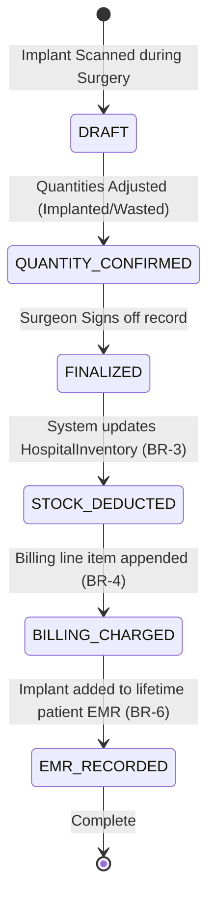

# Form Spec — Implant / Prosthesis / Biomedical Device Record

| | |
|---|---|
| **Status** | Draft |
| **Source** | pasted form analysis — *VH/NABH/OT/11/2026* (2026-07-01) |
| **Existing code?** | **`patient_implant` and `implant_inventory_transaction` are new.** Integrates with [`HospitalInventory`](../../backend/src/main/java/com/hms/entity/HospitalInventory.java) (for stock levels and deduction) and [`InventoryItem`](../../backend/src/main/java/com/hms/entity/InventoryItem.java) (for catalog details); links to [`Billing`](../../backend/src/main/java/com/hms/entity/Billing.java) (for auto-charging implants); records implant history directly into the patient's EMR. |

> **Read first — The Implant Lifecycle & Recall Engine.**
> **(1) Direct Inventory & Billing Integration.** Implants are high-cost, high-traceability assets. When marked as `IMPLANTED` (used), the system must **automatically deduct inventory stock** in `HospitalInventory` (BR-3) and **append a billable line item** to the patient's active `Billing` statement (BR-4) using the linked fee rate. Don't require nurses to double-enter usage across clinical sheets, supply sheets, and billing counters.
> **(2) Barcode & UDI Scanning.** The primary entry method in the UI must be barcode/UDI scanning. Scanning an implant packaging label should automatically parse and populate the Model, Batch, Serial, Expiry, and UDI parameters, reducing typographical risk in critical logs.
> **(3) Lifetime Traceability for Recalls.** Unlike temporary consumables, implants are recorded as a permanent, searchable clinical entity. The database design must ensure that searching by a single Batch/Lot number immediately returns the complete list of patients, surgeries, and surgeons associated with that implant.

---

## 1. Form Overview
- **Department:** Operation Theatre (primary); Orthopedics, Cardiology, Neurosurgery, Inventory, CSSD, Billing, MRD (secondary)
- **Module:** **Operation Theatre → Implant Management** (hospital-wide tracking module supporting cardiac, ortho, neuro, and general surgical implants)
- **Filled By:** OT Nurse / Circulating Nurse (scans and inputs details)
- **Approved / Verified By:** Operating Surgeon (verifies and signs usage)
- **Stored In:** Patient EMR (permanent) and MRD (archive)
- **Lifecycle:** created during surgery (implant opened/placed); finalized on OT case closure; permanent clinical record for the patient's lifetime; archived in MRD on discharge
- **NABH clause:** COP/ROM — traceability of implantable devices; verification and documentation of implant details (serial number, manufacturer, batch, warranty) in the medical record; provision of an implant card to the patient.

## 2. Purpose
- **Hospital use:** tracks details of permanently implanted hardware, prosthesis, and devices for patient safety and inventory control.
- **NABH requirement:** structured tracking of all implants to ensure swift recall execution and accurate billing records.
- **Legal:** provides permanent evidence of implant placement (manufacturers, lot numbers, serials) for safety recalls and litigation defense.
- **Clinical:** populates the patient's EMR with active devices, which is critical for future imaging precautions (e.g. MRI safety check).
- **Business rationale:** protects revenue by automating charge capture for expensive devices and eliminates shrinkage in supply cabinets.

## 3. Trigger
`Surgery scheduled → Implant inventory checked (pre-op) → Incision made → **Implant opened & scanned (this form)** → surgeon verifies placement → inventory deducted (BR-3) → billing entry generated (BR-4) → patient implant history updated (BR-6)`.

## 4. User Roles
| Actor on form | Capacity | Existing HMS role | Note |
|---|---|---|---|
| OT Nurse | scans barcode, inputs usage numbers, drafts record | `NURSE` | circulating nurse |
| Surgeon | reviews and confirms implant placement, signs | `DOCTOR` | operating surgeon |
| Inventory Manager | manages implant stock, tracks purchases | `HOSPITAL_ADMIN` | or inventory coordinator |
| Billing Clerk | reviews auto-captured billing charges | `RECEPTIONIST` / Admin | billing desk role |
| MRD Officer | archives finalized patient implant passport | — | role gap: `MRD_OFFICER` |
| Quality Manager | executes manufacturer batch recalls | `HOSPITAL_ADMIN` | quality assurance role |

## 5. Fields
Legend — Source: `auto`=fetched from context, `manual`=entered, `sig`=signature capture, `scan`=barcode/UDI scanner input.

| Field | Type | Max | Mandatory | Editable rule | DB column | Validation | Search | Print | Source |
|---|---|---|---|---|---|---|---|---|---|
| UHID | string | 20 | Y | read-only | (join `patient.custom_id`) | valid patient identity | Y | Y | auto |
| Patient Name | string | 100 | Y | read-only | `patient.name` | — | Y | Y | auto |
| IPD Number | string | 20 | Y | read-only | (join `ipd_admission.ipd_number`) | active admission | Y | Y | auto |
| Surgery | string | 200 | Y | read-only | `operation_record.surgery_name` | — | N | Y | auto |
| Surgeon | string | 100 | Y | read-only | (join `doctor.name`) | — | Y | Y | auto |
| OT Room | string | 10 | Y | read-only | `ot_booking.ot_room` | — | N | Y | auto |
| Implant Name | string | 150 | Y | draft only | `patient_implant.implant_master_id` | must exist in catalog | Y | Y | scan/manual |
| Manufacturer | string | 100 | Y | draft only | `patient_implant.manufacturer` | non-empty | Y | Y | scan/manual |
| Model Number | string | 50 | Y | draft only | `patient_implant.model_number` | — | N | Y | scan/manual |
| Catalog Number | string | 50 | N | draft only | `patient_implant.catalog_number` | — | N | Y | scan/manual |
| Batch Number | string | 30 | Y | draft only | `patient_implant.batch_number` | — | Y | Y | scan/manual |
| Lot Number | string | 30 | N | draft only | `patient_implant.lot_number` | — | Y | Y | scan/manual |
| Serial Number | string | 40 | Y | draft only | `patient_implant.serial_number` | must be unique (BR-7) | Y | Y | scan/manual |
| UDI | string | 100 | N | draft only | `patient_implant.udi` | valid UDI format | Y | Y | scan/manual |
| Quantity Opened | int | — | Y | draft only | `patient_implant.quantity_opened` | > 0 | N | N | manual |
| Quantity Implanted | int | — | Y | draft only | `patient_implant.quantity_implanted` | <= quantity_opened | N | Y | manual |
| Quantity Returned | int | — | N | draft only | `patient_implant.quantity_returned` | <= quantity_opened | N | N | manual |
| Quantity Wasted | int | — | N | draft only | `patient_implant.quantity_wasted` | <= quantity_opened | N | N | manual |
| Implant Position | string | 100 | Y | draft only | `patient_implant.implant_location` | anatomical site | N | Y | manual |
| Warranty Card No | string | 50 | N | draft only | `patient_implant.warranty_card_number`| — | Y | Y | manual |
| Patient Card Issued | bool | — | Y | draft only | `patient_implant.patient_card_issued` | defaults to false | N | Y | manual |
| Nurse Signature | sig | — | Y | draft only | `patient_implant.nurse_sig` | signature blob | N | Y | sig |
| Surgeon Signature | sig | — | Y | final only | `patient_implant.surgeon_sig` | signature blob | N | Y | sig |

## 6. Business Rules
- **BR-1** **Catalog Validation:** Only approved inventory items marked as type `IMPLANT` or `SURGICAL_DEVICE` in the master catalog (`InventoryItem`) can be selected for patient placement.
- **BR-2** **Stock Verification:** Implants allocated to a scheduled case must have active stock entries registered in `HospitalInventory` with non-expired dates before the surgical record can be finalized.
- **BR-3** **Auto-Stock Deduction:** When the surgeon signs off on the implant record, the system must automatically decrease the `stockQuantity` in the matching `HospitalInventory` entry by the `quantity_implanted` plus `quantity_wasted` and log an `implant_inventory_transaction` record.
- **BR-4** **Auto-Billing Charge:** On final surgeon sign-off, the system must automatically create a new billable `BillingItem` for the patient's current `Billing` account, using the `linkedFeeId` configured on the `InventoryItem` catalog sheet.
- **BR-5** **Restock Unused:** Any implant marked as `quantity_returned` (opened but unused and sterile, or unopened surplus) must automatically update the `HospitalInventory` stock count and bypass cost calculations.
- **BR-6** **EMR Persistence:** Every verified patient implant must be permanently recorded under the patient's EMR history and remain immutable for clinical safety lookups.
- **BR-7** **Uniqueness Enforce:** Implant serial numbers must be globally unique within the hospital tenant space. Duplicate serial inputs are blocked on validation.

## 7. Database Design
### Table `patient_implant` (tenant-owned):
Represents the specific device placed inside the patient.

| Column | Type | Notes |
|---|---|---|
| id | BIGINT PK | |
| public_id | VARCHAR(50) unique | UUID identifier |
| hospital_id | BIGINT NOT NULL, FK | Tenant reference key, indexed |
| patient_id | BIGINT NOT NULL, FK | Reference to Patient |
| ipd_admission_id | BIGINT NOT NULL, FK | Reference to IPD admission |
| operation_id | BIGINT NOT NULL, FK | Reference to Operation Record |
| inventory_item_id | BIGINT NOT NULL, FK | Link to Catalog `InventoryItem` |
| manufacturer | VARCHAR(100) | |
| model_number | VARCHAR(50) | |
| catalog_number | VARCHAR(50) | |
| batch_number | VARCHAR(30) | Indexed for recalls |
| lot_number | VARCHAR(30) | |
| serial_number | VARCHAR(40) | Unique key |
| udi | VARCHAR(100) | Unique Device Identifier |
| quantity_opened | INTEGER NOT NULL | |
| quantity_implanted | INTEGER NOT NULL | |
| quantity_returned | INTEGER | |
| quantity_wasted | INTEGER | |
| implant_location | VARCHAR(100) | Anatomical location |
| warranty_card_number | VARCHAR(50) | |
| patient_card_issued | BOOLEAN | Indicates if implant passport printed |
| nurse_sig | TEXT | Base64 signature blob |
| surgeon_sig | TEXT | Base64 signature blob |
| status | VARCHAR(20) | IMPLANTED / WASTED / RETURNED |
| created_at | TIMESTAMP | |
| updated_at | TIMESTAMP | |

### Table `implant_inventory_transaction` (tenant-owned):
Traceability log recording ledger audits for implants.

| Column | Type | Notes |
|---|---|---|
| id | BIGINT PK | |
| hospital_id | BIGINT NOT NULL, FK | |
| inventory_item_id | BIGINT NOT NULL, FK | catalog item |
| transaction_type | VARCHAR(20) | DEDUCT / RETURN / WASTE |
| quantity | INTEGER NOT NULL | |
| operation_id | BIGINT, FK | surgical case link |
| stock_before | INTEGER | |
| stock_after | INTEGER | |
| created_at | TIMESTAMP | |

- **Indexes:** `(hospital_id, batch_number)` for swift recall mapping. `(hospital_id, patient_id)` for permanent EMR checks.

## 8. APIs
Every `{id}` endpoint checks `hospital_id` to confirm patient ownership.

- **`POST /hospital/implants/use`**
  - **Roles:** `NURSE`, `HOSPITAL_ADMIN`
  - **Request:** `{ "ipdAdmissionId": 12, "operationId": 34, "inventoryItemId": 5, "serialNumber": "SN-987654", "batchNumber": "B-4321", "quantityImplanted": 1, "implantLocation": "Right Hip" }`
  - **Response:** Created `patient_implant` JSON.
  - **Purpose:** Adds a device entry under draft status during surgery.

- **`POST /hospital/implants/scan`**
  - **Roles:** `NURSE`, `HOSPITAL_ADMIN`
  - **Request:** `{ "rawBarcode": "010088464301552521SN-9876541727123110B-4321" }`
  - **Response:** Parsed fields JSON `{ "manufacturer": "Medtronic", "model": "MD-32", "serial": "SN-987654", "batch": "B-4321", "expiry": "2027-12-31" }`
  - **Purpose:** Parses GS1-128 or HIBC barcode strings to pre-populate form parameters.

- **`POST /hospital/implants/{id}/sign-off`**
  - **Roles:** `DOCTOR` (Surgeon flag)
  - **Request:** `{ "surgeonSig": "data:image/png;base64,..." }`
  - **Response:** Finalized implant JSON.
  - **Purpose:** surgeon sign-off triggering stock deduction (BR-3) and billing charges (BR-4).

- **`GET /hospital/patients/{patientId}/implants`**
  - **Roles:** `DOCTOR`, `NURSE`, `HOSPITAL_ADMIN`
  - **Response:** Array of all implants registered in patient's lifetime.
  - **Purpose:** Feeds patient's permanent implant history display.

- **`GET /hospital/implants/recall`**
  - **Roles:** `HOSPITAL_ADMIN`
  - **Params:** `?batchNumber=B-4321` or `?manufacturer=Medtronic`
  - **Response:** Array of patient/admission list matching target parameters.
  - **Purpose:** Quality assurance tool to map recalled hardware.

## 9. UI Design
- **Surgical Implant Capture Interface (Tablet / PC):**
  - **Direct Barcode Input Panel:** Focus defaults to the scanning input box, with visual guides on how to scan packaging.
  - **Automatic Detail Display:** Card showing parsed metadata (Manufacturer, Serial, Batch, Expiry) immediately pops up upon successful scanning.
  - **Location Mapping Canvas:** Clicking on an anatomical model (human silhouette) auto-populates the implant position text.
  - **Card Generator Widget:** Previews the Patient Implant Card, featuring a printer button.
  - **Status Badge:** Shows visual confirmation when inventory checks and pricing are reconciled.

## 10. Workflow

## 11. Validation
- Expiry date parsed from UDI/barcode must be greater than current system date.
- Mismatch differences are checked: `quantity_implanted + quantity_returned + quantity_wasted == quantity_opened`.
- Serial number string must be between 4 and 40 characters and contain no illegal symbols.
- Patient card check cannot be true unless the surgeon has signed off.

## 12. Permissions
| Role | Create / Scan | Finalize / Sign | View History | Recall Audit |
|---|---|---|---|---|
| OT Nurse | ✅ | ❌ | ✅ | ❌ |
| Surgeon | ✅ | ✅ | ✅ | ❌ |
| Inventory Staff | ❌ | ❌ | ✅ | ❌ |
| Billing Department | ❌ | ❌ | ✅ | ❌ |
| Hospital Admin | ✅ | ✅ | ✅ | ✅ |
| MRD | ❌ | ❌ | Full View | ❌ |

## 13. Print Rules
- Supports printing two templates:
  - **Surgical Record Sheet:** Standard HTML-to-PDF (`templates/implant-record.html`) showing surgery and implant details.
  - **Patient Implant Passport Card:** Small, credit-card sized print layout (`templates/implant-card.html`) holding patient name, UHID, implant model, serial number, surgeon signature, and a QR code with the manufacturer registration info.

## 14. Audit Logs
Recorded under `AuditLogService` with `entity_type="PATIENT_IMPLANT"`:
- Device scanned and draft created (serial, batch, user).
- Usage status verified.
- Stock deduction transaction completed (before, after, item ID).
- Patient billing line item generated (cost, quantity).
- Batch recall search executed (search terms, records fetched, admin ID).

## 15. Digital Improvements
- **Scanning-Driven Registration:** Replaces long, error-prone manual typing of serial numbers with a single scan.
- **Immediate Recall Mapping:** Enables quality teams to look up an implant batch code and get patient details instantly.
- **Closed-Loop Billing:** Removes billing leakage by automatically charging for high-cost implants at the moment of surgical verification.

## 16. Missing / Intelligent Features
- **Auto Recall Alert Trigger:** Integrates with external manufacturer safety API feeds; if a registered batch is flagged, the system displays alerts on patient charts.
- **MRI Compatibility Alert:** Adds visual warnings to the patient's EMR banner if they have a non-MRI compatible device (e.g. pacemakers, legacy valves) to prevent accidental scanning.
- **Implant Cost Analytics:** Compiles cost dashboards comparing implant expenses per surgeon and per specialty.

---

## Module & workflow placement
- **Owning module:** Operation Theatre → Implant and Device Tracking Suite.
- **Creates / Updates / Views / Prints / Archives:**
  - **Creates:** `patient_implant`, `implant_inventory_transaction` records.
  - **Updates:** Deducts stock counts in `HospitalInventory`; appends charges in `Billing`.
  - **Views:** Patient EMR history.
  - **Prints:** Surgical Implant Record and Patient Implant Card.
  - **Archives:** MRD.
- **Feeds into:** Patient EMR (device history) · Billing Module (auto-charges) · Inventory management (replenishment triggers) · Quality Recall desk.
- **Fed by:** Inventory Item catalog (`InventoryItem`) · CSSD tray lists · Surgical records.
- **New modules this form implies:** Implant Lifecycle Management System · UDI parsing library.
