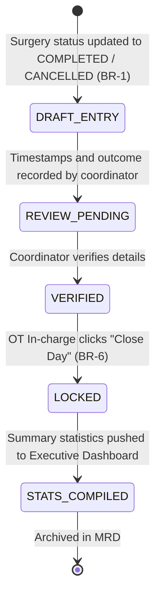

# Form Spec — Operation Theatre Register (OT Master Register)

| | |
|---|---|
| **Status** | Draft |
| **Source** | pasted form analysis — *VH/NABH/OT/12/2026* (2026-07-01) |
| **Existing code?** | **`ot_register` and `ot_daily_summary` are new.** Integrates with [`OtBooking`](../../backend/src/main/java/com/hms/entity/OtBooking.java) (which acts as the master surgery transaction table) and triggers on [`OtService.updateStatus`](../../backend/src/main/java/com/hms/service/hospital/OtService.java#L132) state changes (`COMPLETED` or `CANCELLED`). |

> **Read first — Operational Intelligence, not just a logbook.**
> **(1) Direct integration with WHO Sign Out & Status Updates.** Do not make coordinators re-type completed cases. The moment `OtService` marks a case as `COMPLETED` (via WHO checklist sign-out) or `CANCELLED`, the system must **automatically generate** an entry in `ot_register` (BR-1, BR-2).
> **(2) Automatic calculation of key operational metrics.** The duration of surgery, turnaround time, anesthesia induction time, and room utilization percentage must be derived from existing clinical timestamps (`operation_record.incision_time`, `pacu_record.recovery_start`, etc.) rather than manual estimation.
> **(3) Daily Closure Lock.** To prevent historical alteration of operational audits, the register must feature a "Close Day" process. Once a day's register is closed by the OT In-charge, all entries become read-only, and any modifications require structured supervisor amendments.

---

## 1. Form Overview
- **Department:** Operation Theatre (primary); OT Coordinator, OT Manager, Hospital Administration, Quality Department, MRD, Billing (secondary)
- **Module:** **Operation Theatre → OT Register → Daily Operations** (operational intelligence dashboard and master log)
- **Filled By:** OT Coordinator (monitors and updates details); System (auto-generation)
- **Approved / Closed By:** OT In-charge / Supervisor (closes daily register)
- **Stored In:** MRD (permanent historical record)
- **Lifecycle:** created automatically upon case completion/cancellation; editable until daily closure; locked permanently after daily closure; archived in MRD
- **NABH clause:** COP/MIS — maintaining a master register of all surgeries performed, detailing patient identifiers, surgical team, anesthesia type, implant usage, and immediate post-op outcome for auditability.

## 2. Purpose
- **Hospital use:** serves as the master operational ledger recording every surgery, cancellation, and delay for administrative control.
- **NABH requirement:** provides the definitive list of surgical interventions for infection surveillance, safety audits, and quality metric calculations.
- **Legal:** provides a legally defensible ledger of all surgical cases, timings, and team assignments for government inspectors and forensic audits.
- **Clinical:** tracks post-op destinations (Ward/ICU/Mortuary) to audit clinical outcomes.
- **Business rationale:** drives OT utilization analytics, surgeon efficiency indicators, and billing reconciliation audits.

## 3. Trigger
`Surgery completed (OtBooking status COMPLETED via WHO sign-out) OR Surgery cancelled (OtBooking status CANCELLED) → **OT Register entry automatically created (this form)** → daily details verified by coordinator → daily register closed by OT In-charge (status LOCKED) → statistics updated`.

## 4. User Roles
| Actor on form | Capacity | Existing HMS role | Note |
|---|---|---|---|
| OT Coordinator | verifies auto-populated details, logs delay reasons | `NURSE` / Coordinator | administrative staff |
| OT In-charge | reviews daily summaries, executes "Close Day" lock | `NURSE` | supervisor flag |
| Hospital Admin | views utilization dashboards, exports operational metrics | `HOSPITAL_ADMIN` | read-only dashboard access |
| Quality Auditor | reviews cancellations, delay analytics, and outcomes | `HOSPITAL_ADMIN` | quality role |
| Billing Clerk | cross-verifies registered cases against billed invoices | `RECEPTIONIST` / Admin | billing desk |
| MRD Officer | views historically locked daily registers | — | role gap: `MRD_OFFICER` |

## 5. Fields
Legend — Source: `auto`=fetched from context, `manual`=entered, `sig`=signature capture.

| Field | Type | Max | Mandatory | Editable rule | DB column | Validation | Search | Print | Source |
|---|---|---|---|---|---|---|---|---|---|
| OT Case Number | string | 20 | Y | read-only | `ot_register.case_number` | unique sequence (BR-5) | Y | Y | auto |
| Surgery Date | date | — | Y | read-only | `ot_register.surgery_date` | — | Y | Y | auto |
| OT Room | string | 10 | Y | read-only | `ot_register.ot_room` | — | Y | Y | auto |
| Case Type | enum | — | Y | read-only | `ot_register.case_type` | ELECTIVE / EMERGENCY | N | Y | auto |
| UHID | string | 20 | Y | read-only | (join `patient.custom_id`) | valid patient identity | Y | Y | auto |
| Patient Name | string | 100 | Y | read-only | `patient.name` | — | Y | Y | auto |
| Age / Gender | int/enum | — | Y | read-only | `patient.age` / `gender` | — | N | Y | auto |
| IPD Number | string | 20 | Y | read-only | (join `ipd_admission.ipd_number`) | active admission | Y | Y | auto |
| Procedure | string | 200 | Y | read-only | `ot_register.procedure` | — | Y | Y | auto |
| Specialty | string | 50 | Y | read-only | `ot_register.specialty` | — | Y | Y | auto |
| Primary Surgeon | string | 100 | Y | read-only | (join `doctor.name`) | — | Y | Y | auto |
| Assistant Surgeon | string | 100 | N | read-only | (join `doctor.name`) | — | N | Y | auto |
| Anaesthesiologist | string | 100 | Y | read-only | (join `doctor.name`) | — | Y | Y | auto |
| Patient In Time | datetime | — | Y | read-only | `ot_register.patient_in` | not in future | N | Y | auto |
| Incision Time | datetime | — | Y | read-only | `ot_register.incision_time` | after patient_in | N | Y | auto |
| Closure Time | datetime | — | Y | read-only | `ot_register.closure_time` | after incision_time | N | Y | auto |
| Patient Out Time | datetime | — | Y | read-only | `ot_register.patient_out` | after closure_time | N | Y | auto |
| Turnaround Time | int | — | Y | read-only | `ot_register.turnaround_time` | calculated minutes | N | Y | auto |
| Surgery Duration | int | — | Y | read-only | `ot_register.operation_duration` | calculated minutes (BR-4) | N | Y | auto |
| Post-op Destination | enum | — | Y | draft only | `ot_register.outcome_destination`| WARD / ICU / HDU / MORTUARY / REOP | N | Y | manual |
| Case Status | enum | — | Y | read-only | `ot_register.status` | COMPLETED / CANCELLED / POSTPONED | N | Y | auto |
| Cancellation Reason | string | 250 | cond. | draft only | `ot_register.cancellation_reason` | required if cancelled (BR-2) | N | Y | manual |
| Delay Cause | enum | — | N | draft only | `ot_register.delay_cause` | SURGEON / ANESTHESIA / PATIENT / CLEANING / EQUIP | N | Y | manual |
| Implants Used | text | — | Y | read-only | `ot_register.implants_summary` | list from implant record | N | Y | auto |

## 6. Business Rules
- **BR-1** **Auto-Generation:** Every surgery marked `COMPLETED` in `OtBooking` (triggered by WHO Checklist Sign Out completion) must instantly create a corresponding entry in the `ot_register` table.
- **BR-2** **Cancellation Capture:** Cancelled surgeries (`OtBooking` status `CANCELLED`) must remain in the register list, and the user must provide a mandatory cancellation reason.
- **BR-3** **Urgent Priority:** Emergency cases must be flagged immediately in the register database and carry a higher visual priority in dashboards.
- **BR-4** **Automatic Duration Calculation:** Surgical duration and turnaround times must be calculated automatically by the server based on database timestamps (`patient_in`, `patient_out`, and the previous patient's exit time for the same room).
- **BR-5** **Sequence Uniqueness:** The system must generate a unique, non-duplicative, sequential `case_number` per hospital tenant per calendar year.
- **BR-6** **Immutable Closure:** The Daily OT Register is locked for edits once the OT In-charge executes the `/close-day` API. Any subsequent modifications must be made via supervisor-authorized amendments with logged audit justifications.
- **BR-7** **Multi-Tenant Partition:** Every register record must carry `hospital_id`, and all queries must filter by it.

## 7. Database Design
### Table `ot_register` (tenant-owned):
The master daily operational ledger.

| Column | Type | Notes |
|---|---|---|
| id | BIGINT PK | |
| public_id | VARCHAR(50) unique | UUID identifier |
| hospital_id | BIGINT NOT NULL, FK | Tenant reference key, indexed |
| ot_booking_id | BIGINT NOT NULL, FK | Reference to scheduled case |
| patient_id | BIGINT NOT NULL, FK | |
| case_number | VARCHAR(20) NOT NULL | Unique sequential code |
| ot_room | VARCHAR(10) NOT NULL | Room identifier |
| case_type | VARCHAR(20) NOT NULL | ELECTIVE / EMERGENCY |
| procedure | VARCHAR(200) NOT NULL | |
| specialty | VARCHAR(50) NOT NULL | |
| surgeon_id | BIGINT NOT NULL, FK | |
| assistant_surgeon_id | BIGINT, FK | |
| anaesthetist_id | BIGINT NOT NULL, FK | |
| patient_in | TIMESTAMP | Time patient wheeled in |
| incision_time | TIMESTAMP | |
| closure_time | TIMESTAMP | |
| patient_out | TIMESTAMP | Time patient wheeled out |
| operation_duration | INTEGER | Calculated minutes |
| turnaround_time | INTEGER | Calculated minutes |
| outcome_destination | VARCHAR(30) | WARD / ICU / HDU / MORTUARY / REOP |
| status | VARCHAR(20) | COMPLETED / CANCELLED / POSTPONED |
| cancellation_reason | VARCHAR(250) | Mandatory on cancellation |
| delay_cause | VARCHAR(30) | Identified delay bottleneck |
| implants_summary | TEXT | JSON summary of implants |
| is_locked | BOOLEAN NOT NULL | Locked after Close Day (BR-6) |
| locked_by | BIGINT, FK | Staff user ID |
| locked_at | TIMESTAMP | |
| created_at | TIMESTAMP | |
| updated_at | TIMESTAMP | |

### Table `ot_daily_summary` (tenant-owned):
Aggregated daily metrics used for executive dashboards.

| Column | Type | Notes |
|---|---|---|
| id | BIGINT PK | |
| hospital_id | BIGINT NOT NULL, FK | |
| summary_date | DATE NOT NULL | Indexed |
| ot_room | VARCHAR(10) NOT NULL | |
| total_cases | INTEGER NOT NULL | |
| elective_cases | INTEGER NOT NULL | |
| emergency_cases | INTEGER NOT NULL | |
| cancelled_cases | INTEGER NOT NULL | |
| average_turnaround | INTEGER | Average turnaround minutes |
| utilization_percentage | DECIMAL(5,2) | Occupied minutes / operating day |
| created_at | TIMESTAMP | |

- **Indexes:** `(hospital_id, summary_date)` for dashboard statistics. `(hospital_id, case_number)` for audits.

## 8. APIs
Every `{id}` endpoint checks `hospital_id` to confirm patient ownership.

- **`GET /hospital/ot/register`**
  - **Roles:** `DOCTOR`, `NURSE`, `HOSPITAL_ADMIN`
  - **Params:** `?date=2026-07-01&room=OT-1`
  - **Response:** Array of `ot_register` entries.
  - **Purpose:** Fetches the daily register records.

- **`POST /hospital/ot/register/close-day`**
  - **Roles:** `NURSE` (Supervisor/In-charge flag), `HOSPITAL_ADMIN`
  - **Request:** `{ "date": "2026-07-01" }`
  - **Response:** Daily summary status `{ "locked": true, "casesClosed": 12 }`.
  - **Purpose:** Locks all entries for that day and recomputes `ot_daily_summary` statistics.

- **`PUT /hospital/ot/register/{id}/adjust`**
  - **Roles:** `NURSE` (Supervisor flag), `HOSPITAL_ADMIN`
  - **Request:** `{ "outcomeDestination": "ICU", "delayCause": "CLEANING", "adjustmentReason": "Correcting outcome entry" }`
  - **Response:** Updated register record.
  - **Purpose:** Allows edits to locked/unlocked registers with mandatory audit reasons.

- **`GET /hospital/ot/register/statistics`**
  - **Roles:** `HOSPITAL_ADMIN`
  - **Params:** `?startDate=2026-06-01&endDate=2026-06-30`
  - **Response:** Analytics summary (utilization, turnaround, cancellations).
  - **Purpose:** Feeds executive utilization dashboards.

## 9. UI Design
- **Daily OT Register Dashboard (PC / Large Screen):**
  - **Master Ledger View:** Spreadsheet-style clinical grid showing chronological patient rows, surgery types, surgeons, rooms, and durations.
  - **Live Room Tracking Grid:** Block-schedule view showing OT rooms (columns) and time blocks (rows), visually highlighting running cases (yellow), turnaround periods (gray), and empty slots (green).
  - **Daily Operations KPI Summary Bar:** Top counter panel displaying elective/emergency ratios, total turnaround minutes, and active utilization levels.
  - **Close Day Lock Panel:** Right panel highlighting pending items (e.g. "Case 3 lacks post-op destination"), warning the supervisor of validation blockers.
  - **Sticky Action Bar:** Features print export, Excel export, and the daily lock verification key.

## 10. Workflow

## 11. Validation
- Patient out time must be greater than patient in time.
- Cancellation reason must be specified (minimum 10 characters) if the case status is `CANCELLED`.
- Total daily utilization percentage cannot exceed 100%.
- Close Day API will reject execution if any surgery completed on that day is missing a post-operative destination.

## 12. Permissions
| Role | View Register | Edit Details | Close Day | View Statistics |
|---|---|---|---|---|
| OT Coordinator | ✅ | ✅ (Draft) | ❌ | ❌ |
| OT In-charge | ✅ | ✅ | ✅ | ✅ |
| Surgeon | ✅ | ❌ | ❌ | ❌ |
| Hospital Admin | ✅ | ❌ | ❌ | ✅ |
| MRD | Full View | ❌ | ❌ | ❌ |

## 13. Print Rules
- Supports printing the **Daily OT Master Register**:
  - Template: `templates/ot-register-daily.html`.
  - Layout: Landscape PDF holding patient identifiers, surgical details, exact timestamps, delays, and outcome.
  - Footer: Attestation sign block for the OT In-charge and a verification QR code.

## 14. Audit Logs
Recorded under `AuditLogService` with `entity_type="OT_REGISTER"`:
- Register entry auto-created (booking ID, case number).
- Delay cause logged (category, reason).
- Daily register closed (date, supervisor ID).
- Locked register modified (id, adjusted column, old value, new value, reason).

## 15. Digital Improvements
- **Automatic Logging:** Saves coordinates from manual log typing by automatically pulling timings from surgery checkpoints.
- **Utilization Heatmaps:** Replaces manual arithmetic reports with interactive room color calendars, identifying bottleneck zones.
- **Auto-Calculated Turnaround:** Automatically maps the cleaning and prep periods between consecutive surgeries to optimize scheduling.

## 16. Missing / Intelligent Features
- **Smart Schedule Optimizer:** Recommends scheduling minor cases in low-utilization rooms to balance workflows.
- **Surgical Delay Predictor:** Analyzes surgeon and procedure historical logs to suggest custom padding durations for upcoming bookings.
- **Cancellation Root Analysis:** Groups cancellation reasons into visual analytics to help identify material shortages or scheduling errors.

---

## Module & workflow placement
- **Owning module:** Operation Theatre → Daily Operations Suite.
- **Creates / Updates / Views / Prints / Archives:**
  - **Creates:** `ot_register` entries and daily aggregation records (`ot_daily_summary`).
  - **Updates:** Recomputes dashboard analytics.
  - **Views:** Operation record history and anesthesia summaries.
  - **Prints:** Daily OT Master Register reports.
  - **Archives:** MRD.
- **Feeds into:** Hospital Executive Analytics (utilization charts) · Billing Module (completed surgery verification) · Quality desk (delay logs).
- **Fed by:** OT Scheduling (`OtBooking`) · WHO Surgical Safety Checklist (`OtChecklist`).
- **New modules this form implies:** Operation Theatre Operational Intelligence Engine.
