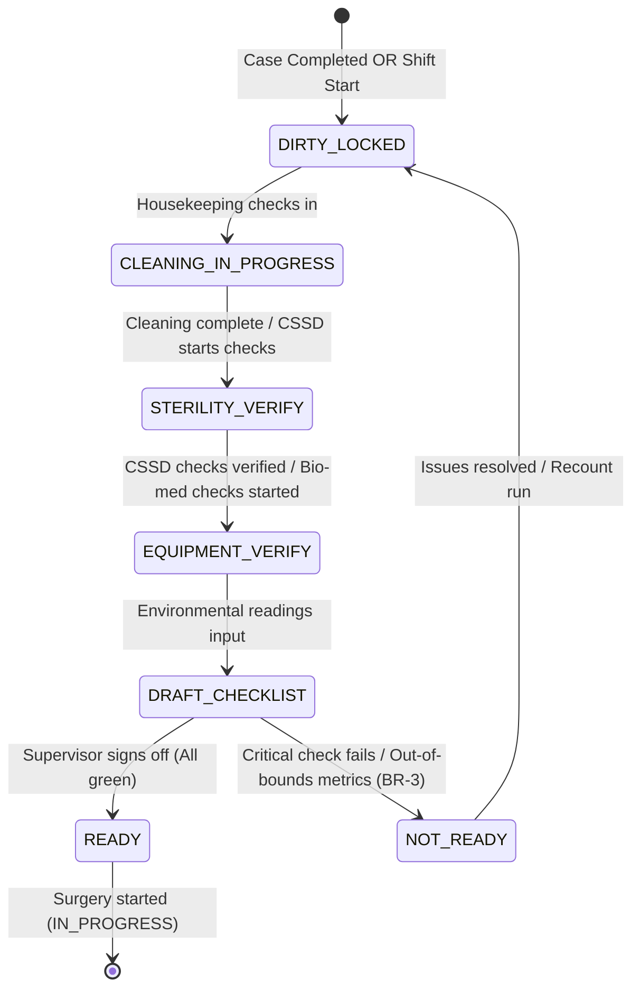

# Form Spec — Operation Theatre Cleaning, Sterility & OT Readiness Checklist

| | |
|---|---|
| **Status** | Draft |
| **Source** | pasted form analysis — *VH/NABH/OT/15/2026* (2026-07-01) |
| **Existing code?** | **`ot_readiness_checklist`, `ot_checklist_item`, and `ot_environment_log` are new.** Integrates with [`OtBooking`](../../backend/src/main/java/com/hms/entity/OtBooking.java) (for rooms and scheduling correlation) and gates [`OtService.updateStatus`](../../backend/src/main/java/com/hms/service/hospital/OtService.java#L132) (prevents transitioning a booking to `IN_PROGRESS` unless the room's readiness is signed off). |

> **Read first — The Infection Control & Room Gating Engine.**
> **(1) Gating case start on room readiness.** In [`OtService.updateStatus`](../../backend/src/main/java/com/hms/service/hospital/OtService.java#L132), a booking cannot transition to `IN_PROGRESS` unless the target room has an active, verified `ot_readiness_checklist` marked as `READY` for the current date/shift (BR-6). This is the key clinical safety gate preventing operations in non-sterile or unverified environments.
> **(2) Multi-Department coordination.** This form is a checklist header that aggregates checks across Housekeeping (cleaning), CSSD (sterile supply validation), Biomedical Engineering (equipment status), and Nursing. The dashboard must show real-time progress of each department's check-offs before the nurse signs the final readiness approval.
> **(3) IoT Sensor & Environment Logging.** Environmental metrics (temperature, humidity, air pressure) should support auto-import from digital room gauges into `ot_environment_log` to avoid manual estimation and ensure true compliance tracking.

---

## 1. Form Overview
- **Department:** Operation Theatre (primary); Infection Control Committee, CSSD, Biomedical Engineering, Housekeeping, Nursing, Quality Department (secondary)
- **Module:** **Operation Theatre → OT Readiness → Cleaning & Sterility** (clinical safety and infection surveillance engine)
- **Filled By:** Housekeeping staff (cleaning checklist); CSSD coordinator (sterility checks); Biomedical engineer (equipment checks); OT Nurse (overall verification)
- **Approved / Signed By:** OT In-charge / Head Nurse
- **Stored In:** Quality Management / Infection Control records (permanent) and MRD (archive)
- **Lifecycle:** created at shift start or post-surgery turnover; active during verification steps; finalized before patient enters; permanent quality audit log
- **NABH clause:** HIC/COP — infection control in operating theatres; maintaining clean environments, monitoring air changes, verifying sterility of instruments, and validating equipment functionality before clinical use.

## 2. Purpose
- **Hospital use:** coordinates and documents the multi-step preparation required to make an operating room ready and sterile for surgeries.
- **NABH requirement:** mandatory documentation of theatre turnaround cleaning, equipment calibration, and sterility validation.
- **Legal:** protects the hospital from liability related to Surgical Site Infections (SSI) by proving clean environmental baselines.
- **Clinical:** ensures HEPA filters, air changes, autoclave indicators, and emergency backups (UPS, gases) are validated prior to patient entry.
- **Business rationale:** reduces surgery delays by tracking preparation times and alerts engineers of device failures before case scheduling.

## 3. Trigger
`Case completed OR Shift starting → Turnaround cleaning initiated → Housekeeping submits cleaning sheet → CSSD submits sterility validation → Biomedical checks devices → **OT Nurse performs final walk-through (this form)** → Final Readiness approved (status READY) → Room unlocked for next case (OtBooking IN_PROGRESS permitted)`.

## 4. User Roles
| Actor on form | Capacity | Existing HMS role | Note |
|---|---|---|---|
| OT Nurse | verifies checklists, reviews environmental parameters, signs | `NURSE` | attending nurse |
| Housekeeping Staff | records daily wash down, surface disinfection, waste checks | — | role gap: `HOUSEKEEPING` |
| CSSD Staff | validates sterile packs, checks batch indicators, enters expiries | — | role gap: `CSSD_STAFF` |
| Biomedical Engineer | records equipment function, files repair requests | — | role gap: `BIOMEDICAL_ENGINEER` |
| OT In-charge | reviews daily checklists, overrides non-critical faults | `NURSE` | supervisor flag |
| Quality Auditor | reviews turnaround statistics and infection correlations | `HOSPITAL_ADMIN` | quality controller |
| MRD Officer | archives historical readiness records | — | role gap: `MRD_OFFICER` |

## 5. Fields
Legend — Source: `auto`=fetched from context, `manual`=entered, `sig`=signature capture, `device`=IoT sensor import.

| Field | Type | Max | Mandatory | Editable rule | DB column | Validation | Search | Print | Source |
|---|---|---|---|---|---|---|---|---|---|
| OT Room | string | 10 | Y | read-only | `ot_readiness_checklist.ot_room_id` | must match active OT rooms | Y | Y | auto |
| Date & Shift | date/enum | — | Y | read-only | `ot_readiness_checklist.date` / `shift`| MORNING / EVENING / NIGHT | Y | Y | auto |
| Previous Case Number | string | 20 | N | read-only | (join `ot_register.case_number`) | — | N | Y | auto |
| Next Scheduled Case | string | 20 | N | read-only | (join `ot_booking.public_id`) | — | N | Y | auto |
| Floor & Surface Cleaned| bool | — | Y | housekeeping | `ot_checklist_item.status` | Yes/No | N | Y | manual |
| OT Table Disinfected | bool | — | Y | housekeeping | `ot_checklist_item.status` | Yes/No | N | Y | manual |
| Anesthesia Cart Cleaned| bool | — | Y | housekeeping | `ot_checklist_item.status` | Yes/No | N | Y | manual |
| Waste Removed | bool | — | Y | housekeeping | `ot_checklist_item.status` | Yes/No | N | Y | manual |
| Sterile Trays Verified | bool | — | Y | CSSD | `ot_checklist_item.status` | Yes/No | N | Y | manual |
| Autoclave Expiries Check| bool | — | Y | CSSD | `ot_checklist_item.status` | Yes/No | N | Y | manual |
| Anesthesia Machine OK | enum | — | Y | biomedical | `ot_checklist_item.status` | PASS / FAIL / SERVICE_REQUIRED | N | Y | manual |
| Cautery & Suction OK | enum | — | Y | biomedical | `ot_checklist_item.status` | PASS / FAIL / SERVICE_REQUIRED | N | Y | manual |
| Backup Power Verified | bool | — | Y | biomedical | `ot_checklist_item.status` | Yes/No | N | Y | manual |
| Medical Gas Pressure | decimal | 4,1 | Y | biomedical | `ot_checklist_item.remarks` | non-negative | N | Y | manual |
| Temperature | decimal | 3,1 | Y | draft only | `ot_environment_log.temperature` | 16.0–26.0 °C | N | Y | device/manual |
| Humidity | decimal | 3,1 | Y | draft only | `ot_environment_log.humidity` | 30.0–70.0 % | N | Y | device/manual |
| Differential Air Pressure| decimal | 3,1 | Y | draft only | `ot_environment_log.air_pressure` | +5.0 to +25.0 Pa | N | Y | device/manual |
| Hand Hygiene Stocked | bool | — | Y | nurse | `ot_checklist_item.status` | Yes/No | N | Y | manual |
| Color-coded Bins Checked| bool | — | Y | nurse | `ot_checklist_item.status` | Yes/No | N | Y | manual |
| Final Readiness Status | enum | — | Y | in-charge | `ot_readiness_checklist.status` | READY / READY_WITH_ISSUES / NOT_READY | Y | Y | manual |
| Staff Signature | sig | — | Y | draft only | `ot_readiness_checklist.verified_by_sig` | signature blob | N | Y | sig |

## 6. Business Rules
- **BR-1** **Shift Requirement:** A verified `READY` checklist must be recorded for every OT room before the first surgery of a shift can start.
- **BR-2** **Mandatory Turnover Clean:** The system must automatically lock an OT room's status to `CLEANING_REQUIRED` immediately upon surgical case completion. The room remains locked until the turnover checklist is completed.
- **BR-3** **Critical Failure Lock:** If any item categorized as `CRITICAL` (e.g. Anesthesia Machine, Backup Power, Oxygen Gas Pressure) is marked as `FAIL`, the room readiness status is automatically set to `NOT_READY` and case starts are blocked.
- **BR-4** **Sterility Expiry Block:** Autoclave supplies marked with expired dates or failed chemical indicators cannot be approved as sterile.
- **BR-5** **Environmental Boundaries:** Environmental logs showing parameters outside configured bounds (e.g., Temperature > 24°C, Pressure < 10 Pa) must trigger a critical warning notification to Infection Control and Biomedical Engineering.
- **BR-6** **Workflow Gate:** `OtService.updateStatus` must throw a validation error and block starting a surgery (`status=IN_PROGRESS`) if the target room's checklist is missing or not marked `READY`.
- **BR-7** **Tenant Isolation:** Every readiness checklist and environmental log must carry `hospital_id`, and queries must validate tenant ownership.

## 7. Database Design
### Table `ot_readiness_checklist` (tenant-owned):
Main header mapping room readiness status per shift.

| Column | Type | Notes |
|---|---|---|
| id | BIGINT PK | |
| public_id | VARCHAR(50) unique | UUID identifier |
| hospital_id | BIGINT NOT NULL, FK | Tenant reference key, indexed |
| ot_room_id | VARCHAR(20) NOT NULL | Target room code |
| shift | VARCHAR(20) NOT NULL | MORNING / EVENING / NIGHT |
| date | DATE NOT NULL | Checklist date |
| status | VARCHAR(20) NOT NULL | READY / READY_WITH_ISSUES / NOT_READY |
| verified_by | BIGINT, FK | Nurse supervisor ID |
| verified_by_sig | TEXT | Base64 signature blob |
| verified_at | TIMESTAMP | |
| remarks | TEXT | Override justifications or descriptions |
| created_at | TIMESTAMP | |
| updated_at | TIMESTAMP | |

### Table `ot_checklist_item` (tenant-owned):
Granular checklist parameters checked by respective departments.

| Column | Type | Notes |
|---|---|---|
| id | BIGINT PK | |
| checklist_id | BIGINT NOT NULL, FK | Link to parent header |
| category | VARCHAR(30) | CLEANING / STERILITY / EQUIPMENT / INFECTION_CONTROL |
| item_name | VARCHAR(100) | e.g. Floor Disinfection, Oxygen Pressure |
| status | VARCHAR(30) | YES / NO / PASS / FAIL / NA |
| verified_by | BIGINT, FK | User who checked item |
| verified_at | TIMESTAMP | |
| remarks | VARCHAR(500) | |

### Table `ot_environment_log` (tenant-owned):
Traceability log for environmental safety verification.

| Column | Type | Notes |
|---|---|---|
| id | BIGINT PK | |
| hospital_id | BIGINT NOT NULL, FK | |
| ot_room_id | VARCHAR(20) NOT NULL | |
| temperature | DECIMAL(4,1) NOT NULL | |
| humidity | DECIMAL(4,1) NOT NULL | |
| air_pressure | DECIMAL(4,1) NOT NULL | |
| recorded_at | TIMESTAMP NOT NULL | |

- **Indexes:** `(hospital_id, ot_room_id, date)` for daily checks. `(hospital_id, status)` for scheduling availability queries.

## 8. APIs
Every `{id}` endpoint checks `hospital_id` to confirm patient ownership.

- **`POST /hospital/ot/readiness/start`**
  - **Roles:** `NURSE`, `HOSPITAL_ADMIN`
  - **Request:** `{ "otRoomId": "OT-1", "shift": "MORNING" }`
  - **Response:** Created `ot_readiness_checklist` JSON with pre-populated checklist items based on room template.
  - **Purpose:** Initializes the shift readiness check.

- **`POST /hospital/ot/readiness/{id}/check-item`**
  - **Roles:** `NURSE`, `HOSPITAL_ADMIN`
  - **Request:** `{ "itemId": 14, "status": "PASS", "remarks": "Calibrated" }`
  - **Response:** Updated item JSON.
  - **Purpose:** Records checks for specific categories (can be called by Housekeeping, Bio-med, or CSSD users).

- **`POST /hospital/ot/readiness/{id}/environment`**
  - **Roles:** `NURSE`, `HOSPITAL_ADMIN`, `device`
  - **Request:** `{ "temperature": 21.2, "humidity": 45.0, "airPressure": 15.0 }`
  - **Response:** Created `ot_environment_log` JSON.
  - **Purpose:** Records current environmental readings.

- **`PUT /hospital/ot/readiness/{id}/approve`**
  - **Roles:** `NURSE` (Supervisor flag), `HOSPITAL_ADMIN`
  - **Request:** `{ "status": "READY", "verifiedBySig": "data..." }`
  - **Response:** Finalized checklist JSON.
  - **Purpose:** Final approval gating case starts (BR-6).

- **`GET /hospital/ot/readiness/status/{otRoomId}`**
  - **Roles:** `DOCTOR`, `NURSE`, `HOSPITAL_ADMIN`
  - **Response:** Current availability status of the room (`READY` or `LOCKED`).

## 9. UI Design
- **Operational Readiness Screen (Tablet Optimized):**
  - **Dashboard Cards:** Color-coded widgets displaying checking completion by category (Cleaning: 100%, Sterility: 100%, Equipment: 60%).
  - **Environment Status Panel:** Displays gauge meters showing temperature, humidity, and differential pressure (green within limits, flashing amber if out of bounds).
  - **Biomedical Ticket Integration:** Small alert widget showing open maintenance tickets for that room.
  - **Sign-off Console:** Signature pad requiring supervisor verification.

## 10. Workflow

## 11. Validation
- Temperature values must be between 10.0 °C and 35.0 °C.
- Humidity values must be between 10% and 90%.
- Differential pressure must be between -10 Pa and 50 Pa.
- The approval endpoint will block execution if any checklist items remain in `PENDING` status.

## 12. Permissions
| Role | View Checklist | Edit Cleaning Section | Edit Sterility Section | Edit Equipment Section | Final Approve |
|---|---|---|---|---|---|
| Housekeeping Staff | ✅ | ✅ | ❌ | ❌ | ❌ |
| CSSD Staff | ✅ | ❌ | ✅ | ❌ | ❌ |
| Biomedical Engineer| ✅ | ❌ | ❌ | ✅ | ❌ |
| OT Nurse | ✅ | ✅ | ✅ | ✅ | ✅ (attending) |
| OT In-charge | ✅ | ✅ | ✅ | ✅ | ✅ (sign-off) |
| Hospital Admin | ✅ | ❌ | ❌ | ❌ | ❌ |

## 13. Print Rules
- Printed via HTML-to-PDF template `templates/ot-readiness.html`.
- **Layout:** Standard formatting showing room name, date, shift, category summaries, environment readings, and signature boxes.
- **Verification:** Signed names and digital timestamps of checking staff and approving supervisor.

## 14. Audit Logs
Recorded under `AuditLogService` with `entity_type="OT_READINESS"`:
- Readiness checklist initialized (room, shift).
- Category check completed (by user, status).
- Environmental alert triggered (parameters, room, values).
- Daily room signed off and ready.
- Room locked due to critical equipment failure.

## 15. Digital Improvements
- **Automatic Gating:** Prevents surgery starting on a room that has not been disinfected or cleared by biomedical staff.
- **Multi-Tenant Coordination:** Eliminates nursing chase-sheets by letting CSSD, Housekeeping, and Bio-med submit checks from their respective portals.
- **Environmental Logging Autocaptures:** Saves nurses from manual log writing by integrating with IoT room gauges.

## 16. Missing / Intelligent Features
- **Infection Risk Alarms:** Alerts infection committees of consecutive humidity/temperature spikes that increase bacterial risk.
- **Predictive Biomedical Maintenance:** Flags devices requiring maintenance before critical failure occurs, based on historical runtimes.
- **Turnaround Time Trackers:** Automatically logs preparation times, helping managers optimize OT scheduling sequences.

---

## Module & workflow placement
- **Owning module:** Operation Theatre → Readiness and Sterility Suite (OT Safety Engine).
- **Creates / Updates / Views / Prints / Archives:**
  - **Creates:** `ot_readiness_checklist`, `ot_checklist_item`, `ot_environment_log`.
  - **Updates:** Controls room availability indicators gating `OtBooking` execution.
  - **Views:** Active scheduling data.
  - **Prints:** Room Readiness and Turnover sheets.
  - **Archives:** MRD.
- **Feeds into:** Operation Theatre Scheduling (gating rules) · Infection Control Committee audits · Biomedical Engineering maintenance queue.
- **Fed by:** CSSD trays calibration templates · Housekeeping work shifts.
- **New modules this form implies:** Operation Theatre Environmental and Sterility Safety Engine.
