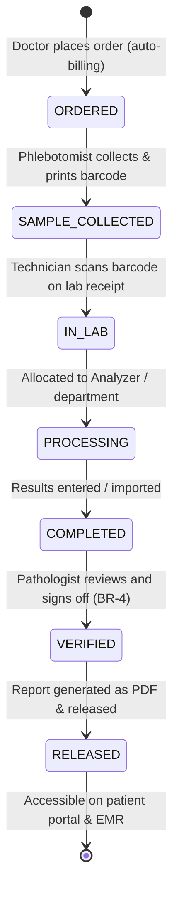

# Form Spec — Laboratory Information System (LIS)

| | |
|---|---|
| **Status** | Draft |
| **Source** | pasted module analysis — *VH/NABH/LIS/01/2026* (2026-07-01) |
| **Existing code?** | **Exists and is highly integrated.** Reuses [`LabOrder`](../../backend/src/main/java/com/hms/entity/LabOrder.java) (holds order details), [`LabResult`](../../backend/src/main/java/com/hms/entity/LabResult.java) (holds parameters as JSON), [`LabTestMaster`](../../backend/src/main/java/com/hms/entity/LabTestMaster.java) (holds catalog tests), and [`LabWorkflowService`](../../backend/src/main/java/com/hms/service/hospital/LabWorkflowService.java) (handles order, collection, and results transitions). |

> **Read first — Leverage the Existing LIS Engine.**
> **(1) Parameter Storage via JSON.** [`LabResult`](../../backend/src/main/java/com/hms/entity/LabResult.java#L47) already stores test parameters in a simple but highly flexible JSON TEXT array format: `[{name, value, unit, referenceRange, flag}]`. This avoids rigid relational schemas for different specialties (Hematology vs Biochemistry vs Serology).
> **(2) Existing Auto-Billing.** In [`LabWorkflowService.placeOrder`](../../backend/src/main/java/com/hms/service/hospital/LabWorkflowService.java#L76), auto-billing is already wired! Placed IPD lab orders post charges to `BillingService` automatically: `500.00` for STAT and `300.00` for ROUTINE. Keep this existing feature intact.
> **(3) Pathologist Verification & Release Gaps.** The current state machine inside `LabWorkflowService` goes directly from `SAMPLE_COLLECTED → COMPLETED` upon result entry. We must recommend evolving the `LabOrder` statuses to introduce **`VERIFIED`** (signed off by a Pathologist user) and **`RELEASED`** (made visible to the patient/portal) states to enforce the critical clinical validation rules (Rule 4, Rule 5).

---

## 1. Form/Module Overview
- **Department:** Laboratory (primary); OPD, IPD, Emergency, ICU, OT, Billing, MRD, Doctor, Nursing (secondary)
- **Module:** **Laboratory → Orders → Sample Collection → Processing → Verification → Reports** (integrated clinical laboratory information system)
- **Filled By:** Nurses / Phlebotomists (sample collection); Lab Technicians (result entry); Pathologists (verification)
- **Approved / Verified By:** Pathologist (verification & release)
- **Stored In:** `lab_results` (database), MRD, and PDF url reports
- **Lifecycle:** created upon physician order; updated through collection, receipt, and analysis; finalized upon Pathologist verification; archived in patient EMR and MRD
- **NABH clause:** AAC/COP — patient laboratory services; documented policies for sample identification, collection, and transportation; critical value alert thresholds; pathologist verification of reports.

## 2. Purpose
- **Hospital use:** manages the complete lifecycle of lab orders, ensuring correct sample tracking, accurate analysis, and timely reporting.
- **NABH requirement:** clinical verification of results, unique sample identification (barcoding), and immediate reporting of critical values.
- **Legal:** provides trace logs of who collected, entered, and verified results, serving as clinical-legal evidence.
- **Clinical:** drives immediate medical decisions (80% of diagnoses depend on labs) and automatically flags abnormal/critical values.
- **Business rationale:** captures revenue automatically upon order placement and streamlines laboratory throughput.

## 3. Trigger
`Doctor orders test (DoctorDashboard / ConsultationModal) → Charge posted to Billing (auto-billing) → Sample collection task generated (Nurse Dashboard) → Barcode printed & scanned → Sample processed in Lab → Result Entered → Pathologist Verifies → Report Released → Doctor/Patient Notified`.

## 4. User Roles
| Actor | Capacity | Existing HMS role | Note |
|---|---|---|---|
| Doctor | orders tests, reviews released reports | `DOCTOR` | attending consultant |
| Nurse | collects samples, prints barcodes | `NURSE` | ward staff |
| Phlebotomist | collects samples at lab counter | `NURSE` / Lab Staff | counter collection role |
| Lab Technician | receives samples, performs tests, inputs values | `LAB_TECHNICIAN` | processing technician |
| Pathologist | reviews abnormal values, verifies and signs reports | `DOCTOR` | with Pathologist capacity flag |
| Billing Clerk | audits charges and verifies payments | `RECEPTIONIST` / Admin | billing desk |
| Patient | views and downloads released reports | — | portal view (read-only) |
| MRD Officer | archives completed records | — | role gap: `MRD_OFFICER` |

## 5. Fields
Legend — Source: `auto`=fetched from context, `manual`=entered, `sig`=signature capture, `device`=analyzer import.

| Field | Type | Max | Mandatory | Editable rule | DB column | Validation | Search | Print | Source |
|---|---|---|---|---|---|---|---|---|---|
| UHID | string | 20 | Y | read-only | (join `patient.custom_id`) | valid patient identity | Y | Y | auto |
| Patient Name | string | 100 | Y | read-only | `patient.name` | — | Y | Y | auto |
| Lab Order ID | string | 50 | Y | read-only | `lab_orders.public_id` | UUID key | Y | Y | auto |
| Test Name | string | 100 | Y | read-only | `lab_orders.test_name` | must match master list | Y | Y | auto |
| Ordered By | string | 100 | Y | read-only | `lab_orders.ordered_by_name` | must match logged user | Y | Y | auto |
| Priority | enum | — | Y | read-only | `lab_orders.priority` | ROUTINE / URGENT / STAT | N | Y | auto |
| Sample Type | string | 50 | Y | read-only | `lab_orders.sample_type` | Blood / Urine / Serum / Biopsy, etc.| N | Y | auto |
| Barcode String | string | 50 | Y | read-only | `sample.barcode` | unique UUID / sequence | Y | Y | auto |
| Collection Time | datetime | — | Y | read-only | `lab_orders.sample_collected_at` | not in future | N | Y | auto |
| Collected By | string | 100 | Y | read-only | `lab_orders.sample_collected_by_name`| must match logged nurse | N | Y | auto |
| Received Time | datetime | — | Y | read-only | `sample.received_time` | after collection | N | N | auto |
| Parameter Name | string | 50 | Y | draft only | `lab_result.parameters` (JSON) | — | N | Y | auto |
| Parameter Value | string | 30 | Y | draft only | `lab_result.parameters` (JSON) | numeric bounds / text | N | Y | device/manual |
| Reference Range | string | 40 | Y | read-only | `lab_result.parameters` (JSON) | from master catalog | N | Y | auto |
| Abnormal Flag | enum | — | Y | read-only | `lab_result.parameters` (JSON) | Normal / Low / High / Critical | N | Y | auto |
| Result Summary | text | 1000 | N | draft only | `lab_result.result_summary` | — | N | Y | manual |
| Is Abnormal | bool | — | Y | read-only | `lab_result.is_abnormal` | auto-true if low/high flag | N | Y | auto |
| Pathologist Verified | string | 100 | Y | final only | `lab_result.verified_by_name` | pathologist user name | Y | Y | sig |
| Verification Time | datetime | — | Y | final only | `lab_report.released_at` | not in future | N | Y | auto |

## 6. Business Rules
- **BR-1** **Unique Barcoding:** Every collected sample must be assigned a unique sequential or UUID barcode upon phlebotomy check-in (Rule 1).
- **BR-2** **In-Lab Scanning:** A sample cannot transition to `PROCESSING` status until its barcode label is physically scanned and validated in the laboratory department (Rule 2).
- **BR-3** **Auto-Billing Charge:** IPD lab orders automatically post charges to billing upon placement: `500.00` for STAT and `300.00` for ROUTINE (already implemented).
- **BR-4** **Pathologist Sign-off Gate:** Results can only transition to a `VERIFIED` and `RELEASED` report state by a user carrying the pathologist capacity flag (Rule 4).
- **BR-5** **Critical Value Alerts:** If entered parameters fall within the critical range specified in the `LabTestMaster`, the system must immediately trigger an auto-popup warning and push high-priority SMS/WebSocket alerts to the attending doctor and ward nurse (Rule 3).
- **BR-6** **Immutable Final State:** Once a report is verified, it is marked read-only. Any adjustments or correction notes require creating a versioned amendment with audit track details (Rule 5, Rule 6).
- **BR-7** **Tenant Isolation:** All database tables must carry `hospital_id`, and queries must validate tenant ownership.

## 7. Database Design
Evolves existing schemas to enforce pathologist review levels and delta tracking.

### Table `lab_orders` (existing, tenant-owned):
Represents a patient's ordered test group.

| Column | Type | Notes |
|---|---|---|
| id | BIGINT PK | |
| public_id | VARCHAR(50) unique | UUID identifier |
| hospital_id | BIGINT NOT NULL, FK | Tenant reference key, indexed |
| patient_id | BIGINT NOT NULL, FK | |
| ipd_admission_id | BIGINT, FK | Nullable (for OPD cases) |
| opd_id | BIGINT, FK | Nullable (for IPD cases) |
| test_name | VARCHAR(100) NOT NULL | |
| lab_test_master_id | BIGINT, FK | catalog test reference |
| priority | VARCHAR(20) NOT NULL | ROUTINE / URGENT / STAT |
| status | VARCHAR(20) NOT NULL | ORDERED / SAMPLE_COLLECTED / IN_LAB / VERIFIED / RELEASED |
| ordered_by_name | VARCHAR(100) NOT NULL | |
| sample_collected_at | TIMESTAMP | |
| sample_collected_by_name| VARCHAR(100) | |
| created_at | TIMESTAMP | |
| updated_at | TIMESTAMP | |

### Table `lab_results` (existing, tenant-owned):
Holds specific parameters and clinical validation flags.

| Column | Type | Notes |
|---|---|---|
| id | BIGINT PK | |
| public_id | VARCHAR(50) unique | UUID identifier |
| hospital_id | BIGINT NOT NULL, FK | |
| lab_order_id | BIGINT NOT NULL, FK | One-to-one constraint |
| patient_id | BIGINT NOT NULL, FK | |
| parameters | TEXT (JSON) | `[{name, value, unit, referenceRange, flag}]` |
| result_summary | TEXT | Clinical summary / narrative |
| is_abnormal | BOOLEAN NOT NULL | |
| result_file_url | VARCHAR(500) | URL of generated PDF |
| resulted_by_name | VARCHAR(100) NOT NULL | Technician who ran the test |
| resulted_at | TIMESTAMP NOT NULL | |
| verified_by_name | VARCHAR(100) | Pathologist identifier |
| created_at | TIMESTAMP | |

### Table `sample_tracker` (new, tenant-owned):
Maintains logistics history of the sample container.

| Column | Type | Notes |
|---|---|---|
| id | BIGINT PK | |
| hospital_id | BIGINT NOT NULL, FK | |
| lab_order_id | BIGINT NOT NULL, FK | |
| barcode | VARCHAR(50) NOT NULL | Unique barcode index |
| sample_type | VARCHAR(50) NOT NULL | Blood, Urine, Plasma, CSF, etc. |
| collector_name | VARCHAR(100) | Phlebotomist name |
| collection_time | TIMESTAMP | |
| received_time | TIMESTAMP | Time checked into the lab |
| status | VARCHAR(20) | COLLECTED / IN_TRANSIT / RECEIVED / PROCESSED |

- **Indexes:** `(hospital_id, status)` for the technician worklists. `(hospital_id, barcode)` for scan checking.

## 8. APIs
Every `{id}` endpoint checks `hospital_id` to confirm patient ownership.

- **`POST /hospital/lab/orders`**
  - **Roles:** `DOCTOR`, `HOSPITAL_ADMIN`
  - **Request:** `{ "patientId": 1, "testName": "Complete Blood Count", "labTestMasterId": 3, "priority": "ROUTINE" }`
  - **Response:** Created `lab_orders` JSON with status `ORDERED`.
  - **Purpose:** Physician places a digital lab request (auto-billing executes).

- **`POST /hospital/lab/collect`**
  - **Roles:** `NURSE`, `LAB_TECHNICIAN`, `HOSPITAL_ADMIN`
  - **Request:** `{ "orderId": 12, "sampleType": "Whole Blood" }`
  - **Response:** Created sample tracker details with generated barcode ID.
  - **Purpose:** Prints barcode label and records collection timestamp.

- **`POST /hospital/lab/receive`**
  - **Roles:** `LAB_TECHNICIAN`, `HOSPITAL_ADMIN`
  - **Request:** `{ "barcode": "BC-7654321" }`
  - **Response:** Receipt confirmation status.
  - **Purpose:** Scan reception updates sample state to `IN_LAB`.

- **`POST /hospital/lab/result/{publicId}`**
  - **Roles:** `LAB_TECHNICIAN`, `HOSPITAL_ADMIN`
  - **Request:** `{ "parameters": "[{ \"name\": \"Hemoglobin\", \"value\": \"13.2\", \"unit\": \"g/dL\", \"referenceRange\": \"12-16\" }]", \"isAbnormal\": false }`
  - **Response:** Created `lab_results` status.
  - **Purpose:** Records parameter metrics (manual entry or device import).

- **`POST /hospital/lab/verify/{publicId}`**
  - **Roles:** `DOCTOR` (Pathologist flag)
  - **Request:** `{ "verifiedByName": "Dr. Sharma", "resultSummary": "Normal Hemoglobin levels." }`
  - **Response:** Verified status.
  - **Purpose:** Signs off report, updates status to `VERIFIED`.

## 9. UI Design
- **Technician Processing Desk (Desktop Optimized):**
  - **Worklist Panel:** Left-hand list of active samples grouped by status (Pending Collection, Received, Processing, Verification). Priority (STAT/URGENT) displays with flashing red indicators.
  - **Scan-Input Console:** Prominent top scanning field. Scanning a barcode automatically focuses the corresponding patient row.
  - **Result Grid Layout:** Excel-like spreadsheet editor displaying parameters. Values outside normal reference bounds auto-highlight in bold red or blue.
- **Pathologist Verification Screen:**
  - **Review Queue:** Displays completed tests needing sign-off.
  - **Delta-Check Widget:** Side panel plotting a patient's historical values for the test parameter (e.g. Hemoglobin over the last 3 checks), highlighting sudden drops.
  - **Sign-off Footer:** Big green "Verify and Release Report" button with a digital credentials prompt.

## 10. Workflow

## 11. Validation
- Numeric parameter values must fall within reasonable physiological bounds (e.g. pH 0–14, Hb 0–30).
- Expiry checks on validation: reports cannot be verified without a signed pathologist username.
- Mismatch differences are checked: result verification will reject if parameters are missing value checks.

## 12. Permissions
| Role | Place Order | Collect Sample | Enter Result | Verify Report | View Report |
|---|---|---|---|---|---|
| Doctor | ✅ | ❌ | ❌ | ❌ | ✅ |
| Nurse | ✅ (limited) | ✅ | ❌ | ❌ | ✅ |
| Lab Technician | ❌ | ✅ | ✅ | ❌ | ✅ |
| Pathologist | ❌ | ❌ | ✅ | ✅ | ✅ |
| Patient | ❌ | ❌ | ❌ | ❌ | ✅ (Released only) |
| MRD | ❌ | ❌ | ❌ | ❌ | Full View |

## 13. Print Rules
- Printed via HTML-to-PDF template `templates/lab-report.html`.
- **Layout:** Standard margins, header with hospital logo, patient barcode (UHID/IPD number), and a clear parameters verification table.
- **Visuals:** Highlighted abnormal values, normal reference ranges, and unit symbols.
- **Sign-off:** Autographed stamp of the verifying Pathologist and a verification QR code.

## 14. Audit Logs
Recorded under `AuditLogService` with `entity_type="LAB_ORDER"`:
- Lab order placed (patient, test, priority, billing posted).
- Sample checked into lab (barcode scanned, time).
- Critical value alert dispatched (doctor notified, parameter, value).
- Report verified (pathologist name, timestamp).
- Report amended (old values, new values, modification reason).

## 15. Digital Improvements
- **Instantiated Delta Checks:** Prevents release of aberrant results by warning pathologists of sudden shifts from historical baselines.
- **Auto-Billing Loop:** Ensures zero leakage by charging for tests directly upon doctor ordering.
- **Live Tracking Passport:** Let doctors and nurses trace whether a sample is collected, received, or running in the machine.

## 16. Missing / Intelligent Features
- **In-App Critical Escalation Alert:** Immediately notifies ICU or emergency monitors if critical thresholds (like Potassium or Hb) are breached.
- **Automatic Interpretation Suggestion:** Pre-fills the report summary box with clinical warnings based on parameter values (e.g. HbA1c > 8.5% suggest "Poor Glycemic Control") for physician review.
- **Analyzer Integrations:** Direct COM/TCP/IP communication hooks to pull counts directly from hematology and biochemistry machines, eliminating transcription error.

---

## Module & workflow placement
- **Owning module:** Laboratory → Laboratory Information System (LIS).
- **Creates / Updates / Views / Prints / Archives:**
  - **Creates:** `lab_orders`, `lab_results`, `sample_tracker` records.
  - **Updates:** Posts charge statements in `Billing`.
  - **Views:** Patient EMR history.
  - **Prints:** Laboratory Report Sheets.
  - **Archives:** MRD.
- **Feeds into:** Patient EMR (laboratory reports) · Billing Module (auto-charges statement) · Nurse Dashboard (collection tasks) · Doctor Dashboard (results lookup).
- **Fed by:** Doctor orders · Lab test catalog templates (`LabTestMaster`).
- **New modules this form implies:** Laboratory Information System (LIS) · Delta Verification Engine.
