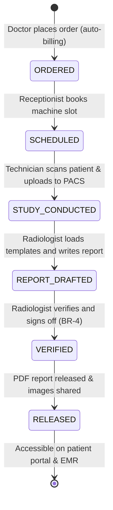

# Form/Module Spec — Radiology Information System (RIS) & PACS

| | |
|---|---|
| **Status** | Draft |
| **Source** | pasted module analysis — *VH/NABH/RIS/01/2026* (2026-07-01) |
| **Existing code?** | **Exists and is highly integrated.** Reuses [`RadiologyOrder`](../../backend/src/main/java/com/hms/entity/RadiologyOrder.java) (holds order details), [`RadiologyResult`](../../backend/src/main/java/com/hms/entity/RadiologyResult.java) (holds findings and impressions), [`RadiologyTestMaster`](../../backend/src/main/java/com/hms/entity/RadiologyTestMaster.java) (holds catalog tests), and [`RadiologyWorkflowService`](../../backend/src/main/java/com/hms/service/hospital/RadiologyWorkflowService.java) (handles order, study, and results transitions). |

> **Read first — Leverage the Existing RIS Engine.**
> **(1) Existing Auto-Billing.** In [`RadiologyWorkflowService.placeOrder`](../../backend/src/main/java/com/hms/service/hospital/RadiologyWorkflowService.java#L59), auto-billing is already wired! Placed IPD radiology orders post charges to `BillingService` automatically: `1200.00` for STAT and `800.00` for ROUTINE. Keep this existing feature intact.
> **(2) PACS Study UID Link.** The study conductance transition `ORDERED → STUDY_CONDUCTED` is handled by [`RadiologyWorkflowService.conductStudy`](../../backend/src/main/java/com/hms/service/hospital/RadiologyWorkflowService.java#L126). This is the exact integration point where a DICOM image acquisition or PACS (Picture Archiving and Communication System) upload listener must link a unique **Study UID** and store the DICOM resource path (`dicom_location`) under a new `radiology_study` reference.
> **(3) Radiologist Verification & Release Gaps.** The current state machine goes directly from `STUDY_CONDUCTED → COMPLETED` upon result entry. We must recommend evolving the `RadiologyOrder` statuses to introduce **`VERIFIED`** (signed off by a Radiologist user) and **`RELEASED`** (made visible to the patient/portal) states to enforce the critical clinical validation rules (Rule 3) and prevent unverified reports from displaying in wards.

---

## 1. Form/Module Overview
- **Department:** Radiology (primary); OPD, IPD, Emergency, ICU, OT, Billing, MRD, Doctor (secondary)
- **Module:** **Radiology → Orders → Scheduling → Imaging → Reporting → PACS** (integrated clinical radiology information system)
- **Filled By:** Radiology Receptionist (scheduling); Radiology Technician (image acquisition); Radiologist (interpretation & reporting)
- **Approved / Verified By:** Radiologist (verification & release)
- **Stored In:** `radiology_results` (database), PACS DICOM server, and generated PDF reports
- **Lifecycle:** created upon physician order; updated through appointment, study acquisition, and reporting; finalized upon Radiologist verification; archived in patient EMR and MRD
- **NABH clause:** AAC/COP — diagnostic imaging services; documented safety precautions (radiation protection, pregnancy screens); unique study UID generation; reporting of critical imaging findings; radiologist verification of reports.

## 2. Purpose
- **Hospital use:** manages the complete lifecycle of radiology orders, ensuring correct patient scheduling, radiation dose control, and high-fidelity image availability.
- **NABH requirement:** clinical verification of imaging findings, radiation safety protocol compliance (AERB), and immediate reporting of critical findings (e.g. brain bleed).
- **Legal:** provides trace logs of who scheduled, performed, and interpreted imaging studies, serving as clinical-legal evidence.
- **Clinical:** provides high-resolution DICOM images and verified impressions directly to physician and surgeon dashboards.
- **Business rationale:** captures high-cost imaging revenue automatically upon order placement and optimizes expensive scanner utilization (MRI, CT).

## 3. Trigger
`Doctor orders scan (DoctorDashboard / ConsultationModal) → Charge posted to Billing (auto-billing) → Scan scheduling checklist generated (Radiology Reception) → Patient called & scan conducted → DICOM image uploaded to PACS → Radiologist writes report → Radiologist Verifies → Report Released → Doctor/Patient Notified`.

## 4. User Roles
| Actor | Capacity | Existing HMS role | Note |
|---|---|---|---|
| Doctor | orders scans, reviews released reports and PACS images | `DOCTOR` | attending clinician |
| Radiology Reception | schedules machine slots and coordinates appointments | `RECEPTIONIST` | front desk role |
| Radiology Technician| performs scan, marks study conducted, uploads to PACS | `RADIOLOGY_TECHNICIAN` | imaging technician |
| Radiologist | reviews DICOM studies, drafts reports, verifies findings | `DOCTOR` | with Radiologist capacity flag |
| Billing Clerk | audits charges and verifies insurance clearance | `RECEPTIONIST` / Admin | billing desk |
| Patient | views and downloads released reports and thumbnails | — | portal view (read-only) |
| MRD Officer | archives completed records | — | role gap: `MRD_OFFICER` |

## 5. Fields
Legend — Source: `auto`=fetched from context, `manual`=entered, `sig`=signature capture, `device`=PACS/modality import.

| Field | Type | Max | Mandatory | Editable rule | DB column | Validation | Search | Print | Source |
|---|---|---|---|---|---|---|---|---|---|
| UHID | string | 20 | Y | read-only | (join `patient.custom_id`) | valid patient identity | Y | Y | auto |
| Patient Name | string | 100 | Y | read-only | `patient.name` | — | Y | Y | auto |
| IPD/OPD Number | string | 20 | Y | read-only | (join admission / OPD) | active encounter | Y | Y | auto |
| Radiology Order ID | string | 50 | Y | read-only | `radiology_orders.public_id` | UUID key | Y | Y | auto |
| Scan Name | string | 100 | Y | read-only | `radiology_orders.test_name` | must match master list | Y | Y | auto |
| Ordered By | string | 100 | Y | read-only | `radiology_orders.ordered_by_name` | must match logged user | Y | Y | auto |
| Priority | enum | — | Y | read-only | `radiology_orders.priority` | ROUTINE / URGENT / STAT | N | Y | auto |
| Modality | enum | — | Y | read-only | `radiology_study.modality` | XRAY / CT / MRI / USG / PET / MAMMO| Y | Y | auto |
| Scheduled Time | datetime | — | Y | draft only | `radiology_schedule.scheduled_time` | not in past | N | N | manual |
| Machine ID | string | 20 | Y | draft only | `radiology_schedule.machine_id` | valid active machine | N | N | manual |
| Study UID | string | 100 | Y | read-only | `radiology_study.study_uid` | unique DICOM UID (BR-1) | Y | Y | device |
| DICOM Location | string | 500 | Y | read-only | `radiology_study.dicom_location` | valid PACS URL | N | N | device |
| Contrast Used | bool | — | Y | technician | `radiology_study.contrast_used` | — | N | Y | manual |
| Radiation Dose (CTDI)| decimal | 5,2 | cond. | technician | `radiology_study.radiation_dose` | > 0 (required for CT/XRAY) | N | Y | manual/device |
| Findings | text | 4000 | Y | radiologist | `radiology_results.findings` | structured text template | N | Y | manual |
| Impression | text | 2000 | Y | radiologist | `radiology_results.impression` | structured text template | N | Y | manual |
| Is Abnormal | bool | — | Y | read-only | `radiology_results.is_abnormal` | auto-true if marked abnormal | N | Y | auto |
| Radiologist Verified | string | 100 | Y | final only | `radiology_results.verified_by_name` | radiologist user name | Y | Y | sig |
| Verification Time | datetime | — | Y | final only | `radiology_report.released_at` | not in future | N | Y | auto |

## 6. Business Rules
- **BR-1** **Unique Study UID:** Every imaging study performed must carry a unique DICOM-compliant `study_uid` generated by the modality or PACS server upon scan acquisition (Rule 1).
- **BR-2** **Permanency of Images:** Radiology images and raw DICOM folders are permanent clinical assets and cannot be hard-deleted or updated. They must be archived indefinitely (Rule 2).
- **BR-3** **Auto-Billing Charge:** IPD radiology orders automatically post charges to billing upon placement: `1200.00` for STAT and `800.00` for ROUTINE (already implemented).
- **BR-4** **Radiologist Sign-off Gate:** Results can only transition to a `VERIFIED` and `RELEASED` report state by a user carrying the radiologist capacity flag (Rule 3).
- **BR-5** **Critical Findings Alert:** If a radiologist flags a scan as abnormal with critical markers (e.g. Intracranial Hemorrhage, Pneumothorax), the system must immediately trigger high-priority alerts to the attending doctor, emergency dashboard, or ICU console (Rule 4).
- **BR-6** **Immutable Final State:** Once a report is verified, it is locked. Any adjustments or correction reports require creating a versioned amendment with audit track details and reasons (Rule 5).
- **BR-7** **Emergency Queue Bypass:** Emergency scans (`priority=STAT`) bypass normal scheduling slots and receive immediate scheduling queue priority (Rule 6).
- **BR-8** **Tenant Isolation:** Every radiology table must carry `hospital_id`, and queries must validate tenant ownership.

## 7. Database Design
Evolves existing schemas to support PACS studies, machine scheduling, and reporting checkups.

### Table `radiology_orders` (existing, tenant-owned):
Represents a patient's ordered imaging scan group.

| Column | Type | Notes |
|---|---|---|
| id | BIGINT PK | |
| public_id | VARCHAR(50) unique | UUID identifier |
| hospital_id | BIGINT NOT NULL, FK | Tenant reference key, indexed |
| patient_id | BIGINT NOT NULL, FK | |
| ipd_admission_id | BIGINT, FK | Nullable (for OPD cases) |
| opd_id | BIGINT, FK | Nullable (for IPD cases) |
| test_name | VARCHAR(100) NOT NULL | |
| radiology_test_master_id| BIGINT, FK | catalog test reference |
| priority | VARCHAR(20) NOT NULL | ROUTINE / URGENT / STAT |
| status | VARCHAR(20) NOT NULL | ORDERED / STUDY_CONDUCTED / VERIFIED / RELEASED |
| ordered_by_name | VARCHAR(100) NOT NULL | |
| study_conducted_at | TIMESTAMP | |
| study_conducted_by_name| VARCHAR(100) | |
| created_at | TIMESTAMP | |
| updated_at | TIMESTAMP | |

### Table `radiology_schedule` (new, tenant-owned):
Manages appointment slots and machine scheduling conflict logs.

| Column | Type | Notes |
|---|---|---|
| id | BIGINT PK | |
| hospital_id | BIGINT NOT NULL, FK | |
| order_id | BIGINT NOT NULL, FK | |
| machine_id | VARCHAR(20) NOT NULL | e.g. MRI-01, CT-02 |
| technician_id | BIGINT, FK | |
| scheduled_time | TIMESTAMP NOT NULL | Slot booking time |
| status | VARCHAR(20) NOT NULL | BOOKED / ARRIVED / SKIPPED |

### Table `radiology_study` (new, tenant-owned):
Holds the DICOM metadata and location mapping details generated on PACS upload.

| Column | Type | Notes |
|---|---|---|
| id | BIGINT PK | |
| hospital_id | BIGINT NOT NULL, FK | |
| order_id | BIGINT NOT NULL, FK | |
| modality | VARCHAR(20) NOT NULL | XRAY / CT / MRI / USG, etc. |
| study_uid | VARCHAR(100) NOT NULL | Unique DICOM Study UID |
| dicom_location | VARCHAR(500) NOT NULL | Path/URL on PACS server |
| contrast_used | BOOLEAN NOT NULL | |
| radiation_dose | DECIMAL(5,2) | CTDI/DLP parameters |
| performed_at | TIMESTAMP NOT NULL | Time scan was run |

### Table `radiology_results` (existing, tenant-owned):
Holds radiologist report text, impressions, and validation flags.

| Column | Type | Notes |
|---|---|---|
| id | BIGINT PK | |
| public_id | VARCHAR(50) unique | UUID identifier |
| hospital_id | BIGINT NOT NULL, FK | |
| radiology_order_id | BIGINT NOT NULL, FK | One-to-one constraint |
| patient_id | BIGINT NOT NULL, FK | |
| findings | TEXT NOT NULL | |
| impression | TEXT NOT NULL | |
| is_abnormal | BOOLEAN NOT NULL | |
| result_file_url | VARCHAR(500) | URL of generated report PDF |
| resulted_by_name | VARCHAR(100) NOT NULL | Radiologist who drafted report |
| resulted_at | TIMESTAMP NOT NULL | |
| verified_by_name | VARCHAR(100) | Verifying radiologist |
| created_at | TIMESTAMP | |

- **Indexes:** `(hospital_id, study_uid)` for PACS integration lookups. `(hospital_id, patient_id)` for permanent history checks.

## 8. APIs
Every `{id}` endpoint checks `hospital_id` to confirm patient ownership.

- **`POST /hospital/radiology/orders`**
  - **Roles:** `DOCTOR`, `HOSPITAL_ADMIN`
  - **Request:** `{ "patientId": 1, "testName": "MRI Brain W/O Contrast", "radiologyTestMasterId": 4, "priority": "ROUTINE" }`
  - **Response:** Created `radiology_orders` JSON with status `ORDERED`.
  - **Purpose:** Physician places a digital imaging request (auto-billing executes).

- **`POST /hospital/radiology/schedule`**
  - **Roles:** `RECEPTIONIST`, `HOSPITAL_ADMIN`
  - **Request:** `{ "orderId": 12, "machineId": "MRI-01", "scheduledTime": "2026-07-01T11:00:00" }`
  - **Response:** Created schedule JSON.
  - **Purpose:** Books a machine slot for the patient.

- **`POST /hospital/radiology/study`**
  - **Roles:** `RADIOLOGY_TECHNICIAN`, `HOSPITAL_ADMIN`, `device`
  - **Request:** `{ "orderId": 12, "modality": "MRI", "studyUid": "1.2.840.113619...", "dicomLocation": "http://pacs/study/123", "contrastUsed": false, "radiationDose": 12.5 }`
  - **Response:** Created study reference JSON (updates order status to `STUDY_CONDUCTED` via `conductStudy`).
  - **Purpose:** Links PACS upload details when scan completes.

- **`POST /hospital/radiology/result/{publicId}`**
  - **Roles:** `DOCTOR` (Radiologist flag), `HOSPITAL_ADMIN`
  - **Request:** `{ "findings": "Normal ventricles. No hemorrhage.", "impression": "Normal brain scan.", "isAbnormal": false }`
  - **Response:** Created report status.
  - **Purpose:** Saves the findings and impressions template drafts.

- **`POST /hospital/radiology/verify/{publicId}`**
  - **Roles:** `DOCTOR` (Radiologist flag)
  - **Request:** `{ "verifiedByName": "Dr. Varma" }`
  - **Response:** Verified status.
  - **Purpose:** Signs off report, updates status to `VERIFIED`.

## 9. UI Design
- **Radiologist Reporting Workspace (Desktop Optimized):**
  - **Split Screen View:** Left panel hosts the built-in PACS Viewer (DICOM controls: zoom, window level, measurements, side-by-side historical scans). Right panel hosts the Structured Reporting editor.
  - **Template Console:** Dropdown menu to load modality templates (e.g. Chest X-Ray Normal, CT Head Stroke Protocol), avoiding free-text typing.
  - **Critical Indicator Panel:** Quick toggles for urgent critical alerts (e.g. Intracranial Hemorrhage). Checking this immediately triggers critical escalation alerts.
- **Technician Console (Tablet Optimized):**
  - Displays room queues, schedules, contrast logs, and patient radiation dose records.

## 10. Workflow

## 11. Validation
- CTDI/Dose parameters must be non-negative values.
- Mismatch differences are checked: report verification will reject if findings or impressions are blank.
- The approval endpoint will block execution if a valid radiologist digital signature is not provided.

## 12. Permissions
| Role | Place Order | Schedule Slot | Conduct Scan | Verify Report | View Report / Images |
|---|---|---|---|---|---|
| Doctor | ✅ | ❌ | ❌ | ❌ | ✅ |
| Receptionist | ❌ | ✅ | ❌ | ❌ | ✅ (Status only) |
| Radiology Tech | ❌ | View | ✅ | ❌ | ✅ |
| Radiologist | ❌ | ❌ | ✅ | ✅ | ✅ |
| Patient | ❌ | ❌ | ❌ | ❌ | ✅ (Released only) |
| MRD | ❌ | ❌ | ❌ | ❌ | Full View |

## 13. Print Rules
- Printed via HTML-to-PDF template `templates/radiology-report.html`.
- **Layout:** Standard margins, patient barcode, clinical history box, and two columns for Findings and Impressions.
- **Visuals:** Key thumbnail attachments from PACS can be embedded at the bottom of the page.
- **Sign-off:** Autographed stamp of the verifying Radiologist, registration number, and verification QR code.

## 14. Audit Logs
Recorded under `AuditLogService` with `entity_type="RADIOLOGY_ORDER"`:
- Imaging order placed (patient, scan type, priority, billing posted).
- Machine appointment slot booked (date, room, machine ID).
- Study conducted and PACS upload verified (Study UID, URL).
- Critical finding alert dispatched (findings, locations notified).
- Report verified (radiologist name, timestamp).

## 15. Digital Improvements
- **Instantiated Template Reporting:** Saves time and standardizes reports by pre-populating standard scan templates.
- **Closed-Loop Billing:** Charges for diagnostic imaging automatically at order placement, preventing billing leakage.
- **Automatic Critical Alert Routing:** Pushes high-speed alerts to critical wards (ICU, ER) immediately on clinical diagnosis.

## 16. Missing / Intelligent Features
- **AI Pre-screening:** Automatically analyzes X-rays/CTs for common indicators (e.g. pneumothorax, hemorrhage) and flags suspect cases to the top of the radiologist's review queue.
- **Cumulative Radiation Dose Tracker:** Accumulates patient radiation exposure records over successive scans and alerts clinicians if boundaries are breached.
- **Side-by-Side PACS Comparison:** Auto-loads a patient's previous historical scans in the PACS viewer to audit progression.

---

## Module & workflow placement
- **Owning module:** Radiology → Radiology Information System (RIS).
- **Creates / Updates / Views / Prints / Archives:**
  - **Creates:** `radiology_orders`, `radiology_results`, `radiology_schedule`, `radiology_study` records.
  - **Updates:** Deducts/charges bills in `Billing`.
  - **Views:** Patient EMR history.
  - **Prints:** Radiology Report Sheets with thumbnail attachments.
  - **Archives:** MRD.
- **Feeds into:** Patient EMR (imaging reports & PACS links) · Billing Module (auto-charges statement) · Doctor Dashboard (results lookup).
- **Fed by:** Doctor orders · Radiology test catalog templates (`RadiologyTestMaster`) · Modality uploads.
- **New modules this form implies:** Radiology Information System (RIS) · DICOM/PACS Integration Engine · Structured Reporting Engine.
