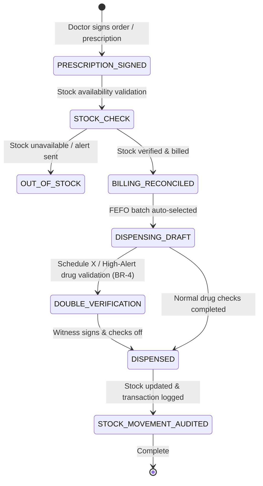

# Form/Module Spec — Pharmacy Management System (PMS)

| | |
|---|---|
| **Status** | Draft |
| **Source** | pasted module analysis — *VH/NABH/PMS/01/2026* (2026-07-01) |
| **Existing code?** | **Exists and is highly integrated.** Reuses [`MedicineMaster`](../../backend/src/main/java/com/hms/entity/pharmacy/MedicineMaster.java) (holds drugs), [`MedicineBatch`](../../backend/src/main/java/com/hms/entity/pharmacy/MedicineBatch.java) (holds batches), [`PharmacySale`](../../backend/src/main/java/com/hms/entity/pharmacy/PharmacySale.java) (holds sales transactions), [`Prescription`](../../backend/src/main/java/com/hms/entity/Prescription.java) (holds prescriptions), and MAR tracking via [`NurseTask`](../../backend/src/main/java/com/hms/entity/NurseTask.java). |

> **Read first — Leverage the Existing Pharmacy Engine.**
> **(1) Master-Detail Sales Ledger.** The system already possesses [`PharmacySale`](../../backend/src/main/java/com/hms/entity/pharmacy/PharmacySale.java) and [`PharmacySaleItem`](../../backend/src/main/java/com/hms/entity/pharmacy/PharmacySaleItem.java) tables. Use these for all walk-in and prescription dispensing logs instead of building new sales tables.
> **(2) Expiry & FEFO Check.** [`MedicineBatch`](../../backend/src/main/java/com/hms/entity/pharmacy/MedicineBatch.java#L38) holds a specific `expiry_date` and `status`. Ensure that batch selection in the dispensing engine automatically prioritizes batches by FEFO (First-Expiry, First-Out) and rejects any expired status (Rule 1, Rule 3).
> **(3) Narcotics & Controlled Substances Gaps.** While `MedicineMaster` carries a `scheduleType` column (OTC, H, H1, X), the codebase lacks a double-verification workflow or narcotics register. We must recommend introducing a dedicated **`narcotic_log`** table and requiring dual electronic signatures (Pharmacist + Nurse/Doctor) before issue or administration of Schedule X and high-alert drugs (Rule 4).

---

## 1. Form/Module Overview
- **Department:** Pharmacy (primary); Doctors, Nursing, Billing, Purchase, Inventory, MRD (secondary)
- **Module:** **Pharmacy → Prescription → Dispensing → Inventory → Billing → Medication Administration** (integrated hospital medication management platform)
- **Filled By:** Doctor (prescription); Pharmacist (dispense validation); Nurse (administration check-off)
- **Approved / Verified By:** Pharmacist (dispensing verification); Nurse Supervisor (high-alert double verification)
- **Stored In:** `pharmacy_sales` (database), MAR records, and stock inventory ledger
- **Lifecycle:** created upon prescription/order; active during stock allocation and dispensing; finalized upon drug administration or return; archived permanently in patient EMR
- **NABH clause:** COP/PRE — medication management and use; policies on prescribing, rational drug use, safe storage, look-alike sound-alike (LASA) drugs, high-alert drug protocols, and narcotic tracking registers.

## 2. Purpose
- **Hospital use:** manages the complete medication cycle, preventing drug errors, managing purchase inventories, and ensuring regulatory compliance.
- **NABH requirement:** strict controls on drug storage, expiry management, double-signature validation for high-alert drugs, and narcotic registers.
- **Legal:** complies with State Drug Controller rules on Schedule H/H1/X dispensing, recording doctor details and signatures.
- **Clinical:** protects patient safety through drug interaction checks, allergy alerts, dose validation, and structured MAR schedules.
- **Business rationale:** prevents stock shrinkage, optimizes cash collections on drug sales, and automates reorder purchase orders.

## 3. Trigger
`Doctor prescribes medicine (OPD Consult / IPD Order) → Clinical safety scan (Allergies, Interactions) → Prescription verified by Pharmacist → Stock allocated via FEFO → Bill generated & paid → Medicine dispensed (stock deducted, BR-3) → MAR tasks generated (IPD) → Nurse administers drug → Returned drugs reconciled (BR-5)`.

## 4. User Roles
| Actor | Capacity | Existing HMS role | Note |
|---|---|---|---|
| Doctor | prescribes drugs, reviews interaction alerts, signs orders | `DOCTOR` | operating surgeon / consultant |
| Pharmacist | reviews prescriptions, validates dosages, dispenses batches | `PHARMACIST` | dispensing pharmacist |
| Nurse | administers drugs on ward, signs MAR, requests stock | `NURSE` | ward staff nurse |
| Store Manager | monitors stock levels, executes purchase invoices | `PHARMACIST` / Admin | pharmacy store controller |
| Billing Clerk | validates payments and issues sales receipts | `RECEPTIONIST` / Admin | pharmacy cash desk |
| Patient | receives medications and drug instructions | — | consumer portal view |
| MRD Officer | reviews historical prescription files | — | role gap: `MRD_OFFICER` |

## 5. Fields
Legend — Source: `auto`=fetched from context, `manual`=entered, `sig`=signature capture.

| Field | Type | Max | Mandatory | Editable rule | DB column | Validation | Search | Print | Source |
|---|---|---|---|---|---|---|---|---|---|
| UHID | string | 20 | Y | read-only | (join `patient.custom_id`) | valid patient identity | Y | Y | auto |
| Patient Name | string | 100 | Y | read-only | `patient.name` | — | Y | Y | auto |
| Prescription ID | string | 50 | Y | read-only | `prescriptions.public_id` | UUID key | Y | Y | auto |
| Drug Name | string | 150 | Y | read-only | `medicine_master.medicine_name` | must match catalog | Y | Y | auto |
| Generic Name | string | 150 | Y | read-only | `medicine_master.generic_name` | — | Y | Y | auto |
| Schedule Type | enum | — | Y | read-only | `medicine_master.schedule_type` | H / H1 / X / OTC | Y | Y | auto |
| Batch Number | string | 30 | Y | draft only | `medicine_batch.batch_number` | must be active (BR-1) | Y | Y | auto/manual |
| Expiry Date | date | — | Y | read-only | `medicine_batch.expiry_date` | not expired (BR-1) | N | Y | auto |
| Quantity Ordered | int | — | Y | read-only | `prescription_item.quantity` | > 0 | N | Y | auto |
| Quantity Dispensed | int | — | Y | draft only | `pharmacy_sale_item.quantity` | <= stock (BR-2) | N | Y | manual |
| Unit Price | decimal | 10,2 | Y | read-only | `medicine_batch.selling_price` | > 0.00 | N | Y | auto |
| Total GST | decimal | 10,2 | Y | read-only | `pharmacy_sale_item.tax_amount` | calculated | N | Y | auto |
| Total Bill Amount | decimal | 10,2 | Y | read-only | `pharmacy_sale.total_amount` | calculated sum | N | Y | auto |
| Witness Staff ID | string | 20 | cond. | draft only | `narcotic_log.witness_user_id` | required for controlled/X (BR-4) | N | Y | manual |
| Pharmacist Sig | sig | — | Y | final only | `pharmacy_sale.pharmacist_sig` | verified pharmacist credentials | N | Y | sig |
| Witness Signature | sig | — | cond. | final only | `narcotic_log.witness_sig` | required for controlled/X (BR-4) | N | Y | sig |

## 6. Business Rules
- **BR-1** **Expiry Gate:** The system must block selecting or dispensing any drug batch where `expiry_date` is in the past, or status is `EXPIRED` / `QUARANTINED` (Rule 1).
- **BR-2** **Stock Level Cap:** Quantity dispensed cannot exceed `current_quantity` minus `reserved_quantity` for the selected `medicine_batch` (Rule 2).
- **BR-3** **FEFO Policy Enforcement:** Batch selection must default to the First-Expiry, First-Out (FEFO) algorithm, auto-selecting the batch with the nearest expiry date (Rule 3).
- **BR-4** **Controlled Substance Double Sign-off:** For Schedule X and high-alert drugs (Insulin, Heparin, Narcotic pain relievers), the system requires a second witness signature (doctor/nurse user credentials) before saving the dispense record (Rule 4).
- **BR-5** **Auto-Stock Update on Returns:** Unused IPD drug returns must be verified by a pharmacist; upon approval, the system must automatically increase the batch's `current_quantity` and post a credit note adjustment to the patient's billing file (BR-5).
- **BR-6** **Stock Movement Audit Trail:** Any stock deduction, purchase inlet, return, or waste log must write an entry to `InventoryTransaction` detailing user, quantity, change, and batch ID (Rule 6).
- **BR-7** **Tenant Isolation:** Every pharmacy transaction, batch record, and inventory line must carry `hospital_id` and enforce multi-tenant isolation.

## 7. Database Design
Integrates with the `entity/pharmacy` sub-package and adds narcotics register support.

### Table `narcotic_log` (new, tenant-owned):
Maintains strict legal accounting for controlled substances and Schedule X/H1 drugs.

| Column | Type | Notes |
|---|---|---|
| id | BIGINT PK | |
| public_id | VARCHAR(50) unique | UUID identifier |
| hospital_id | BIGINT NOT NULL, FK | Tenant reference key, indexed |
| pharmacy_sale_id | BIGINT NOT NULL, FK | Reference to sale statement |
| medicine_id | BIGINT NOT NULL, FK | Reference to Master catalog |
| batch_id | BIGINT NOT NULL, FK | Reference to Batch |
| quantity_issued | DECIMAL(10,2) NOT NULL | |
| quantity_wasted | DECIMAL(10,2) | Waste count during prep |
| witness_user_id | BIGINT NOT NULL, FK | Secondary witness staff member |
| witness_sig | TEXT NOT NULL | Signature blob of witness |
| created_by | BIGINT NOT NULL, FK | Dispensing pharmacist |
| created_at | TIMESTAMP | |

### Table `InventoryTransaction` (existing, tenant-owned):
Traceability log for stock updates.

| Column | Type | Notes |
|---|---|---|
| id | BIGINT PK | |
| hospital_id | BIGINT NOT NULL | |
| batch_id | BIGINT NOT NULL | |
| transaction_type | VARCHAR(20) NOT NULL | PURCHASE / DISPENSE / RETURN / ADJUSTMENT / WASTE |
| quantity | DECIMAL(10,2) NOT NULL | |
| reference_id | BIGINT | ID of sale or purchase invoice item |
| created_by | VARCHAR(100) | User email |
| created_at | TIMESTAMP | |

- **Indexes:** `(hospital_id, batch_id)` for batch tracking. `(hospital_id, summary_date)` for sales dashboards.

## 8. APIs
Every `{id}` endpoint checks `hospital_id` to confirm patient ownership.

- **`POST /hospital/pharmacy/sale`**
  - **Roles:** `PHARMACIST`, `HOSPITAL_ADMIN`
  - **Request:** `{ "prescriptionId": 12, "items": [{ "medicineId": 3, "batchId": 4, "quantity": 10 }] }`
  - **Response:** Created `PharmacySale` JSON with status `COMPLETED`.
  - **Purpose:** Finalizes medication issue and deducts stock (BR-3).

- **`POST /hospital/pharmacy/narcotic-verification`**
  - **Roles:** `PHARMACIST`
  - **Request:** `{ "saleId": 14, "witnessUserId": 8, "witnessSig": "data..." }`
  - **Response:** Success confirmation JSON.
  - **Purpose:** Verifies controlled Schedule X dispensing via double sign-off (BR-4).

- **`POST /hospital/pharmacy/returns`**
  - **Roles:** `PHARMACIST`, `HOSPITAL_ADMIN`
  - **Request:** `{ "admissionId": 12, "items": [{ "medicineId": 3, "batchId": 4, "quantity": 2 }] }`
  - **Response:** Created return receipt JSON (auto-updates stock, BR-5).
  - **Purpose:** Reconciles returned surplus ward drugs.

- **`GET /hospital/pharmacy/stock`**
  - **Roles:** `PHARMACIST`, `DOCTOR`, `NURSE`, `HOSPITAL_ADMIN`
  - **Params:** `?search=Paracetamol`
  - **Response:** List of matching medicines with total available quantities.

- **`GET /hospital/pharmacy/dashboard/expiry`**
  - **Roles:** `PHARMACIST`, `HOSPITAL_ADMIN`
  - **Response:** List of batches expiring in the next 30/60/90 days.

## 9. UI Design
- **Pharmacist Dispensing Console (Desktop Optimized):**
  - **Queue List Panel:** Left-hand list showing active prescriptions (green = paid, amber = pending billing, priority = emergency).
  - **FEFO Batch Selector:** Center panel showing the ordered item. The system auto-selects and highlights the nearest-expiry batch card.
  - **High-Alert Verification Panel:** Pops up a warning modal for Schedule H1/X drugs, requiring secondary witness pin entry and sign-off.
  - **Label Printer preview:** Right-hand layout previewing dosage frequency labels (e.g. "Take 1 tab after meals morning/night") for sticker printing.

## 10. Workflow

## 11. Validation
- Dispensing quantity must be positive and greater than zero.
- Expired date verification: `expiry_date` must be greater than current date.
- Double-signature validation: witness credentials must be verified and mismatch checked before saving Schedule X sales.

## 12. Permissions
| Role | Prescribe Medicine | Dispense Medicine | Record Return | Verify Narcotic | View Stock |
|---|---|---|---|---|---|
| Doctor | ✅ | ❌ | ❌ | ✅ (witness) | ✅ |
| Pharmacist | ❌ | ✅ | ✅ | ✅ (owner) | ✅ |
| Nurse | ❌ | ❌ | ✅ (initiate) | ✅ (witness) | ✅ (Ward stock) |
| Patient | ❌ | ❌ | ❌ | ❌ | ❌ |
| MRD | ❌ | ❌ | ❌ | ❌ | Full View |

## 13. Print Rules
- Supports printing:
  - **Pharmacy Sale Receipt:** standard slip printer layout showing medicine name, batch, expiry, tax, total cost.
  - **Sticker Labels:** small sticker format containing dosage instructions, drug name, and UHID to paste on drug containers.
  - **Narcotic Register Page:** HTML-to-PDF (`templates/narcotic-register.html`) listing chronological Narcotic issues, quantity, patient, and doctor/witness signatures.

## 14. Audit Logs
Recorded under `AuditLogService` with `entity_type="PHARMACY_SALE"`:
- Prescription received and processed.
- Batch dispatched (medicine, batch, quantity).
- High-alert verification signed (witness ID, pharmacist).
- Return approved (credited amount, returned quantity, batch).
- Expiry batch status updated to `EXPIRED` or `QUARANTINED`.

## 15. Digital Improvements
- **FEFO Automation:** Saves pharmacists from manual expiration checks by auto-allocating the correct batch code.
- **Closed-Loop Returns:** Connects ward returns with accounting credit adjustments automatically.
- **Double Verification Safety Lock:** Enforces clinical compliance protocols by blocking narcotic issues in the software until a witness signs.

## 16. Missing / Intelligent Features
- **Drug Interaction Scanners:** Connects to `DrugInteractionMaster` database to automatically flag high-risk combinations (e.g. Warfarin + Aspirin) to the doctor before prescribing.
- **LASA Warning Banner:** Displays visual badges on look-alike sound-alike drug cards (e.g. Dopamine vs Dobutamine) during dispensing to prevent selection error.
- **Stock depletion predictor:** Analyzes consumption parameters to project inventory stock-out timelines.

---

## Module & workflow placement
- **Owning module:** Pharmacy → Pharmacy Management System (PMS).
- **Creates / Updates / Views / Prints / Archives:**
  - **Creates:** `PharmacySale`, `PharmacySaleItem`, `narcotic_log`, `InventoryTransaction`.
  - **Updates:** Deducts stock counts in `MedicineBatch`; updates statements in `Billing`.
  - **Views:** Patient EMR history.
  - **Prints:** Sales Receipts, dosage stickers, and narcotic register pages.
  - **Archives:** MRD.
- **Feeds into:** Patient EMR (medication history) · Billing Module (auto-charges statement) · Nurse Dashboard (MAR schedule tasks).
- **Fed by:** Doctor prescriptions · Purchase invoices (`PurchaseInvoice`).
- **New modules this form implies:** Medication Management Platform · Clinical Decision Support System (CDSS) interface · Narcotics Tracking register.
