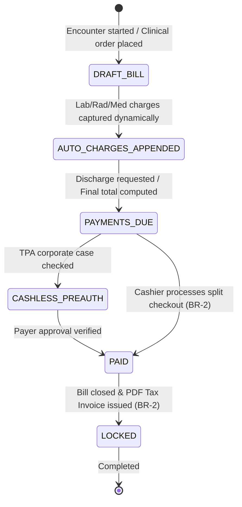

# Form/Module Spec — Billing & Revenue Cycle Management (RCM)

| | |
|---|---|
| **Status** | Draft |
| **Source** | pasted module analysis — *VH/NABH/RCM/01/2026* (2026-07-01) |
| **Existing code?** | **Exists and is highly integrated.** Reuses [`Billing`](../../backend/src/main/java/com/hms/entity/Billing.java) (holds bill header), [`BillingItem`](../../backend/src/main/java/com/hms/entity/BillingItem.java) (holds bill items), [`BillingMedicine`](../../backend/src/main/java/com/hms/entity/BillingMedicine.java) (holds pharmacy charges), and [`BillingPayment`](../../backend/src/main/java/com/hms/entity/BillingPayment.java) (holds payments). |

> **Read first — Leverage the central Charge Capture Engine.**
> **(1) centralized billing hooks.** The system already uses an automated charge capture engine. For example, [`LabWorkflowService.placeOrder`](../../backend/src/main/java/com/hms/service/hospital/LabWorkflowService.java#L77) and [`RadiologyWorkflowService.placeOrder`](../../backend/src/main/java/com/hms/service/hospital/RadiologyWorkflowService.java#L60) post charges to `BillingService` automatically: `500.00` for STAT lab tests, `1200.00` for STAT radiology. Ensure any clinical test orders automatically generate a `BillingItem` linking back to the encounter.
> **(2) Split Payments & Advances.** In the existing schema, `Billing` stores a single `paymentMethod` and `paymentReference`. To support modern RCM workflows, you should route payments to a dedicated table like `BillingPayment` (already exists in backend entity folder) to support split payments (e.g. Cash + Card) and advances deductions for the same bill (Rule 8).
> **(3) TPA & Payer Claims Gaps.** The current billing structures only handle direct patient payments. To support cashless insurance and corporate billing, we recommend implementing the new `insurance_claim` table to record approvals, pre-authorizations, and payer settlements (Rule 7).

---

## 1. Form/Module Overview
- **Department:** Billing Department (primary); OPD, IPD, Emergency, Pharmacy, Laboratory, Radiology, OT, TPA, Finance, Accounts (secondary)
- **Module:** **Billing → Registration Billing → Service Billing → Payments → Insurance → Refunds → Reports** (integrated revenue cycle management system)
- **Filled By:** Billing Executive (adds line items); Cashier (collects payments); TPA Coordinator (insurance)
- **Approved / Signed By:** Billing Supervisor (approves discounts/refunds)
- **Stored In:** `billing` (database), `billing_items`, and payment transaction ledgers
- **Lifecycle:** initialized upon encounter booking or clinical order; dynamically appended with charges; finalized upon payment receipt or insurance clearance; locked against changes; archived in MRD
- **NABH clause:** AAC/MIS — patient billing procedures; standard tariff schedule availability; detailed itemized billing statements; cashless insurance verification; financial audit trails.

## 2. Purpose
- **Hospital use:** tracks every billable medical event, collects payments, monitors outstanding receivables, and reconciles financial accounts.
- **NABH requirement:** provision of standard cost tariffs to patients, transparent itemized billing sheets, and audited discount logs.
- **Legal:** complies with GST invoicing requirements, generates tax receipts, and maintains clear financial ledgers for government tax reviews.
- **Clinical:** connects clinical orders with the billing dashboard to prevent unauthorized, unpaid diagnostic or imaging procedures.
- **Business rationale:** prevents revenue leakage, accelerates cash collection, handles cashless corporate claims, and computes department profitability.

## 3. Trigger
`Encounter created / Clinical order placed → Automated charge captured → Bill updated → Patient presents at billing desk → Split payment received OR Cashless authorization checked → Receipt printed (status PAID) → Account closed → Refund/Credit Note processed if cancelled`.

## 4. User Roles
| Actor | Capacity | Existing HMS role | Note |
|---|---|---|---|
| Billing Executive | creates bills, captures manual charges, checks deposits | `RECEPTIONIST` / Billing | front desk staff |
| Cashier | accepts payments, prints receipts, processes refunds | `RECEPTIONIST` / Billing | cash counter role |
| TPA Executive | uploads pre-auths, monitors claim settlements | `RECEPTIONIST` / Admin | insurance desk |
| Finance Manager | audits accounts, checks collection summaries, approves refunds | `SUPER_ADMIN` / Finance | finance manager |
| Patient | pays bills online, views cost estimates | — | patient portal role |
| Hospital Admin | views collection forecasting and revenue analytics | `HOSPITAL_ADMIN` | read-only dashboard access |

## 5. Fields
Legend — Source: `auto`=fetched from context, `manual`=entered, `sig`=signature capture.

| Field | Type | Max | Mandatory | Editable rule | DB column | Validation | Search | Print | Source |
|---|---|---|---|---|---|---|---|---|---|
| Bill Number | string | 25 | Y | read-only | `billing.custom_id` | unique readable code (BR-1)| Y | Y | auto |
| UHID | string | 20 | Y | read-only | (join `patient.custom_id`) | valid patient identity | Y | Y | auto |
| Patient Name | string | 100 | Y | read-only | `patient.name` | — | Y | Y | auto |
| IPD/OPD Number | string | 25 | Y | read-only | (join admission / OPD) | active encounter | Y | Y | auto |
| Service Name | string | 200 | Y | read-only | `billing_items.description` | must match Charge Master | N | Y | auto |
| Unit Price | decimal | 10,2 | Y | read-only | `billing_items.amount` | non-negative (BR-4) | N | Y | auto |
| Quantity | int | — | Y | read-only | `billing_items.quantity` | > 0 | N | Y | auto |
| Service Discount | decimal | 10,2 | Y | draft only | `billing_items.discount_amount` | <= gross value | N | Y | manual |
| GST Tax Amount | decimal | 10,2 | Y | read-only | `billing_items.tax_amount` | calculated | N | Y | auto |
| Net Bill Value | decimal | 10,2 | Y | read-only | `billing.amount` | calculated sum | N | Y | auto |
| Payment Mode | enum | — | Y | cashier | `billing_payments.payment_mode` | Cash / UPI / Card / Cheque | N | Y | manual |
| Transaction Ref | string | 100 | cond. | cashier | `billing_payments.reference_no` | required for UPI/Card | Y | Y | manual |
| Advance Used | decimal | 10,2 | Y | read-only | `billing.advance_applied` | <= available advance | N | Y | auto |
| Payer Type | enum | — | Y | TPA desk | `billing.payer_type` | PATIENT / INSURANCE / CORP | N | Y | auto |
| Approved Claim Amt| decimal | 10,2 | cond. | TPA desk | `insurance_claim.approved_amount`| <= claim amount | N | Y | manual |
| Cashier Name | string | 100 | Y | read-only | `billing.marked_paid_by` | must match logged cashier | Y | Y | auto |

## 6. Business Rules
- **BR-1** **Unique Bill Index:** Every bill generated must carry a unique, non-duplicative readable code (e.g. `BIL-2026-00045`) partitioned per hospital tenant (Rule 1).
- **BR-2** **Immutable on Payment:** A bill cannot be edited, deleted, or rolled back once a payment is recorded against it. Corrections must use credit/debit note reversals (Rule 2, Rule 3).
- **BR-3** **Charge Master Pricing:** Service fees must be pulled from the active Charge Master database. Manual override of pricing rates is blocked (Rule 4).
- **BR-4** **Automated Room Calculations:** Room and bed charges must run automatically every midnight based on the patient's active occupied bed assignment (Rule 5).
- **BR-5** **Refund Sign-off Gate:** Refunds (due to canceled tests or drug returns) must have an approved supervisor signature and carry a documented validation reason (Rule 6).
- **BR-6** **Insurance Freeze:** Cashless billing files remain editable for claim amendments only until the final claim file is submitted to the payer (Rule 7).
- **BR-7** **Advance Deduct First:** Any active advance deposit registered under the patient's admission file must be auto-applied and deducted from the net total during final discharge checkout.
- **BR-8** **Tenant Isolation:** Every billing header, item, payment transaction, and refund must check `hospital_id` to confirm tenant ownership.

## 7. Database Design
Evolves existing schemas to enforce split payments, advance deposits, and cashless claims tracking.

### Table `billing` (existing, tenant-owned):
The master bill header for encounters.

| Column | Type | Notes |
|---|---|---|
| id | BIGINT PK | |
| public_id | VARCHAR(50) unique | UUID identifier |
| custom_id | VARCHAR(25) unique | Bill number |
| hospital_id | BIGINT NOT NULL, FK | Tenant reference key, indexed |
| patient_id | BIGINT NOT NULL, FK | |
| doctor_id | BIGINT NOT NULL, FK | |
| ipd_admission_id | BIGINT, FK | Nullable (for OPD cases) |
| opd_id | BIGINT, FK | Nullable (for IPD cases) |
| billing_type | VARCHAR(20) NOT NULL | OPD / IPD |
| amount | DECIMAL(10,2) NOT NULL | Net bill total |
| payment_status | VARCHAR(20) NOT NULL | PAID / PENDING / PARTIALLY_PAID |
| payer_type | VARCHAR(20) NOT NULL | PATIENT / INSURANCE / CORPORATE |
| advance_applied | DECIMAL(10,2) | Deducted advance deposits |
| marked_paid_by | VARCHAR(100) | Cashier name |
| created_at | TIMESTAMP | |

### Table `billing_items` (existing, tenant-owned):
Individual service line items.

| Column | Type | Notes |
|---|---|---|
| id | BIGINT PK | |
| billing_id | BIGINT NOT NULL, FK | |
| hospital_id | BIGINT NOT NULL, FK | |
| description | VARCHAR(200) NOT NULL | Service / test name |
| amount | DECIMAL(10,2) NOT NULL | Unit price |
| quantity | INTEGER NOT NULL | |
| discount_amount | DECIMAL(10,2) | |
| tax_amount | DECIMAL(10,2) | GST component |
| category | VARCHAR(50) | LAB / RAD / PHARMACY / ROOM / OT / CONSULT |

### Table `billing_payments` (existing, tenant-owned):
Supports split payment entries for a single bill.

| Column | Type | Notes |
|---|---|---|
| id | BIGINT PK | |
| billing_id | BIGINT NOT NULL, FK | |
| hospital_id | BIGINT NOT NULL, FK | |
| payment_mode | VARCHAR(30) NOT NULL | Cash / UPI / Card / Advance |
| amount | DECIMAL(10,2) NOT NULL | Payment allocation |
| reference_no | VARCHAR(100) | UTR / Transaction code |
| received_by | VARCHAR(100) | Cashier email |
| received_at | TIMESTAMP NOT NULL | |

### Table `insurance_claim` (new, tenant-owned):
Tracks corporate and cashless claims.

| Column | Type | Notes |
|---|---|---|
| id | BIGINT PK | |
| hospital_id | BIGINT NOT NULL, FK | |
| billing_id | BIGINT NOT NULL, FK | |
| payer | VARCHAR(100) NOT NULL | TPA company name |
| claim_amount | DECIMAL(10,2) NOT NULL | |
| approved_amount | DECIMAL(10,2) | Authorized amount |
| status | VARCHAR(30) NOT NULL | PENDING_AUTH / APPROVED / SUBMITTED / SETTLED |
| submitted_at | TIMESTAMP | |

## 8. APIs
Every `{id}` endpoint checks `hospital_id` to confirm patient ownership.

- **`POST /hospital/billing/create`**
  - **Roles:** `BILLING_EXEC`, `HOSPITAL_ADMIN`
  - **Request:** `{ "patientId": 1, "ipdAdmissionId": 12, "billingType": "IPD", "items": [{ "description": "Consultation", "amount": 500.00, "quantity": 1 }] }`
  - **Response:** Created `billing` JSON.
  - **Purpose:** Initializes a bill file and adds lines.

- **`POST /hospital/billing/payment`**
  - **Roles:** `CASHIER`, `HOSPITAL_ADMIN`
  - **Request:** `{ "billingId": 12, "payments": [{ "paymentMode": "UPI", "amount": 1000.00, "referenceNo": "UTR98765" }] }`
  - **Response:** Payment verification status (updates bill status to `PAID`).
  - **Purpose:** Records split collections (BR-2).

- **`POST /hospital/billing/refund`**
  - **Roles:** `CASHIER`, `HOSPITAL_ADMIN`
  - **Request:** `{ "billingId": 12, "amount": 500.00, "reason": "Test cancelled" }`
  - **Response:** Refund transaction confirmation JSON.
  - **Purpose:** Records approved refunds (BR-5).

- **`POST /hospital/billing/insurance-preauth`**
  - **Roles:** `TPA_EXEC`, `HOSPITAL_ADMIN`
  - **Request:** `{ "billingId": 12, "payer": "Star Health", "claimAmount": 50000.00 }`
  - **Response:** Updated claim status.
  - **Purpose:** Logs insurance cashless pre-authorizations (BR-6).

- **`GET /hospital/billing/patient/{patientId}`**
  - **Roles:** `DOCTOR`, `NURSE`, `CASHIER`, `HOSPITAL_ADMIN`
  - **Response:** Array of bills and deposits (outstanding balance).

## 9. UI Design
- **Billing Desk Screen (Desktop Optimized):**
  - **Account Overview Panel:** Top panel showing Patient UHID, Bed number, Days Admitted, Gross charges, Deposits, and Outstanding Balance (color highlighted).
  - **Line Item Spreadsheet:** Interactive grid of all captured charges grouped by department (Lab, Pharmacy, Room). Hovering displays the ordering doctor and timestamp.
  - **Split Payment Console:** Dynamic checkout widget allowing split entries (e.g. UPI field + Cash field).
  - **Discharge Checklist Status:** visual indicators proving all clinical systems have checked off the patient before cashier marks final discharge clearance.

## 10. Workflow

## 11. Validation
- Discount rates cannot exceed the service line gross amount.
- Transaction references are mandatory if payment mode is UPI, Net Banking, or Credit Card.
- Room charges validation: must verify room charge duration matches admission days.

## 12. Permissions
| Role | Create Bill | Add Items | Collect Payment | Approve Refund | View Dashboard |
|---|---|---|---|---|---|
| Billing Executive | ✅ | ✅ | ❌ | ❌ | ✅ |
| Cashier | ❌ | ❌ | ✅ | ❌ | ✅ |
| Finance Manager | ✅ | ✅ | ✅ | ✅ | ✅ (Full) |
| TPA Executive | ❌ | ❌ | ❌ | ❌ | ✅ (Insurance claims) |
| Patient | ❌ | ❌ | ❌ | ❌ | ✅ (Own bill) |
| MRD | ❌ | ❌ | ❌ | ❌ | Full View |

## 13. Print Rules
- Printed via HTML-to-PDF template `templates/tax-invoice.html`.
- **Layout:** Standard corporate invoice, hospital tax numbers, header with patient profile, itemized categories, payment modes, cashier sign block, and a payment receipt QR code.
- **Formattings:** Detailed interim statement (for review) vs final Tax Invoice (locked).

## 14. Audit Logs
Recorded under `AuditLogService` with `entity_type="BILLING"`:
- Bill created (patient, initial amount).
- Charge captured (item description, department, amount).
- Split payment registered (mode, amount, reference).
- Refund processed (amount, reason, supervisor ID).
- Payer claim submitted (payer, claim amount).

## 15. Digital Improvements
- **Automated Charge Capture:** Eliminates revenue leakage by posting test and drug fees straight from source clinical systems.
- **Advance Auto-Deductions:** Automatically balances patient ledger accounts at final check-out.
- **Paperless Estimates:** Generates patient cost estimation projections dynamically based on planned surgery packages.

## 16. Missing / Intelligent Features
- **Revenue Leakage Audit:** Cross-scans LIS/RIS order logs against billing files and flags unbilled clinical scans to billing staff.
- **Package Overage Sentinel:** Tracks package limits during admission (e.g. Cataract cap) and alerts clinicians when exclusions approach.
- **Claim Denial Predictor:** Scans TPA files for missing diagnostic codes prior to submission to reduce rejection rates.

---

## Module & workflow placement
- **Owning module:** Billing → Billing & Revenue Cycle Management (RCM).
- **Creates / Updates / Views / Prints / Archives:**
  - **Creates:** `billing`, `billing_items`, `billing_payments`, `insurance_claim`.
  - **Updates:** Recomputes balance levels; locks billing headers.
  - **Views:** Patient EMR history.
  - **Prints:** Tax Invoices, refund credit receipts, and itemized accounts.
  - **Archives:** MRD.
- **Feeds into:** Hospital Revenue Dashboard (MIS reports) · EMR Discharge workflows (gate checks).
- **Fed by:** Clinical order systems (LIS, RIS, Pharmacy, OT) · Bed assignments.
- **New modules this form implies:** Revenue Cycle Management (RCM) Engine · Cashless TPA Tracker.
