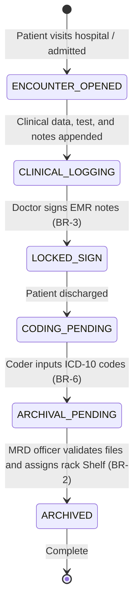

# Form/Module Spec — Medical Records Department (MRD) & EMR

| | |
|---|---|
| **Status** | Draft |
| **Source** | pasted module analysis — *VH/NABH/MRD/01/2026* (2026-07-01) |
| **Existing code?** | **Exists and is highly integrated.** Reuses [`MedicalRecord`](../../backend/src/main/java/com/hms/entity/MedicalRecord.java) (holds symptoms, diagnosis, and clinical notes), [`MrdRecord`](../../backend/src/main/java/com/hms/entity/MrdRecord.java) (holds archival locations for files), and validation loops in [`MrdService`](../../backend/src/main/java/com/hms/service/hospital/MrdService.java). |

> **Read first — EMR is the Patient's Longitudinal Timeline.**
> **(1) Unified EMR Header.** The system already uses [`MedicalRecord`](../../backend/src/main/java/com/hms/entity/MedicalRecord.java) to track symptoms, diagnosis, and treatment notes. All clinical documents (consultations, OT records, discharge notes) must associate back to this central EMR identifier.
> **(2) Existing Archival Checks.** [`MrdRecord`](../../backend/src/main/java/com/hms/entity/MrdRecord.java) tracks folder archiving status (`rack_location`, `status`, `mrd_number`). Ensure that the discharge workflow gates the transition of an EMR file to `ARCHIVED` status until the MRD officer has verified physical files and assigned a shelf location.
> **(3) Medical Coding & Versioning Gaps.** While EMR entries store free-text diagnosis notes, there is no structured ICD-10/11 diagnostic coding or document version tracking. We recommend implementing the `medical_code` table to map standard diagnostic codes and a `medical_document` versioning ledger to record clinical amendments without overwriting historical notes (Rule 1, Rule 4).

---

## 1. Form/Module Overview
- **Department:** Medical Records Department (MRD) (primary); Clinical Departments, Billing, Administration, Quality, Insurance, Legal Cell (secondary)
- **Module:** **Medical Records → Electronic Medical Record → Coding → Archive → Document Management** (enterprise medical records platform)
- **Filled By:** Clinicians (clinical notes); Medical Coders (ICD codes); MRD Officers (shelf locations & file verification)
- **Approved / Signed By:** Attending Doctor (signs clinical notes); MRD Supervisor (closes folder)
- **Stored In:** `medical_records` (database), `mrd_records`, and document storage systems
- **Lifecycle:** initialized upon patient registration; continuously updated during clinical encounters; locked after doctor signature; verified and coded by MRD; archived in permanent storage
- **NABH clause:** ROM — record organization and management; maintenance of a unique longitudinal EMR; standard disease coding (ICD); file retrieval turnaround times; record retention and security.

## 2. Purpose
- **Hospital use:** maintains a single, chronological record of all patient clinical events to drive care consistency and support legal audits.
- **NABH requirement:** structured EMR file tracking, standard ICD disease classification, document signature verification, and secure retention protocols.
- **Legal:** serves as the primary legal evidence of patient care in medical negligence disputes, requiring absolute immutability of signed notes.
- **Clinical:** gives clinicians a clear, unified view of a patient's historical diagnoses, allergies, and surgeries in seconds.
- **Business rationale:** drives insurance claim document packs and supports secondary research data aggregation.

## 3. Trigger
`Encounter created → EMR folder initialized → Clinical notes, lab values, and radiology links appended → Patient discharged → Attending doctor signs note (status LOCKED, BR-3) → MRD receives folder → Medical coder registers ICD codes (BR-6) → Folder archived with rack location (status ARCHIVED)`.

## 4. User Roles
| Actor | Capacity | Existing HMS role | Note |
|---|---|---|---|
| Doctor | drafts and signs clinical notes, reviews medical histories | `DOCTOR` | attending physician |
| Nurse | records nursing charts and daily progress sheets | `NURSE` | ward staff nurse |
| Medical Coder | assigns standard ICD-10/11 codes to EMR files | — | role gap: `MEDICAL_CODER` |
| MRD Officer | verifies file completeness, logs physical rack coordinates | — | role gap: `MRD_OFFICER` |
| Quality Auditor | reviews clinical documentation completion metrics | `HOSPITAL_ADMIN` | quality controller |
| Insurance Officer | pulls signed EMR sets for cashless claim packs | `RECEPTIONIST` / Admin | claims clerk |
| Hospital Admin | manages EMR retention periods and legal requests | `HOSPITAL_ADMIN` | system administrator |

## 5. Fields
Legend — Source: `auto`=fetched from context, `manual`=entered, `sig`=signature capture.

| Field | Type | Max | Mandatory | Editable rule | DB column | Validation | Search | Print | Source |
|---|---|---|---|---|---|---|---|---|---|
| UHID | string | 20 | Y | read-only | (join `patient.custom_id`) | valid patient identity | Y | Y | auto |
| Patient Name | string | 100 | Y | read-only | `patient.name` | — | Y | Y | auto |
| EMR Record ID | string | 50 | Y | read-only | `medical_records.public_id` | UUID key | Y | Y | auto |
| Encounter Type | enum | — | Y | read-only | `medical_records.visit_type` | OPD / IPD / EMERGENCY | Y | Y | auto |
| Attending Doctor | string | 100 | Y | read-only | (join `doctor.name`) | — | Y | Y | auto |
| Diagnostic Note | text | 1000 | Y | draft only | `medical_records.diagnosis` | — | N | Y | manual |
| Treatment Plan | text | 2000 | Y | draft only | `medical_records.treatment_notes` | — | N | Y | manual |
| ICD-10 Code | string | 10 | Y | coder only | `medical_code.icd_code` | valid ICD pattern | Y | Y | manual |
| Procedure Code | string | 10 | N | coder only | `medical_code.procedure_code` | valid CPT code | Y | Y | manual |
| MRD Number | string | 30 | Y | read-only | `mrd_records.mrd_number` | unique sequence | Y | Y | auto |
| Rack Location | string | 50 | Y | MRD only | `mrd_records.rack_location` | e.g. Shelf A, Row 3 | Y | N | manual |
| Archival Status | enum | — | Y | MRD only | `mrd_records.status` | PENDING / CODED / ARCHIVED | Y | Y | auto |
| Doctor Signature | sig | — | Y | final only | `medical_document.signed_by` | verified credential block | N | Y | sig |
| Archiving Staff | string | 100 | Y | read-only | (join archivedById) | — | Y | N | auto |

## 6. Business Rules
- **BR-1** **Longitudinal timeline:** The EMR must display a single, chronological timeline listing all encounters, procedures, and tests under the patient's UHID. Splitting history into separate visit folders is blocked (Rule 5).
- **BR-2** **No Hard Deletion:** No medical record or document reference can be hard-deleted from the database. Amendments must write a versioned entry in `medical_document` leaving the historical record intact (Rule 1, Rule 4).
- **BR-3** **Immutability on Signature:** Clinical notes and treatment plans are locked and become read-only immediately after the doctor signs off (Rule 3).
- **BR-4** **Audit log enforcement:** Any access, viewing, or editing of an EMR file must be logged under `AuditLog` recording user ID, action, and patient ID (Rule 2).
- **BR-5** **Retention Settings:** Archival and retention configurations must allow custom rules (e.g. keep pediatric files for 20 years, adults for 10 years) before flagging destruction.
- **BR-6** **Discharge completion gate:** The discharge summary cannot be signed off in EMR until the attending clinician has completed all mandatory clinical fields (Rule 6).
- **BR-7** **Tenant Isolation:** Every EMR entry, document metadata sheet, and rack reference must carry `hospital_id` to enforce multi-tenant isolation.

## 7. Database Design
Evolves existing schemas to enforce version control, medical coding, and longitudinal logging.

### Table `medical_records` (existing, tenant-owned):
Holds the patient visit diagnosis summary.

| Column | Type | Notes |
|---|---|---|
| id | BIGINT PK | |
| public_id | VARCHAR(50) unique | UUID identifier |
| hospital_id | BIGINT NOT NULL, FK | Tenant reference key, indexed |
| patient_id | BIGINT NOT NULL, FK | |
| doctor_id | BIGINT NOT NULL, FK | |
| appointment_id | BIGINT, FK | Nullable |
| ipd_admission_id | BIGINT, FK | Nullable |
| visit_type | VARCHAR(20) NOT NULL | OPD / IPD / EMERGENCY |
| symptoms | VARCHAR(1000) | |
| diagnosis | VARCHAR(1000) | |
| treatment_notes | VARCHAR(2000) | |
| follow_up_date | DATE | |
| created_at | TIMESTAMP | |

### Table `patient_timeline` (new, tenant-owned):
Consolidates lifetime events chronologically.

| Column | Type | Notes |
|---|---|---|
| id | BIGINT PK | |
| hospital_id | BIGINT NOT NULL, FK | |
| patient_id | BIGINT NOT NULL, FK | |
| event_type | VARCHAR(30) NOT NULL | CONSULT / LAB / RAD / SURGERY / DISCHARGE |
| event_reference_id | BIGINT NOT NULL | ID of target entity |
| department | VARCHAR(50) | |
| event_time | TIMESTAMP NOT NULL | |

### Table `medical_document` (new, tenant-owned):
Manages clinical document versions and signatures.

| Column | Type | Notes |
|---|---|---|
| id | BIGINT PK | |
| patient_id | BIGINT NOT NULL, FK | |
| document_type | VARCHAR(50) NOT NULL | PRESCRIPTION / CONSENT / DISCHARGE_SUMMARY |
| version | INTEGER NOT NULL | Increments on edit |
| file_reference | VARCHAR(500) NOT NULL | Path to PDF / file |
| signed_by | VARCHAR(100) | Doctor username |
| signed_at | TIMESTAMP | |
| is_active | BOOLEAN NOT NULL | False if superseded |

### Table `medical_code` (new, tenant-owned):
Maps disease registry classifications.

| Column | Type | Notes |
|---|---|---|
| id | BIGINT PK | |
| record_id | BIGINT NOT NULL, FK | Link to `medical_records` |
| icd_code | VARCHAR(10) NOT NULL | ICD-10 diagnostic code |
| procedure_code | VARCHAR(10) | CPT code (if procedure run) |
| coded_by_email | VARCHAR(100) NOT NULL | |
| coded_at | TIMESTAMP NOT NULL | |

- **Indexes:** `(hospital_id, patient_id, event_time)` for EMR timeline generation. `(hospital_id, icd_code)` for disease registry statistics.

## 8. APIs
Every `{id}` endpoint checks `hospital_id` to confirm patient ownership.

- **`GET /hospital/emr/timeline/{patientId}`**
  - **Roles:** `DOCTOR`, `NURSE`, `HOSPITAL_ADMIN`
  - **Response:** Array of chronological `patient_timeline` events.
  - **Purpose:** Feeds the patient's longitudinal EMR timeline view.

- **`POST /hospital/emr/document/save`**
  - **Roles:** `DOCTOR`, `NURSE`, `HOSPITAL_ADMIN`
  - **Request:** `{ "patientId": 1, "documentType": "DISCHARGE_SUMMARY", "fileReference": "/docs/summary.pdf" }`
  - **Response:** Created document details JSON.
  - **Purpose:** Adds a new document reference to the DMS (Rule 2).

- **`POST /hospital/emr/code`**
  - **Roles:** `MEDICAL_CODER`, `HOSPITAL_ADMIN`
  - **Request:** `{ "recordId": 12, "icdCode": "E11.9" }`
  - **Response:** Coding entry confirmation JSON.
  - **Purpose:** Saves standard disease codes to EMR (BR-6).

- **`POST /hospital/emr/archive/{admissionId}`**
  - **Roles:** `MRD_OFFICER`, `HOSPITAL_ADMIN`
  - **Request:** `{ "mrdNumber": "MRD-98765", "rackLocation": "Shelf C-12" }`
  - **Response:** Updated `MrdRecord` status `ARCHIVED`.
  - **Purpose:** Finalizes folder archiving at MRD store.

- **`GET /hospital/emr/search`**
  - **Roles:** `HOSPITAL_ADMIN`
  - **Params:** `?icdCode=E11.9`
  - **Response:** List of matching patient records (used for clinical audit research).

## 9. UI Design
- **Longitudinal EMR Timeline View (PC Optimized):**
  - **Timeline Canvas:** Center column displaying a vertical scrolling line. Nodes on the line represent chronological events (e.g. 2025: X-Ray node, consultation node, admission node). Hovering over a node displays summary details.
  - **Quick Search Filter:** Sidebar checklist allowing users to filter by category (e.g. show only Lab results, show only OT records).
  - **Clinical summary block:** Sticky card summarizing Patient profile, allergies, current active diagnoses, and implants.
- **MRD Archival Dashboard:**
  - **Archiving work queue:** Lists discharged patients waiting for file verification and coding.
  - **Rack Mapping Console:** Grid view representing physical shelves to assign folder storage.

## 10. Workflow

## 11. Validation
- ICD codes must match patterns in the Standard ICD master dictionary.
- Shelf coordinate coordinates must fit hospital storage grids.
- Clinical note signature endpoint will reject execution if the document has already been signed.

## 12. Permissions
| Role | Write Notes | Sign Notes | Assign ICD Codes | Assign Shelf Location | View EMR History |
|---|---|---|---|---|---|
| Doctor | ✅ | ✅ | ❌ | ❌ | ✅ |
| Nurse | ✅ | ✅ (Nursing) | ❌ | ❌ | ✅ |
| Medical Coder | ❌ | ❌ | ✅ | ❌ | ✅ |
| MRD Officer | ❌ | ❌ | ❌ | ✅ | ✅ (Full) |
| Insurance Officer | ❌ | ❌ | ❌ | ❌ | ✅ (Only signed sets) |
| Hospital Admin | ❌ | ❌ | ❌ | ❌ | Full View |

## 13. Print Rules
- Printed via HTML-to-PDF template `templates/medical-record-complete.html`.
- **Layout:** Portrait layout, cover sheet containing patient identifiers and diagnosis indexes, followed by chronological sections (Consultations, Labs, OT records, discharge sheet).
- **Security:** Watermarked "LOCKED - ARCHIVED IN MRD" with digital signature stamps and a verification QR code.

## 14. Audit Logs
Recorded under `AuditLogService` with `entity_type="MEDICAL_RECORD"`:
- EMR folder initialized.
- Clinical note signed (user, timestamp).
- Document version amended (old document ID, new document ID, reason).
- ICD code registered (code, coder email).
- Physical record coordinates assigned (shelf location, MRD officer ID).
- Historical EMR file retrieved/viewed (user, patient ID).

## 15. Digital Improvements
- **Chronological Timeline View:** Replaces disorganized folder clicking with a unified scrolling patient journey.
- **Structured Coding Audits:** Enables instant query generation for specific diseases (e.g. retrieve all patients with Diabetic Ketoacidosis).
- **Immutability Assurance:** Guarantees forensic safety by blocking edits to signed medical files.

## 16. Missing / Intelligent Features
- **Auto-ICD Recommender:** Reads findings/notes texts and suggests likely ICD-10 codes to coders.
- **Clinical Summary Generator:** Aggregates a long, complex IPD stay into a concise clinical brief for doctors using NLP.
- **Incomplete Folder Alert:** Flags missing documents (like surgical consents) to MRD before archiving is finalized.

---

## Module & workflow placement
- **Owning module:** Medical Records Department (MRD) → Electronic Medical Record (EMR).
- **Creates / Updates / Views / Prints / Archives:**
  - **Creates:** `patient_timeline`, `medical_document`, `medical_code` records.
  - **Updates:** Updates `MrdRecord` status; locks EMR notes.
  - **Views:** Patient EMR history.
  - **Prints:** Complete Medical Records and EMR sheets.
  - **Archives:** MRD.
- **Feeds into:** EMR Patient Timeline (visual lookup) · Insurance Module (claim documentation pack) · Research desk audits.
- **Fed by:** Every clinical entry module (OPD, IPD, LIS, RIS, Pharmacy, OT).
- **New modules this form implies:** Document Management System (DMS) · ICD Coding Engine.
