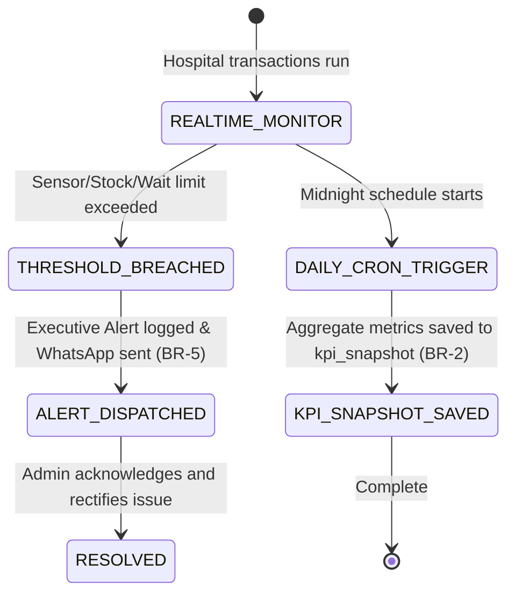

# Form/Module Spec — Hospital Administration, MIS & Executive Dashboard

| | |
|---|---|
| **Status** | Draft |
| **Source** | pasted module analysis — *VH/NABH/MIS/01/2026* (2026-07-01) |
| **Existing code?** | **Dashboard tables are new.** Operates as an aggregation layer querying transactional tables including [`Billing`](../../backend/src/main/java/com/hms/entity/Billing.java) (revenue), [`OtBooking`](../../backend/src/main/java/com/hms/entity/OtBooking.java) (utilization), [`LabOrder`](../../backend/src/main/java/com/hms/entity/LabOrder.java) (TAT), [`RadiologyOrder`](../../backend/src/main/java/com/hms/entity/RadiologyOrder.java) (TAT), and [`WhatsAppConfig`](../../backend/src/main/java/com/hms/entity/WhatsAppConfig.java) (alert routing). |

> **Read first — The Hospital Intelligence Layer.**
> **(1) Operational Database Aggregation.** This module never duplicates or owns clinical or billing records. It acts as an analytics layer that reads and compiles aggregates from active tables. For example, revenue calculations are queried from `Billing` and `BillingPayment`, and room utilization metrics are fetched from `IpdBedHistory` and `Bed`.
> **(2) Role-Restricted Widgets.** The database structure `dashboard_widget` maps its display rules to existing tenant roles (`SUPER_ADMIN`, `HOSPITAL_ADMIN`, `DOCTOR`, `NURSE`). This enforces strict least-privilege access, ensuring clinicians see clinical stats and billing managers see financial totals (Rule 1, Rule 5).
> **(3) Integration with WhatsApp Notification Engine.** High-priority alerts logged under `executive_alert` (e.g. ICU bed census > 90%, critical drug low stock) should map to the existing [`WhatsAppConfig`](../../backend/src/main/java/com/hms/entity/WhatsAppConfig.java) setup to dispatch text warnings directly to administrators.

---

## 1. Form/Module Overview
- **Department:** Hospital Administration (primary); All clinical and financial departments (secondary)
- **Module:** **Administration → Operations Dashboard → Finance Dashboard → Clinical Dashboard → Analytics → Reports** (enterprise business intelligence platform)
- **Filled By:** System (automated daily aggregates); Admin (widget layouts & configurations)
- **Approved / Verified By:** CEO / Medical Director (reviews and configures threshold alerts)
- **Stored In:** `dashboard_widget` (database), `kpi_snapshot` (historical registry), and `executive_alert`
- **Lifecycle:** runs continuously in the background; generates nightly KPI snapshots; sends real-time alerts; provides custom data exports for audits
- **NABH clause:** MIS — management information system; metrics tracking daily census, surgical mortality, wait times, lab turnaround times, and incident reporting.

## 2. Purpose
- **Hospital use:** serves as the central command console representing clinical metrics, financial cash flows, and resource bottlenecks on a single display.
- **NABH requirement:** provides the Medical Director and Quality team with documented statistics on medication errors, post-op infection rates, patient falls, and corrective action logs (CAPA).
- **Legal:** logs administrative actions and critical alerts to defend hospital practices during operational reviews.
- **Clinical:** monitors waiting lines, ICU bed censuses, and laboratory/radiology turnaround delays to optimize patient throughput.
- **Business rationale:** prevents financial slippage, tracks billing collection efficiencies, and forecasts future stock levels.

## 3. Trigger
`Transactional database events occur → Nightly CRON jobs aggregate daily stats → KPI snapshots written → Real-time threshold breaches occur → WhatsApp/Websocket alerts triggered (this form) → Executives review live graphs and execute data-driven directives`.

## 4. User Roles
| Actor | Capacity | Existing HMS role | Note |
|---|---|---|---|
| Chairman / CEO | reviews executive summaries, cash flows, and patient metrics | `SUPER_ADMIN` | strategic director |
| Medical Director | reviews clinical quality, SSI rates, and mortality averages | `DOCTOR` / Admin | clinical director |
| Hospital Administrator| manages daily staff attendance, bed counts, and turnaround times | `HOSPITAL_ADMIN` | operational manager |
| Finance Head | audits daily collections, pending insurance claims, and outstanding AR | `SUPER_ADMIN` / Finance | financial controller |
| Quality Auditor | monitors incident reports, falls, and NABH checklist completion | `HOSPITAL_ADMIN` | quality assurance manager |
| Department Head | reviews department specific patient queues and machine workloads | `DOCTOR` / Tech | specialized coordinator |

## 5. Fields
Legend — Source: `auto`=fetched from context, `manual`=entered, `sig`=signature capture.

| Field | Type | Max | Mandatory | Editable rule | DB column | Validation | Search | Print | Source |
|---|---|---|---|---|---|---|---|---|---|
| Dashboard Name | string | 50 | Y | admin | `dashboard_widget.dashboard_name` | must match role groups | Y | N | manual |
| Widget ID | string | 50 | Y | admin | `dashboard_widget.widget_name` | unique widget identifier | N | N | manual |
| Timeframe | enum | — | Y | cashier | `dashboard_widget.configuration` | TODAY / WEEKLY / MONTHLY / YEARLY | N | N | manual |
| Bed Occupancy Rate | decimal | 5,2 | Y | read-only | (join `Bed` status) | calculated percentage | N | Y | auto |
| Lab TAT (Minutes) | int | — | Y | read-only | (join `lab_orders` times) | calculated averages | N | Y | auto |
| Radiology TAT (Mins) | int | — | Y | read-only | (join `radiology_orders`) | calculated averages | N | Y | auto |
| OT Utilization Rate | decimal | 5,2 | Y | read-only | (join `ot_register` times) | calculated percentage | N | Y | auto |
| Total Revenue | decimal | 12,2 | Y | read-only | (join `billing` totals) | calculated sum | N | Y | auto |
| Outstanding AR | decimal | 12,2 | Y | read-only | (join `billing` pending) | calculated sum | N | Y | auto |
| Stock Expiry Alerts | int | — | Y | read-only | (join `medicine_batch`) | count of near-expiry batches | N | Y | auto |
| Incident Severity | enum | — | Y | quality | `executive_alert.severity` | INFO / WARNING / CRITICAL | Y | Y | auto/manual |
| Alert Message | string | 250 | Y | quality | `executive_alert.description` | non-empty description | Y | Y | auto/manual |
| Attendance Rate | decimal | 5,2 | Y | read-only | (join HR tables) | calculated percentage | N | Y | auto |

## 6. Business Rules
- **BR-1** **Role-Based Widgets Mapping:** Dashboards are customized and segmented by user role permissions. CEO profiles can view financial cash flows, whereas ward nurses are restricted to bed queues and clinical vitals (Rule 1, Rule 5).
- **BR-2** **Consistent KPI Dictionary:** KPI snapshot algorithms (e.g. Length of Stay, Bed Occupancy) must use standard formulas consistent across all tenant hospitals (Rule 2).
- **BR-3** **Timeframe Filtering:** All widgets must support dynamic date filters: Today, Yesterday, Weekly, Monthly, Yearly, and Custom Range (Rule 3).
- **BR-4** **Custom Refresh Rates:** Widget data caching and refresh intervals must be custom-configured based on the specific KPI (e.g. ICU bed maps refresh every 5 mins, financial sales once daily) (Rule 4).
- **BR-5** **Critical Threshold Escalate:** When specific critical thresholds are breached (e.g. ICU occupancy > 95%, critical drug stock < 10 units), the system must immediately trigger an entry in `executive_alert` and dispatch a notification.
- **BR-6** **Immutable KPI Snapshots:** Historical KPI logs (`kpi_snapshot`) are permanent ledger records and cannot be edited or deleted.
- **BR-7** **Tenant Isolation:** Every dashboard configuration and KPI snapshot record must check `hospital_id` to enforce multi-tenant isolation.

## 7. Database Design
Introduces new analytics, configuration, and notification tracking tables.

### Table `dashboard_widget` (new, tenant-owned):
Saves configuration layouts per user role.

| Column | Type | Notes |
|---|---|---|
| id | BIGINT PK | |
| hospital_id | BIGINT NOT NULL, FK | Tenant reference key, indexed |
| dashboard_name | VARCHAR(50) NOT NULL | e.g. CEO_DASHBOARD, CLINICAL_DASHBOARD |
| widget_name | VARCHAR(50) NOT NULL | e.g. REVENUE_WIDGET, BED_MAP_WIDGET |
| configuration | TEXT | JSON string of layout coordinates and timeframe filters |
| created_at | TIMESTAMP | |

### Table `kpi_snapshot` (new, tenant-owned):
Maintains historical records of daily metrics for trend analysis.

| Column | Type | Notes |
|---|---|---|
| id | BIGINT PK | |
| hospital_id | BIGINT NOT NULL, FK | |
| kpi_name | VARCHAR(100) NOT NULL | e.g. bed_occupancy, average_los, net_revenue |
| value | DECIMAL(15,2) NOT NULL | Metric value |
| period | VARCHAR(20) NOT NULL | DAILY / WEEKLY / MONTHLY |
| captured_at | TIMESTAMP NOT NULL | Timestamp of aggregation CRON execution |

### Table `executive_alert` (new, tenant-owned):
Tracks real-time system alerts and resolution statuses.

| Column | Type | Notes |
|---|---|---|
| id | BIGINT PK | |
| hospital_id | BIGINT NOT NULL, FK | |
| severity | VARCHAR(20) NOT NULL | INFO / WARNING / CRITICAL |
| title | VARCHAR(100) NOT NULL | e.g. Anesthesia Gas Pressure Low |
| description | VARCHAR(250) NOT NULL | Detailed description of warning |
| status | VARCHAR(20) NOT NULL | ACTIVE / ACKNOWLEDGED / RESOLVED |
| created_at | TIMESTAMP NOT NULL | |
| resolved_at | TIMESTAMP | |

- **Indexes:** `(hospital_id, kpi_name, captured_at)` for historical trend charts. `(hospital_id, status)` for active alerts.

## 8. APIs
Every `{id}` endpoint checks `hospital_id` to confirm patient ownership.

- **`GET /hospital/dashboard/executive`**
  - **Roles:** `SUPER_ADMIN`, `HOSPITAL_ADMIN`
  - **Params:** `?timeframe=WEEKLY`
  - **Response:** Consolidated financial collections, bed census, and active alert counts.
  - **Purpose:** Feeds the main executive dashboard screen.

- **`GET /hospital/dashboard/clinical`**
  - **Roles:** `DOCTOR`, `NURSE`, `HOSPITAL_ADMIN`
  - **Response:** Standard averages of Length of Stay (LOS), diagnostic TATs, and ward occupancy metrics.
  - **Purpose:** Feeds the Medical Director's clinical review screen.

- **`GET /hospital/dashboard/kpi/trends`**
  - **Roles:** `SUPER_ADMIN`, `HOSPITAL_ADMIN`
  - **Params:** `?kpiName=net_revenue&startDate=2026-06-01`
  - **Response:** Chronological array of `kpi_snapshot` values.
  - **Purpose:** Plots comparative performance line charts.

- **`POST /hospital/dashboard/alert/acknowledge`**
  - **Roles:** `HOSPITAL_ADMIN`
  - **Request:** `{ "alertId": 45, "status": "ACKNOWLEDGED", "remarks": "Biomedical engineer dispatched" }`
  - **Response:** Updated alert JSON.
  - **Purpose:** Logs supervisor acknowledgment of warnings.

## 9. UI Design
- **Operations Command Center Dashboard (Desktop Optimized):**
  - **Grid Layout Console:** Modular grid displaying dashboard widgets. Widgets can be drag-dropped by users to customize coordinates.
  - **Metric Counter Cards:** Top row of visual KPI banners (Bed occupancy, Revenue, TATs, pending TPA claims).
  - **Visual Alert Sidebar:** Right-hand panel displaying active `executive_alert` cards (red warning badges for CRITICAL level, flashing icons).
  - **Trend Analysis Graphs:** Middle section showing comparative multi-colored line charts (e.g. this month's revenue vs last month's, department-wise collection breakdowns).

## 10. Workflow

## 11. Validation
- Value inputs for KPI configurations must be valid numeric thresholds.
- Acknowledgments require user comments explaining resolution actions.
- Caching configurations must verify that refresh rates are positive numbers.

## 12. Permissions
| Role | View Executive BI | View Clinical BI | Acknowledge Alerts | Customize Layouts | View Raw Audits |
|---|---|---|---|---|---|
| CEO / Finance | ✅ | ✅ | ✅ | ✅ | ✅ |
| Medical Director | ❌ | ✅ | ✅ | ✅ | ❌ |
| Hospital Admin | ✅ | ✅ | ✅ | ✅ | ✅ (Full) |
| Quality Auditor | ❌ | ✅ | ✅ | ❌ | ✅ |
| Clinician / Nurse | ❌ | ❌ | ❌ | ❌ | ❌ |
| MRD Officer | ❌ | ❌ | ❌ | ❌ | ❌ |

## 13. Print Rules
- Supports printing the **Daily Executive Hospital Census Summary**:
  - Template: `templates/executive-brief.html`.
  - Layout: Portrait document summarizing daily volumes (OPD count, admissions, discharges, OT cases, net cash collection, active alerts).
  - Visuals: Clean layout with minimal text, optimized for presentation briefings.

## 14. Audit Logs
Recorded under `AuditLogService` with `entity_type="ADMIN_DASHBOARD"`:
- Dashboard configurations modified (widget added/removed).
- Critical operational alert acknowledged (alert ID, user comment).
- Daily KPI compilation completed successfully.
- Retention configuration limits modified.

## 15. Digital Improvements
- **Role-tailored dashboards:** Eliminates dashboard clutter by displaying only relevant screens per role.
- **Predictive bed planning:** Forecasts bed shortages, enabling managers to dynamically open backup wards.
- **Unified Command Sidebars:** Aggregates warnings from all modules, saving leaders from inspecting individual department logs.

## 16. Missing / Intelligent Features
- **Executive Daily Brief Generator:** Pre-compiles hospital performance summaries into a single email brief every morning.
- **Denial Analytics Engine:** Groups outstanding receivables by insurance carrier to highlight high-rejection departments.
- **Surgical Cancellation Root Causes:** Compiles cancellation indicators, identifying material or staffing bottlenecks.

---

## Module & workflow placement
- **Owning module:** Hospital Administration → Executive Dashboard (BI Suite).
- **Creates / Updates / Views / Prints / Archives:**
  - **Creates:** `kpi_snapshot`, `dashboard_widget`, `executive_alert`.
  - **Updates:** Dispatches WhatsApp and SMS logs.
  - **Views:** Aggregated collections across all modules.
  - **Prints:** Daily Operational Briefings and Audit spreadsheets.
  - **Archives:** Quality registers.
- **Feeds into:** Executive dashboards (visual charts) · WhatsApp alerts (external notifications).
- **Fed by:** All operational system databases (Billing, EMR, LIS, RIS, OT, Pharmacy).
- **New modules this form implies:** Hospital Business Intelligence (BI) Engine · Automated Analytics Cron jobs.
