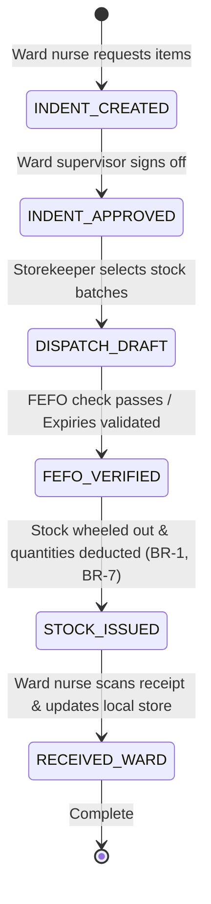

# Form/Module Spec — Inventory & Store Management System (ISMS)

| | |
|---|---|
| **Status** | Draft |
| **Source** | pasted module analysis — *VH/NABH/ISMS/01/2026* (2026-07-01) |
| **Existing code?** | **Exists and is highly integrated.** Reuses [`InventoryItem`](../../backend/src/main/java/com/hms/entity/InventoryItem.java) (represents the catalog of consumables) and [`HospitalInventory`](../../backend/src/main/java/com/hms/entity/HospitalInventory.java) (tracks physical stock quantities, expiries, and reorder levels). |

> **Read first — centralize the Hospital Supply Chain.**
> **(1) Catalog and Stock Separation.** The HMS already distinguishes between catalog descriptors ([`InventoryItem`](../../backend/src/main/java/com/hms/entity/InventoryItem.java)) and physical quantities ([`HospitalInventory`](../../backend/src/main/java/com/hms/entity/HospitalInventory.java)). Keep this clean separation intact; do not store physical batch stock under the catalog definition.
> **(2) FEFO Dispatch Rules.** Fulfilling surgical or nursing indents must query the `expiryDate` inside `HospitalInventory` and enforce First-Expiry, First-Out (FEFO) logic to prevent inventory write-offs (Rule 3, Rule 4).
> **(3) Indents & Movement Transactions Gaps.** While stock quantities exist, there are no structures for department indents or stock transfers. We recommend introducing the new `department_indent` (for wards to request supplies) and `stock_transaction` (immutable logistics log) tables to satisfy full audit traceability (Rule 2).

---

## 1. Form/Module Overview
- **Department:** Central Store (primary); Pharmacy, Laboratory, OT, ICU, CSSD, Housekeeping, Biomedical, Purchase, Finance (secondary)
- **Module:** **Inventory → Item Master → Stock → Indents → Issue → Transfers → Audits** (integrated hospital inventory and supply chain platform)
- **Filled By:** Storekeeper (GRN receipt, stock issues); Ward/OT Nurse (indents); Store Manager (audits)
- **Approved / Verified By:** Department Head (indents); Store Manager (purchase orders & audits)
- **Stored In:** `hospital_inventory` (database), `inventory_items`, and inventory transactions
- **Lifecycle:** catalog item registered; purchase order generated; stock received via GRN; requested via department indents; issued to wards/clinics; physically audited; expired items disposed
- **NABH clause:** COP/MIS — control and management of hospital supplies; safe storage of items; monitoring of expiry dates; physical verification of stocks; maintenance of supply chain registers.

## 2. Purpose
- **Hospital use:** tracks non-medicine consumables (sutures, reagents, gas cylinders, linens) to prevent clinical stock-outs and control operational overhead.
- **NABH requirement:** structured registers of supply audits, shelf-life monitoring of sterile items, and documented procedures for handling critical shortages.
- **Legal:** provides trace evidence for hazardous supply handlings (gases, chemicals) and records physical audits for accounting safety.
- **Clinical:** ensures that life-saving surgical supplies are active and available in theatre rooms before patient incisions start.
- **Business rationale:** prevents pilferage, balances inventory carrying costs, and alerts purchasing agents when stock falls below reorder points.

## 3. Trigger
`Department runs low on supplies → Nurse raises department indent → Store reviewer approves → Storekeeper issues stock via FEFO → Department acknowledges receipt (stock updated, BR-7) → Periodic physical counts log adjustments if differences found`.

## 4. User Roles
| Actor | Capacity | Existing HMS role | Note |
|---|---|---|---|
| Storekeeper | receives supplier shipments, generates GRNs, dispatches stock | — | role gap: `STOREKEEPER` |
| Store Manager | monitors store levels, approves indents, executes audits | `HOSPITAL_ADMIN` | store controller |
| Department Head | reviews and signs off on ward indents and returns | `DOCTOR` / Nurse | clinical supervisor |
| Purchase Officer | replenishes central stocks, tracks vendor invoices | `HOSPITAL_ADMIN` | procurement clerk |
| Finance Manager | audits inventory valuations and reviews stock write-offs | `SUPER_ADMIN` / Finance | controller |
| Hospital Admin | views supply analytics and machine utilization dashboards | `HOSPITAL_ADMIN` | administration view |

## 5. Fields
Legend — Source: `auto`=fetched from context, `manual`=entered, `sig`=signature capture.

| Field | Type | Max | Mandatory | Editable rule | DB column | Validation | Search | Print | Source |
|---|---|---|---|---|---|---|---|---|---|
| Item Code | string | 20 | Y | read-only | `inventory_items.item_code` | unique code pattern | Y | Y | auto |
| Item Name | string | 150 | Y | read-only | `inventory_items.name` | must match catalog | Y | Y | auto |
| Item Category | string | 50 | Y | read-only | `inventory_items.type` | Consumable / Surgical / Reagent, etc.| Y | Y | auto |
| Unit of Measure | string | 20 | Y | read-only | `inventory_items.uom` | e.g. Pack, Box, Piece | N | Y | auto |
| Batch Number | string | 30 | Y | draft only | `hospital_inventory.batch_number` | unique sequence | Y | Y | manual/auto |
| Expiry Date | date | — | Y | read-only | `hospital_inventory.expiry_date` | not expired (BR-4) | N | Y | auto/manual |
| Available Qty | decimal | 10,2 | Y | read-only | `hospital_inventory.stock_quantity` | non-negative (BR-1) | N | Y | auto |
| Indented Quantity | decimal | 10,2 | Y | draft only | `department_indent.requested_qty` | > 0 | N | Y | manual |
| Issued Quantity | decimal | 10,2 | Y | store only | `stock_transaction.quantity` | <= available stock | N | Y | manual |
| Unit Price | decimal | 10,2 | Y | read-only | `hospital_inventory.unit_price` | > 0.00 | N | Y | auto |
| From Store | string | 30 | Y | read-only | `stock_transaction.from_store` | main / pharmacy / OT / lab | Y | N | auto |
| To Store / Dept | string | 50 | Y | read-only | `stock_transaction.to_store` | target ward / clinic | Y | Y | auto |
| Requester Staff ID | string | 20 | Y | read-only | (join `department_indent.requested_by`)| valid user account | Y | Y | auto |
| Approver Signature | sig | — | Y | final only | `department_indent.approved_by_sig` | signature blob | N | Y | sig |

## 6. Business Rules
- **BR-1** **No Negative Stock:** The system must block any stock issue or transfer transaction that results in a negative stock quantity (`stock_quantity >= 0`) (Rule 1).
- **BR-2** **Immutable Transaction Logs:** Every physical inventory movement must write a permanent, immutable record in `stock_transaction`. Deletion or modification of logs is blocked (Rule 2).
- **BR-3** **FEFO Dispatching:** Stock issue algorithms must automatically select and suggest batches with the nearest expiry date (First-Expiry, First-Out) unless a manual supervisor override is signed off (Rule 3).
- **BR-4** **Expiry Gate:** Expired consumables (e.g. sutures past sterilization date) are automatically quarantined. Dispensing or issuing expired batches is blocked (Rule 4).
- **BR-5** **Adjustment Authorization:** Physical audit differences must write adjustment entries in `stock_transaction` and require explicit store manager authorization (Rule 5, Rule 6).
- **BR-6** **Reorder Alerts:** When the total stock of a catalog item falls below the `reorder_level` specified in `InventoryItem`, the system must automatically trigger a reorder notification to the Purchase module.
- **BR-7** **Tenant Isolation:** Every item, batch, indent, transfer, and transaction log must check `hospital_id` to enforce multi-tenant isolation.

## 7. Database Design
Evolves existing schemas to enforce multi-store indents, stock movements, and ledger updates.

### Table `inventory_items` (existing, tenant-owned):
The master catalog of non-medicine items.

| Column | Type | Notes |
|---|---|---|
| id | BIGINT PK | |
| hospital_id | BIGINT NOT NULL | Tenant reference key, indexed |
| item_code | VARCHAR(20) NOT NULL | Unique catalog code |
| name | VARCHAR(150) NOT NULL | Item name |
| type | VARCHAR(50) NOT NULL | Consumable / Surgical / Reagent / Gloves, etc. |
| manufacturer | VARCHAR(100) | |
| uom | VARCHAR(20) NOT NULL | Unit of measure |
| min_stock_level | INTEGER | |
| reorder_level | INTEGER | |
| linked_fee_id | BIGINT | Auto-billing link reference |

### Table `hospital_inventory` (existing, tenant-owned):
Represents active batch stock levels per store room.

| Column | Type | Notes |
|---|---|---|
| id | BIGINT PK | |
| hospital_id | BIGINT NOT NULL | |
| inventory_item_id | BIGINT NOT NULL, FK | Link to catalog item |
| batch_number | VARCHAR(30) | Nullable |
| stock_quantity | INTEGER NOT NULL | Active stock count |
| unit_price | DOUBLE | Unit purchase rate |
| expiry_date | DATE | Nullable |
| store_name | VARCHAR(50) NOT NULL | main_store / ot_store / lab_store, etc. |
| status | VARCHAR(20) NOT NULL | ACTIVE / EXPIRED / QUARANTINED |
| created_at | TIMESTAMP | |

### Table `department_indent` (new, tenant-owned):
Tracks ward requests for supplies.

| Column | Type | Notes |
|---|---|---|
| id | BIGINT PK | |
| hospital_id | BIGINT NOT NULL, FK | |
| from_department | VARCHAR(50) NOT NULL | Requesting ward/unit |
| inventory_item_id | BIGINT NOT NULL, FK | |
| requested_qty | DECIMAL(10,2) NOT NULL | |
| status | VARCHAR(20) NOT NULL | DRAFT / PENDING / APPROVED / FILLED |
| requested_by | BIGINT, FK | Staff user ID |
| approved_by | BIGINT, FK | Supervisor ID |
| approved_by_sig | TEXT | Signature blob |
| created_at | TIMESTAMP | |

### Table `stock_transaction` (new, tenant-owned):
The master logistics ledger.

| Column | Type | Notes |
|---|---|---|
| id | BIGINT PK | |
| hospital_id | BIGINT NOT NULL, FK | |
| inventory_item_id | BIGINT NOT NULL, FK | |
| batch_id | BIGINT, FK | Reference to `hospital_inventory` |
| transaction_type | VARCHAR(30) NOT NULL | GRN / ISSUE / TRANSFER / RETURN / ADJUSTMENT / WASTE |
| quantity | DECIMAL(10,2) NOT NULL | |
| from_store | VARCHAR(50) | Source store room |
| to_store | VARCHAR(50) | Target store room / department |
| performed_by | VARCHAR(100) NOT NULL | User email |
| transaction_time | TIMESTAMP NOT NULL | |

- **Indexes:** `(hospital_id, inventory_item_id, store_name)` for local stock checks. `(hospital_id, transaction_time)` for audit ledger reviews.

## 8. APIs
Every `{id}` endpoint checks `hospital_id` to confirm patient ownership.

- **`POST /hospital/inventory/indent`**
  - **Roles:** `NURSE`, `LAB_TECHNICIAN`, `HOSPITAL_ADMIN`
  - **Request:** `{ "fromDepartment": "ICU", "inventoryItemId": 5, "requestedQty": 50 }`
  - **Response:** Created `department_indent` JSON with status `PENDING`.
  - **Purpose:** Ward requests central stock.

- **`POST /hospital/inventory/issue`**
  - **Roles:** `STOREKEEPER`, `HOSPITAL_ADMIN`
  - **Request:** `{ "indentId": 12, "issuedQty": 50, "batchId": 4 }`
  - **Response:** Success confirmation (updates stock and records `stock_transaction`).
  - **Purpose:** Storekeeper dispatches stock and updates levels (BR-1, BR-7).

- **`POST /hospital/inventory/transfer`**
  - **Roles:** `STORE_MANAGER`, `HOSPITAL_ADMIN`
  - **Request:** `{ "itemId": 3, "quantity": 100, "fromStore": "main_store", "toStore": "pharmacy_store" }`
  - **Response:** Created transaction details.
  - **Purpose:** Transfers stock between warehouse rooms.

- **`POST /hospital/inventory/audit`**
  - **Roles:** `STORE_MANAGER`, `HOSPITAL_ADMIN`
  - **Request:** `{ "batchId": 4, "physicalQty": 18.0, "reason": "Physical count audit check" }`
  - **Response:** Adjustment transaction status.
  - **Purpose:** Records physical-count audits (BR-5).

## 9. UI Design
- **Store Fulfiller Console (Desktop Optimized):**
  - **Active Indent Queue:** Left-hand column showing pending ward indents (colored by age and priority).
  - **Stock Dispatch Board:** Center screen displaying the selected indent. Displays available batches in the warehouse, auto-highlighting the FEFO batch card.
  - **Barcode Scanner Port:** Scan-input bar. Scanning a consumable barcode checks off matching batch details.
  - **Audit Board Layout:** Tab listing stock valuation metrics and reorder warnings.

## 10. Workflow

## 11. Validation
- Issued quantities cannot exceed available batch counts.
- Expiry date verification: `expiry_date` must be greater than current date.
- Indent approvals require valid supervisor signatures.

## 12. Permissions
| Role | Raise Indent | Approve Indent | Issue Stock | Record GRN | Execute Audit |
|---|---|---|---|---|---|
| Nurse / Tech | ✅ | ❌ | ❌ | ❌ | ❌ |
| Ward Supervisor | ✅ | ✅ (Own dept) | ❌ | ❌ | ❌ |
| Storekeeper | ❌ | ❌ | ✅ | ✅ | ❌ |
| Store Manager | ✅ | ✅ | ✅ | ✅ | ✅ |
| Finance Manager | ❌ | ❌ | ❌ | ❌ | ✅ (Valuation audit)|
| Hospital Admin | ✅ | ✅ | ✅ | ✅ | ✅ (Full) |

## 13. Print Rules
- Supports printing:
  - **Goods Receipt Note (GRN):** slip printer format showing supplier, purchase invoice reference, item, batch, and quantities.
  - **Stock Transfer Slip:** receipt showing source store, target store, item, batch, quantity, and driver signatures.
  - **Physical Stock Sheet:** landscape template listing system quantities next to blank lines for physical count entry.

## 14. Audit Logs
Recorded under `AuditLogService` with `entity_type="INVENTORY"`:
- Indent raised and signed (requester, quantity).
- Stock issued (indent ID, items, quantity, transaction ID).
- Stock audit adjustment logged (batch, system qty, physical qty, discrepancy reason).
- Expiry batch quarantined.
- Reorder notification dispatched (item, stock level).

## 15. Digital Improvements
- **Automated Reordering:** Saves store managers from manual counting by auto-generating draft purchase alerts.
- **Traceable Transfers:** Eliminates internal stock loss by tracking movement from central storage to ward supply racks.
- **Sterile Expiry Protection:** Automatically locks expired sutures or syringes from display to prevent clinical application.

## 16. Missing / Intelligent Features
- **Surgical Pack Demand Predictor:** Scans upcoming OT calendar cases and reserves surgical packs, sutures, and catheters in the OT store 24 hours prior.
- **Expiry Transfer Optimizer:** Scans slow-moving store locations for near-expiry items and recommends transfers to high-usage areas (e.g. transfer syringes from OPD to ER).
- **Vendor Rating Dashboard:** Compiles performance metrics evaluating vendor lead times, billing discrepancies, and quality rejections.

---

## Module & workflow placement
- **Owning module:** Inventory → Inventory & Store Management (ISMS).
- **Creates / Updates / Views / Prints / Archives:**
  - **Creates:** `department_indent`, `stock_transaction` records.
  - **Updates:** Updates stock counts in `hospital_inventory`; triggers purchase requests.
  - **Views:** Active catalog lists.
  - **Prints:** Goods Issue notes, Stock ledgers, and physical audit sheets.
  - **Archives:** Quality records.
- **Feeds into:** Purchase Module (reorder requests) · Billing Module (consumable charges).
- **Fed by:** Purchase receipts (GRN) · Ward indents.
- **New modules this form implies:** Supply Chain Management System · FEFO Dispatch Engine.
