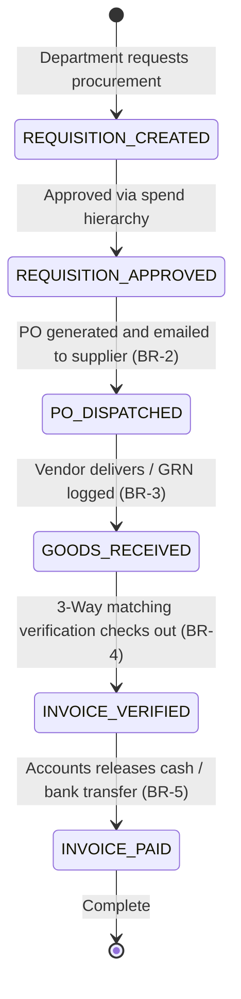

# Form/Module Spec — Purchase & Procurement Management System (PPMS)

| | |
|---|---|
| **Status** | Draft |
| **Source** | pasted module analysis — *VH/NABH/PPMS/01/2026* (2026-07-01) |
| **Existing code?** | **Exists and is highly integrated.** Reuses [`HospitalInventoryPurchase`](../../backend/src/main/java/com/hms/entity/HospitalInventoryPurchase.java) (holds general consumable purchases), [`PurchaseInvoice`](../../backend/src/main/java/com/hms/entity/pharmacy/PurchaseInvoice.java) (holds pharmacy invoices), and [`PurchaseInvoiceItem`](../../backend/src/main/java/com/hms/entity/pharmacy/PurchaseInvoiceItem.java) (holds invoice details). |

> **Read first — The Procure-to-Pay (P2P) Safety Engine.**
> **(1) Unified Purchase Inlets.** The system already tracks purchases through [`HospitalInventoryPurchase`](../../backend/src/main/java/com/hms/entity/HospitalInventoryPurchase.java) (for general inventory items) and [`PurchaseInvoice`](../../backend/src/main/java/com/hms/entity/pharmacy/PurchaseInvoice.java) (for pharmacy batches). Ensure any approved GRNs automatically route details into these active ledgers to keep stock levels synchronized.
> **(2) Automatic Inventory updates.** When a Goods Receipt Note (GRN) is confirmed and marked completed, the system must **automatically update stock levels** inside `HospitalInventory` or `MedicineBatch`, incrementing counts by the verified received quantity (Rule 3).
> **(3) P2P Lifecycle & 3-Way Matching Gaps.** The current tables only record final purchase receipts. To enable enterprise procurement, you should introduce `purchase_requisition` (PR), `vendor`, `purchase_order` (PO), and `vendor_invoice` tables to support multi-stage approval thresholds and three-way invoice verification before accounts release payments (Rule 4, Rule 5).

---

## 1. Form/Module Overview
- **Department:** Purchase Department (primary); Inventory, Pharmacy, Laboratory, Radiology, OT, CSSD, Biomedical, Finance, Accounts (secondary)
- **Module:** **Purchase → Purchase Requisition → RFQ → Vendor → Purchase Order → Goods Receipt → Invoice → Payment** (procure-to-pay procurement engine)
- **Filled By:** Department Heads (purchase requisition); Purchase Officer (PO & RFQ creation); Storekeeper (GRN receipt verification)
- **Approved / Verified By:** Purchase Manager (PO approval); Administrator (value threshold clearance)
- **Stored In:** `purchase_order` (database), `purchase_requisition`, `vendor_invoice`, and supplier ledgers
- **Lifecycle:** requisition raised; approved by hierarchy; RFQ sent; quotations compared; PO generated & dispatched; goods received (GRN); 3-way matching run; invoice verified; accounts issues payment
- **NABH clause:** MIS/COP — procurement policies for medical equipment and consumables; vendor qualification checklists (drug licenses); goods receipt verification records; audit trails of supplier transactions.

## 2. Purpose
- **Hospital use:** automates and controls the purchasing cycle for all hospital stores, negotiating optimal pricing and enforcing corporate spend authorizations.
- **NABH requirement:** strict verification of incoming medical inventory, vendor credential registers (valid licenses for drugs/implants), and documented purchase reconciliations.
- **Legal:** enforces valid GST tax invoices, drug license records, and legal delivery declarations from qualified vendors.
- **Clinical:** ensures that clinical departments have continuous supply routes, avoiding critical shortages of reagents, medicines, or devices.
- **Business rationale:** reduces purchase spend, prevents double-payment of invoices, audits vendor delivery compliance, and minimizes order cycle times.

## 3. Trigger
`Inventory level drops below reorder point OR Department requests specific supplies → Purchase Requisition (PR) created → Configured approval workflow clears PR → PO generated & sent to approved Vendor → Vendor delivers items → GRN confirmed (stock updated, BR-3) → 3-way match clears invoice → Payment processed`.

## 4. User Roles
| Actor | Capacity | Existing HMS role | Note |
|---|---|---|---|
| Department Head | raises requisitions, specifies item quantities and dates | `DOCTOR` / Nurse | requester |
| Purchase Officer | creates RFQs, coordinates quotations, generates draft POs | `HOSPITAL_ADMIN` | procurement executive |
| Purchase Manager | audits quotation sheets, approves PO releases | `HOSPITAL_ADMIN` | procurement head |
| Store Manager | validates incoming shipments, marks GRN completion | `HOSPITAL_ADMIN` | store controller |
| Finance Manager | executes 3-way matching and verifies invoice details | `SUPER_ADMIN` / Finance | finance controller |
| Accountant | records payments and clears supplier accounts | `RECEPTIONIST` / Admin | cashier / accounts clerk |

## 5. Fields
Legend — Source: `auto`=fetched from context, `manual`=entered, `sig`=signature capture.

| Field | Type | Max | Mandatory | Editable rule | DB column | Validation | Search | Print | Source |
|---|---|---|---|---|---|---|---|---|---|
| PR Number | string | 25 | Y | read-only | `purchase_requisition.id` | unique sequence | Y | Y | auto |
| PO Number | string | 25 | Y | read-only | `purchase_order.po_number` | unique sequence | Y | Y | auto |
| Requester Department| string | 50 | Y | read-only | `purchase_requisition.department` | valid hospital unit | Y | Y | auto |
| Vendor Name | string | 150 | Y | draft only | `vendor.vendor_name` | must match Vendor Master | Y | Y | manual/auto |
| Vendor GSTIN | string | 15 | Y | read-only | `vendor.gst_number` | valid GSTIN pattern | Y | Y | auto |
| Item Name | string | 150 | Y | read-only | (join `inventory_items.name`) | must match master catalog | Y | Y | auto |
| Ordered Qty | decimal | 10,2 | Y | read-only | `purchase_order_item.quantity` | > 0 | N | Y | auto |
| Received Qty | decimal | 10,2 | Y | store only | `goods_receipt_item.received_qty` | <= ordered qty (BR-3) | N | Y | manual |
| Damaged Qty | decimal | 10,2 | N | store only | `goods_receipt_item.damaged_qty` | <= received qty | N | N | manual |
| PO Rate | decimal | 10,2 | Y | read-only | `purchase_order_item.rate` | > 0.00 | N | Y | auto |
| Invoice Number | string | 50 | Y | cashier | `vendor_invoice.invoice_number` | unique per vendor (BR-5) | Y | Y | manual |
| Invoice Date | date | — | Y | cashier | `vendor_invoice.invoice_date` | not in future | N | Y | manual |
| Net Invoice Amount | decimal | 12,2 | Y | cashier | `vendor_invoice.amount` | calculated sum | N | Y | manual |
| Approver Staff ID | string | 20 | Y | read-only | (join `purchase_order.approved_by`)| valid manager role | Y | N | auto |
| Manager Signature | sig | — | Y | final only | `purchase_order.approved_by_sig` | signature blob | N | Y | sig |

## 6. Business Rules
- **BR-1** **Approved PR Only:** Quotations and RFQs can only be generated from approved, active purchase requisitions (Rule 1).
- **BR-2** **Approved Quotes Only:** A Purchase Order (PO) cannot be finalized or sent to a vendor unless it references an approved vendor quotation comparison (Rule 2).
- **BR-3** **Quantity Receipt Cap:** GRN quantities cannot exceed the original ordered quantity on the PO unless a manager-authorized variation amendment is logged (Rule 3).
- **BR-4** **Three-Way Invoice Match:** Invoice payment approval requires successful 3-way matching validation among the Purchase Order, Goods Receipt Note, and Vendor Invoice details (Rule 4).
- **BR-5** **Duplicate Invoice Block:** A vendor invoice cannot be entered or paid twice. Checks must search by `(vendor_id, invoice_number)` (Rule 5).
- **BR-6** **Immutable PO Cancel:** Cancelled POs cannot be deleted from the database. They must transition to status `CANCELLED` and maintain complete version history (Rule 6).
- **BR-7** **Tenant Isolation:** Every PR, RFQ, vendor record, PO, and invoice verification sheet must check `hospital_id` to enforce multi-tenant isolation.

## 7. Database Design
Evolves existing schemas to enforce purchase pipelines, vendor profiles, and 3-way check loops.

### Table `purchase_requisition` (new, tenant-owned):
Requisitions raised by clinical/operational units.

| Column | Type | Notes |
|---|---|---|
| id | BIGINT PK | |
| public_id | VARCHAR(50) unique | |
| hospital_id | BIGINT NOT NULL, FK | Tenant reference key, indexed |
| department | VARCHAR(50) NOT NULL | Requesting unit |
| requested_by | BIGINT NOT NULL, FK | Staff user ID |
| priority | VARCHAR(20) NOT NULL | ROUTINE / URGENT / EMERGENCY |
| status | VARCHAR(20) NOT NULL | DRAFT / PENDING_APPROVAL / APPROVED / CONVERTED_TO_PO |
| required_date | DATE NOT NULL | |
| created_at | TIMESTAMP | |

### Table `vendor` (new, tenant-owned):
The master vendor credentials folder.

| Column | Type | Notes |
|---|---|---|
| id | BIGINT PK | |
| hospital_id | BIGINT NOT NULL, FK | |
| vendor_code | VARCHAR(20) NOT NULL, unique| e.g. VEND-9876 |
| vendor_name | VARCHAR(150) NOT NULL | |
| gst_number | VARCHAR(15) NOT NULL | |
| license_number | VARCHAR(50) | Drug license code |
| rating | DECIMAL(3,2) | Vendor score (1.00 to 5.00) |
| status | VARCHAR(20) NOT NULL | ACTIVE / BLACKLISTED / SUSPENDED |

### Table `purchase_order` (new, tenant-owned):
Purchase orders issued to suppliers.

| Column | Type | Notes |
|---|---|---|
| id | BIGINT PK | |
| hospital_id | BIGINT NOT NULL, FK | |
| vendor_id | BIGINT NOT NULL, FK | Target supplier |
| po_number | VARCHAR(25) NOT NULL | Unique sequential number |
| status | VARCHAR(20) NOT NULL | DRAFT / SENT / PARTIALLY_RECEIVED / RECEIVED / CANCELLED |
| approved_by | BIGINT, FK | Manager ID |
| approved_by_sig | TEXT | Signature blob |
| order_date | TIMESTAMP NOT NULL | |
| expected_delivery | DATE | |

### Table `vendor_invoice` (new, tenant-owned):
Vendor bills matching GRN entries.

| Column | Type | Notes |
|---|---|---|
| id | BIGINT PK | |
| hospital_id | BIGINT NOT NULL, FK | |
| vendor_id | BIGINT NOT NULL, FK | |
| invoice_number | VARCHAR(50) NOT NULL | Supplier invoice code |
| invoice_date | DATE NOT NULL | |
| amount | DECIMAL(12,2) NOT NULL | Total billed value |
| status | VARCHAR(20) NOT NULL | UNPAID / VERIFIED / PAID |
| matched_po_id | BIGINT, FK | Reference PO |
| matched_grn_id | BIGINT, FK | Reference GRN |

- **Indexes:** `(hospital_id, po_number)` for purchase audits. `(hospital_id, vendor_id, invoice_number)` for duplicate invoice guards.

## 8. APIs
Every `{id}` endpoint checks `hospital_id` to confirm patient ownership.

- **`POST /hospital/purchase/requisition`**
  - **Roles:** `DOCTOR`, `NURSE`, `HOSPITAL_ADMIN`
  - **Request:** `{ "department": "Pharmacy", "requiredDate": "2026-07-15", "items": [{ "itemId": 3, "quantity": 1000 }] }`
  - **Response:** Created PR details JSON.
  - **Purpose:** Initiates purchase requisition workflows.

- **`POST /hospital/purchase/order`**
  - **Roles:** `PURCHASE_OFFICER`, `HOSPITAL_ADMIN`
  - **Request:** `{ "vendorId": 5, "expectedDelivery": "2026-07-20", "items": [{ "itemId": 3, "quantity": 1000, "rate": 5.20 }] }`
  - **Response:** Created PO details JSON.
  - **Purpose:** Generates a PO document after quote verification.

- **`POST /hospital/purchase/invoice-verify`**
  - **Roles:** `FINANCE`, `HOSPITAL_ADMIN`
  - **Request:** `{ "vendorId": 5, "invoiceNumber": "INV-10245", "amount": 5200.00, "matchedPoId": 12, "matchedGrnId": 8 }`
  - **Response:** Match status details.
  - **Purpose:** Performs 3-way match validation (BR-4, BR-5).

- **`POST /hospital/purchase/payment`**
  - **Roles:** `ACCOUNTS`, `HOSPITAL_ADMIN`
  - **Request:** `{ "invoiceId": 14, "paymentMode": "Bank Transfer", "amount": 5200.00 }`
  - **Response:** Payment transaction status.
  - **Purpose:** Clears supplier invoices.

## 9. UI Design
- **Purchase Order Workspace (Desktop Optimized):**
  - **Requisition Review Pane:** Left-hand list of approved department requisitions. Clicking auto-loads matching items into PO builder.
  - **3-Way Match Validation Modal:** Graphical split screen showing PO lines (left), GRN received lines (center), and Vendor Invoice upload (right). Discrepancies are highlighted in red (e.g. "Invoice rate ₹5.50 vs PO rate ₹5.20").
  - **Vendor Rating Card:** Small widget displaying delivery score card (on-time rate, fill rate) when choosing a vendor.

## 10. Workflow

## 11. Validation
- PO item rates must match agreed vendor price catalog boundaries.
- Invoice date cannot be post-dated into future calendars.
- Duplicate checks: 3-way matching will block invoice approvals if a matching invoice code is already verified.

## 12. Permissions
| Role | Raise PR | Approve PR | Draft PO | Approve PO | Run 3-Way Match | Release Payment |
|---|---|---|---|---|---|---|
| Dept Head | ✅ | ✅ (Own PR) | ❌ | ❌ | ❌ | ❌ |
| Purchase Officer | Review | ❌ | ✅ | ❌ | ❌ | ❌ |
| Purchase Manager | Review | ✅ (Level 1) | Review | ✅ | ❌ | ❌ |
| Finance Manager | ❌ | ❌ | ❌ | ❌ | ✅ | Review |
| Accountant | ❌ | ❌ | ❌ | ❌ | View | ✅ |
| Hospital Admin | ✅ | ✅ | ✅ | ✅ | ✅ | ✅ |

## 13. Print Rules
- Supports printing:
  - **Purchase Order (PO):** landscape corporate layout containing vendor address, delivery conditions, item detail matrix, tax columns, and digital manager signature.
  - **3-Way Match Summary Sheet:** document listing PO items side-by-side with GRN counts and invoice rates, indicating match status.
  - **Vendor Payment Slip:** receipt showing matched invoice ID, paid amount, transaction UTR, and accounts sign block.

## 14. Audit Logs
Recorded under `AuditLogService` with `entity_type="PURCHASE"`:
- Requisition raised (items, quantity, priority).
- PO approved and sent (PO number, vendor ID, manager signature).
- Invoice received and logged (invoice number, vendor ID).
- 3-Way match executed (PO id, GRN id, discrepancy alert if found).
- Payment processed (invoice ID, paid amount).

## 15. Digital Improvements
- **Automated 3-Way Matching:** Saves accountants hours of spreadsheet comparisons by automatically flagging discrepancies.
- **Spend Control Hierarchy:** Enforces procurement policies by routing high-value POs through CEO approvals automatically.
- **On-Time Analytics:** Automatically measures supplier lead times to optimize shipping and purchase dates.

## 16. Missing / Intelligent Features
- **Smart Vendor Recommendation:** Automatically suggests the best vendor for an item based on historical price rates, on-time delivery rates, and quality check feedback.
- **Consumption Forecasting Engine:** Analyzes seasonal consumption data to predict reorder requirements before warehouse stock-outs.
- **Price Trend Analyzer:** Logs raw material cost fluctuations over time and warns purchasing agents of upcoming price increases.

---

## Module & workflow placement
- **Owning module:** Purchase → Purchase & Procurement Management System (PPMS).
- **Creates / Updates / Views / Prints / Archives:**
  - **Creates:** `purchase_requisition`, `purchase_order`, `vendor_invoice`, `vendor`.
  - **Updates:** Updates GRN records; updates ledger logs.
  - **Views:** Inventory item catalog lists.
  - **Prints:** Purchase Orders, RFQ forms, and payment vouchers.
  - **Archives:** Quality records.
- **Feeds into:** Inventory module (GRN stock updates) · Accounts payable (payment runs).
- **Fed by:** Inventory reorder triggers · Department indents.
- **New modules this form implies:** Procure-to-Pay (P2P) Engine · Vendor Management dashboard.
