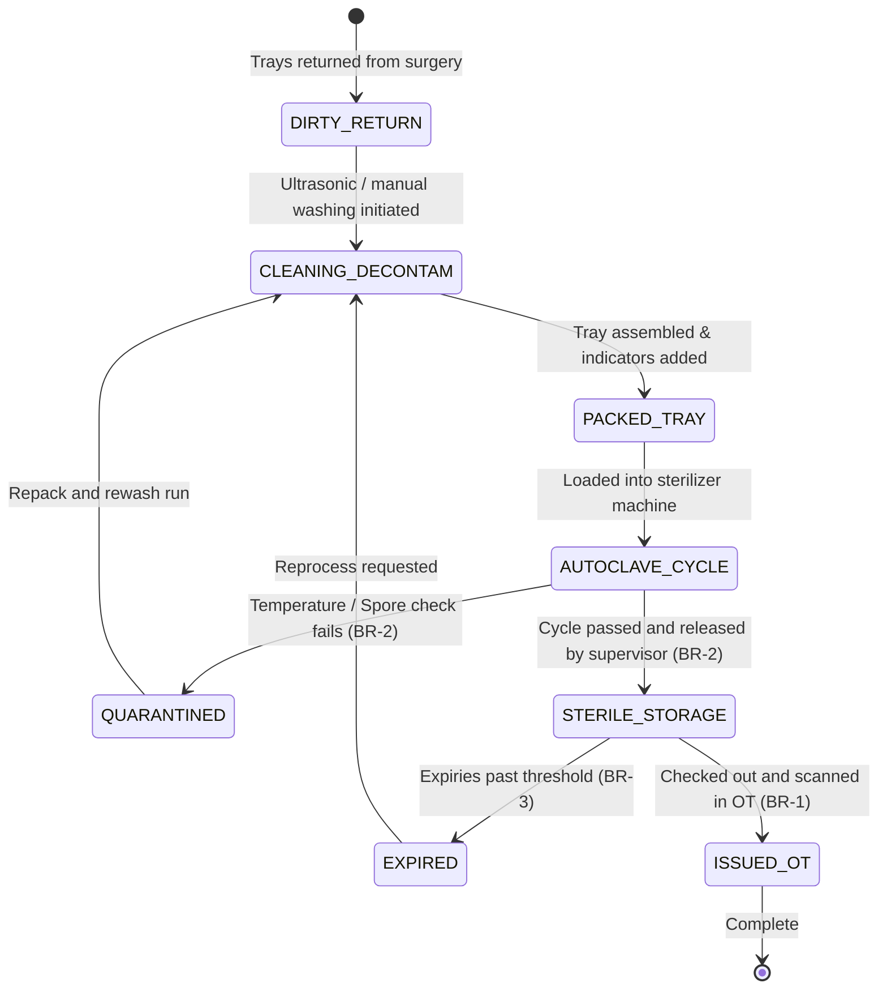

# Form/Module Spec — Central Sterile Supply Department (CSSD)

| | |
|---|---|
| **Status** | Draft |
| **Source** | pasted module analysis — *VH/NABH/CSSD/01/2026* (2026-07-01) |
| **Existing code?** | **CSSD tables are new.** Integrates with [`OtChecklist`](../../backend/src/main/java/com/hms/entity/OtChecklist.java) (instrument counting verification) and gates [`OtBooking`](../../backend/src/main/java/com/hms/entity/OtBooking.java) execution (requires sterilization validation of surgical trays before case initiation). |

> **Read first — The Surgical Instrument Sterile Safety Loop.**
> **(1) Direct integration with WHO checklists.** The clinical count of surgical instruments and gauzes starts in CSSD packaging and finishes at wound closure. Fulfilling the OT count check during WHO sign-out ([`OtChecklist.java`](../../backend/src/main/java/com/hms/entity/OtChecklist.java)) should match the predefined master content lists configured on the issued `cssd_tray` records.
> **(2) Sterility Gating for OT Readiness.** In the OT Readiness Spec ([`26-ot-readiness.md`](./26-ot-readiness.md)), the attending nurse verifies CSSD sterile trays. The system must automatically scan the issued tray barcode and check the `sterilization_cycle` table to confirm that the batch was disinfected and has not exceeded its `sterility_expiry` (Rule 3).
> **(3) Load-Level Quarantine.** If a biological indicator or temperature parameter fails during an autoclave run, the system must **instantly lock** and change the status of all trays mapped to that cycle's `load_id` to `QUARANTINED`, preventing issue to any operating theatre (Rule 2).

---

## 1. Form/Module Overview
- **Department:** CSSD (primary); Operation Theatre, ICU, Wards, Emergency, Endoscopy, Cath Lab, Infection Control, Biomedical (secondary)
- **Module:** **CSSD → Instrument Return → Cleaning → Packing → Sterilization → Storage → Issue** (sterile instrument lifecycle management platform)
- **Filled By:** CSSD Technician (cleaning, packing, cycle load details); CSSD Supervisor (approvals)
- **Approved / Verified By:** CSSD Supervisor (sterility verification)
- **Stored In:** `cssd_instrument` (database), `cssd_tray`, `sterilization_cycle`, and `cssd_issue` registers
- **Lifecycle:** dirty instruments returned from OT; disinfected and cleaned; inspected and packed into trays; sterilized in autoclave; quality checked; stored; issued to OT; used and returned
- **NABH clause:** HIC/COP — infection control practices; surgical instrument sterilization protocols; validation of autoclave loads using chemical, physical, and biological indicators; batch sterilization records.

## 2. Purpose
- **Hospital use:** tracks reusable surgical hardware (forceps, clamps, retractor sets) to guarantee clean, germ-free instruments for patient procedures.
- **NABH requirement:** mandatory documentation of sterilizer cycle variables (temperature, pressure, time) and indicator validation logs (biological/chemical).
- **Legal:** provides trace evidence that the instruments used in a surgical case were properly disinfected, defending the hospital from postoperative infection claims.
- **Clinical:** prevents cross-contamination and surgical site infections (SSI) by enforcing sterility expiry quarantines.
- **Business rationale:** manages instrument loss or damage and audits sterilizer machine utilization.

## 3. Trigger
`Surgery ends → Used instruments returned → Decontamination check logged → Sterility pack compiled & barcode generated → Sterilization cycle run → Biological/chemical indicators check out → Pack stored → Attending OT nurse requests trays (this form) → Tray issued and scanned in OT → Complete`.

## 4. User Roles
| Actor | Capacity | Existing HMS role | Note |
|---|---|---|---|
| CSSD Technician | cleans, packs trays, runs sterilizers, enters cycle variables | — | role gap: `CSSD_TECHNICIAN` |
| CSSD Supervisor | reviews biological indicators, approves autoclave releases | — | role gap: `CSSD_SUPERVISOR` |
| OT Attending Nurse | records used counts, returns dirty packs, scans issued trays | `NURSE` | ward/OT nurse role |
| Infection Nurse | audits cycle load results and checks quarantine lists | `NURSE` | infection control role |
| Biomedical Engineer| performs sterilizer calibrations, schedules repairs | — | role gap: `BIOMEDICAL_ENGINEER` |
| Hospital Admin | views sterilizer machine dashboards and efficiency metrics| `HOSPITAL_ADMIN` | operations manager |

## 5. Fields
Legend — Source: `auto`=fetched from context, `manual`=entered, `sig`=signature capture, `device`=sterilizer import.

| Field | Type | Max | Mandatory | Editable rule | DB column | Validation | Search | Print | Source |
|---|---|---|---|---|---|---|---|---|---|
| Tray Barcode | string | 30 | Y | read-only | `cssd_tray.barcode` | unique sequence | Y | Y | auto/scan |
| Tray Name | string | 100 | Y | read-only | `cssd_tray.tray_name` | must match Tray Master | Y | Y | auto |
| Specialty | string | 50 | Y | read-only | `cssd_tray.specialty` | e.g. Ortho, General, ENT | Y | Y | auto |
| Return Condition | enum | — | Y | technician | `cssd_instrument.status` | DIRTY / DAMAGED / MISSING | N | N | manual |
| Missing Details | string | 250 | cond. | technician | `cssd_instrument.remarks` | required if missing/damaged | N | N | manual |
| Pre-soak Operator | string | 100 | Y | technician | `cssd_instrument.cleaned_by` | valid staff user | N | N | auto |
| Sterilizer Machine ID| string | 20 | Y | technician | `sterilization_cycle.machine_id` | must match machine master | Y | Y | manual/device |
| Cycle Number | int | — | Y | technician | `sterilization_cycle.cycle_number`| unique sequence per machine | Y | Y | manual/device |
| Sterilize Method | enum | — | Y | technician | `sterilization_cycle.method` | STEAM / ETO / PLASMA / DRY_HEAT | N | Y | manual |
| Target Temperature | decimal | 4,1 | Y | draft only | `sterilization_cycle.temperature`| non-negative | N | Y | device/manual |
| Target Pressure | decimal | 4,2 | Y | draft only | `sterilization_cycle.pressure` | non-negative | N | Y | device/manual |
| Cycle Duration (Mins)| int | — | Y | draft only | `sterilization_cycle.duration` | > 0 | N | Y | device/manual |
| Chemical Indicator | enum | — | Y | supervisor | `sterilization_cycle.chemical_result`| PASS / FAIL | N | Y | manual |
| Biological Indicator | enum | — | Y | supervisor | `sterilization_cycle.biological_result`| PASS / FAIL | N | Y | manual |
| Sterility Expiry | date | — | Y | read-only | `cssd_tray.expiry_date` | calculated date | N | Y | auto |
| Receiver Staff ID | string | 20 | Y | read-only | (join `cssd_issue.received_by`) | valid user account | Y | N | auto |
| Supervisor Signature| sig | — | Y | final only | `sterilization_cycle.approved_by_sig`| signature blob | N | Y | sig |

## 6. Business Rules
- **BR-1** **Sterility Lock:** Trays marked as `DIRTY` or `CLEANED` (but not sterilized) cannot be issued or scheduled for surgical procedures (Rule 1).
- **BR-2** **Fail Quarantine:** If chemical or biological indicator checks result in `FAIL`, the system must automatically update the status of all trays in the load to `QUARANTINED` and block dispatch (Rule 2).
- **BR-3** **Expiry Prevention:** Expired sterile trays (past sterility expiry duration) are locked and cannot be checked out. They must be routed back to the cleaning queue for re-processing (Rule 3).
- **BR-4** **Incident on Mismatch:** Any count difference or instrument damage checked during return processing must log an audit entry and generate an incident report (Rule 5).
- **BR-5** **Real-Time Logistics Tracker:** Every tray state change (dirty, cleaning, packing, sterilizing, sterile, issued, returned) must record a transaction ledger entry tracking user, room, and timestamp (Rule 4).
- **BR-6** **Machine Lock:** If a sterilizer fails periodic test validations (Bowie-Dick or biological spore checks), the system blocks scheduling loads to that machine until a biomedical release certificate is logged.
- **BR-7** **Tenant Isolation:** Every instrument record, tray definition, autoclave cycle sheet, and issue log must carry `hospital_id` to enforce multi-tenant isolation.

## 7. Database Design
Evolves safety loops by introducing sterilizer parameters and tray tracking.

### Table `cssd_instrument` (new, tenant-owned):
The master inventory list of surgical reusable instruments.

| Column | Type | Notes |
|---|---|---|
| id | BIGINT PK | |
| hospital_id | BIGINT NOT NULL, FK | Tenant reference key, indexed |
| instrument_code | VARCHAR(20) NOT NULL | Unique barcode |
| name | VARCHAR(100) NOT NULL | Instrument name |
| category | VARCHAR(50) NOT NULL | Forceps / Retractors / Clamps, etc. |
| current_tray_id | BIGINT, FK | Nullable if loose / unassigned |
| status | VARCHAR(20) NOT NULL | DIRTY / CLEANED / STERILE / MISSING / MAINTENANCE |
| maintenance_due | DATE | Next scheduled bio-med audit |

### Table `cssd_tray` (new, tenant-owned):
Surgical trays containing instrument groups.

| Column | Type | Notes |
|---|---|---|
| id | BIGINT PK | |
| hospital_id | BIGINT NOT NULL, FK | |
| tray_name | VARCHAR(100) NOT NULL | e.g. Major Laparotomy Set |
| barcode | VARCHAR(30) NOT NULL, unique| Scan code |
| status | VARCHAR(20) NOT NULL | DIRTY / IN_STERILIZER / STERILE / ISSUED / QUARANTINED |
| cycle_id | BIGINT, FK | Autoclave run link |
| expiry_date | DATE | Sterility expiry date |

### Table `sterilization_cycle` (new, tenant-owned):
Logs autoclave run parameters and indicator validations.

| Column | Type | Notes |
|---|---|---|
| id | BIGINT PK | |
| hospital_id | BIGINT NOT NULL, FK | |
| cycle_number | VARCHAR(30) NOT NULL | Machine specific sequence |
| machine_id | VARCHAR(20) NOT NULL | Autoclave code |
| method | VARCHAR(20) NOT NULL | STEAM / ETO / PLASMA / DRY_HEAT |
| temperature | DECIMAL(4,1) NOT NULL | Logged parameters |
| pressure | DECIMAL(4,2) NOT NULL | Logged parameters |
| duration | INTEGER NOT NULL | Minutes |
| chemical_result | VARCHAR(10) NOT NULL | PASS / FAIL |
| biological_result | VARCHAR(10) | PASS / FAIL (spore check) |
| status | VARCHAR(20) NOT NULL | IN_PROGRESS / PASSED / FAILED |
| approved_by | BIGINT, FK | Supervisor user ID |
| approved_by_sig | TEXT | Signature blob |
| created_at | TIMESTAMP | |

### Table `cssd_issue` (new, tenant-owned):
Tracks checkout logs to clinical areas.

| Column | Type | Notes |
|---|---|---|
| id | BIGINT PK | |
| hospital_id | BIGINT NOT NULL, FK | |
| tray_id | BIGINT NOT NULL, FK | |
| issued_to_department | VARCHAR(50) NOT NULL | Ward, OT, ER, etc. |
| issued_by | BIGINT NOT NULL, FK | CSSD tech user ID |
| received_by | BIGINT NOT NULL, FK | Ward/OT nurse user ID |
| issue_time | TIMESTAMP NOT NULL | |

- **Indexes:** `(hospital_id, tray_id, status)` for checkout validation. `(hospital_id, cycle_id)` for load lookup.

## 8. APIs
Every `{id}` endpoint checks `hospital_id` to confirm patient ownership.

- **`POST /hospital/cssd/return`**
  - **Roles:** `CSSD_TECHNICIAN`, `HOSPITAL_ADMIN`
  - **Request:** `{ "trayBarcode": "TRAY-1025", "fromDepartment": "OT-1", "condition": "DIRTY" }`
  - **Response:** Updated tray status.
  - **Purpose:** Logs dirty returns post-surgery.

- **`POST /hospital/cssd/cycle/start`**
  - **Roles:** `CSSD_TECHNICIAN`, `HOSPITAL_ADMIN`
  - **Request:** `{ "machineId": "STER-01", "method": "STEAM", "trays": [12, 14, 15] }`
  - **Response:** Created `sterilization_cycle` JSON.
  - **Purpose:** Commences autoclave batch tracking.

- **`POST /hospital/cssd/cycle/verify/{id}`**
  - **Roles:** `CSSD_SUPERVISOR`, `HOSPITAL_ADMIN`
  - **Request:** `{ "chemicalResult": "PASS", "biologicalResult": "PASS", "approvedBySig": "data..." }`
  - **Response:** Verified load status (updates linked trays to status `STERILE` and computes expiry).
  - **Purpose:** Supervisor releases the load (BR-2).

- **`POST /hospital/cssd/issue`**
  - **Roles:** `CSSD_TECHNICIAN`, `HOSPITAL_ADMIN`
  - **Request:** `{ "trayBarcode": "TRAY-1025", "issuedToDepartment": "OT-2", "receivedBy": 8 }`
  - **Response:** Created `cssd_issue` details.
  - **Purpose:** Scan dispatch checks out sterile tray to OT (BR-1, BR-3).

## 9. UI Design
- **Autoclave Cycle Monitor (Tablet Optimized):**
  - **Machine Status Panel:** Displays sterilizers (cards) with current temperatures and cycle steps (Bowie-dick check OK, load running, cooling).
  - **Batch Verification Layout:** Center form displaying selected cycle parameters. Big green "Approve and Release Load" button adjacent to biological indicator toggles.
  - **Quarantine Dashboard:** Highlighted row panel showing failed runs and quarantined tray codes.
- **Instrument Checkout Console:**
  - Fast barcode scanner field with auto-receipt voice guidance ("Tray sterile - issued successfully").

## 10. Workflow

## 11. Validation
- Sterility duration parameters must match standard configurations.
- The approval endpoint will block execution if cycle temperature/pressure values are missing.
- Barcode checkout validation: must confirm that the scanned tray barcode matches a registered record in `cssd_tray`.

## 12. Permissions
| Role | Record Return | Pack Trays | Run Autoclave | Verify Sterility | Issue Trays | view Dashboard |
|---|---|---|---|---|---|---|
| CSSD Technician | ✅ | ✅ | ✅ | ❌ | ✅ | ✅ |
| CSSD Supervisor | ✅ | ✅ | ✅ | ✅ | ✅ | ✅ (Full) |
| OT Nurse | Return | ❌ | ❌ | ❌ | Receive | ✅ (Status check)|
| Infection Nurse | ❌ | ❌ | ❌ | ❌ | ❌ | ✅ (Audit view) |
| Biomedical Eng | ❌ | ❌ | Maintenance| ❌ | ❌ | Relevant |
| Hospital Admin | ✅ | ✅ | ✅ | ✅ | ✅ | ✅ |

## 13. Print Rules
- Supports printing:
  - **Sterilization Load label:** barcode sticker showing load number, machine, cycle date, expiry date, operator, and chemical verification code.
  - **Tray Contents checklist:** slip printer output detailing the exact list of instruments required in the tray (e.g. 10 forceps, 4 clamps) to help technicians inspect.
  - **CSSD Issue Slip:** receipt verifying dispatch to ward containing signatures.

## 14. Audit Logs
Recorded under `AuditLogService` with `entity_type="CSSD"`:
- Autoclave cycle started (machine, load number, trays).
- Sterilization cycle verification logged (indicators result, supervisor).
- Sterile tray load quarantined (cycle ID, trays).
- Sterile pack issued (tray barcode, receiving unit).
- Instrument reported missing/damaged (instrument code, user).

## 15. Digital Improvements
- **Automated Quarantine Gate:** Prevents clinical staff from checkout of failed load batches.
- **Sterility Expiry Alarms:** Automatically flags expired trays, avoiding manual calendar checks.
- **Surgical Content Audits:** Reduces post-op instrument miscounts by showing content checklists at return checkout.

## 16. Missing / Intelligent Features
- **RFID Real-Time Location:** Integrates with wall scanners to show the exact location of surgical trays (e.g. in CSSD, in transit, in OT-1) in real time.
- **Autoclave Parameter Integrations:** Pulls temperature/pressure files directly from autoclave COM ports to verify parameters without typing.
- **Dynamic Demand Forecasting:** Compiles scheduling histories to forecast upcoming tray requirements (e.g. predict orthopedic sets required for tomorrow).

---

## Module & workflow placement
- **Owning module:** CSSD → Central Sterile Supply Department (CSSD).
- **Creates / Updates / Views / Prints / Archives:**
  - **Creates:** `sterilization_cycle`, `cssd_issue`, `cssd_instrument`, `cssd_tray`.
  - **Updates:** Gates availability indicators in `OtBooking` and OT Readiness.
  - **Views:** Patient EMR surgery logs.
  - **Prints:** Autoclave labels, Content checklists, and issue slips.
  - **Archives:** Quality records.
- **Feeds into:** Operation Theatre Readiness (sterility checks) · Quality Management (infection tracking logs).
- **Fed by:** Instrument counts · Biomedical machine configurations.
- **New modules this form implies:** Sterilization Lifecycle Management Engine · Instrument Tracking dashboard.
