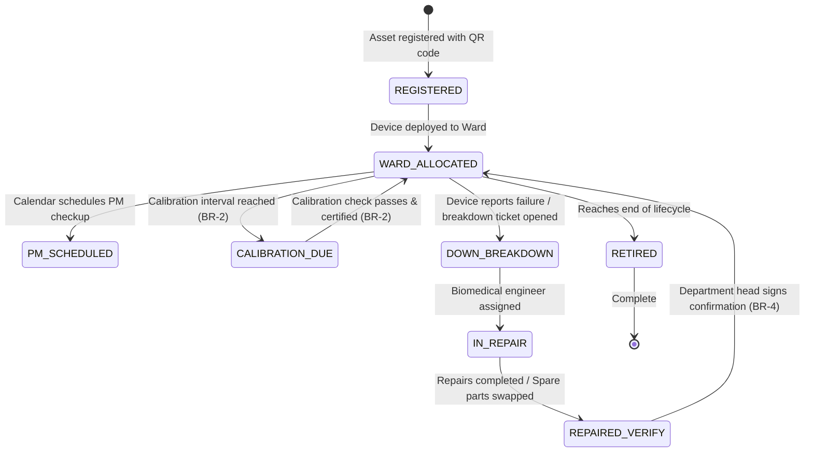

# Form/Module Spec — Biomedical Engineering & Medical Equipment Management (BEMS)

| | |
|---|---|
| **Status** | Draft |
| **Source** | pasted module analysis — *VH/NABH/BEMS/01/2026* (2026-07-01) |
| **Existing code?** | **BEMS tables are new.** Integrates with [`HospitalInventory`](../../backend/src/main/java/com/hms/entity/HospitalInventory.java) (for spare parts consumption during repairs) and gates OT checkups inside [`26-ot-readiness.md`](./26-ot-readiness.md) (requires critical device calibration clearance). |

> **Read first — Keep Critical Devices Sterile and Calibrated.**
> **(1) Gatekeeper for Clinical Safety.** The OT Readiness checklist ([`26-ot-readiness.md`](./26-ot-readiness.md)) validates medical devices (Anesthesia machine, cautery, ventilators). The validation logic must check the `medical_equipment` table to block room readiness verification if any mapped critical device is flagged as `DOWN` or `CALIBRATION_OVERDUE` under configured safety rules (Rule 3).
> **(2) Spare Parts Stock Deduction.** When spare parts are marked as replaced during preventive maintenance (`maintenance_schedule`), the system must invoke the central inventory service to decrease the corresponding consumable stock counts in `HospitalInventory` (BR-3 from Inventory Spec).
> **(3) Persistent QR Code History.** Every registered asset is assigned a unique `asset_code` and QR sticker. Scanning the QR code must pull a longitudinal history showing all past preventive maintenance logs, open breakdown tickets, and AMC contract boundaries to aid bio-med engineers on-site.

---

## 1. Form/Module Overview
- **Department:** Biomedical Engineering Department (primary); ICU, OT, Laboratory, Radiology, Emergency, CSSD, Administration, Purchase, Inventory (secondary)
- **Module:** **Biomedical Engineering → Equipment Master → Maintenance → Calibration → Breakdown → AMC → Asset Tracking** (medical equipment lifecycle management platform)
- **Filled By:** Biomedical Engineer (maintenance logs, calibration inputs, repair entries); Department Nurse (reports breakdown faults)
- **Approved / Verified By:** Biomedical Manager (assigns tickets, approves contracts & retirements)
- **Stored In:** `medical_equipment` (database), `maintenance_schedule`, `breakdown_ticket`, and `calibration_record`
- **Lifecycle:** asset purchased; registered with QR code; allocated to ward; daily function runs; scheduled preventive maintenance completed; periodic calibration certified; breakdown tickets resolved; retired and disposed
- **NABH clause:** FMS — facility management and safety; medical equipment program; documented asset register; preventive maintenance and calibration calendars; warranty and AMC/CMC contracts; alert systems for critical equipment downtime.

## 2. Purpose
- **Hospital use:** maintains a complete inventory of medical hardware, tracking calibrations, schedules, and repair downtime logs.
- **NABH requirement:** structured calibration logs verifying accuracy of patient readouts (e.g. ventilators, monitors, infusion pumps), and documented maintenance logs.
- **Legal:** provides trace evidence of device calibration safety compliance, protecting the hospital from clinical liability during forensic investigations.
- **Clinical:** ensures life-saving monitors and defibrillators are fully certified, accurate, and functional before clinical application.
- **Business rationale:** reduces machine downtime costs by optimizing AMC/CMC vendor SLAs and schedules.

## 3. Trigger
`Department equipment fails OR calibration interval approaching → Maintenance ticket / calibration task generated (this form) → Biomedical engineer assigned → Repair executed & verified → Calibration certified (status ACTIVE) → Equipment released back to ward`.

## 4. User Roles
| Actor | Capacity | Existing HMS role | Note |
|---|---|---|---|
| Biomedical Engineer| performs calibrations, updates maintenance logs, resolves tickets | — | role gap: `BIOMEDICAL_ENGINEER` |
| Biomedical Manager | oversees schedules, assigns tickets, audits vendor contracts | — | role gap: `BIOMEDICAL_MANAGER` |
| Department Head | reports breakdown faults, requests backups, verifies repairs | `DOCTOR` / Nurse | clinical requester |
| Purchase Officer | updates warranty details, checks equipment contracts | `HOSPITAL_ADMIN` | procurement clerk |
| Quality Auditor | reviews calibration logs and compliance registers | `HOSPITAL_ADMIN` | quality controller |
| External Vendor | performs AMC calibration runs and logs certificates | — | external service technician |

## 5. Fields
Legend — Source: `auto`=fetched from context, `manual`=entered, `sig`=signature capture, `device`=calibration gauge import.

| Field | Type | Max | Mandatory | Editable rule | DB column | Validation | Search | Print | Source |
|---|---|---|---|---|---|---|---|---|---|
| Asset Code | string | 20 | Y | read-only | `medical_equipment.asset_code` | unique asset format (BR-1)| Y | Y | auto/scan |
| Equipment Name | string | 100 | Y | read-only | `medical_equipment.equipment_name`| must match asset list | Y | Y | auto |
| Category | string | 50 | Y | read-only | `medical_equipment.category` | ICU / OT / Radiology, etc. | Y | Y | auto |
| Serial Number | string | 50 | Y | read-only | `medical_equipment.serial_number` | unique index | Y | Y | auto |
| Current Department | string | 50 | Y | manager | `medical_equipment.department` | valid ward / unit | Y | Y | auto/manual |
| Current Location | string | 50 | Y | engineer | `medical_equipment.location` | specific room ID | Y | N | manual |
| Asset Status | enum | — | Y | engineer | `medical_equipment.status` | ACTIVE / DOWN / CALIBRATION_DUE | Y | Y | auto/manual |
| Breakdown Severity | enum | — | Y | requester | `breakdown_ticket.priority` | LOW / MEDIUM / CRITICAL | N | Y | manual |
| Problem Description | string | 500 | Y | requester | `breakdown_ticket.remarks` | non-empty details | N | Y | manual |
| Assigned Engineer | string | 100 | Y | manager | `breakdown_ticket.engineer_name` | valid bio-med account | Y | N | manual |
| Calibration Agency | string | 100 | Y | engineer | `calibration_record.agency` | verified agency name | Y | Y | manual |
| Calibration Date | date | — | Y | engineer | `calibration_record.calibration_date`| not in future | N | Y | manual |
| Calibration Expiry | date | — | Y | engineer | `calibration_record.due_date` | after calibration date | N | Y | manual |
| Spare Parts Swapped | text | — | N | engineer | `maintenance_schedule.remarks` | items swapped from store | N | N | manual |
| Engineer Signature | sig | — | Y | final only | `breakdown_ticket.engineer_sig` | signature blob | N | Y | sig |

## 6. Business Rules
- **BR-1** **Asset Code Uniqueness:** Every medical equipment registered must be assigned a unique sequential or barcode-defined `asset_code` prior to ward deployment (Rule 1).
- **BR-2** **Calibration Overdue Lock:** When the calendar date exceeds `due_date` in `calibration_record`, the system automatically changes status to `CALIBRATION_OVERDUE`. Attending staff are immediately warned, and usage is restricted under configured safety rules (Rule 3).
- **BR-3** **Parts Stock Deduct:** Marking spare parts as used during repairs must trigger an inventory transaction that decreases counts inside `HospitalInventory` (Inventory BR-3).
- **BR-4** **Double Close Validation:** Breakdown tickets remain open and the device remains flagged as `DOWN` until the department head clicks "Confirm Repair" after testing the device (Rule 4).
- **BR-5** **Contract Warranty Alert:** When a breakdown ticket is opened, the system must display active Warranty/AMC boundaries to ensure external vendor SLAs are utilized before manual service is assigned (Rule 5).
- **BR-6** **No Historical Deletions:** Retired or disposed equipment cannot be deleted from the database. It remains registered with status `RETIRED` to maintain historical audit traceability (Rule 6).
- **BR-7** **Tenant Isolation:** Every medical equipment, maintenance task, breakdown ticket, calibration log, and AMC contract must check `hospital_id` to enforce multi-tenant isolation.

## 7. Database Design
Evolves safety loops by introducing equipment tracking and calibration ledgers.

### Table `medical_equipment` (new, tenant-owned):
The master asset registry directory.

| Column | Type | Notes |
|---|---|---|
| id | BIGINT PK | |
| hospital_id | BIGINT NOT NULL, FK | Tenant reference key, indexed |
| asset_code | VARCHAR(20) NOT NULL, unique| Unique QR lookup code |
| equipment_name | VARCHAR(100) NOT NULL | |
| category | VARCHAR(50) NOT NULL | Ventilator, ECG, Cautery, Monitor, etc. |
| manufacturer | VARCHAR(100) | |
| model | VARCHAR(50) | |
| serial_number | VARCHAR(50) NOT NULL | |
| department | VARCHAR(50) NOT NULL | Ward location |
| location | VARCHAR(50) | Room code |
| status | VARCHAR(20) NOT NULL | ACTIVE / DOWN / CALIBRATION_OVERDUE / RETIRED |
| warranty_expiry | DATE | |
| created_at | TIMESTAMP | |

### Table `maintenance_schedule` (new, tenant-owned):
Manages scheduled preventive maintenance (PM) events.

| Column | Type | Notes |
|---|---|---|
| id | BIGINT PK | |
| hospital_id | BIGINT NOT NULL, FK | |
| equipment_id | BIGINT NOT NULL, FK | |
| maintenance_type | VARCHAR(30) NOT NULL | PREVENTIVE / CALIBRATION / SAFETY_CHECK |
| scheduled_date | DATE NOT NULL | |
| completed_date | DATE | |
| engineer_name | VARCHAR(100) | |
| status | VARCHAR(20) NOT NULL | SCHEDULED / OVERDUE / COMPLETED |
| remarks | TEXT | Parts replaced and comments |

### Table `breakdown_ticket` (new, tenant-owned):
Breakdown logs generated by clinical teams.

| Column | Type | Notes |
|---|---|---|
| id | BIGINT PK | |
| hospital_id | BIGINT NOT NULL, FK | |
| equipment_id | BIGINT NOT NULL, FK | |
| reported_by | VARCHAR(100) NOT NULL | Email of reporting user |
| reported_at | TIMESTAMP NOT NULL | |
| priority | VARCHAR(20) NOT NULL | LOW / MEDIUM / CRITICAL |
| status | VARCHAR(20) NOT NULL | OPEN / IN_PROGRESS / REPAIRED / CLOSED |
| engineer_sig | TEXT | Signature blob of engineer |
| resolved_at | TIMESTAMP | |

### Table `calibration_record` (new, tenant-owned):
Legal compliance calibration certificates.

| Column | Type | Notes |
|---|---|---|
| id | BIGINT PK | |
| hospital_id | BIGINT NOT NULL, FK | |
| equipment_id | BIGINT NOT NULL, FK | |
| calibration_date | DATE NOT NULL | |
| due_date | DATE NOT NULL | Next calibration schedule |
| agency | VARCHAR(100) NOT NULL | Testing body |
| certificate_reference | VARCHAR(100) | Storage link for PDF cert |
| result | VARCHAR(10) NOT NULL | PASS / FAIL |

- **Indexes:** `(hospital_id, asset_code)` for QR scan lookups. `(hospital_id, status)` for downtime metrics.

## 8. APIs
Every `{id}` endpoint checks `hospital_id` to confirm patient ownership.

- **`POST /hospital/biomedical/equipment`**
  - **Roles:** `BIOMEDICAL_MANAGER`, `HOSPITAL_ADMIN`
  - **Request:** `{ "equipmentName": "Ventilator V60", "category": "ICU", "serialNumber": "SN-776", "department": "ICU" }`
  - **Response:** Created `medical_equipment` details JSON with generated asset code.
  - **Purpose:** Registers a new asset.

- **`POST /hospital/biomedical/breakdown`**
  - **Roles:** `DOCTOR`, `NURSE`, `HOSPITAL_ADMIN`
  - **Request:** `{ "equipmentId": 12, "priority": "CRITICAL", "remarks": "Screen flickering and alarms failing" }`
  - **Response:** Created ticket details (updates equipment status to `DOWN`).
  - **Purpose:** Files breakdown repair requests.

- **`POST /hospital/biomedical/calibration`**
  - **Roles:** `BIOMEDICAL_ENGINEER`, `HOSPITAL_ADMIN`
  - **Request:** `{ "equipmentId": 12, "calibrationDate": "2026-07-01", "dueDate": "2027-07-01", "agency": "TUV India" }`
  - **Response:** Created calibration record (resets status to `ACTIVE`).
  - **Purpose:** Enters calibration certification parameters.

- **`POST /hospital/biomedical/ticket/close`**
  - **Roles:** `DOCTOR` (Department Head flag), `NURSE`
  - **Request:** `{ "ticketId": 14, "confirmResolution": true }`
  - **Response:** Closed ticket status.
  - **Purpose:** Supervisor clinical check before returning device to active use (BR-4).

## 9. UI Design
- **Biomedical Engineer Dashboard (Desktop Optimized):**
  - **Asset Directory List:** Grid showing active assets, calibration schedules, and statuses. Alerts (downtime/critical) are color highlighted.
  - **Downtime Counter Cards:** Banners displaying MTBF and MTTR metrics alongside average response SLAs.
  - **Ticket Board Pane:** Drag-drop column display (Open, In Progress, Repaired, Closed) representing breakdown tickets.
  - **QR Code lookup window:** Focus defaults scanner to load histories.

## 10. Workflow

## 11. Validation
- Calibration expiration dates must be greater than current date.
- Description inputs are mandatory when opening breakdown tickets.
- Ticket closures require department head confirmations (BR-4).

## 12. Permissions
| Role | Register Asset | Create Ticket | Assign Engineer | Update PM logs | Verify Calibration | View History |
|---|---|---|---|---|---|---|
| Dept Head | ❌ | ✅ | ❌ | ❌ | ❌ | ✅ |
| Bio-med Engineer | ❌ | ✅ | ❌ | ✅ | ✅ | ✅ |
| Bio-med Manager | ✅ | ✅ | ✅ | ✅ | ✅ | ✅ (Full) |
| Quality Auditor | ❌ | ❌ | ❌ | ❌ | ✅ (Audit only) | ✅ |
| Hospital Admin | ✅ | ✅ | ✅ | ✅ | ✅ | ✅ |

## 13. Print Rules
- Supports printing:
  - **Asset Tag Stickers:** small QR code sticker containing asset code, category, location, and calibration expiration date to paste on machines.
  - **Calibration Certificate Log:** landscape document listing all active assets, latest calibration runs, agencies, and due dates.
  - **Breakdown Report:** summary slip displaying repair time, downtime hours, parts replaced, and engineer/manager signatures.

## 14. Audit Logs
Recorded under `AuditLogService` with `entity_type="BIOMEDICAL"`:
- Asset registered and code assigned (asset name, category).
- Breakdown ticket opened (equipment ID, reporting user).
- Calibration cert recorded (dueDate, agency).
- PM log completed (parts swapped, comments).
- Breakdown ticket closed (verified by supervisor, downtime duration).

## 15. Digital Improvements
- **Automated Calibration Alerts:** Prevents clinical usage of uncalibrated devices.
- **Unified Ticket Resolution:** Coordinates nursing and engineering departments without requiring phone tracking.
- **Closed-Loop Parts Deduct:** Reconciles repair actions with inventory stock logs automatically.

## 16. Missing / Intelligent Features
- **Predictive Breakdown Alarms:** Analyzes runtime logs to highlight devices with high failure probabilities before shutdown.
- **Asset Redirection Suggestions:** Recommends alternative backup machines from nearby low-occupancy rooms during critical failures.
- **SLA Scorecards:** Evaluates vendor turnaround times and contract costs.

---

## Module & workflow placement
- **Owning module:** Biomedical Engineering → Medical Equipment Management (BEMS).
- **Creates / Updates / Views / Prints / Archives:**
  - **Creates:** `medical_equipment`, `maintenance_schedule`, `breakdown_ticket`, `calibration_record`.
  - **Updates:** Updates stock counts in `HospitalInventory`; controls availability in OT Readiness and ICU monitors.
  - **Views:** Active catalog lists.
  - **Prints:** Asset QR labels, Maintenance checklists, and calibration logs.
  - **Archives:** Quality records.
- **Feeds into:** Operation Theatre Readiness (equipment check loops) · ICU Console (device tracking) · Quality audits.
- **Fed by:** Purchase receipts · Incident logs.
- **New modules this form implies:** Medical Equipment Management Engine · Calibration and Compliance dashboard.
