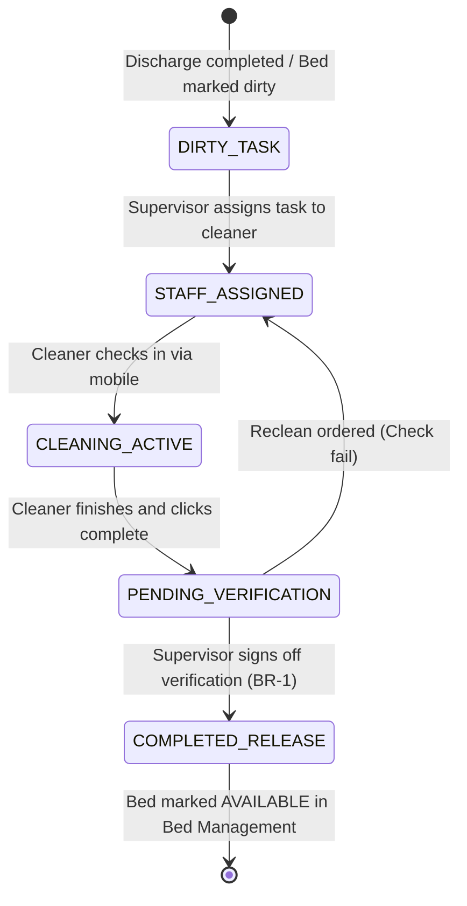

# Form/Module Spec — Housekeeping & Facility Management System (HFMS)

| | |
|---|---|
| **Status** | Draft |
| **Source** | pasted module analysis — *VH/NABH/HFMS/01/2026* (2026-07-01) |
| **Existing code?** | **HFMS tables are new.** Integrates with [`Bed`](../../backend/src/main/java/com/hms/entity/Bed.java) (gates bed turnover status from `CLEANING_REQUIRED` back to `AVAILABLE`) and [`26-ot-readiness.md`](./26-ot-readiness.md) (controls housekeeping check-offs for OT turnover). |

> **Read first — Keep Wards and Beds Safe for Admission.**
> **(1) Bed Turnover Gate.** In the Bed allocation structure ([`Bed.java`](../../backend/src/main/java/com/hms/entity/Bed.java)), when a patient is discharged, the bed status must transition to `CLEANING_REQUIRED` (dirty). The system must block assigning this bed to any new IPD admission until a verified `cleaning_task` for this specific bed is marked as `COMPLETED` by the housekeeping supervisor (Rule 1).
> **(2) OT Disinfection Check-offs.** In the OT Readiness Spec ([`26-ot-readiness.md`](./26-ot-readiness.md)), housekeeping floor and wall cleanings are verified. Confirming these items must update the corresponding `cleaning_task` status to `COMPLETED` and auto-populate the technician's metadata (Rule 2).
> **(3) Biomedical Waste Audit trails.** The `waste_collection` registry tracks color-coded pickups (Red, Yellow, Blue, White). Each entry requires matching weighing scale variables and barcode waste tag scans to comply with statutory bio-medical waste regulations (Rule 3).

---

## 1. Form/Module Overview
- **Department:** Housekeeping Department (primary); Nursing, Infection Control, OT, ICU, CSSD, Biomedical, Quality (secondary)
- **Module:** **Housekeeping → Cleaning Tasks → Waste Management → Linen → Facility Complaints → Audits** (integrated hospital housekeeping and facility operations platform)
- **Filled By:** Housekeeping Staff (records task execution); Waste collector (records weight & tags); Nursing (raises facility tickets)
- **Approved / Verified By:** Housekeeping Supervisor (signs off task completions and audits)
- **Stored In:** `cleaning_task` (database), `waste_collection`, `linen_transaction`, and `facility_complaint`
- **Lifecycle:** cleaning requested (discharge/OT case end); staff assigned; cleaning completed; supervisor verifies; location marked active; waste collected & manifest generated; facility tickets closed
- **NABH clause:** HIC/FMS — environmental cleanliness and safety; policies on biomedical waste disposal, color-coded segregations, and manifest tracking; hospital laundry and linen management; facility complaints resolution SLA audits.

## 2. Purpose
- **Hospital use:** coordinates and schedules sanitation activities across all wards, tracks biomedical waste disposal weights, manages laundry cycles, and reports facility repairs.
- **NABH requirement:** structured monitoring of terminal disinfection logs (isolation rooms, OTs), color-segregated waste registers, and linen safety audits.
- **Legal:** complies with State Pollution Control Board guidelines on Bio-Medical Waste (BMW) handling, logging weight details and vendor manifests.
- **Clinical:** minimizes hospital-acquired infections (HAI) by validating high-touch surface cleanings and isolation chamber sanitations.
- **Business rationale:** reduces bed turnaround times to increase ward admission capabilities and monitors facility maintenance SLA response times.

## 3. Trigger
`Patient discharged OR surgery ends → Bed marked CLEANING_REQUIRED → Cleaning task generated (this form) → Housekeeper assigned → Surfaces disinfected → Supervisor verifies task (status COMPLETED, BR-1) → Bed marked AVAILABLE`.

## 4. User Roles
| Actor | Capacity | Existing HMS role | Note |
|---|---|---|---|
| Housekeeper | disinfecst surfaces, collects waste bags, requests linen | — | role gap: `HOUSEKEEPER` |
| Housekeeping Supervisor| assigns schedules, verifies room cleanliness, audits linen | — | role gap: `HOUSEKEEPING_SUPERVISOR`|
| Ward Nurse | triggers bed clean requests, reports facility complaints | `NURSE` | ward staff nurse |
| Infection Control Nurse| audits surface compliance, checks biological indicator wipes | `NURSE` | quality auditor |
| Facility Engineer | reviews water/electrical complaints, logs repairs | — | role gap: `FACILITY_ENGINEER` |
| Store Keeper | manages bulk cleaning consumables and laundry inventory | `PHARMACIST` / Store | inventory clerk |

## 5. Fields
Legend — Source: `auto`=fetched from context, `manual`=entered, `sig`=signature capture.

| Field | Type | Max | Mandatory | Editable rule | DB column | Validation | Search | Print | Source |
|---|---|---|---|---|---|---|---|---|---|
| Task ID | string | 25 | Y | read-only | `cleaning_task.id` | unique sequence | Y | Y | auto |
| Target Location | string | 50 | Y | read-only | `cleaning_task.location` | valid room / bed code | Y | Y | auto |
| Task Type | enum | — | Y | read-only | `cleaning_task.task_type` | ROUTINE / DEEP / TERMINAL / EMERGENCY | Y | Y | auto |
| Assigned Housekeeper| string | 100 | Y | supervisor | `cleaning_task.assigned_to` | valid housekeeper account | Y | Y | manual/auto |
| Cleaning Priority | enum | — | Y | supervisor | `cleaning_task.priority` | ROUTINE / URGENT | N | Y | auto/manual |
| Bed Status | enum | — | Y | read-only | `cleaning_task.status` | DIRTY / IN_PROGRESS / PENDING_VERIFICATION / COMPLETED | Y | Y | auto |
| Start Time | datetime | — | Y | housekeeper | `cleaning_task.start_time` | not in future | N | N | auto |
| Complete Time | datetime | — | Y | housekeeper | `cleaning_task.completed_at` | after start time | N | Y | auto |
| Waste Category | enum | — | Y | collector | `waste_collection.waste_type` | YELLOW / RED / BLUE / WHITE / GENERAL | Y | Y | manual |
| Waste Weight (Kg) | decimal | 5,2 | Y | collector | `waste_collection.quantity` | > 0.00 | N | Y | manual/device |
| Disposal Vendor | string | 100 | Y | collector | `waste_collection.vendor` | approved waste vendor | Y | Y | auto/manual |
| Facility Issue Type | enum | — | Y | nurse | `facility_complaint.complaint_type`| LEAKAGE / LIGHTING / ELECTRICAL / AC / PLUMBING | Y | Y | manual |
| Engineer Assigned | string | 100 | N | supervisor | `facility_complaint.assigned_to` | valid engineer account | Y | N | manual |
| Supervisor Signature| sig | — | Y | supervisor | `cleaning_task.supervisor_sig`| signature blob | N | Y | sig |

## 6. Business Rules
- **BR-1** **Turnover Gating:** A bed status cannot transition to `AVAILABLE` in `Bed` until a corresponding `cleaning_task` is completed and verified with a supervisor signature (Rule 1).
- **BR-2** **OT Readiness Integration:** OT rooms cannot be cleared for surgery in the OT Readiness checklist unless terminal housekeeping cleanings are recorded (Rule 2).
- **BR-3** **Biomedical Waste Schedule:** Biomedical waste collection tasks must run on configured shifts (daily check-ins), requiring weight entry and barcode tag validation (Rule 3).
- **BR-4** **Double Close Validation:** Facility complaints (plumbing/ac issues) must remain open until both the resolving engineer and the reporting ward nurse sign off on the ticket resolution (Rule 5).
- **BR-5** **Linen Threshold Alerts:** Dirty linen laundry cycles must update ledger totals. If ward available linen counts drop below safety minimums, the system must trigger shortage alerts.
- **BR-6** **Pest Control Records:** Pest control visits must be scheduled quarterly, requiring compliance certificate registration before the log is approved.
- **BR-7** **Tenant Isolation:** Every cleaning task, waste record, linen log, and facility complaint must check `hospital_id` to enforce multi-tenant isolation.

## 7. Database Design
Evolves safety loops by introducing task routing and waste tracking.

### Table `cleaning_task` (new, tenant-owned):
Manages sanitation schedules and bed turnover.

| Column | Type | Notes |
|---|---|---|
| id | BIGINT PK | |
| hospital_id | BIGINT NOT NULL, FK | Tenant reference key, indexed |
| location | VARCHAR(50) NOT NULL | Bed code / Room number |
| task_type | VARCHAR(30) NOT NULL | ROUTINE / DEEP / TERMINAL / EMERGENCY |
| assigned_to | BIGINT, FK | Housekeeper staff ID |
| status | VARCHAR(30) NOT NULL | DIRTY / IN_PROGRESS / PENDING_VERIFICATION / COMPLETED |
| start_time | TIMESTAMP | |
| completed_at | TIMESTAMP | |
| supervisor_sig | TEXT | Base64 signature blob |
| created_at | TIMESTAMP | |

### Table `waste_collection` (new, tenant-owned):
Registers bio-medical waste bag dispatch weights.

| Column | Type | Notes |
|---|---|---|
| id | BIGINT PK | |
| hospital_id | BIGINT NOT NULL, FK | |
| waste_type | VARCHAR(20) NOT NULL | YELLOW / RED / BLUE / WHITE / GENERAL |
| quantity | DECIMAL(5,2) NOT NULL | Weight in Kg |
| barcode_tag | VARCHAR(50) NOT NULL | Tag scanned from waste bag |
| collector_name | VARCHAR(100) NOT NULL | Housekeeper ID |
| vendor | VARCHAR(100) NOT NULL | Authorized disposal agency |
| manifest_number | VARCHAR(50) | State manifest tracking code |
| collection_time | TIMESTAMP NOT NULL | |

### Table `linen_transaction` (new, tenant-owned):
Tracks ward linens sent to laundry and clean returns.

| Column | Type | Notes |
|---|---|---|
| id | BIGINT PK | |
| hospital_id | BIGINT NOT NULL, FK | |
| linen_type | VARCHAR(50) NOT NULL | Bed sheets / Gowns / Pillow covers |
| transaction_type | VARCHAR(30) NOT NULL | DIRTY_COLLECT / DISPATCH_LAUNDRY / CLEAN_RECEIVE / ISSUE_WARD |
| quantity | INTEGER NOT NULL | |
| department | VARCHAR(50) NOT NULL | Ward location |
| performed_at | TIMESTAMP NOT NULL | |

### Table `facility_complaint` (new, tenant-owned):
Helpdesk tickets for building maintenance.

| Column | Type | Notes |
|---|---|---|
| id | BIGINT PK | |
| hospital_id | BIGINT NOT NULL, FK | |
| location | VARCHAR(50) NOT NULL | Room / area code |
| complaint_type | VARCHAR(30) NOT NULL | LEAKAGE / LIGHTING / ELECTRICAL / AC / PLUMBING |
| reported_by | VARCHAR(100) NOT NULL | Reporting staff email |
| assigned_to | BIGINT, FK | Maintenance engineer staff ID |
| status | VARCHAR(20) NOT NULL | OPEN / IN_PROGRESS / RESOLVED / CLOSED |
| created_at | TIMESTAMP | |

- **Indexes:** `(hospital_id, location, status)` for bed availability queries. `(hospital_id, collection_time)` for environmental pollution audits.

## 8. APIs
Every `{id}` endpoint checks `hospital_id` to confirm patient ownership.

- **`POST /hospital/housekeeping/task`**
  - **Roles:** `NURSE`, `HOSPITAL_ADMIN`
  - **Request:** `{ "location": "BED-201", "taskType": "TERMINAL", "priority": "URGENT" }`
  - **Response:** Created `cleaning_task` JSON with status `DIRTY`.
  - **Purpose:** Automatically triggers bed clean tasks upon discharge (BR-1).

- **`POST /hospital/housekeeping/complete/{id}`**
  - **Roles:** `HOUSEKEEPER`, `HOSPITAL_ADMIN`
  - **Request:** `{ "status": "PENDING_VERIFICATION" }`
  - **Response:** Updated task JSON.
  - **Purpose:** Housekeeper reports task completion.

- **`POST /hospital/housekeeping/verify/{id}`**
  - **Roles:** `HOUSEBOARD_SUPERVISOR`, `HOSPITAL_ADMIN`
  - **Request:** `{ "supervisorSig": "data..." }`
  - **Response:** Finalized task JSON (updates bed status in `Bed` to `AVAILABLE`).
  - **Purpose:** Supervisor validation releases bed (BR-1).

- **`POST /hospital/housekeeping/waste`**
  - **Roles:** `HOUSEKEEPER`, `HOSPITAL_ADMIN`
  - **Request:** `{ "wasteType": "RED", "quantity": 4.5, "barcodeTag": "TAG-8876", "vendor": "BMW Dispos Ltd" }`
  - **Response:** Created waste entry JSON.
  - **Purpose:** Logs collected bio-waste weights (BR-3).

- **`POST /hospital/housekeeping/complaint`**
  - **Roles:** `NURSE`, `HOSPITAL_ADMIN`
  - **Request:** `{ "location": "WARD-B-AC-02", "complaintType": "AC", "reportedBy": "nurse@hms.com" }`
  - **Response:** Created complaint ticket JSON.
  - **Purpose:** Reports building maintenance faults (BR-4).

## 9. UI Design
- **Housekeeping Dashboard (Mobile Optimized):**
  - **Task Checklist Grid:** Large touch-target buttons showing assigned cleaning jobs (e.g. "Clean Bed 201"). Urgents highlight in pulsing red.
  - **Bed Turnover Panel:** Sidebar tracking Ward occupancy, showing beds waiting for cleaners vs beds waiting for supervisor validation.
  - **Waste Tag Scanner:** Camera interface to scan color barcode stickers and register waste bag weights.
- **Facility Maintenance Portal:**
  - Board tracking plumbing, electrical, and AC issues.

## 10. Workflow

## 11. Validation
- Waste weight entries must be positive values.
- Completion timestamps must be chronologically after creation timestamps.
- Complaint ticket closures block execution if supervisor signatures are missing.

## 12. Permissions
| Role | Assign Task | Complete Task | Verify Task | Log Waste | File Complaint | view Dashboard |
|---|---|---|---|---|---|---|
| Housekeeper | ❌ | ✅ | ❌ | ✅ | ❌ | Assigned Tasks |
| Supervisor | ✅ | ❌ | ✅ | ✅ | ✅ | ✅ (Full) |
| Nurse | Request | ❌ | ❌ | ❌ | ✅ | Relevant Wards |
| Infection Nurse | Audit | ❌ | Audit | ❌ | ❌ | ✅ (Audit view) |
| Facility Eng | ❌ | ❌ | ❌ | ❌ | ✅ (Resolve) | Relevant Tasks |
| Hospital Admin | ✅ | ✅ | ✅ | ✅ | ✅ | ✅ |

## 13. Print Rules
- Supports printing:
  - **Bed Cleaning Register:** landscape PDF listing daily rooms cleaned, timings, housekeepers, and supervisor signatures.
  - **Biomedical Waste Log:** manifest document showing dates, weights per color category, collector, vendor details, and barcode checklist.
  - **Facility Ticket slip:** receipt detailing AC/electrical repair history.

## 14. Audit Logs
Recorded under `AuditLogService` with `entity_type="HOUSEKEEPING"`:
- Bed cleaning task generated (location, priority).
- Cleaning task signed off (supervisor, location, bed available).
- Bio-waste log registered (type, weight, barcode).
- Pest control compliance certificate uploaded.
- Facility complaint resolved (location, resolution notes).

## 15. Digital Improvements
- **Automated Bed Turnover Trigger:** Cuts communication delays by auto-messaging cleaners the moment discharges are signed.
- **Sterility check-offs:** Prevents surgeries in dirty rooms by linking OT readiness checks directly to cleaning logs.
- **Compliance Weight Reconciliations:** Prevents waste theft by cross-auditing bag weights at collection vs vendor manifests.

## 16. Missing / Intelligent Features
- **Smart Workload Allocator:** Automatically assigns cleaning tasks to the nearest available housekeeper on duty.
- **Turnaround Predictive Models:** Calculates typical cleaning durations to forecast bed availability schedules for admissions.
- **Infection Risk Heatmaps:** Flags high-occupancy isolation rooms for automated deep-clean cycles.

---

## Module & workflow placement
- **Owning module:** Housekeeping → Housekeeping & Facility Management (HFMS).
- **Creates / Updates / Views / Prints / Archives:**
  - **Creates:** `cleaning_task`, `waste_collection`, `linen_transaction`, `facility_complaint`.
  - **Updates:** Updates bed availability in `Bed` and OT readiness indicators.
  - **Views:** Patient admission directories.
  - **Prints:** Cleaning registers, Waste manifests, and complaint slips.
  - **Archives:** Quality records.
- **Feeds into:** Bed Management (turnover gate) · Operation Theatre Readiness (sterility checks) · Infection Control (HIC audits).
- **Fed by:** Patient Discharge triggers · OT scheduling checkout.
- **New modules this form implies:** Facility Maintenance Helpdesk · Bio-Medical Waste ledger.
