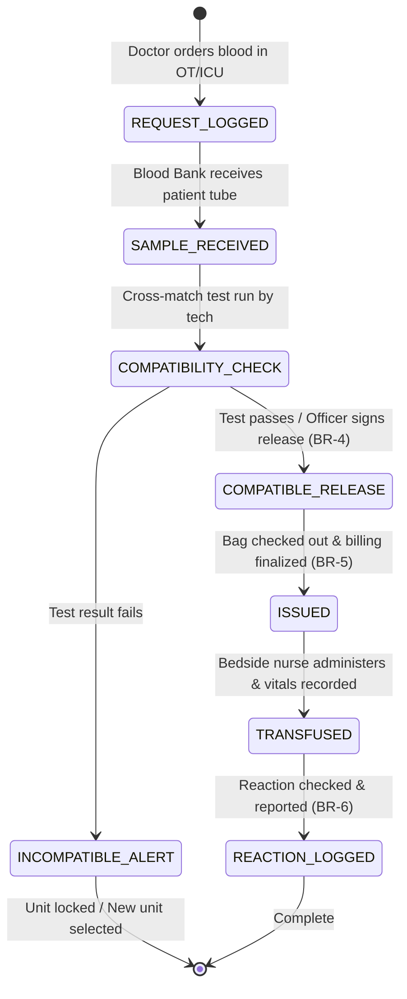

# Form/Module Spec — Blood Bank & Transfusion Management (BBTMS)

| | |
|---|---|
| **Status** | Draft |
| **Source** | pasted module analysis — *VH/NABH/BBTMS/01/2026* (2026-07-01) |
| **Existing code?** | **BBTMS tables are new.** Integrates with [`Patient`](../../backend/src/main/java/com/hms/entity/Patient.java) and EMR records inside [`31-mrd-emr.md`](./31-mrd-emr.md) (captures transfusion logs and reaction incidents). **⚠ Grounding correction:** `Patient` has **no `blood_group` column** today — the patient blood group this module cross-matches against must be **added to `Patient`** (foundational gap, like `date_of_birth`/`guardian_*`), not read from existing code. |

> **Read first — The Patient Transfusion Safety Loop.**
> **(1) Cross-Match & Eligibility Gate.** Before issuing any blood bag, the technician must enter cross-matching details in the `cross_match` table. The system must **automatically block** generating an issue receipt if the test result is `INCOMPATIBLE`, unless a supervisor signs off on an Emergency Release override (Rule 4).
> **(2) Blood Request Triggers.** During surgery execution ([`18-operation-record.md`](./18-operation-record.md)), surgeons record blood transfusions. The system should automatically post a `blood_request` to the Blood Bank indicating the patient UHID, components required (PRBC/FFP), and urgency (STAT/URGENT).
> **(3) Dynamic Expiry & Quarantine.** Blood bags have strict, short lifespans (e.g., PRBC 35 days, Platelets 5 days). The database records `expiry_date` in `blood_unit`. Once a unit exceeds this date, the system must change its status to `EXPIRED` and quarantine it, blocking any issue APIs (Rule 3).

---

## 1. Form/Module Overview
- **Department:** Blood Bank (primary); Emergency, ICU, OT, Obstetrics, Laboratory, Billing, MRD, Quality (secondary)
- **Module:** **Blood Bank → Donor → Collection → Testing → Components → Storage → Cross Match → Issue → Transfusion** (transfusion lifecycle platform)
- **Filled By:** Blood Bank Technician (donor screening, collection, testing); Attending Nurse (transfusion logs)
- **Approved / Verified By:** Blood Bank Officer (verification & issue approval)
- **Stored In:** `blood_donor` (database), `blood_unit`, `blood_request`, `cross_match`, and EMR records
- **Lifecycle:** donor registered & screened; blood collected; tested for infectious diseases; separated into components (PRBC, FFP, Platelets); units stored; matched with patient request; issued to ward; transfused and monitored; archived in patient EMR
- **NABH clause:** COP/HIC — blood and blood component transfusion safety; documented donor eligibility; mandatory testing (HIV, HBsAg, HCV, Syphilis); compatibility cross-matching procedures; hemovigilance programs.

## 2. Purpose
- **Hospital use:** tracks every blood bag from donor donation to recipient transfusion, managing safe stock levels and monitoring adverse reactions.
- **NABH requirement:** strict validation of screening tests, documented cross-matching logs, unique blood bag identifiers, and active hemovigilance audits.
- **Legal:** complies with Drug Controller General of India (DCGI) licensing rules on blood bank operations, logging donor deferrals and mandatory test logs.
- **Clinical:** protects patients from incompatible transfusions and hemolytic reactions by enforcing multi-stage compatibility checks.
- **Business rationale:** charges billing accounts for blood processing and component issuance, preventing revenue leakage.

## 3. Trigger
`Doctor orders blood in OT/ICU → Blood request logged → Patient sample cross-matched → Bag checked out by Blood Bank Officer (status ISSUED, BR-5) → Nurse initiates transfusion → Vitals monitored → Reaction checks completed`.

## 4. User Roles
| Actor | Capacity | Existing HMS role | Note |
|---|---|---|---|
| Blood Bank Tech | registers donors, collects blood bags, performs screening tests | — | role gap: `BLOOD_BANK_TECHNICIAN` |
| Blood Bank Officer | audits test results, approves cross-matches, signs issue slips | — | role gap: `BLOOD_BANK_OFFICER` |
| Ward/OT Nurse | collects issued blood bags, checks vitals, logs MAR transfusions | `NURSE` | ward attending nurse |
| Pathologist | performs laboratory testing (HIV, Malaria scans) | `DOCTOR` | lab consultant |
| Quality Manager | investigates transfusion reactions, reports hemovigilance | `HOSPITAL_ADMIN` | quality controller |
| Billing Clerk | verifies charges for processing and component issuing | `RECEPTIONIST` / Admin | billing desk |

## 5. Fields
Legend — Source: `auto`=fetched from context, `manual`=entered, `sig`=signature capture, `device`=laboratory scan.

| Field | Type | Max | Mandatory | Editable rule | DB column | Validation | Search | Print | Source |
|---|---|---|---|---|---|---|---|---|---|
| Donor Number | string | 20 | Y | read-only | `blood_donor.donor_number` | unique sequence | Y | Y | auto |
| Donor Name | string | 100 | Y | read-only | `blood_donor.name` | — | Y | Y | auto |
| Blood Group | enum | — | Y | read-only | `blood_donor.blood_group` | A / B / AB / O | Y | Y | auto |
| Rh Factor | enum | — | Y | read-only | `blood_donor.rh_type` | POSITIVE / NEGATIVE | Y | Y | auto |
| Blood Bag Number | string | 30 | Y | read-only | `blood_unit.unit_number` | unique index (BR-1) | Y | Y | auto/scan |
| Collection Date | datetime | — | Y | technician | `blood_unit.created_at` | not in future | N | Y | auto |
| Component Type | enum | — | Y | technician | `blood_unit.component_type` | WHOLE_BLOOD / PRBC / FFP / PLT / CRYO| Y | Y | manual |
| HIV Test Result | enum | — | Y | pathologist | `blood_unit.hiv_result` | REACTIVE / NON_REACTIVE | N | Y | device/manual |
| HBsAg Test Result | enum | — | Y | pathologist | `blood_unit.hbsag_result` | REACTIVE / NON_REACTIVE | N | Y | device/manual |
| Malaria Test Result | enum | — | Y | pathologist | `blood_unit.malaria_result` | REACTIVE / NON_REACTIVE | N | Y | device/manual |
| Unit Status | enum | — | Y | read-only | `blood_unit.status` | AVAILABLE / RESERVED / ISSUED / EXPIRED | Y | Y | auto |
| Requesting Patient | string | 20 | Y | read-only | (join `patient.custom_id`) | valid patient identity | Y | Y | auto |
| Cross-Match Result | enum | — | Y | technician | `cross_match.result` | COMPATIBLE / INCOMPATIBLE | N | Y | manual |
| Transfusion Start | datetime | — | Y | nurse | `transfusion_record.started_at` | not in future | N | Y | manual |
| Adverse Reaction | enum | — | Y | nurse | `transfusion_record.reaction` | NONE / FEBRILE / ALLERGIC / HEMOLYTIC | N | Y | manual |
| Officer Signature | sig | — | Y | final only | `cross_match.approved_by_sig` | signature blob | N | Y | sig |

## 6. Business Rules
- **BR-1** **Unique Bag Numbering:** Every blood collection bag must carry a unique, sequential barcode ID (`unit_number`) globally partitioned by tenant (Rule 1).
- **BR-2** **Component Traceability:** Each component split from a parent whole blood donation receives a separate row in `blood_unit` but must maintain reference to the parent donor ID (Rule 2).
- **BR-3** **Expiry Block:** Blood components past their expiration dates (PRBC > 35 days, FFP > 1 year, Platelets > 5 days) are automatically quarantined. Dispensing or issuing expired blood is blocked (Rule 3).
- **BR-4** **Cross-Match Enforce:** No blood unit can be marked as `ISSUED` without a corresponding `COMPATIBLE` entry in `cross_match` (Rule 4). Emergency release bypasses require a signed director override.
- **BR-5** **Single Recipient Mapping:** Every blood unit marked as `ISSUED` must link to exactly one patient ID in `transfusion_record` (Rule 5).
- **BR-6** **Transfusion Reaction Alarm:** Logging any adverse reaction type other than `NONE` automatically freezes the patient's active transfusion logs, quarantined adjacent bags, and alerts the Quality and Infection teams (Rule 6).
- **BR-7** **Tenant Isolation:** Every donor, blood unit, cross-match, and transfusion log must check `hospital_id` to enforce multi-tenant isolation.

## 7. Database Design
Evolves safety loops by introducing donor profiles, component splittings, and transfusion monitoring.

### Table `blood_donor` (new, tenant-owned):
Donor demographics and eligibility history.

| Column | Type | Notes |
|---|---|---|
| id | BIGINT PK | |
| hospital_id | BIGINT NOT NULL, FK | Tenant reference key, indexed |
| donor_number | VARCHAR(20) NOT NULL, unique| Unique lookup code |
| name | VARCHAR(100) NOT NULL | |
| blood_group | VARCHAR(5) NOT NULL | ABO classification |
| rh_type | VARCHAR(10) NOT NULL | POSITIVE / NEGATIVE |
| status | VARCHAR(20) NOT NULL | ELIGIBLE / DEFERRED |
| deferral_expiry | DATE | Date when temporary deferral ends |
| last_donation_date | DATE | |
| created_at | TIMESTAMP | |

### Table `blood_unit` (new, tenant-owned):
Specific blood component inventory logs.

| Column | Type | Notes |
|---|---|---|
| id | BIGINT PK | |
| hospital_id | BIGINT NOT NULL, FK | |
| unit_number | VARCHAR(30) NOT NULL, unique| Blood Bag ID |
| donor_id | BIGINT NOT NULL, FK | Parent donation link |
| component_type | VARCHAR(20) NOT NULL | Whole Blood, PRBC, FFP, Platelets, etc. |
| blood_group | VARCHAR(5) NOT NULL | |
| rh_type | VARCHAR(10) NOT NULL | |
| hiv_result | VARCHAR(20) | REACTIVE / NON_REACTIVE |
| hbsag_result | VARCHAR(20) | |
| malaria_result | VARCHAR(20) | |
| status | VARCHAR(20) NOT NULL | AVAILABLE / RESERVED / ISSUED / EXPIRED / QUARANTINED |
| expiry_date | DATE NOT NULL | Sterility expiration |
| created_at | TIMESTAMP | |

### Table `blood_request` (new, tenant-owned):
Requests generated by wards and OT.

| Column | Type | Notes |
|---|---|---|
| id | BIGINT PK | |
| hospital_id | BIGINT NOT NULL, FK | |
| patient_id | BIGINT NOT NULL, FK | |
| department | VARCHAR(50) NOT NULL | Requesting unit |
| component | VARCHAR(20) NOT NULL | PRBC / FFP / PLT |
| units_requested | INTEGER NOT NULL | |
| priority | VARCHAR(20) NOT NULL | ROUTINE / URGENT / STAT |
| status | VARCHAR(20) NOT NULL | PENDING / CROSS_MATCHING / FILLED / CANCELLED |
| created_at | TIMESTAMP | |

### Table `cross_match` (new, tenant-owned):
Patient-bag compatibility check records.

| Column | Type | Notes |
|---|---|---|
| id | BIGINT PK | |
| hospital_id | BIGINT NOT NULL, FK | |
| request_id | BIGINT NOT NULL, FK | |
| blood_unit_id | BIGINT NOT NULL, FK | |
| result | VARCHAR(20) NOT NULL | COMPATIBLE / INCOMPATIBLE |
| verified_by | BIGINT, FK | Blood Bank Officer ID |
| approved_by_sig | TEXT | Signature blob |
| verified_at | TIMESTAMP | |

### Table `transfusion_record` (new, tenant-owned):
EMR charts for bedside nurse checkoffs.

| Column | Type | Notes |
|---|---|---|
| id | BIGINT PK | |
| hospital_id | BIGINT NOT NULL, FK | |
| patient_id | BIGINT NOT NULL, FK | |
| blood_unit_id | BIGINT NOT NULL, FK | |
| started_at | TIMESTAMP NOT NULL | |
| completed_at | TIMESTAMP | |
| reaction | VARCHAR(30) NOT NULL | NONE / FEBRILE / ALLERGIC / HEMOLYTIC |
| nurse_id | BIGINT NOT NULL, FK | Attending nurse staff ID |

- **Indexes:** `(hospital_id, unit_number)` for bag scans. `(hospital_id, blood_group, status)` for inventory dashboard tallies.

## 8. APIs
Every `{id}` endpoint checks `hospital_id` to confirm patient ownership.

- **`POST /hospital/bloodbank/donor`**
  - **Roles:** `BLOOD_BANK_TECH`, `HOSPITAL_ADMIN`
  - **Request:** `{ "name": "Raj Kumar", "bloodGroup": "O", "rhType": "NEGATIVE" }`
  - **Response:** Created donor details JSON.
  - **Purpose:** Registers a blood donor and checks eligibility.

- **`POST /hospital/bloodbank/request`**
  - **Roles:** `DOCTOR`, `HOSPITAL_ADMIN`
  - **Request:** `{ "patientId": 1, "component": "PRBC", "unitsRequested": 2, "priority": "STAT" }`
  - **Response:** Created request details JSON.
  - **Purpose:** Generates a blood bank request from the ward (auto-bills processing fees).

- **`POST /hospital/bloodbank/crossmatch`**
  - **Roles:** `BLOOD_BANK_TECH`, `HOSPITAL_ADMIN`
  - **Request:** `{ "requestId": 12, "bloodUnitId": 4, "result": "COMPATIBLE" }`
  - **Response:** Created cross-match entry.
  - **Purpose:** Registers compatibility test results.

- **`POST /hospital/bloodbank/issue`**
  - **Roles:** `BLOOD_BANK_OFFICER`, `HOSPITAL_ADMIN`
  - **Request:** `{ "bloodUnitId": 4, "requestId": 12, "approvedBySig": "data..." }`
  - **Response:** Updated unit status `ISSUED`.
  - **Purpose:** Issues blood bag to ward runner after matching validation (BR-4).

- **`POST /hospital/bloodbank/transfusion`**
  - **Roles:** `NURSE`, `HOSPITAL_ADMIN`
  - **Request:** `{ "patientId": 1, "bloodUnitId": 4, "reaction": "NONE" }`
  - **Response:** Created transfusion log.
  - **Purpose:** Bedside nurse logs transfusion start and checkoffs.

## 9. UI Design
- **Blood Bank Dispatch Console (Desktop Optimized):**
  - **Reconciliation Board:** Split display showing Patient request details (left) and matching available blood bags (right). Mismatches (O+ bag selected for O- patient) flash red alerts.
  - **Stock Status Gauges:** Graphical cards displaying available units per blood group (PRBC, FFP, Platelets). Critical shortage limits flash orange.
  - **Cross-Match Sign-off Modal:** Verification box requiring credentials entry to confirm compatibility passes.

## 10. Workflow

## 11. Validation
- Biological expiries must verify collection timelines.
- Transfusion start times cannot precede the issue timestamp.
- Cross-matching approval blocks if the selected bag blood group is incompatible with the patient's record.

## 12. Permissions
| Role | Register Donor | Log Test | Verify Cross-Match | Issue Blood | Administer | view Dashboard |
|---|---|---|---|---|---|---|
| Tech | ✅ | ✅ | ❌ | ❌ | ❌ | ✅ |
| Officer | ✅ | ✅ | ✅ | ✅ | ❌ | ✅ (Full) |
| Doctor | Request | ❌ | ❌ | ❌ | ❌ | ✅ (Status check)|
| Nurse | ❌ | ❌ | ❌ | ❌ | ✅ (Transfuse)| Relevant Wards |
| Quality Auditor | ❌ | ❌ | ❌ | ❌ | ❌ | ✅ (Audit view) |
| Hospital Admin | ✅ | ✅ | ✅ | ✅ | ✅ | ✅ |

## 13. Print Rules
- Supports printing:
  - **Blood Bag labels:** barcode sticker detailing bag ID, donor group, collection date, expiry date, component type, and infectious screening clear seals.
  - **Cross-Match Report:** landscape sheet showing patient details, bag ID, testing methods, results, and pathologist/officer signatures.
  - **Blood Issue slip:** receipt confirming dispatch containing runner signatures.

## 14. Audit Logs
Recorded under `AuditLogService` with `entity_type="BLOOD_BANK"`:
- Donor registered (donor code, group).
- Blood bag collected (bag ID, donor ID).
- Disease testing finalized (HIV, HBsAg results).
- Cross-match verified (compatible status, unit ID, patient ID).
- Blood bag issued (unit ID, request ID).
- Transfusion reaction reported (reaction severity, ward).

## 15. Digital Improvements
- **Incompatible Lockout Gate:** Prevents human selection error by locking cross-matches that mismatch recipient groups.
- **Expiry quarantine:** Automatically blocks dispatch of expired platelets or plasma.
- **Traceable Hemovigilance:** Speeds investigation times by linking adverse reactions straight to original donor records.

## 16. Missing / Intelligent Features
- **Donor Kamp Scheduler:** Analyzes historical seasonal demand drops (e.g. holiday shortages) and auto-invites eligible donors via SMS/WhatsApp campaigns.
- **Reaction Spore Alerts:** Quarantines all adjacent blood components separated from the same parent donation if a transfusion reaction occurs in any recipient.
- **Blood Demand Forecasting:** Forecasts upcoming surgical needs based on the scheduled OT calendar to prioritize collections.

---

## Module & workflow placement
- **Owning module:** Blood Bank → Blood Bank & Transfusion Management (BBTMS).
- **Creates / Updates / Views / Prints / Archives:**
  - **Creates:** `blood_donor`, `blood_unit`, `blood_request`, `cross_match`, `transfusion_record`.
  - **Updates:** Deducts stock counts; updates billing accounts.
  - **Views:** Patient clinical history.
  - **Prints:** Blood bag stickers, Cross-match certificates, and issue slips.
  - **Archives:** Quality records.
- **Feeds into:** Operation Theatre Record (blood usage updates) · EMR Transfusion monitoring (bedside charts).
- **Fed by:** Surgeon order requests · Donor collections.
- **New modules this form implies:** Blood Bank Inventory Management · Hemovigilance surveillance desk.
