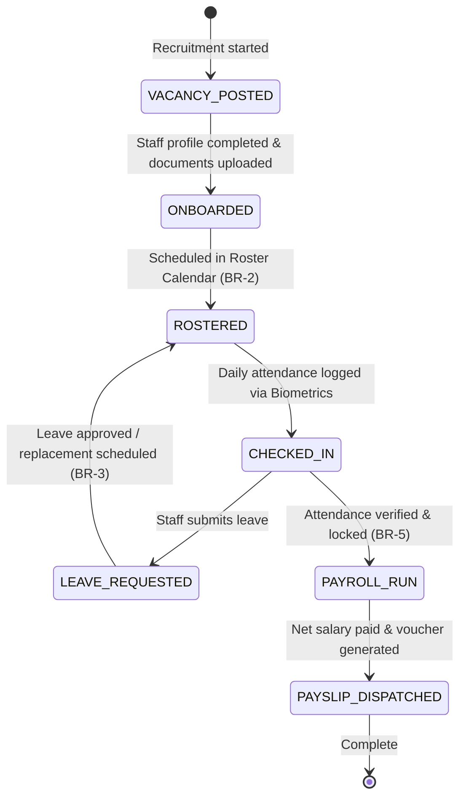

# Form/Module Spec — Human Resources, Payroll & Workforce Management

| | |
|---|---|
| **Status** | Draft |
| **Source** | pasted module analysis — *VH/NABH/HR/01/2026* (2026-07-01) |
| **Existing code?** | **HR tables are new.** Integrates with [`User`](../../backend/src/main/java/com/hms/entity/User.java) (for login credentials) and role entities like [`Doctor`](../../backend/src/main/java/com/hms/entity/Doctor.java), [`Nurse`](../../backend/src/main/java/com/hms/entity/Nurse.java), [`Pharmacist`](../../backend/src/main/java/com/hms/entity/Pharmacist.java), [`LabTechnician`](../../backend/src/main/java/com/hms/entity/LabTechnician.java), and [`RadiologyTechnician`](../../backend/src/main/java/com/hms/entity/RadiologyTechnician.java). |

> **Read first — The Hospital Human Capital safety loop.**
> **(1) Relational Link to User and Roles.** The HMS already maps distinct clinician tables ([`Doctor`](../../backend/src/main/java/com/hms/entity/Doctor.java), [`Nurse`](../../backend/src/main/java/com/hms/entity/Nurse.java)) to the core security login [`User`](../../backend/src/main/java/com/hms/entity/User.java). The new `employee` table must act as the primary profile container, carrying a `user_id` FK to link credentials and permissions under a unified ID (Rule 1).
> **(2) Roster Conflict Gate.** Shift allocation logic must validate that employees are not assigned overlapping shift hours or consecutive night rotations within the same calendar day (Rule 4).
> **(3) Medical License Validation.** Professional licensing columns (Medical/Nursing Council registrations) are critical for statutory audits. If any license passes its expiry threshold, the system must **immediately trigger warnings** on the dashboard and restrict scheduling the staff member for clinical procedures (Rule 6).

---

## 1. Form/Module Overview
- **Department:** Human Resources (primary); Administration, Finance, Nursing Administration, Medical Superintendent, Department Heads (secondary)
- **Module:** **Human Resources → Recruitment → Employee Management → Attendance → Roster → Payroll → Performance** (human capital management platform)
- **Filled By:** HR Executive (onboarding & payroll details); Department Head (shift rosters); Employees (leave requests)
- **Approved / Verified By:** Department Head (leaves); HR Manager (payroll validation)
- **Stored In:** `employee` (database), `attendance`, `shift_roster`, `leave_request`, and `payroll`
- **Lifecycle:** vacancy posted; candidate selected; onboarding documents verified; active roster scheduling; daily biometric clock-in; leave balances deducted; monthly payroll processed; performance audited; employee exited
- **NABH clause:** HRM — human resource management; credentials and verification of clinical staff (license verification); roster planning; mandatory training records (Fire Safety, Infection Control); employee health records.

## 2. Purpose
- **Hospital use:** coordinates workforce schedules across a 24/7 clinical environment, automates biometric attendance tracking, processes salary payouts, and audits license compliance.
- **NABH requirement:** mandatory primary-source verification of doctor/nurse clinical licenses, documented shift coverage rosters, and logs of clinical competency training.
- **Legal:** complies with national labor laws, manages PF/ESI payroll deductions, tracks professional taxes, and files TDS tax statements.
- **Clinical:** ensures optimal nurse-to-patient staffing ratios in high-risk zones (ICU, HDU) and maintains list of on-call emergency consultants.
- **Business rationale:** prevents roster double-booking, manages salary overhead allocations, and audits staff overtime levels.

## 3. Trigger
`Job vacancy approved → Candidate hired → Onboarding document verified → Shift roster generated → Daily check-in logged via biometric scan → Monthly attendance compiled → Payroll processed (this form) → Payslip issued`.

## 4. User Roles
| Actor | Capacity | Existing HMS role | Note |
|---|---|---|---|
| HR Executive | logs employee profiles, verifies qualifications, drafts contracts | — | role gap: `HR_EXECUTIVE` |
| HR Manager | validates payroll runs, approves salary changes, logs vacancies | — | role gap: `HR_MANAGER` |
| Department Head | schedules shift slots, clears leaves, checks daily coverage | `DOCTOR` / Nurse | supervisor |
| Staff Nurse / Doctor | checks duty rosters, logs attendance, applies for leave | `DOCTOR` / `NURSE` | staff self-service |
| Finance Manager | audits payroll totals and releases salary bank dispatches | `SUPER_ADMIN` / Finance | controller |
| Quality Auditor | reviews training completion rates and license registers | `HOSPITAL_ADMIN` | quality controller |

## 5. Fields
Legend — Source: `auto`=fetched from context, `manual`=entered, `sig`=signature capture.

| Field | Type | Max | Mandatory | Editable rule | DB column | Validation | Search | Print | Source |
|---|---|---|---|---|---|---|---|---|---|
| Employee Code | string | 20 | Y | read-only | `employee.employee_code` | unique code pattern (BR-1)| Y | Y | auto |
| Employee Name | string | 100 | Y | read-only | `user.name` | — | Y | Y | auto |
| Primary Role | enum | — | Y | read-only | `user.role` | DOCTOR / NURSE / PHARMACIST, etc. | Y | Y | auto |
| Department | string | 50 | Y | HR only | `employee.department` | valid hospital unit | Y | Y | auto/manual |
| Designation | string | 50 | Y | HR only | `employee.designation` | — | Y | Y | manual/auto |
| Professional License| string | 50 | cond. | HR only | `employee.license_number` | required for clinicians | Y | Y | manual |
| License Expiry | date | — | cond. | HR only | `employee.license_expiry` | required for clinicians | N | Y | manual |
| Shift Assigned | enum | — | Y | supervisor | `shift_roster.shift` | MORNING / EVENING / NIGHT / ON_CALL| N | Y | auto/manual |
| Roster Date | date | — | Y | supervisor | `shift_roster.date` | not in past | N | Y | auto/manual |
| Check-in Time | datetime | — | N | read-only | `attendance.check_in` | — | N | Y | biometric |
| Check-out Time | datetime | — | N | read-only | `attendance.check_out` | after check-in | N | Y | biometric |
| Leave Type | enum | — | Y | self | `leave_request.leave_type` | CASUAL / SICK / EARNED / MATERNITY | N | N | manual |
| Gross Salary | decimal | 10,2 | Y | HR only | `payroll.gross_salary` | > 0.00 | N | Y | auto |
| Total Deductions | decimal | 10,2 | Y | read-only | `payroll.deductions` | calculated PF/TDS | N | Y | auto |
| Net Salary Payout | decimal | 10,2 | Y | read-only | `payroll.net_salary` | calculated gross - deducts | N | Y | auto |
| HR Supervisor Sig | sig | — | Y | final only | `payroll.approved_by_sig` | signature blob | N | Y | sig |

## 6. Business Rules
- **BR-1** **Unique Staff ID:** Every employee record must be assigned a unique sequence code (`employee_code`) globally partitioned by tenant (Rule 1).
- **BR-2** **No Roster Overlaps:** Employees cannot be assigned overlapping shift hours or consecutive night duties within the same 24-hour cycle (Rule 4).
- **BR-3** ** Roster Update on Leave:** Approval of a `leave_request` must automatically mark the employee as `ON_LEAVE` in the `shift_roster` and notify the coordinator to schedule coverage (Rule 3).
- **BR-4** **License Expiry Check:** Clinicians with expired professional licenses (Medical/Nursing Council registrations) are automatically flagged. The system blocks scheduling them for clinical rosters or procedures (Rule 6).
- **BR-5** **Biometric Attendance Verification:** Monthly payroll compilation can only run after biometric attendance logs are locked and verified by the HR manager (Rule 2, Rule 5).
- **BR-6** **Immutable exit records:** Resigned or terminated employee profiles cannot be deleted. They transition to status `EXITED` and are archived for legal history (Rule 7).
- **BR-7** **Tenant Isolation:** Every employee profile, shift slot, leave sheet, attendance punch, and payroll record must check `hospital_id` to enforce multi-tenant isolation.

## 7. Database Design
Evolves safety loops by introducing employee registries, biometric logs, and roster tables.

### Table `employee` (new, tenant-owned):
Primary HR profiles linking to the security core.

| Column | Type | Notes |
|---|---|---|
| id | BIGINT PK | |
| hospital_id | BIGINT NOT NULL, FK | Tenant reference key, indexed |
| user_id | BIGINT NOT NULL, FK | Link to core security `User` |
| employee_code | VARCHAR(20) NOT NULL, unique| Staff code |
| department | VARCHAR(50) NOT NULL | |
| designation | VARCHAR(50) NOT NULL | |
| joining_date | DATE NOT NULL | |
| license_number | VARCHAR(50) | Medical registration license |
| license_expiry | DATE | Expiry check date |
| status | VARCHAR(20) NOT NULL | ACTIVE / ON_LEAVE / EXITED |
| created_at | TIMESTAMP | |

### Table `attendance` (new, tenant-owned):
Biometric check-in/out records.

| Column | Type | Notes |
|---|---|---|
| id | BIGINT PK | |
| hospital_id | BIGINT NOT NULL, FK | |
| employee_id | BIGINT NOT NULL, FK | Link to profile |
| check_in | TIMESTAMP | Biometric check-in |
| check_out | TIMESTAMP | Biometric check-out |
| shift | VARCHAR(20) NOT NULL | MORNING / EVENING / NIGHT |
| status | VARCHAR(20) NOT NULL | PRESENT / LATE / ABSENT |

### Table `shift_roster` (new, tenant-owned):
Workforce schedules.

| Column | Type | Notes |
|---|---|---|
| id | BIGINT PK | |
| hospital_id | BIGINT NOT NULL, FK | |
| employee_id | BIGINT NOT NULL, FK | |
| department | VARCHAR(50) NOT NULL | Unit scheduled |
| shift | VARCHAR(20) NOT NULL | MORNING / EVENING / NIGHT / ON_CALL |
| date | DATE NOT NULL | Scheduled calendar day |

### Table `leave_request` (new, tenant-owned):
Leave request approvals.

| Column | Type | Notes |
|---|---|---|
| id | BIGINT PK | |
| hospital_id | BIGINT NOT NULL, FK | |
| employee_id | BIGINT NOT NULL, FK | |
| leave_type | VARCHAR(30) NOT NULL | CASUAL / SICK / EARNED / MATERNITY |
| start_date | DATE NOT NULL | |
| end_date | DATE NOT NULL | |
| status | VARCHAR(20) NOT NULL | PENDING / APPROVED / REJECTED |
| approved_by | BIGINT, FK | Manager ID |

### Table `payroll` (new, tenant-owned):
Monthly salary logs.

| Column | Type | Notes |
|---|---|---|
| id | BIGINT PK | |
| hospital_id | BIGINT NOT NULL, FK | |
| employee_id | BIGINT NOT NULL, FK | |
| salary_month | VARCHAR(7) NOT NULL | e.g. 2026-06 |
| gross_salary | DECIMAL(10,2) NOT NULL | |
| deductions | DECIMAL(10,2) NOT NULL | PF / ESI / TDS |
| net_salary | DECIMAL(10,2) NOT NULL | Gross - deductions |
| approved_by_sig | TEXT | Supervisor signature blob |

- **Indexes:** `(hospital_id, employee_id, date)` for roster lookups. `(hospital_id, license_expiry)` for compliance alerts.

## 8. APIs
Every `{id}` endpoint checks `hospital_id` to confirm patient ownership.

- **`POST /hospital/hr/employee`**
  - **Roles:** `HR_EXECUTIVE`, `HOSPITAL_ADMIN`
  - **Request:** `{ "userId": 5, "department": "Nursing", "designation": "Staff Nurse", "joiningDate": "2026-07-01", "licenseNumber": "N-8876", "licenseExpiry": "2028-12-31" }`
  - **Response:** Created employee profile JSON.
  - **Purpose:** Onboards new staff.

- **`POST /hospital/hr/leave`**
  - **Roles:** `DOCTOR`, `NURSE`, `PHARMACIST`, `HOSPITAL_ADMIN`
  - **Request:** `{ "leaveType": "CASUAL", "startDate": "2026-07-10", "endDate": "2026-07-12" }`
  - **Response:** Created request details JSON with status `PENDING`.
  - **Purpose:** Employee self-service leave submission.

- **`POST /hospital/hr/leave/approve/{id}`**
  - **Roles:** `HR_MANAGER`, `HOSPITAL_ADMIN`
  - **Request:** `{ "status": "APPROVED" }`
  - **Response:** Approved status (triggers auto-roster updates, BR-3).
  - **Purpose:** Manager leaf approval.

- **`POST /hospital/hr/payroll/process`**
  - **Roles:** `HR_MANAGER`, `FINANCE`, `HOSPITAL_ADMIN`
  - **Request:** `{ "salaryMonth": "2026-06" }`
  - **Response:** Processed payroll records count.
  - **Purpose:** Compiles monthly salary records (BR-5).

## 9. UI Design
- **Roster Builder Console (Desktop Optimized):**
  - **Grid Calendar View:** Horizontal grid displaying departments (rows) and dates (columns). Cells host employee names and shift markers (M/E/N/OC).
  - **Roster Conflict Indicator:** Auto-flags overlap warnings in yellow if a nurse is assigned double shifts.
  - **Compliance Checklist Sidebar:** Banners tracking staff counts in critical wards (e.g. ICU needs minimum 5 nurses per shift, highlights red if coverage drops).
- **Employee Self-Service (Mobile Optimized):**
  - Mobile panel for check-in punches, leave requests, and payslip downloads.

## 10. Workflow

## 11. Validation
- Leave dates must not overlap with existing approved requests.
- Biometric check-out times must follow check-in timestamps.
- Roster assignments will reject if the employee is marked as `ON_LEAVE`.

## 12. Permissions
| Role | Onboard Staff | Customize Roster | Approve Leave | Compile Payroll | view Self Dashboard |
|---|---|---|---|---|---|
| Employee | ❌ | ❌ | Apply | ❌ | Own profile |
| Supervisor | ❌ | ✅ (Own dept) | ✅ (Own dept) | ❌ | ✅ |
| HR Manager | ✅ | ✅ | ✅ | ✅ | ✅ (Full) |
| Finance Manager | ❌ | ❌ | ❌ | ✅ (Verify) | ✅ |
| Quality Auditor | ❌ | ❌ | ❌ | ❌ | ✅ (Audit view) |
| Hospital Admin | ✅ | ✅ | ✅ | ✅ | ✅ |

## 13. Print Rules
- Supports printing:
  - **Employee ID Card:** credit-card format containing name, code, department, emergency contacts, and barcode verification.
  - **Monthly Shift Roster:** landscape matrix showing department shift allocations for print boards.
  - **Payslip Voucher:** standard corporate slip printer format showing gross breakdown, PF deductions, tax, net salary, and manager seals.

## 14. Audit Logs
Recorded under `AuditLogService` with `entity_type="HR"`:
- Employee profile created (employee code, roles).
- License renewal warning sent (license number, expiry date).
- Leave request approved (leave ID, approver).
- Shift roster conflict resolved (date, shift, employees).
- Biometric attendance manual correction logged (employee, editor ID).
- Payroll month locked and processed (salary month, net payout total).

## 15. Digital Improvements
- **Automated Roster Shift Gates:** Eliminates staffing shortages by notifying managers to schedule coverage upon leave approvals.
- **Council License Warnings:** Protects clinical quality checks by blocking expired clinicians from roster allocations.
- **Biometric Integration Reconciliations:** Prevents duplicate spreadsheet calculations by connecting card punches straight to payroll.

## 16. Missing / Intelligent Features
- **Smart Nurse Rostering Optimizer:** Automatically builds shift rosters complying with staffing regulations, avoiding excessive night duties.
- **Staff Attrition Predictor:** Evaluates attendance patterns, overtime levels, and performance reviews to highlight staff at risk of resigning.
- **Workforce Demand Forecaster:** Evaluates upcoming OT case schedules and bed occupancies to suggest dynamic staffing increases.

---

## Module & workflow placement
- **Owning module:** Human Resources → human Capital Management (HCM).
- **Creates / Updates / Views / Prints / Archives:**
  - **Creates:** `employee`, `attendance`, `shift_roster`, `leave_request`, `payroll`.
  - **Updates:** Controls user availability in OT registers and EMR clinical nodes.
  - **Views:** Active credentials listings.
  - **Prints:** ID cards, Shift rosters, and payslips.
  - **Archives:** Quality records.
- **Feeds into:** Finance Module (payroll bank dispatch files) · Nursing station (shift assignments).
- **Fed by:** Clinical rosters · Biometric attendance scans.
- **New modules this form implies:** Shift Scheduling Engine · Biometric Attendance Integration bridge.
