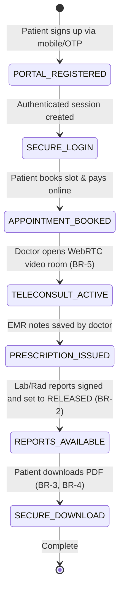

# Form/Module Spec — Patient Portal & Digital Engagement

| | |
|---|---|
| **Status** | Draft |
| **Source** | pasted module analysis — *VH/NABH/PT/01/2026* (2026-07-01) |
| **Existing code?** | **Portal tables are new.** Integrates with [`Patient`](../../backend/src/main/java/com/hms/entity/Patient.java) (holds demographic records), [`Appointment`](../../backend/src/main/java/com/hms/entity/Appointment.java) (online booking), [`Billing`](../../backend/src/main/java/com/hms/entity/Billing.java) (online payments), and EMR components inside [`31-mrd-emr.md`](./31-mrd-emr.md). |

> **Read first — Keep Patient Records Secure and Private.**
> **(1) Relational Link to core security User.** To utilize existing JWT authentication filters and Spring security roles, the portal must link the new `patient_portal_user` to the core [`User`](../../backend/src/main/java/com/hms/entity/User.java) table using role `PATIENT`. All patient login processes should route through the central authentication endpoints.
> **(2) Released Reports Gate.** Patients cannot view draft lab results or radiology reports. The portal retrieval APIs must check the target order status ([`27-lab-information-system.md`](./27-lab-information-system.md) and [`28-radiology-information-system.md`](./28-radiology-information-system.md)) to confirm they are set to `RELEASED` before displaying (Rule 2).
> **(3) Online Billing Gateway Reconcile.** When a patient completes a credit card or UPI payment via the portal gateway, the system must trigger a callback that inserts a `BillingPayment` transaction, updates the bill status to `PAID`, and recomputes patient ledger balances (Billing BR-2).

---

## 1. Form/Module Overview
- **Department:** Hospital Administration (primary); OPD, IPD, Laboratory, Radiology, Pharmacy, Billing, MRD, IT (secondary)
- **Module:** **Patient Portal → Appointments → Medical Records → Reports → Billing → Telemedicine → Notifications** (patient experience & engagement platform)
- **Filled By:** Patient (demographic updates, bookings, payments); System (auto-populates EMR records)
- **Approved / Verified By:** Patient (consents); Billing Gateway (payment approvals)
- **Stored In:** `patient_portal_user` (database), `portal_notification`, `teleconsultation`, and `patient_consent`
- **Lifecycle:** portal user registers; mobile OTP verified; portal dashboard loaded; appointments booked online; medical records accessed; online payments completed; virtual teleconsultations attended; access revoked
- **NABH clause:** AAC/ROM — patient information and engagement; standard process for providing patients access to their clinical reports; secure patient record privacy; billing estimates transparency.

## 2. Purpose
- **Hospital use:** provides a secure patient-facing portal allowing online appointments, payment checkouts, and report downloads, reducing reception desk congestion.
- **NABH requirement:** patient access to standard records, transparent estimation sheets, and secure, credentialed access checking (privacy compliance).
- **Legal:** protects patient privacy (HIPAA/DISHA compliant), logging all medical records views, and securing consents for family caregivers.
- **Clinical:** facilitates continuous care through digital follow-up reminders, teleconsultation audio/video links, and active EMR summaries.
- **Business rationale:** increases booking conversions, reduces patient no-shows, and captures outstanding patient balances online.

## 3. Trigger
`Patient registers online → Mobile OTP verified → EMR profile linked → Portal login (this form) → Appointments scheduled OR bills paid → Lab/Rad reports ready → PDF downloaded → Teleconsultation attended`.

## 4. User Roles
| Actor | Capacity | Existing HMS role | Note |
|---|---|---|---|
| Patient | logs in, books appointments, pays bills, downloads reports | `PATIENT` (New role) | account owner |
| Guardian / Relative | views child/ward records, completes payments | `PATIENT` (Delegate) | authorized delegate |
| Doctor | conducts video consults, uploads digital prescriptions | `DOCTOR` | attending physician |
| Cashier | reconciles online payment dispatches in finance dashboard | `RECEPTIONIST` / Billing | cash counter clerk |
| Quality Auditor | reviews portal audit logs for privacy violations | `HOSPITAL_ADMIN` | quality controller |
| System Admin | manages portal credentials and configures telemedicine servers | `HOSPITAL_ADMIN` | IT administrator |

## 5. Fields
Legend — Source: `auto`=fetched from context, `manual`=entered, `sig`=signature capture.

| Field | Type | Max | Mandatory | Editable rule | DB column | Validation | Search | Print | Source |
|---|---|---|---|---|---|---|---|---|---|
| Patient Portal ID | string | 20 | Y | read-only | `patient_portal_user.id` | unique sequence | Y | Y | auto |
| Mobile Number | string | 15 | Y | read-only | `patient_portal_user.mobile` | valid phone pattern | Y | N | auto/OTP |
| Email Address | string | 100 | N | patient | `patient_portal_user.email` | valid email format | Y | N | manual |
| Patient UHID | string | 20 | Y | read-only | (join `patient.custom_id`) | valid patient identity | Y | Y | auto |
| Patient Name | string | 100 | Y | read-only | `patient.name` | — | Y | Y | auto |
| Booking Department | string | 50 | Y | patient | `appointment.department` | valid hospital specialty | N | Y | manual/auto |
| Booking Doctor | string | 100 | Y | patient | (join `doctor.name`) | must match schedule | Y | Y | manual/auto |
| Slot Time | datetime | — | Y | patient | `appointment.time` | not in past | N | Y | manual/auto |
| Tele-Meeting Link | string | 500 | cond. | doctor | `teleconsultation.meeting_link`| valid URL (required if video) | N | N | auto |
| Consent Type | enum | — | Y | patient | `patient_consent.consent_type` | VIEW_REPORTS / FULL_ACCESS | N | Y | manual |
| Granted To Name | string | 100 | Y | patient | `patient_consent.granted_to` | valid identity / relationship | Y | Y | manual |
| Payer Reference ID | string | 100 | cond. | payment gateway| `billing_payments.reference_no` | required if paid | Y | Y | auto |
| Consent Signature | sig | — | Y | patient | `patient_consent.signature_blob` | signature blob | N | Y | sig |

## 6. Business Rules
- **BR-1** **Delegate Verification:** Patients can only access EMR files linked to their own patient ID unless explicit delegate permission is registered in the `patient_consent` table (Rule 1).
- **BR-2** **Released Reports Gate:** Clinical diagnostic files are hidden from the portal view until the LIS or RIS updates the order status to `RELEASED` after pathologist/radiologist sign-off (Rule 2).
- **BR-3** **Prescription Read-Only:** Prescriptions and clinical summaries visible in the portal timeline are read-only. Patients cannot modify or delete clinical files (Rule 7).
- **BR-4** **Audit Trail Logging:** Every portal session, record lookup, and report download must write a log in `AuditLog` recording the patient portal ID, action, and accessed document ID (Rule 6).
- **BR-5** **Tele-Consult Appointment Gate:** Generating a telemedicine video room requires a pre-scheduled, active `Appointment` in confirmed status (Rule 4).
- **BR-6** **Notification Triggers:** Portal actions (payment received, appointment booked) must trigger real-time WhatsApp, SMS, or push notifications using the existing notification templates.
- **BR-7** **Tenant Isolation:** Every portal user, teleconsultation room, consent ledger, and notification transaction must carry `hospital_id` to enforce multi-tenant isolation.

## 7. Database Design
Evolves safety loops by introducing portal accounts, telemedicine links, and consent directories.

### Table `patient_portal_user` (new, tenant-owned):
Patient credentials and verification links.

| Column | Type | Notes |
|---|---|---|
| id | BIGINT PK | |
| hospital_id | BIGINT NOT NULL, FK | Tenant reference key, indexed |
| patient_id | BIGINT NOT NULL, unique, FK| Link to patient profile |
| mobile | VARCHAR(15) NOT NULL | Registered mobile |
| email | VARCHAR(100) | |
| last_login | TIMESTAMP | |
| status | VARCHAR(20) NOT NULL | ACTIVE / LOCKED / SUSPENDED |

### Table `portal_notification` (new, tenant-owned):
Tracks portal alerts and push queues.

| Column | Type | Notes |
|---|---|---|
| id | BIGINT PK | |
| hospital_id | BIGINT NOT NULL, FK | |
| patient_id | BIGINT NOT NULL, FK | |
| notification_type | VARCHAR(30) NOT NULL | APPOINTMENT / BILLING / REPORT_READY / MED_REMINDER |
| title | VARCHAR(150) NOT NULL | |
| status | VARCHAR(20) NOT NULL | PENDING / SENT / READ |
| sent_at | TIMESTAMP | |

### Table `teleconsultation` (new, tenant-owned):
Virtual consultation rooms.

| Column | Type | Notes |
|---|---|---|
| id | BIGINT PK | |
| hospital_id | BIGINT NOT NULL, FK | |
| doctor_id | BIGINT NOT NULL, FK | |
| patient_id | BIGINT NOT NULL, FK | |
| appointment_id | BIGINT NOT NULL, unique, FK| Link to scheduler slot |
| meeting_link | VARCHAR(500) NOT NULL | WebRTC/Zoom video URL |
| status | VARCHAR(20) NOT NULL | SCHEDULED / ACTIVE / COMPLETED |
| started_at | TIMESTAMP | |
| ended_at | TIMESTAMP | |

### Table `patient_consent` (new, tenant-owned):
Manages authorized family/caregiver record access.

| Column | Type | Notes |
|---|---|---|
| id | BIGINT PK | |
| hospital_id | BIGINT NOT NULL, FK | |
| patient_id | BIGINT NOT NULL, FK | Owner patient ID |
| consent_type | VARCHAR(30) NOT NULL | VIEW_REPORTS / FULL_ACCESS |
| granted_to | VARCHAR(100) NOT NULL | Target user's relationship / email |
| signature_blob | TEXT | Base64 signature verification |
| status | VARCHAR(20) NOT NULL | ACTIVE / REVOKED |
| created_at | TIMESTAMP | |

- **Indexes:** `(hospital_id, patient_id)` for portal profiles. `(hospital_id, status)` for active notification queues.

## 8. APIs
Every `{id}` endpoint checks `hospital_id` to confirm patient ownership.

- **`POST /hospital/portal/register`**
  - **Roles:** `anonymous`
  - **Request:** `{ "mobile": "9876543210", "patientId": 3 }`
  - **Response:** Success confirmation JSON (OTP dispatched).
  - **Purpose:** Registers a portal account.

- **`POST /hospital/portal/login`**
  - **Roles:** `anonymous`
  - **Request:** `{ "mobile": "9876543210", "otp": "123456" }`
  - **Response:** JWT access token with role `PATIENT`.
  - **Purpose:** Authenticates patient portal sessions.

- **`GET /hospital/portal/dashboard/{patientId}`**
  - **Roles:** `PATIENT` (Owner/Delegate checks)
  - **Response:** Upcoming appointments, unreleased bills, and released reports checklist.
  - **Purpose:** Feeds portal home page dashboard.

- **`POST /hospital/portal/payment`**
  - **Roles:** `PATIENT`
  - **Request:** `{ "billingId": 12, "amount": 1500.00, "gatewayRef": "PAY-987" }`
  - **Response:** Payment reconciliation status.
  - **Purpose:** Executes billing checkouts (updates `Billing` status, BR-3).

- **`POST /hospital/portal/consent`**
  - **Roles:** `PATIENT`
  - **Request:** `{ "grantedTo": "wife@hms.com", "consentType": "VIEW_REPORTS", "signatureBlob": "data..." }`
  - **Response:** Created consent details.
  - **Purpose:** Authorizes caregiver views (BR-1).

## 9. UI Design
- **Patient Dashboard (Mobile Web Optimized):**
  - **Bento-Grid Dashboard:** Quick access panels (Book Visit, My Reports, Pay Bill, Tele-Consult).
  - **Clinical Timeline Slider:** Chronological timeline showing hospital history, color-coded by event (blue consults, green tests, red surgeries).
  - **Medical Documents Drawer:** Secure cabinet listing PDF prescriptions and released reports with download buttons.
  - **Tele-Meeting widget:** Auto-shows a "Join Video Consultation" button 10 minutes prior to scheduled slots.

## 10. Workflow

## 11. Validation
- Online payment callbacks require validated gateway signatures.
- Date filters cannot be set to future calendars for EMR queries.
- Booking endpoints block slots if target doctor hours are unavailable.

## 12. Permissions
| Role | View Own EMR | Book Slot | Complete Payment | View Delegate EMR | Revoke Consent | view Dashboard |
|---|---|---|---|---|---|---|
| Patient | ✅ | ✅ | ✅ | ❌ | ✅ | ✅ |
| Guardian | ✅ (Authorized)| ✅ | ✅ | ✅ | ❌ | ✅ |
| Doctor | ✅ (Attending) | ❌ | ❌ | ❌ | ❌ | ❌ |
| Cashier | ❌ | ❌ | ✅ (Audit) | ❌ | ❌ | ❌ |
| Hospital Admin | ❌ | ✅ (Manage) | ✅ (Audit) | ❌ | ✅ (Override)| ✅ (Manage) |

## 13. Print Rules
- Supports printing:
  - **Appointment Slip:** receipt format containing doctor name, booking date, queue token, and location map.
  - **Tax Receipt:** slip printer format confirming billing transaction details.
  - **Released Reports:** standard LIS/RIS layouts watermarked "PATIENT COPY - DOWNLOADED VIA PORTAL".

## 14. Audit Logs
Recorded under `AuditLogService` with `entity_type="PATIENT_PORTAL"`:
- Portal account registered.
- Patient record accessed (patient ID, ip address).
- Lab report downloaded (order ID, patient ID).
- Online gateway payment completed (billing ID, amount).
- Access consent granted (granted to, consent type).
- Tele-consultation session started/ended (meeting room ID, duration).

## 15. Digital Improvements
- **Released Gating:** Guarantees patient safety by preventing access to unverified diagnostic findings.
- **Paperless Receipts:** Reduces administrative workload by allowing online bill downloads.
- **Online Checkout Loop:** Minimizes patient discharge delays by allowing payments from bedside.

## 16. Missing / Intelligent Features
- **Intelligent Adherence Reminders:** Automatically sends push warnings reminding patients to take medications based on EMR schedules.
- **AI Health Brief Compiler:** Synthesizes patient medical history into a clean visual chart for caregiver reviews.
- **Preventive Care Calendar:** Recommends screening checkups based on age, gender, and previous diagnoses.

---

## Module & workflow placement
- **Owning module:** Hospital Administration → Patient Engagement (Portal Suite).
- **Creates / Updates / Views / Prints / Archives:**
  - **Creates:** `patient_portal_user`, `portal_notification`, `teleconsultation`, `patient_consent`.
  - **Updates:** Updates payment statuses in `Billing` and schedules in `Appointment`.
  - **Views:** Patient EMR history.
  - **Prints:** Receipts, Appointment slips, and reports.
  - **Archives:** EMR logs.
- **Feeds into:** Billing Gateway (online collections) · EMR Timeline (patient lookup).
- **Fed by:** Released diagnostics · Doctor scheduling calendars.
- **New modules this form implies:** Patient Portal UI · WebRTC Telemedicine core.
