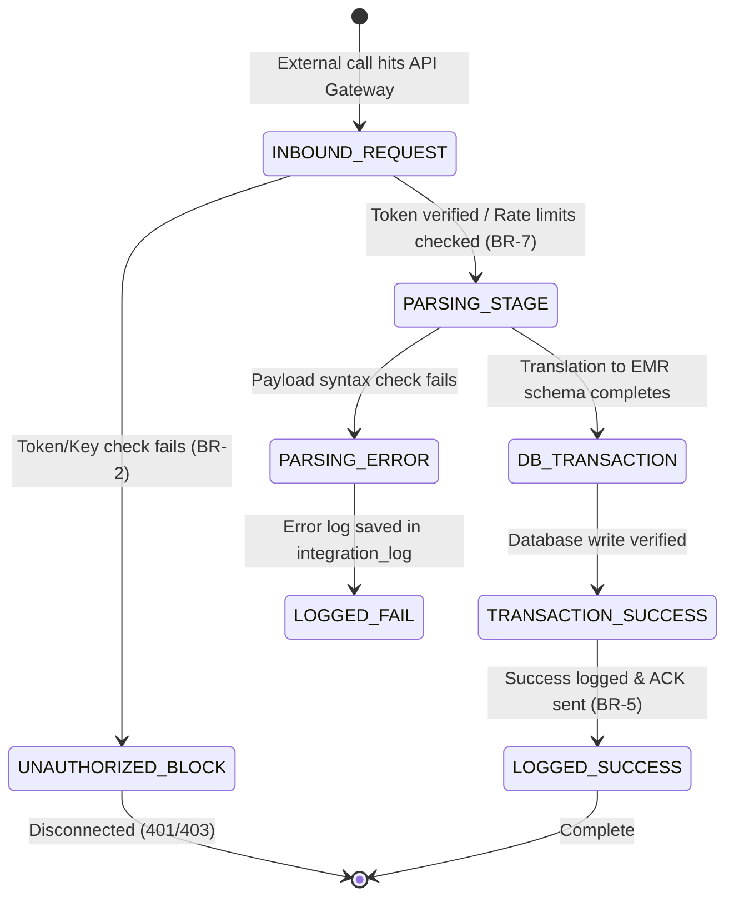

# Form/Module Spec — Integration Engine & Interoperability Platform

| | |
|---|---|
| **Status** | Draft |
| **Source** | pasted module analysis — *VH/NABH/INT/01/2026* (2026-07-01) |
| **Existing code?** | **Integration tables are new.** Operates as an API Gateway and transaction routing layer mapping inputs directly to core tables like [`Patient`](../../backend/src/main/java/com/hms/entity/Patient.java) (demographics), [`LabOrder`](../../backend/src/main/java/com/hms/entity/LabOrder.java) (HL7 ORM), [`RadiologyOrder`](../../backend/src/main/java/com/hms/entity/RadiologyOrder.java) (DICOM Worklist), and [`Billing`](../../backend/src/main/java/com/hms/entity/Billing.java) (Payment Gateways). |

> **Read first — The Digital Nervous System of the HMS.**
> **(1) Unified API Gateway routing.** External systems must never access transactional databases directly. All laboratory analyzer imports, PACS uploads, and insurance claims must pass through the API Gateway, validating tenant tokens (`hospital_id`) and verifying rate limits (Rule 1, Rule 2, Rule 7).
> **(2) HL7/FHIR Data Transformation.** Incoming HL7 ADT/ORM messages and FHIR Observation resources must be translated and written straight to the matching operational tables (e.g. ADT triggers IPD admissions, ORU pushes results to `LabResult` JSON parameters array).
> **(3) Webhook Reconciliations.** Webhook callbacks received from payment providers (UPI/Card gateways) must insert a `BillingPayment` ledger entry and update `Billing` payment status to `PAID` (Billing BR-2).

---

## 1. Form/Module Overview
- **Department:** IT Department (primary); Every operational and clinical HMS department (secondary)
- **Module:** **Integration → API Gateway → HL7 → FHIR → DICOM → Webhook → External Systems** (healthcare interoperability gateway)
- **Filled By:** System (automated API routing & translation); Integration Engineer (connector mapping)
- **Approved / Verified By:** IT Administrator (API client credentials & SSL keys)
- **Stored In:** `api_client` (database), `integration_log`, `webhook_event`, and `device_connection`
- **Lifecycle:** external client requests token; API gateway verifies rate limits; HL7/FHIR message received; payload parsed; internal database updated; delivery response returned; transaction logged
- **NABH clause:** AAC/MIS — patient record interoperability; secure transfer of clinical datasets; standards compliance (HL7, FHIR, DICOM); access control monitoring.

## 2. Purpose
- **Hospital use:** centralizes all inbound and outbound data transfers, connecting laboratory devices, PACS imaging modalities, payer portals, and government scheme systems.
- **NABH requirement:** secure transmission of patient records, validation of device data capture accuracy, and audited logs of external information exchanges.
- **Legal:** complies with national healthcare data privacy standards (e.g. ABDM in India, HIPAA in US), enforcing encryption of patient data in transit.
- **Clinical:** automatically imports blood counts and radiology scan impressions straight from devices to EMR files, reducing transcription lag.
- **Business rationale:** prevents collection leakage through real-time payment gateway webhooks and coordinates automated stock purchase dispatches.

## 3. Trigger
`External event occurs (laboratory analyzer finishes test OR gateway receives payment) → Webhook callback received (this form) → API Gateway validates client token → Payload parsed to internal format → DB records updated → Success response dispatched`.

## 4. User Roles
| Actor | Capacity | Existing HMS role | Note |
|---|---|---|---|
| Integration Engineer| configures APIs, maps FHIR resources, sets rate limits | — | role gap: `INTEGRATION_ENGINEER`|
| IT Administrator | monitors gateway health, resets credentials, audits logs | `HOSPITAL_ADMIN` | IT director |
| Software Developer | tests APIs, builds third-party custom connectors | — | external vendor role |
| Hospital Admin | views integration dashboards and device online statuses | `HOSPITAL_ADMIN` | administration view |
| Quality Manager | reviews audit logs for information security compliance | `HOSPITAL_ADMIN` | quality controller |
| Billing Cashier | monitors payment webhook confirmations | `RECEPTIONIST` / Billing | cash desk |

## 5. Fields
Legend — Source: `auto`=fetched from context, `manual`=entered, `sig`=signature capture.

| Field | Type | Max | Mandatory | Editable rule | DB column | Validation | Search | Print | Source |
|---|---|---|---|---|---|---|---|---|---|
| Client ID | string | 50 | Y | admin | `api_client.client_name` | unique client identifier | Y | N | auto |
| API Key Token | string | 100 | Y | admin | `api_client.api_key` | secure hash | N | N | auto |
| Rate Limit (Req/Min)| int | — | Y | admin | `api_client.rate_limit` | > 0 (BR-7) | N | N | manual |
| Client Status | enum | — | Y | admin | `api_client.status` | ACTIVE / SUSPENDED | Y | N | manual |
| Message Source | string | 50 | Y | read-only | `integration_log.source_system` | e.g. LIS_ANALYZER, PACS_SERVER | Y | N | auto |
| Message Destination | string | 50 | Y | read-only | `integration_log.destination_system`| e.g. STRYNKIX_HMS, STAR_HEALTH | Y | N | auto |
| Message Type | enum | — | Y | read-only | `integration_log.message_type` | HL7_ADT / HL7_ORU / FHIR_PATIENT | Y | N | auto |
| Payload Content | text | — | Y | read-only | `integration_log.payload` | valid JSON / XML / HL7 structure| N | N | auto |
| Integration Status | enum | — | Y | read-only | `integration_log.status` | SUCCESS / FAILED / RETRYING | Y | N | auto |
| Device Protocol | enum | — | Y | engineer | `device_connection.protocol` | ASTM / HL7 / DICOM / MODBUS | N | N | manual |
| Device Online Status | enum | — | Y | read-only | `device_connection.status` | ONLINE / OFFLINE / FAULT | Y | N | auto |
| Webhook Event Type | string | 100 | Y | read-only | `webhook_event.event_type` | e.g. payment.success, patient.created| Y | N | auto |
| Verification Sign | sig | — | Y | final only | `api_client.approved_by_sig` | signature blob | N | N | sig |

## 6. Business Rules
- **BR-1** **Gateway Gating:** All external applications, PACS networks, and lab analyzers must connect exclusively through the API Gateway. Direct database writes are blocked (Rule 1).
- **BR-2** **Mandatory Authentication:** Every incoming API request must be validated using JWT headers or signed API keys (Rule 2).
- **BR-3** **Secure Transmission:** All patient health data exchanged with external endpoints must be encrypted using TLS 1.3 in transit (Rule 3).
- **BR-4** **Retry Queue Policies:** Failed outbound webhook dispatches (e.g. sending reports to national registers) must trigger automatic retry loops up to a maximum of 5 attempts before quarantine (Rule 4).
- **BR-5** **Full Observability Logs:** Every API transaction must write an entry in `integration_log` tracking client ID, payload hash, response latency, and transfer status (Rule 5).
- **BR-6** **Backward Compatibility:** Exposed endpoint updates must maintain backward compatibility for a minimum of 12 months using versioned namespaces (e.g., `/api/v1/` and `/api/v2/`) (Rule 6).
- **BR-7** **Rate Limit Defense:** Dynamic rate limits configured on the client profile must be enforced. Excess requests are rejected with status `429 Too Many Requests` (Rule 7).
- **BR-8** **Tenant Isolation:** Every client credential, integration log, and webhook transaction must check `hospital_id` to enforce multi-tenant isolation.

## 7. Database Design
Introduces gateway logging, client credential registries, and device connection tables.

### Table `api_client` (new, tenant-owned):
Registers authorized external integrations.

| Column | Type | Notes |
|---|---|---|
| id | BIGINT PK | |
| hospital_id | BIGINT NOT NULL, FK | Tenant reference key, indexed |
| client_name | VARCHAR(50) NOT NULL | e.g. Star_Health_TPA, LIS_Analyzer_01 |
| api_key | VARCHAR(100) NOT NULL | Secure hashed API key |
| status | VARCHAR(20) NOT NULL | ACTIVE / SUSPENDED |
| rate_limit | INTEGER NOT NULL | Max requests per minute |
| approved_by_sig | TEXT | Supervisor signature blob |
| created_at | TIMESTAMP | |

### Table `integration_log` (new, tenant-owned):
Tracks chronological transaction histories.

| Column | Type | Notes |
|---|---|---|
| id | BIGINT PK | |
| hospital_id | BIGINT NOT NULL, FK | |
| source_system | VARCHAR(50) NOT NULL | |
| destination_system | VARCHAR(50) NOT NULL | |
| message_type | VARCHAR(50) NOT NULL | HL7_ADT / FHIR_PATIENT / WEBHOOK |
| payload | TEXT NOT NULL | Raw data payload |
| status | VARCHAR(20) NOT NULL | SUCCESS / FAILED / RETRYING |
| error_message | TEXT | Nullable |
| created_at | TIMESTAMP NOT NULL | |

### Table `webhook_event` (new, tenant-owned):
Holds incoming payment and patient sync events.

| Column | Type | Notes |
|---|---|---|
| id | BIGINT PK | |
| hospital_id | BIGINT NOT NULL, FK | |
| event_type | VARCHAR(100) NOT NULL | e.g. payment.callback |
| payload_reference | TEXT NOT NULL | Hashed payload details |
| status | VARCHAR(20) NOT NULL | PENDING / PROCESSED / FAILED |
| received_at | TIMESTAMP NOT NULL | |

### Table `device_connection` (new, tenant-owned):
Registers physical medical devices communicating over network ports.

| Column | Type | Notes |
|---|---|---|
| id | BIGINT PK | |
| hospital_id | BIGINT NOT NULL, FK | |
| device_name | VARCHAR(100) NOT NULL | e.g. ICU Monitor Bed 4 |
| department | VARCHAR(50) NOT NULL | |
| protocol | VARCHAR(20) NOT NULL | ASTM / HL7 / DICOM |
| status | VARCHAR(20) NOT NULL | ONLINE / OFFLINE / FAULT |
| last_data_received | TIMESTAMP | |

- **Indexes:** `(hospital_id, message_type, status)` for queue auditing. `(hospital_id, device_name)` for connectivity monitoring.

## 8. APIs
Every `{id}` endpoint checks `hospital_id` to confirm patient ownership.

- **`POST /hospital/integration/register-client`**
  - **Roles:** `IT_ADMIN`
  - **Request:** `{ "clientName": "Star Health TPA", "rateLimit": 500 }`
  - **Response:** Hashed client credential details JSON.
  - **Purpose:** Registers an external client credential.

- **`POST /api/v1/patient`**
  - **Roles:** `api_client` (requires valid key token)
  - **Request:** `{ "firstName": "John", "lastName": "Doe", "mobile": "9876543210" }`
  - **Response:** Created EMR patient JSON.
  - **Purpose:** Interoperability endpoint to synchronize patients (ABDM/FHIR ADT).

- **`POST /hospital/integration/webhook/payment`**
  - **Roles:** `anonymous` (gateway token checked)
  - **Request:** `{ "billingId": 12, "transactionStatus": "SUCCESS", "gatewayRef": "UPI8876" }`
  - **Response:** Processed acknowledgement JSON (updates `Billing` status, BR-3).
  - **Purpose:** Webhook target for payment callbacks.

- **`GET /hospital/integration/status`**
  - **Roles:** `IT_ADMIN`, `HOSPITAL_ADMIN`
  - **Response:** Health status array of all registered device connections.

## 9. UI Design
- **IT Integration Dashboard (Desktop Optimized):**
  - **System Topology Grid:** Live visual network map showing Strynkix HMS (center) and connected satellites (LIS, RIS, PACS, TPA, Webhooks). Satellites are color-coded (green = online, flashing red = disconnected).
  - **Traffic Volume Line Chart:** Displays request volumes (requests/min) and average latency graphs.
  - **Error Audit Log Console:** Bottom terminal pane listing failed integration payloads, with single-click "Retry" buttons.

## 10. Workflow

## 11. Validation
- Port and socket details must fit valid network grids.
- Incoming payload structures must compile to valid JSON/XML formats.
- Version namespace paths are checked: deprecated version requests trigger warnings.

## 12. Permissions
| Role | Register Client | View Logs | Rerun Message | configure Gateway | View Status |
|---|---|---|---|---|---|
| Integration Eng | ❌ | ✅ | ✅ | ✅ | ✅ |
| IT Admin | ✅ | ✅ | ✅ | ✅ | ✅ (Full) |
| External Dev | ❌ | ❌ | ❌ | ❌ | ❌ |
| Hospital Admin | ❌ | ❌ | ❌ | ❌ | ✅ (Dashboard) |

## 13. Print Rules
- Supports printing:
  - **Integration Audit Summary:** landscape PDF listing daily API request totals, error rates per client, and average response times.
  - **API Key Token sheet:** credentials document for developers containing the hashed access tokens.

## 14. Audit Logs
Recorded under `AuditLogService` with `entity_type="INTEGRATION"`:
- API client credential generated (client name, rate limit).
- Webhook callback processed (event type, transaction status).
- Integration message retry executed (log ID).
- Critical device disconnected (device name, department).
- Rate limit violation blocked (client name, request rate).

## 15. Digital Improvements
- **Centralized API Logging:** Prevents data sync errors by maintaining a single, observable audit board for all satellite systems.
- **Automated Reconcile callbacks:** Removes manual ledger checks by auto-settling bills upon gateway approvals.
- **Structured HL7 ADT mapping:** Speeds admission workflows by auto-creating EMR profiles from external intake clinics.

## 16. Missing / Intelligent Features
- **Smart Mapping Assistant:** Automatically suggests database translations for new external vendor payloads.
- **Anomaly Request Sentinel:** Identifies request spikes and flags potential security threats.
- **Device Health Predictive Alarms:** Alerts IT when a clinical monitor drops data stream connectivity for more than 30 seconds.

---

## Module & workflow placement
- **Owning module:** IT Department → Integration Engine & Interoperability Platform.
- **Creates / Updates / Views / Prints / Archives:**
  - **Creates:** `api_client`, `integration_log`, `webhook_event`, `device_connection`.
  - **Updates:** Reconciles collections in `Billing`; updates test results in `LabResult` and `RadiologyResult`.
  - **Views:** Active catalog lists.
  - **Prints:** System health reports and client token sheets.
  - **Archives:** IT log audits.
- **Feeds into:** EMR timelines (clinical updates) · Billing cash desks (gateway syncs) · WhatsApp notification dispatches.
- **Fed by:** Modality uploads · External callbacks.
- **New modules this form implies:** Integration Gateway Hub · HL7/FHIR translation parser.
