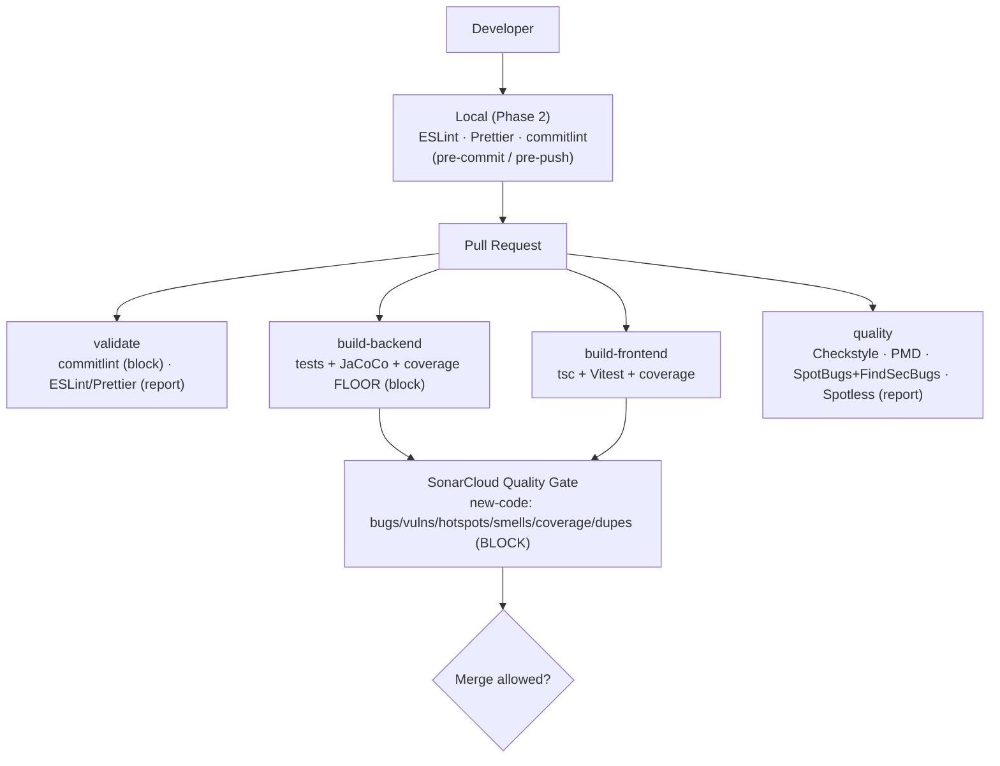

# Code Quality & Quality Gates

How code quality is enforced for the Hospital Management System. The guiding principle is
**clean as you code**: the codebase is large and predates most tooling, so we enforce a high
bar on **new/changed code** (via SonarCloud) while holding a **regression floor** on the
whole project and reporting everything else — rather than blocking on years of legacy debt.

---

## 1. Quality architecture



**Enforced (blocking):** SonarCloud quality gate + JaCoCo coverage floor + commit convention.
**Report-only (visibility, not blocking yet):** Checkstyle, PMD, SpotBugs, Spotless, ESLint, Prettier.

---

## 2. Tools

| Layer | Tool | Role | Enforcement |
| ----- | ---- | ---- | ----------- |
| Cross | **SonarCloud** | bugs, vulnerabilities, security hotspots, code smells, coverage, duplication | **Gate blocks on new code** |
| Backend | **JaCoCo** | coverage measurement + floor | **Blocks below floor** |
| Backend | **Spotless** (Palantir) | formatting | report-only (`ratchetFrom=main`) |
| Backend | **Checkstyle** | style/readability smells | report-only |
| Backend | **PMD** | best-practice / error-prone / design | report-only |
| Backend | **SpotBugs + Find Security Bugs** | bug patterns + security | report-only |
| Frontend | **ESLint** (+ react, hooks, jsx-a11y, import, unused-imports) | correctness, a11y, import hygiene | report-only in CI |
| Frontend | **Prettier** | formatting | report-only in CI |
| Frontend | **tsc** | type/syntax check | blocks (build) |

Configs: `backend/config/{checkstyle.xml,pmd-ruleset.xml,spotbugs-exclude.xml}`,
`eslint.config.js`, `.prettierrc.json`, Spotless + JaCoCo in `backend/pom.xml`.

---

## 3. Coverage thresholds

Measured baseline (whole project): **~25.7% line, ~17% branch, ~24% instruction**.

| Scope | Metric | Threshold | Where | Blocking |
| ----- | ------ | --------- | ----- | -------- |
| **New code** | coverage | **80%** | SonarCloud gate | ✅ |
| Whole project (floor) | line | **20%** | JaCoCo `check@verify` | ✅ |
| Whole project (floor) | branch | **10%** | JaCoCo `check@verify` | ✅ |
| Frontend | unit coverage | reported (no hard floor yet) | Vitest → Sonar | via Sonar new-code |

The floors sit **below** current coverage on purpose: they stop backsliding while the team
raises coverage, and the real quality bar (80% on new code) is enforced by Sonar so every PR
must test what it adds. Raise the floors as overall coverage climbs.

---

## 4. Static-analysis rules (backend)

- **Checkstyle** (compact, high-signal): unused/star/redundant imports, empty blocks,
  `equals`/`hashCode`, string `==`, missing switch default, fall-through, boolean
  simplification, naming conventions, method length (≤150), params (≤10), complexity (≤20).
- **PMD**: best-practices + error-prone + multithreading + performance categories (noisy/
  stylistic rules excluded), plus God-class / excessive-length / cyclomatic / NPath design rules.
- **SpotBugs + Find Security Bugs**: max effort, medium threshold; excludes Lombok/JPA/DTO
  false positives (`config/spotbugs-exclude.xml`).

All three are **report-only** (uploaded as the `java-quality-reports` artifact and counted in
the CI summary). SonarCloud is the enforced gate; these add defense-in-depth and local parity.

---

## 5. Build quality policy

| Policy | Value |
| ------ | ----- |
| New blocker / critical issues | **0** (Sonar gate) |
| New vulnerabilities / security hotspots | **0** reviewed as safe (Sonar gate) |
| New-code coverage | **≥ 80%** |
| New-code duplication | **≤ 3%** |
| Whole-project coverage | must not drop below the JaCoCo floor |
| Maintainability / reliability rating (new code) | **A** |
| Commit messages | Conventional Commits (blocking) |

> Exact new-code gate conditions live in the **SonarCloud "Sonar way"** gate (see §7).

---

## 6. Running quality checks locally

```bash
# Frontend
npm run lint            # ESLint
npm run format:check    # Prettier
npm run typecheck       # tsc

# Backend
mvn -f backend/pom.xml verify          # tests + coverage + FLOOR check
mvn -f backend/pom.xml checkstyle:check
mvn -f backend/pom.xml pmd:check
mvn -f backend/pom.xml spotbugs:check
mvn -f backend/pom.xml spotless:apply  # auto-format changed Java
open backend/target/site/jacoco/index.html   # coverage report
```

### Fixing common failures

| Failure | Fix |
| ------- | --- |
| Sonar gate: coverage on new code < 80% | add tests for the lines you changed |
| Sonar gate: new bug/vuln/smell | open the issue in SonarCloud → fix or mark reviewed |
| JaCoCo floor failed | your change dropped overall coverage — add tests |
| ESLint `import/order` / unused import | `npm run lint:fix` (auto-fixes) |
| Prettier | `npm run format` |
| Spotless / Checkstyle Java style | `mvn -f backend/pom.xml spotless:apply` |
| commitlint | use `type(scope): summary` — see `CONTRIBUTING.md` |

---

## 7. Manual configuration required OUTSIDE the repository

These are SonarCloud / GitHub settings, not files in this repo:

1. **SonarCloud project** exists with a **Quality Gate** assigned (default "Sonar way" is
   new-code focused — recommended). Set the **New Code** definition to *Reference branch =
   `main`* (or *Previous version*) so legacy debt never blocks.
2. **SonarCloud GitHub App** installed on the repo → enables PR decoration (quality gate
   status + inline issues posted on PRs). Without it, analysis still runs but PRs aren't
   annotated.
3. **GitHub secrets/vars:** `SONAR_TOKEN`, `SONAR_ORGANIZATION`, `SONAR_PROJECT_KEY`.
4. **Enforcement toggle:** the gate blocks by default (`SONAR_QUALITY_GATE_WAIT` defaults to
   `true`). Set that repo **variable** to `false` to temporarily make Sonar non-blocking.
5. **Branch protection** on `main`/`staging`: mark the `sonar` and `ci-summary` checks as
   **required** so a failing gate actually blocks merge.

---

## 8. Remaining quality technical debt

- ESLint / Prettier / Checkstyle / PMD / SpotBugs / Spotless are **report-only** — the plan is
  to enforce on changed files, then repo-wide, after a cleanup pass.
- Overall coverage is low (~25%); the floor should be ratcheted up over time.
- No frontend hard coverage floor yet (relies on Sonar new-code coverage).
- SpotBugs/PMD overlap somewhat with Sonar — kept for local/offline parity; revisit if noisy.
